# 支持向量机背后的数学支持！

> 原文：<https://pub.towardsai.net/supporting-the-math-behind-supporting-vector-machines-d46e94b23b9d?source=collection_archive---------3----------------------->

## [机器学习](https://towardsai.net/p/category/machine-learning)，[数学](https://towardsai.net/p/category/mathematics)

## 快速游览 SVM 构成数学和理论解释以及从零开始实施。

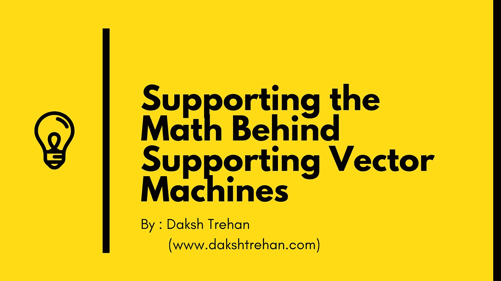

**支持向量机**是另一种简单的算法，每个机器学习专家都应该拥有它。支持向量机是许多人的首选，因为它产生的数据非常准确，需要较少的计算能力。SVM 可用于回归和分类任务。

# 目录

*   *支持向量机简介*
*   *SVM 是如何工作的？*
*   *处理异常值*
*   *佩加索斯*
*   *非线性分类*
*   *赞成&反对 SVM*
*   可视化 SVM
*   *SVM 的申请*

## *支持*向量机简介

支持向量机(SVM)是一个强大的分类器，可以处理线性和非线性数据。

> 如果你有一个 **n** 维空间，那么超平面的维数将是 **(n-1)。**

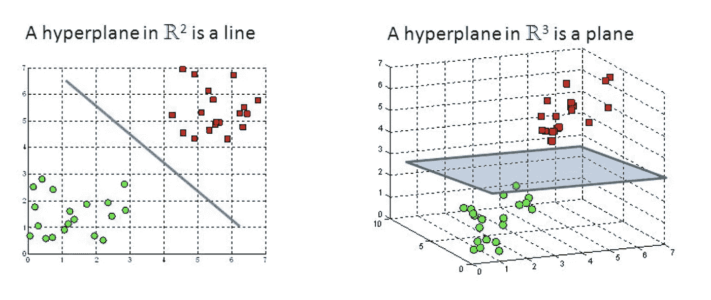

SVM 的**目标是找到一个**最佳超平面**，它能最好地分离我们的数据，从而使空间中最近的点到自身的距离最大化。**

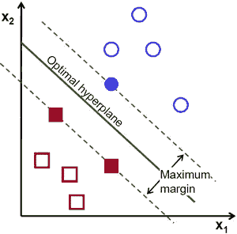

为了简单起见，考虑一条道路，它将左侧、右侧的汽车、建筑物、行人分开，并尽可能形成最宽的车道。那些离街道很近的汽车和建筑是支持向量。

这就是支持向量机的工作原理。

## SVM 是如何运作的？

> **目标**:寻找一个最优超平面。

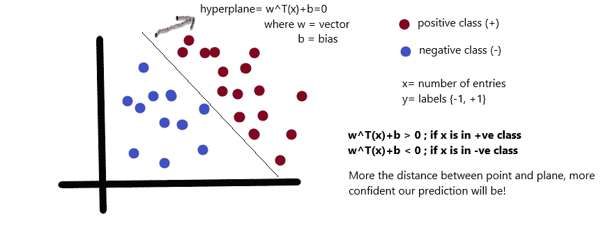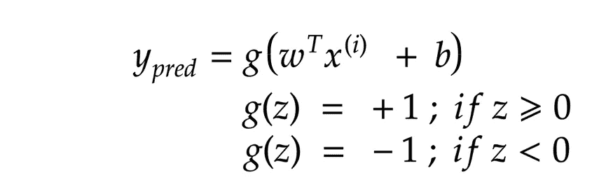

**计算点到支持向量的距离**

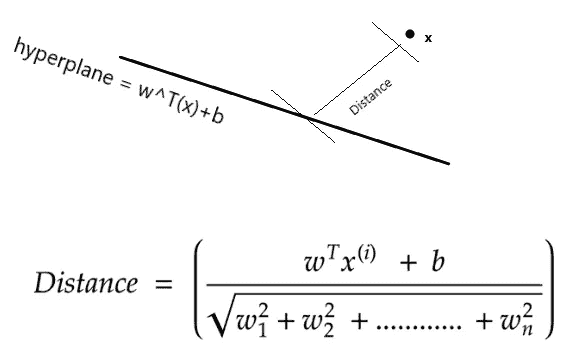

我们想要一个能够以非常有效的方式对点进行分类的超平面，即以精确的方式分配类别。

为了准确地执行，我们需要改变我们的目标。

> **修改目标:**最大化离超平面的最小距离。

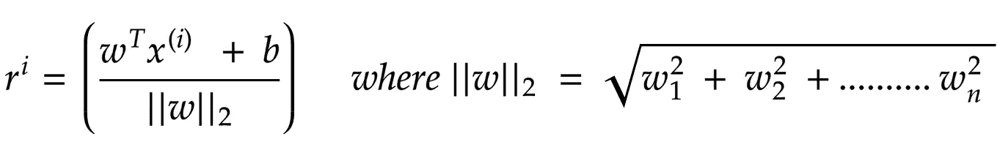

让我们假设一个**最小阈值距离= γ**

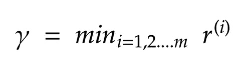

现在所有点必须满足以下两个条件:

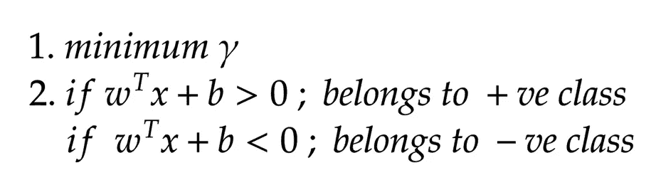

为了实现最小距离，我们需要**最大化“w”。**

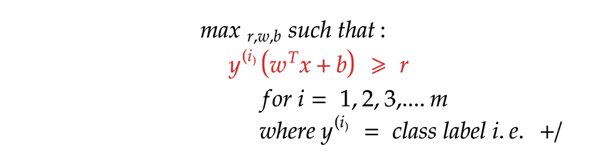

这个执行有点乏味和麻烦，因此为了降低数学复杂性，我们将重新制定我们的方程。

因此，我们将以支持向量必须位于超平面上的方式重新归一化我们的数据。

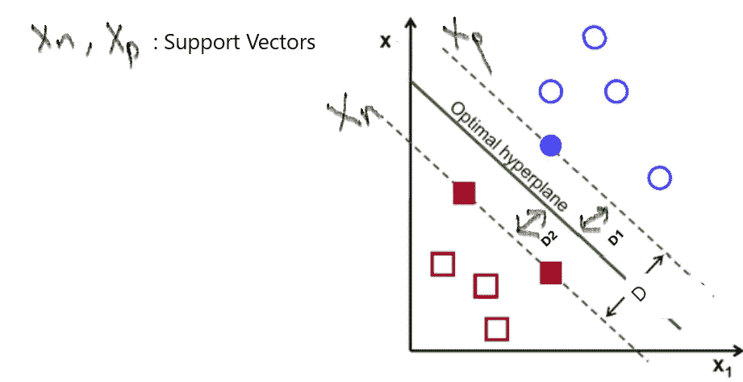

所以，为了**最大化“w”，我们需要最大化“D”。**

> d = D1+D2；所以我们也需要最大化 D1 和 D2。

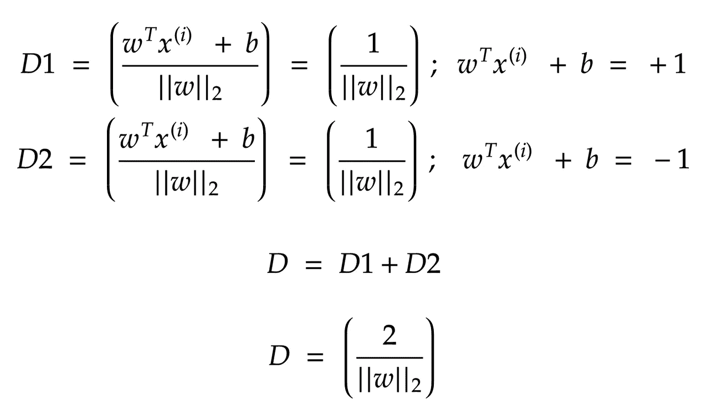

现在，为了使**增加“D”，我们必须在**最小距离必须为 1** 的条件下，重点减少“| | w | |”**。

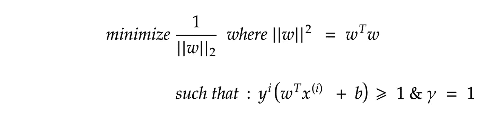

在我们的新目标中，我们需要减少||w||但是我们需要记住||w||不是自由的，即**它依赖于γ。**

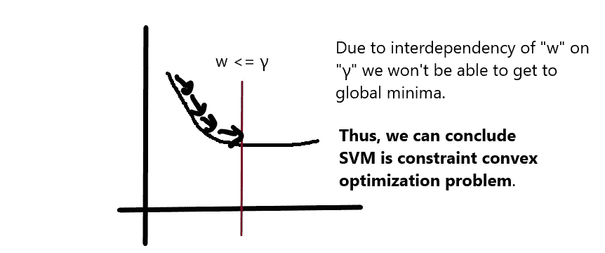

由于 SVM **不能使用梯度下降**，由于约束依赖性，我们需要寻找其他解决方案。

使用以下任何一种方法都可以避免该问题:

*   *二次规划求解器*
*   *朗格朗密度*
*   *佩加索斯*

## 处理异常值

有时候对于一些例子 **(x(i)，y(i))** 我们可能会遇到错误 **E(i)** 。

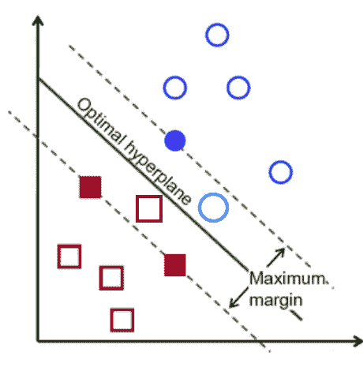

误差将完全摧毁我们的目标，因为增加误差将增加损失的成本，但是为了开发一个稳健的模型，我们需要允许一些误差，否则，它将导致*过度拟合*。

但是为了保持尽可能低的误差，我们将引入一个惩罚，当我们的模型错误地分类一个数据点时，它将面临一些**惩罚(c)** ，这将帮助我们增加我们的准确性。

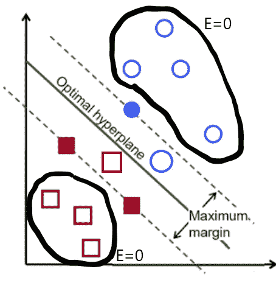

> 如果 E = 0；那就不罚了。

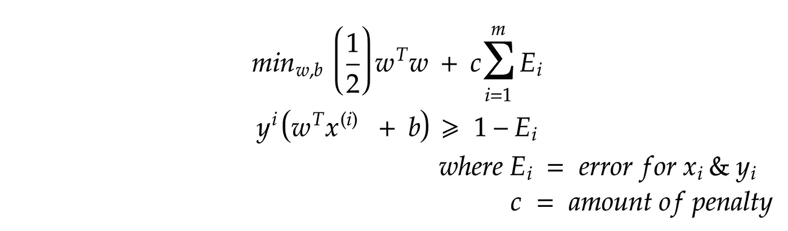

> 如果 c 很大；然后是更小的余量但更好的分类(更容易过度拟合)
> 
> 如果 c=1，即非常低；那么裕度被最大化，但是以错误分类为代价(更好的分类器)

## 佩加索斯

为了**克服约束凸优化问题**，我们采用*PEGASOS*方法。

我们重新制定我们的方程，以实现约束独立性。

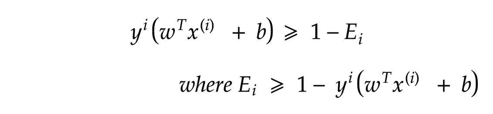

现在，如果我们从数学上来说，等式上对 *1* 的影响将是*0*,因为我们加它一次，相反减去它一次。

为了简化我们的方程，我们将用 t(i)来代替。

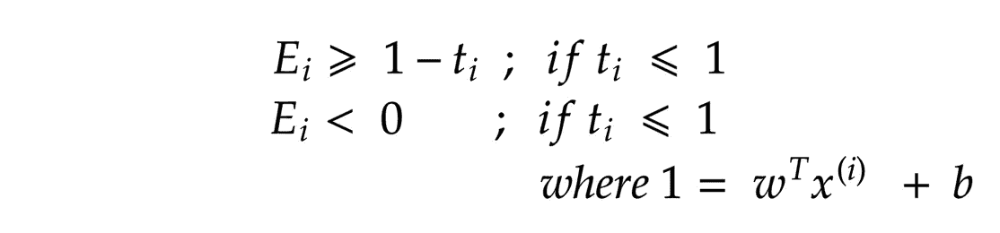

上述等式对应于如果点远离超平面，误差将为零，否则遇到的误差将为(1-t(i))。

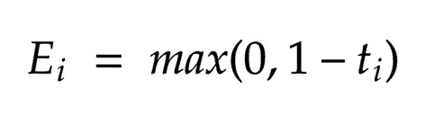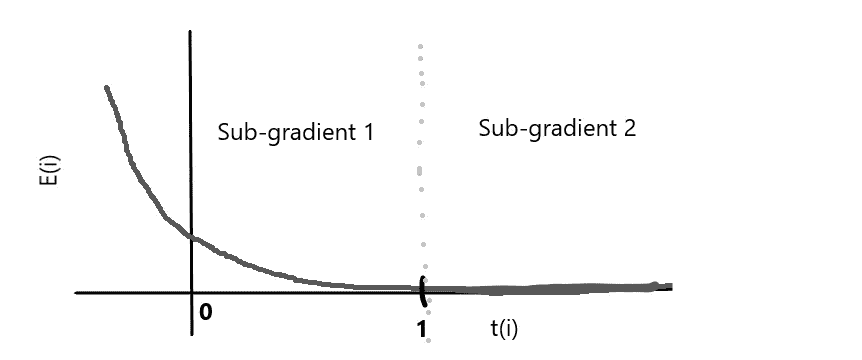

公式化函数在 t≥1 时仍**不微分；所以我们要在**子渐变 1** & **子渐变 2 中划分我们的渐变。****

我们需要将**最小化**的最后一个函数是:

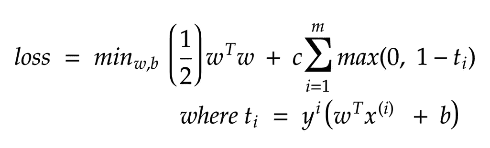

现在，因为约束被移除，我们的函数独立于γ。我们可以使用[梯度下降](https://towardsdatascience.com/gradient-descent-explained-9b953fc0d2c)来减少损失。

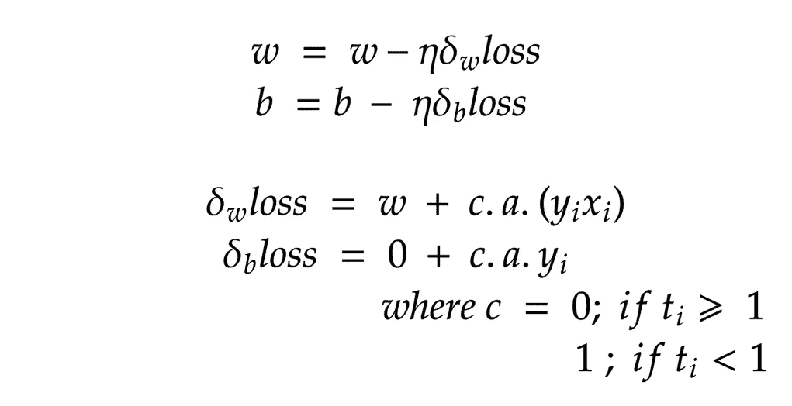

## 使用梯度下降最小化损失

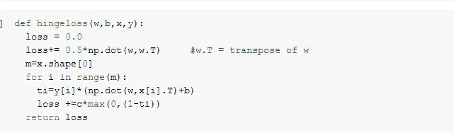

计算损失

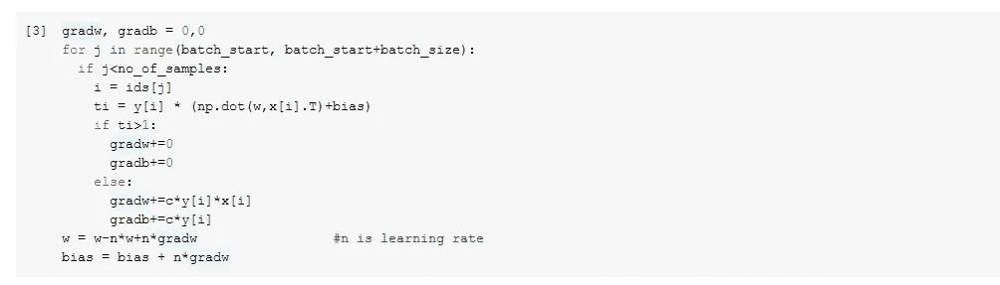

为 SVM 实施梯度下降

## 非线性分类

为了使用支持向量机对非线性数据进行分类，我们需要将数据投影到更高维度，即通过增加其特征将 2D 数据转换为 3D 数据。

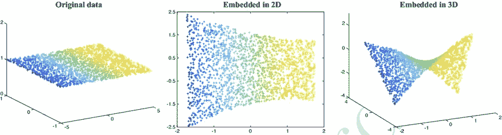

[来源](https://www.researchgate.net/figure/Left-Original-3D-data-distributed-along-2D-manifold-Middle-Embedded-coordinates-of_fig1_327107042)

> 这种特征的增加在计算上将是昂贵的。

为了转换数据的维度，我们使用内核。

*   *线性内核*
*   *RBF(径向基)核*

*   *多项式内核*

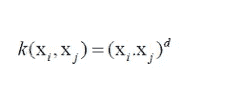

*   *s 形内核*

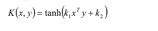

内核技巧的障碍是为你的模型选择正确的内核，因为我们永远不知道哪个内核最适合我们的模型，代价是什么。

因此，为了自动调整我们的超参数，我们将实现 **GridSearch** 。

我们将指定参数，即由以关键字为核心的字典和惩罚组成的列表，我们将为每个核心运行我们的模型，并获得最佳的准确性。

> params = [{'kernel':['linear '，' rbf '，' poly '，' sigmoid']，' c':[0.1，0.2，0.5，1.0，2.0，5.0]}

现在，对于每种类型的内核和 5 种类型的惩罚，我们将存储精度，稍后将选择具有最佳精度的内核和惩罚(c)。

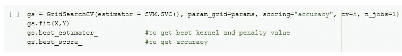

*接受的参数:*

*   **cv** :交叉验证
*   **n_jobs** :可用 CPU 数量

## 支持向量机的利与弊

**赞成者**

*   可以轻松处理大型特征空间。
*   内核技巧是 SVM 的真正优势，因为它有助于找到甚至是复杂问题的解决方案。
*   适用于线性和非线性数据。
*   不容易过度拟合。
*   即使对于非结构化数据也是可靠的。

**缺点**

*   对噪音敏感。
*   选择一个最佳内核真的很难。
*   大数据集训练时间长。

## 想象 SVM

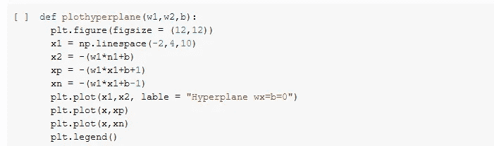

## SVM 的应用

来源:DataFlair

# 结论

希望这篇文章能帮助你尽可能好地理解支持向量机(SVM ),并帮助你实际使用它。

一如既往，非常感谢您的阅读，如果您觉得这篇文章有用，请分享！

请随意连接:

> 加入我在~[www.dakshtrehan.com](http://www.dakshtrehan.com)
> 
> *LinkedIN ~*[*https://www.linkedin.com/in/dakshtrehan/*](https://www.linkedin.com/in/dakshtrehan/)
> 
> *Github ~*[https://github.com/dakshtrehan](https://github.com/dakshtrehan)

关注更多机器学习/深度学习博客。

> *中等~*[*https://medium.com/@dakshtrehan*](https://medium.com/@dakshtrehan)

# 想了解更多？

[利用深度学习检测新冠肺炎](https://towardsdatascience.com/detecting-covid-19-using-deep-learning-262956b6f981)

[无法逃脱的人工智能算法:抖音](https://towardsdatascience.com/the-inescapable-ai-algorithm-tiktok-ad4c6fd981b8)

[为什么你要为乔治·弗洛伊德的谋杀和德里的骚乱负责？](https://medium.com/@dakshtrehan/why-are-you-responsible-for-george-floyds-murder-delhi-communal-riots-4c1edb7acbc5)

[为什么随机森林而不是决策树？](https://medium.com/@dakshtrehan/why-random-forest-and-not-decision-tree-6047d94edf61)

[聚类:是什么？什么时候用？](https://medium.com/@dakshtrehan/clustering-what-it-is-when-to-use-it-a612bbe95881)

[从 k 个最近邻居开始你的 ML 之旅](https://medium.com/@dakshtrehan/start-off-your-ml-journey-with-k-nearest-neighbors-f72a122f428)

[朴素贝叶斯解释](https://medium.com/swlh/things-you-never-knew-about-naive-bayes-eb84b6ee039a)

[激活功能说明](https://medium.com/analytics-vidhya/activation-functions-explained-8690ea7bdec9)

[参数优化说明](https://towardsdatascience.com/parameters-optimization-explained-876561853de0)

[梯度下降解释](https://towardsdatascience.com/gradient-descent-explained-9b953fc0d2c)

[逻辑回归解释](https://towardsdatascience.com/logistic-regression-explained-ef1d816ea85a)

[线性回归解释了](https://medium.com/towards-artificial-intelligence/linear-regression-explained-f5cc85ae2c5c)

[确定最适合您的 ML 模型](https://medium.com/datadriveninvestor/determining-perfect-fit-for-your-ml-model-339459eef670)

> *干杯！*