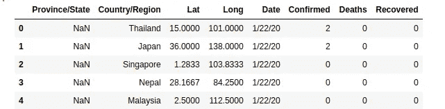
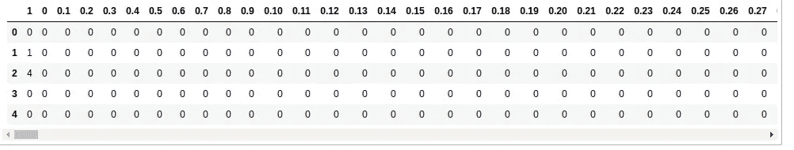
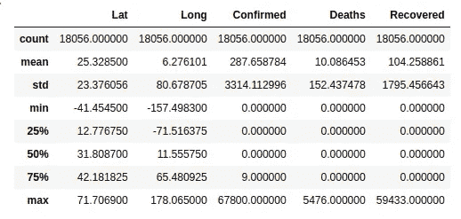
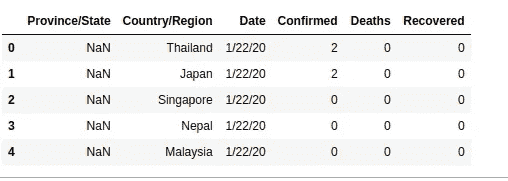
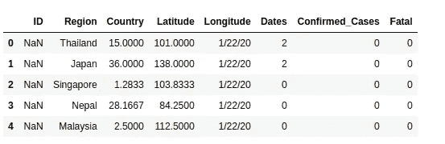
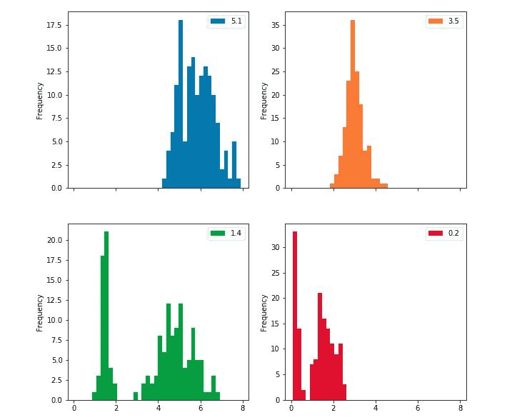
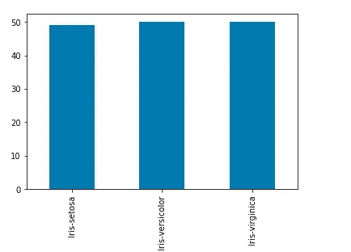
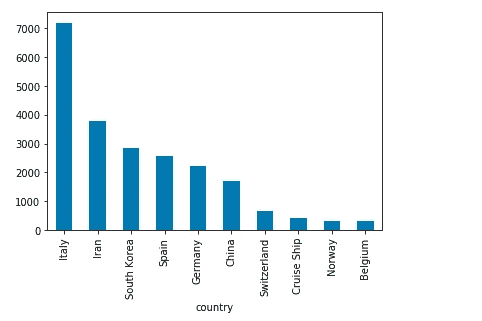
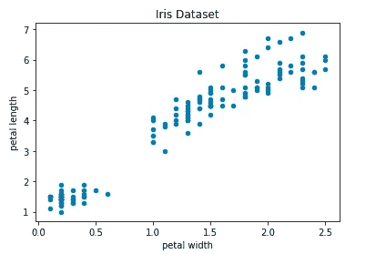

# 适用于新手的惊人强大的数据集探索技术

> 原文：<https://pub.towardsai.net/surprisingly-powerful-dataset-exploration-techniques-for-rookies-260f5e5d7111?source=collection_archive---------0----------------------->

> 让我们探索新冠肺炎数据集和其他有趣的简单而强大的技术。


[疾控中心](https://unsplash.com/@cdc?utm_source=unsplash&utm_medium=referral&utm_content=creditCopyText)在 [Unsplash](https://unsplash.com/s/photos/virus?utm_source=unsplash&utm_medium=referral&utm_content=creditCopyText) 拍摄的照片

> 新冠肺炎数据集下载完成！

现在怎么办？你一定在想。

当我开始这个漫长而激动人心的数据科学之旅时，我也是这么想的。

我会盯着电脑屏幕上的数据集文件夹，就像一只刚刚失去牧羊人的绵羊。失落、困惑和彻底沮丧的我发现自己正在观看 youtube 上的一段视频，是《生活大爆炸》中的**谢尔顿**。


图片来自 popsugar.com

缓慢但肯定的任务失败了。

如果您是数据科学的新手，那么在当今存在的海量数据集中，开始理解任何数据集的内容都是令人畏缩和不知所措的。海洋每秒钟都在进一步扩张。

每个数据科学领域的新手都必须熟悉探索数据集的非常基本的技术，因为它是人工智能的燃料。

在没有首先理解你正在处理的数据集的情况下从事机器学习项目，就像试图在没有蓝图的情况下建造摩天大楼。想一想。

在今天的文章中，我将分享一些基本而强大的探索技术，您可以将它们应用于几乎任何数据集。

这些技术将帮助你突破数据集。不仅如此，您还将对正在处理的数据集有一个整体的了解。

这应该足以激活你系统中多巴胺的流动，这样你就可以在享受乐趣的同时顺利完成你的机器学习项目。

好了，说够了。我们开始吧。

# 先决条件

对于这篇文章，我们将使用 [**Pandas**](https://pandas.pydata.org/pandas-docs/stable/index.html#module-pandas) ，它是机器学习最流行的数据结构库之一。它有许多有趣的内置函数，我们将很快探索这些函数。

有人将 pandas 与 [**Matplotlib**](https://matplotlib.org/index.html) 和 [**Seaborn**](https://seaborn.pydata.org/)) 一起使用，达到统计数据可视化的目的。请随意查看。

对于那些从来没有使用过熊猫图书馆的人来说，不要担心。我写这篇文章是为了你。

为了使用 Pandas 库，我们首先需要安装它。

```
pip install pandas
```

我正在使用[**jupyter 笔记本**](https://jupyter.org/) 运行本文中的所有代码。如果你还没有设置好木星笔记本，我会帮你搞定的。查看[数据营](https://www.datacamp.com/community/tutorials/tutorial-jupyter-notebook)网站。

在这篇文章的最后，我会分享一个到我的 GitHub 页面的链接，在那里你可以访问完整的笔记本。所以保持冷静直到最后。

# 导入相关库

为了访问令人惊奇的 **Pandas** 函数，我们需要将它导入我们的代码。我用别名 **pd 导入的。** Pandas 建立在 [NumPy](https://numpy.org/) 之上，这对数学运算非常有用

进口熊猫和数字图书馆 10

# 将数据集加载到内存。

熊猫 ***。read_csv()*** 方法读取数据集文件并将其保存为 Pandas [Dataframe](https://www.geeksforgeeks.org/python-pandas-dataframe/) 对象。将数据框想象成一个带有标签行和列的表格。这里我使用的是来自 [**的新冠肺炎数据集**](https://www.kaggle.com/)

在文章的最后，我将提供我在本文中使用的所有不同数据集的链接。所以不要为此烦恼。

# **显示数据集中样本(观察值)的数量。**

对于您遇到的任何数据集，了解数据集中存在的数据点或训练示例的数量非常重要。这只是行数和列数。

```
Number of Samples or observations:  18056
Number of Attributes or Features 8
```

如果您对知道行数感兴趣，就这样做。

```
Number of Samples:  18056
```

# **快速浏览一下数据集的内容**

你的数据集的内容到底是什么？熊猫 ***头()*** 帮你搞定。默认情况下 ***head()*** 打印数据集的*****最后 5 行*** 。**

****

**显示新冠肺炎数据集的前五行和后五行**

**您也可以通过将行数作为参数传递给函数来指定您想要显示的行数。**

**分别打印第一行和最后 10 行**

**有时数据集会有大量的列，因此您无法查看所有的列。除非你在用一个巨大的电脑屏幕工作。幸运的是，通过下面的代码片段，您可以左右滚动来查看所有内容。酷吧？**

****

**显示滚动按钮的随机数据集的屏幕截图**

# **显示有趣的统计信息。**

**让我们进一步了解数据集的一些统计信息。个人认为， [**。**](https://pandas.pydata.org/pandas-docs/stable/reference/api/pandas.DataFrame.describe.html) 描述()【方法】是一个*必知*函数。**

**它提供了一些非常有价值的统计信息，比如在我们的数据集中发现的每个数字列的计数、[均值](https://www.wikiwand.com/en/Mean)、[标准差](https://www.wikiwand.com/en/Standard_deviation)等。**

****

**新冠肺炎统计信息截图**

****count** row 特别有用，因为它提供了数据中任何可能对机器学习模型的性能产生负面影响的缺失值的线索。**

# **删除不相关的列**

**在构建机器学习模型时，一些特征或列可能对预测的性能没有贡献。您可以使用下面的代码片段删除任何不需要的列。**轴**指定是列。**

**我删除了新冠肺炎数据集中的纬度和经度列。**

****

**纬度和经度列被删除的屏幕截图**

**注意:将修改后的数据集赋给一个新变量是一个很好的做法。**

# **数据集中唯一样本的数量**

**下一段代码在机器学习中非常有用，尤其是当我们处理分类问题的时候。它有助于您了解属于特定类别的样本数量。下面显示了一个示例**

****

**每个国家的样本数量**

# **重命名奇怪的列名**

**数据集有时会很混乱，因为数据集的创建者给出了奇怪的列名。你不必坚持这些。不喜欢就这么改吧。**

****

**更改了列名的屏幕截图**

**有时，您只需要更改那个听起来像胡言乱语的特定列名。就这么做。**

# **直方图。**

**让我们**用可视化来给**增添一点趣味。第一个也是最常用的可视化工具是 [**直方图**](https://www.wikiwand.com/en/Histogram) 。确保为其绘制直方图的列只包含数值。我们可以选择将 bin size 作为唯一的参数传递。就是这样。**

****

**虹膜数据集的直方图**

**出于演示目的，我还使用 Iris 数据集来显示有趣的图。链接包含在文章末尾。**

**如果您对可视化所有要素的直方图图很感兴趣，可以如下所示生成多个图。**子地块**为每一列创建一个柱状图，而 ***布局*** 指定每行和每一列的地块数量。**

****

**来自 Iris 数据集的四个特征的子情节的截屏**

# **条形图**

**这是一个有趣的可视化工具。然而，为了使用***plot.bar()使用*** 方法绘制条形图，我们需要首先使用`value_count()`方法计算出现次数，然后使用`sort_index()`方法从最小到最大对出现次数进行排序。**

****

**Iris 数据集条形图屏幕截图**

**这是新冠肺炎数据集中条形图的一个很好的示例。首先按国家/地区分组数据，然后计算确诊病例的平均值，并按其他值的升序排序。最后，绘制一个条形图，显示确诊病例数最多的 10 个国家。**

****

**带有前 10 个确诊病例最高国家的条形图屏幕截图**

# **散点图**

**最后但绝非最不重要的是散点图。通常用于显示数据集中 2 列或要素之间的关系。请注意，只能绘制数字列。**

****

**Iris 数据集散点图截屏**

# **其他地块**

**还有其他有趣的情节，我决定不涵盖这些在这篇文章。不过，我会在这里提到这些与适当的链接，以便于探索。**

## *** [折线图](https://pandas.pydata.org/pandas-docs/stable/reference/api/pandas.DataFrame.plot.line.html)**

## ****[**Box 地块**](https://pandas.pydata.org/pandas-docs/stable/reference/api/pandas.DataFrame.boxplot.html)****

## ******[**热图**](https://seaborn.pydata.org/generated/seaborn.heatmap.html)******

## ******* [成对绘图](https://seaborn.pydata.org/generated/seaborn.pairplot.html)******

# ******红利提示******

******我偶然看到了由布兰达·哈利 撰写的《走向数据科学》发表的这篇文章，标题为 [**我的熊猫小抄**](https://towardsdatascience.com/my-pandas-cheat-sheet-b71437ab26f) ，我发现它非常有帮助。我认为它包含了你经常需要的非常有用和方便的熊猫功能。******

# ******外卖******

******无论你在互联网上遇到什么样的数据集，这些简单的数据探索技术应该是你脑海中的第一个想法。它将允许你对你正在处理的事情有一个线索。******

******理解数据集的内容和关系将有助于你决定它是对你正在进行的项目有用还是完全浪费时间。******

******当你实现了这篇文章中概述的这些熊猫技巧时，战斗还没有开始就已经成功了一半。相信我，这会帮你省下很多时间和麻烦。******

******感谢您的阅读，希望对您有所帮助。如果你有其他有趣的功能，你认为我和其他人应该知道，请不要犹豫，留下评论。让我们一起学习，一起成长。******

******如果你喜欢这篇文章，请随意阅读我的 [**博客**](https://beltus.github.io/vision/) 上的一些精彩文章******

# ******参考******

******链接到 [GitHub jupyter 笔记本](https://github.com/Beltus/Datascience)完整代码。******

******链接到[卡格尔新冠肺炎数据集](https://www.kaggle.com/imdevskp/corona-virus-report)******

******链接到[虹膜数据集](https://archive.ics.uci.edu/ml/datasets/Iris)******

******https://Neptune . ai/blog/explorative-data-analysis-natural-language-processing-tools******

******[https://realpython.com/pandas-python-explore-dataset/](https://realpython.com/pandas-python-explore-dataset/)
[https://towards data science . com/exploring-the-data-using-python-47 C4 BC 7 b 8 fa 2](https://towardsdatascience.com/exploring-the-data-using-python-47c4bc7b8fa2)
[https://towards data science . com/a-gentle-introduction-to-explorative-data-analysis-f11d 843 b 8184](https://towardsdatascience.com/a-gentle-introduction-to-exploratory-data-analysis-f11d843b8184)
[https://towards data-science . com/introduction-to-data-visualization-in-python-89 a54c 99](https://towardsdatascience.com/introduction-to-data-visualization-in-python-89a54c97fbed)******