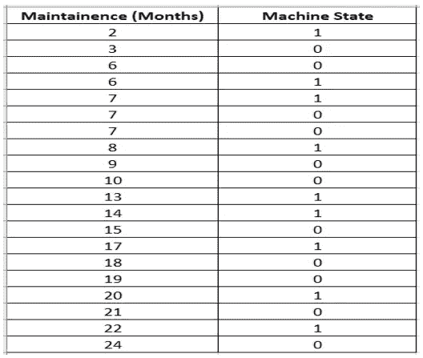
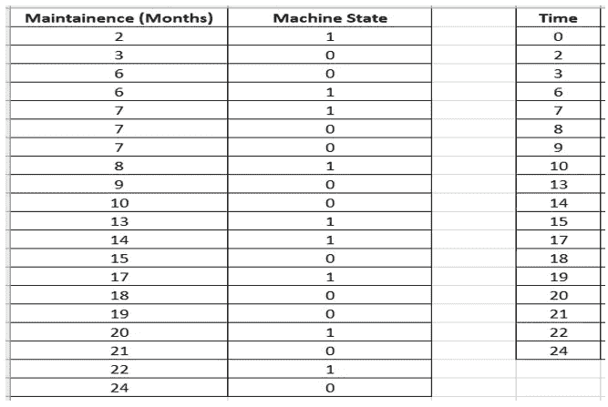
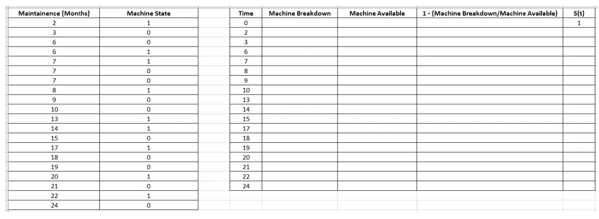
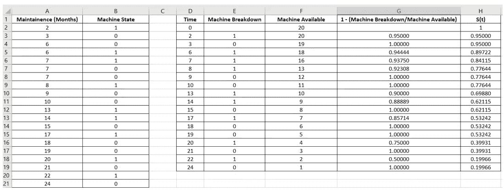
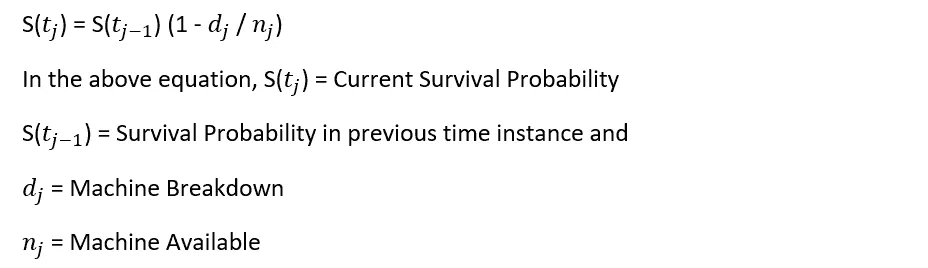
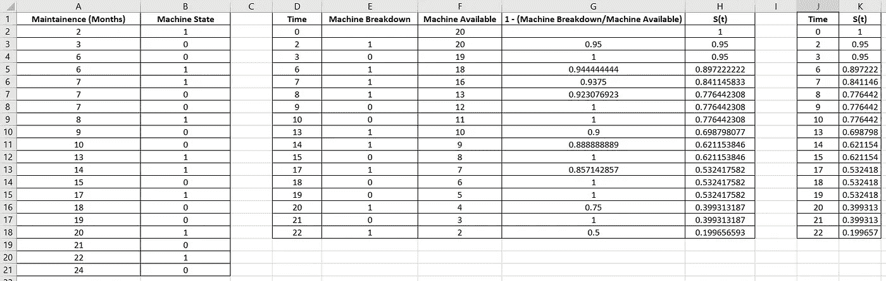
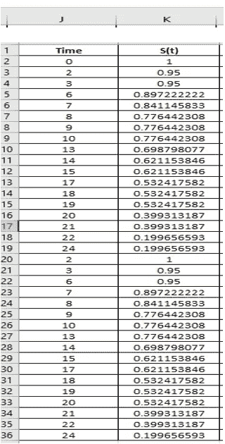
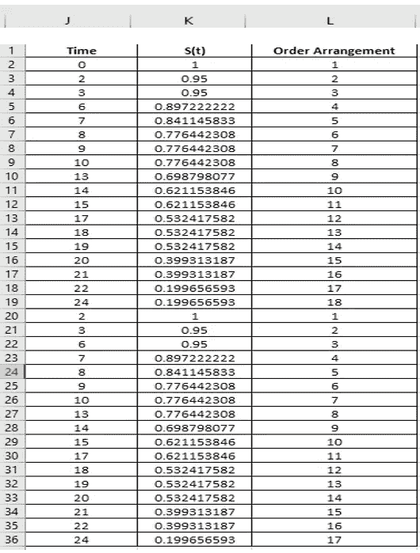
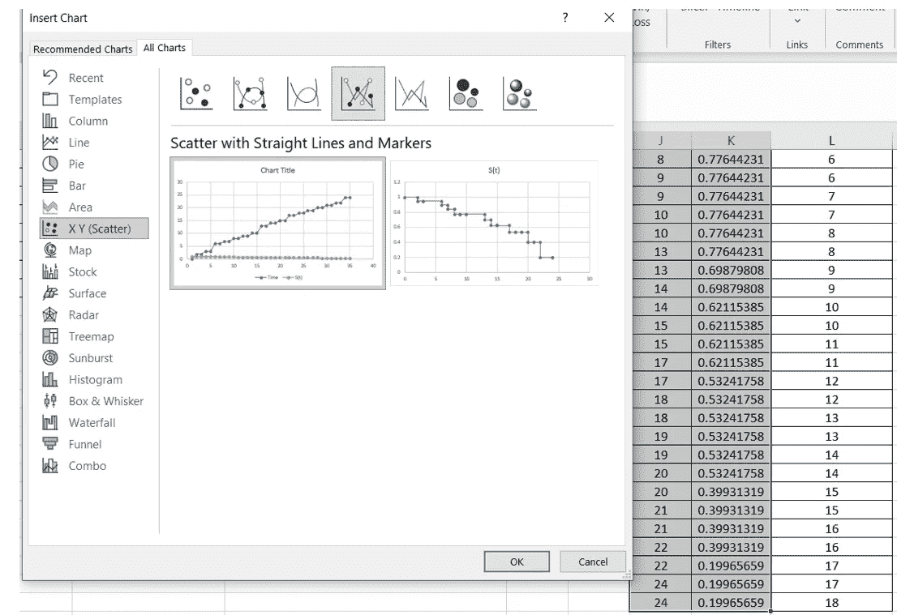
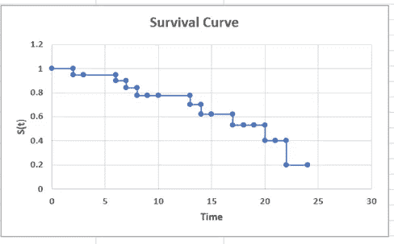

# 生存分析也可以在 excel 中完成。

> 原文：<https://pub.towardsai.net/survival-analysis-can-be-done-in-excel-too-46bc12e93a33?source=collection_archive---------4----------------------->

## [数据分析](https://towardsai.net/p/category/data-analysis)

图片由来自 Pixabay 的 Peggy und Marco Lachmann-Anke 提供

写这篇文章的目的是向大家展示“如何利用 excel 的简单公式进行生存分析”。

在我继续之前，让我分享一个生存分析的正式定义。

Denny Ryanto 在 Unsplash 上拍摄的照片

“生存分析是用于数据分析的统计程序的集合，其中感兴趣的结果变量是事件发生前的时间。幸存者函数表示个体从起源时间存活到时间 t 之后的某个时间的概率

记住这个定义，现在让我们继续我们的目标，使用 excel 实现生存分析。

**用于分析的数据集**

我正在考虑一个简单的制造单元的例子，其中一堆有很高故障几率的旧机器被选择进行维护。我们的工作是进行生存分析，找出这些机器在维护期结束后的生存概率。

照片由 Unsplash 上的附身摄影提供

数据集显示了旧机器维护了多长时间(*栏 A* )以及机器在维护期结束后是否“发生故障”(*栏 B* )。

按作者

这里 1 =机器故障，0 =机器可用

群体中包含的机器总数= 20。

需要修改数据，以便将其转换为正确的格式，从而创建生存曲线。

**格式化数据**

再增加一列，D 为“时间”,显示维护的唯一月份。第一个值应该从 0 开始。

按作者

**根据需要创建新列**

新列创建为

1.“机器故障”，

2.“机器可用”，

3.“1-(机器故障/机器可用)”也称为(1-危险)，其中危险=(机器故障/机器可用)和

4.“S(t)”(生存函数)。

列中的值使用 excel 公式填充。

列中的第一个值“S(t)”是 1，因为在开始时间(t = 0)，所有机器都被认为是可用的，并且生存函数为 1。

按作者

**用所需的 Excel 公式填充各个列**

按作者

1.从“机器故障”栏开始。

第一行保留空白，因为在时间实例“0”时没有机器故障。

“机器故障”栏第 2 行中的值是使用以下公式计算的

E3:= count ifs(＄A＄2:＄A＄21，D3，＄B＄2:＄B＄21.1)

只需突出显示区域 E3:E19 并按 Ctrl-D 即可填充该列的其他行。使用相同的技巧填充 F 到 H 列中的所有其他值。

这统计了在特定时刻发生故障的机器数量。

2.对于“可用机器”栏，使用的公式为:

F2: =COUNTIF($A$2:$A$21，“>”&D2–1)

这将计算在移除发生故障的机器后，特定时间实例中可用的机器数量。

3.计算“1-(机器故障/可用机器)”栏时，使用的公式为:

G3: =1-(E3/F3)

它代表由(Ej/Fj)给出的危险，其中 j = 1…19

这是因为它有助于计算生存函数 S(t ),如下所示。

生存分析中的生存函数解释为某个感兴趣的对象在超过某个时间 t 后生存的概率，函数值介于 0 和 1(含)之间，是一个非增函数。

4.对于“S(t)”列，使用的公式为:

H3: =H2*G3

这就计算出了生存概率。

该列第一行中的值为 1，作为一个实例(t = 0)，所有机器都可用。没有崩溃。

**现在为了创建生存曲线，我们需要遵循一定的步骤。**

步骤 1:将 D 列和 H 列中的值复制到 J 列和 k 列中。

按作者

步骤 2:将 JBOY3 乐队:J19 范围内的值复制到 J20:J36。然后范围 K2:K18 中的值被复制到 K20:K36。

按作者

步骤 3:列 L 中的值列表是如下表所示的数字序列。

按作者

步骤 4:基于列 L，从最小到最大对列 J 到 L 进行排序。

按作者

步骤 5:细胞 J2:K36 被突出显示，以创建“具有直线和标记的散点图”选项，这是我们的最终存活曲线(卡普兰-迈耶曲线)。

Kaplan-Meier 是一种非参数分析，也称为乘积限方法，用于根据事件发生的时间来估计生存函数。

按作者

生存曲线(卡普兰-迈耶曲线)

按作者

**如何解读这条生存曲线/卡普兰·迈耶曲线**

Kaplan-Meier 曲线是生存函数估计的直观表示，它表示某一时间间隔内某一事件(例如生存)的概率是多少。

从上面的生存曲线，可以解释为:

在 8 个月的时间段之后，包含在群体中的机器的存活概率接近 0.80，即 80%。

类似地，在 17 个月的时间段之后，包含在群体中的机器的生存概率接近 0.60，即 60%。

并且在 22 个月的时间段之后，包含在群体中的机器的存活概率接近 0.20，即 20%。

我的结论是。

希望你喜欢阅读这篇文章。

你可以在媒体上跟踪我

LinkedIn: [Supriya Ghosh](https://www.linkedin.com/in/supriya-ghosh)

还有推特: [@isupriyaghosh](https://twitter.com/isupriyaghosh)

这会激励我对你越来越满足。