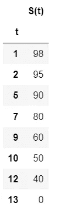
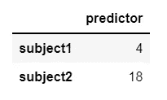
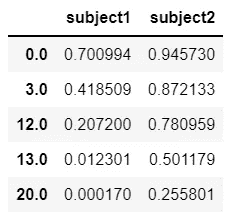
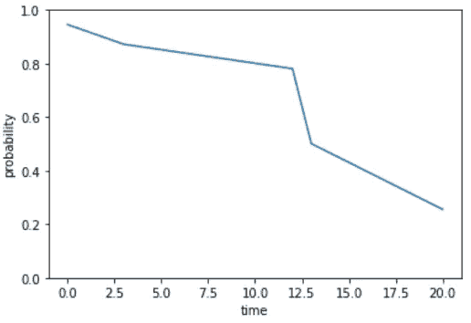
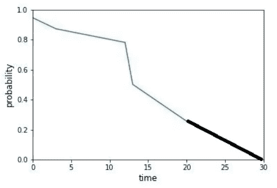
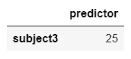
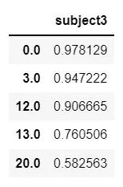
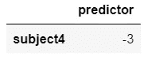
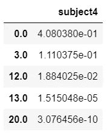

# 生存分析:从生存函数中产生单一的事件时间预测

> 原文：<https://pub.towardsai.net/survival-analysis-produce-a-single-time-to-event-prediction-from-survival-functions-581d31dd625f?source=collection_archive---------1----------------------->


照片由[merit Thomas](https://unsplash.com/@merittthomas)在 [Unsplash](https://unsplash.com?utm_source=medium&utm_medium=referral) 上拍摄

生存分析是一系列用于分析事件时间数据的统计方法。传统上，这种技术用于健康和保险领域，其中感兴趣的事件是死亡、再次住院和类似的病态事件。然而，生存分析可以应用于任何时间段的建模，比如一个人找到工作、一个系统失败或一个客户流失所需的时间。

生存分析的独特之处在于其处理删失数据的能力，也就是说，对于某些受试者来说，事件发生时间的信息没有完全公开。发生这种情况有不同的原因。例如，受试者可能在研究终止前退出，或者试验在某些受试者感兴趣的事件发生前结束。

应用不同的生存分析技术会产生一个或多个生存函数。生存函数描述了受试者或群体在过去时间 t 内生存的概率。在这种情况下，“生存”意味着避免感兴趣的事件。总存活时间或寿命是指“出生”(试验开始)和“死亡”(感兴趣的事件发生时)之间的时间段。自然地，函数是单调非递增的，因为随着时间的推移，生存的可能性越来越小。

这里有一个生存函数，例如:

```
import pandas as pd

pd.DataFrame({'t': [1, 2, 5, 7, 9, 10, 12, 13], 'S(t)': [98, 95, 90, 80, 60, 50, 40, 0]}).set_index('t')
```



根据这个生存函数，有 90%的可能性感兴趣的事件在时间 5 之前不会发生。

存活函数对于比较几个组的存活时间和描述附加变量对存活时间的影响也是有用的。这是一个保存大量信息的强大功能，但有时，您希望将其总结为一个单一的事件时间预测。在这篇文章中，我将讨论从生存函数预测寿命的多种方法。如果你想学习更多关于生存分析的知识，或者如何从你的数据中获得生存函数，试试 python 库“生命线”的[文档](https://lifelines.readthedocs.io/en/latest/)，或者这篇伟大的[博客文章](https://towardsdatascience.com/survival-analysis-intuition-implementation-in-python-504fde4fcf8e)。

# 让我们得到一些生存函数。

我们将从用 python 创建一个玩具数据集开始。在这个数据集中，我们在一项持续 20 多天的研究中有 5 名受试者。“观察”栏说明受试者在研究期间是否确实经历了症状的复发，“持续时间”栏表示症状再次出现的日期。如你所见，我们的数据没有被删截:症状复发的时间被记录为整个样本。我们还记录了一个预测变量。

```
df = pd.DataFrame({"predictor": [5, 3.5, 20, 9, 15], 
                   "observed": [True, True, True, True, True],
                   "duration": [0, 12, 13, 3, 20]})
```

我们将使用生命线库来使 [Cox 比例风险模型](https://en.wikipedia.org/wiki/Proportional_hazards_model)适合我们的数据。该模型用于描述一个或多个协变量对存活率的影响。

```
from lifelines import CoxPHFitter

cph = CoxPHFitter()
cph.fit(df, "duration", "observed")
```

`<lifelines.CoxPHFitter: fitted with 5 total observations, 0 right-censored observations>`

最后，我们使用该模型来预测 2 名受试者的新样本的生存函数:

```
X = pd.DataFrame({"predictor": [4, 18]}, index=['subject1', 'subject2'])
X
```



```
survival_functions = cph.predict_survival_function(X)
survival_functions
```



我们现在对每个主题都有一个生存函数。但这些受试者感兴趣的是底线:他们的症状多久会复发？

# 计算预期寿命值作为生存曲线下的面积

连续随机变量最常见的集中趋势度量是期望值。一个随机变量的期望值是它的可能结果的平均值，用它们的概率加权。存活时间是一个连续变量(尽管我们的 petite 示例可以被认为是离散的)，所以我们需要在给定的范围内对函数进行积分。这意味着受试者寿命的期望值是生存曲线下的面积。

生命线的回归拟合对象有一个计算主体寿命期望值的方法:predict_expectation()。它使用梯形法则计算曲线下的面积。

```
cph.predict_expectation(X)
```

`subject1 4.648343
subject2 13.456205
dtype: float64`

文档警告说“如果生存函数不收敛到 0，那么期望真的是无穷大，返回值没有意义/太大”。这是为什么呢？我们来看看 2 号课题的生存函数，比如。我们的预测生存函数表示模型训练的每个持续时间的概率。对于最近的时间段，20 天，受试者 2 的存活概率相对较高，为 0.25。

```
import matplotlib.pyplot as plt

survival_functions['subject2'].plot()
xlabel = plt.xlabel("time")
ylabel = plt.ylabel("probability")
ylim = plt.ylim([0, 1])
```



这条曲线下的面积是 13.456

计算存活曲线下的面积实际上产生了向下的偏差，因为曲线很可能在第 20 天后继续。然而，我们没有足够的信息来确定这个函数对于大于 20 的值的行为。很有可能会有更长的无症状期:



这条曲线下的面积约为 14.7

但也有可能在第 20 天后,“存活”的几率会直接降至零。


这条曲线下的面积约为 13.58

# 预测中值寿命

我们已经确定，使用症状复发时间的期望值，虽然在数学上很美，但可能有问题。相反，我们可以使用概率达到 50%阈值的时间作为我们的预测。在达到这个阈值时，事件未发生的概率变得低于它在每个随后的时间点发生的概率。使用中间值或其他百分位数简单而直接，不受极端值的影响。生命线通过 predict_median()方法直接支持这个选项。

```
cph.predict_median(X)
```

`subject1 3.0
subject2 20.0
Name: 0.5, dtype: float64`

毫不奇怪，中值会产生与期望值不同的预测。请注意，从技术上讲，2 号受试者的函数在第 20 天越过了 0.5 的阈值，但它在第 13 天非常接近越过阈值。这是相对粗糙的生存函数的陷阱之一。

尽管如此，也不能保证你的生存函数真的达到了 50%的概率！当您的生存函数预测到特别高的存活率时，该函数甚至可能在跨过 50%标记之前就结束了，生命线 predict_median()方法返回值 inf。在这种情况下，可以认为预测症状复发的时间没有意义，因为估计或模型没有获得足够的相关信息。让我们来看看:

```
X2 = pd.DataFrame({"predictor": [25]}, index=['subject3'])
X2
```



```
cph.predict_survival_function(X2)
```



```
cph.predict_median(X2)
```

`inf`

或者，如果生存机会很小，函数可能从低于 0.5 的概率开始，predict_median()将返回零。

```
X3 = pd.DataFrame({"predictor": [-3]}, index=['subject4'])
X3
```



```
cph.predict_survival_function(X3)
```



```
cph.predict_median(X3)
```

`0.0`

如果您想安全起见，根据您的用例，您可以使用不同的百分位数作为生存概率阈值。

```
cph.predict_percentile(X, p=0.75)
```

`subject1 0.0
subject2 13.0
Name: 0.75, dtype: float64`

> **如果你在这篇文章中幸存下来(看我在那里做了什么？)，你准备把你的生存函数，变成一个结论性的预测。请记住，当生存函数不收敛到零时，中值比期望值更可取，但如果函数甚至不超过 0.5，它也救不了你。祝你好运！**