# Python 生存分析教程-方法、内容、时间和原因

> 原文：<https://pub.towardsai.net/survival-analysis-with-python-tutorial-how-what-when-and-why-19a5cfb3c312?source=collection_archive---------0----------------------->


来源: [Unsplash](https://unsplash.com/photos/rHfsPolwIgk)

## [机器学习](https://towardsai.net/p/category/machine-learning)，[编辑](https://towardsai.net/p/category/editorial)，[编程](https://towardsai.net/p/category/programming)，[统计](https://towardsai.net/p/category/statistics)

## 使用 Python 进行生存分析 Python 是一个统计分支，用于预测和计算一个或多个重大事件发生的预期持续时间。

**作者:** [**普拉蒂克·舒克拉**](https://www.linkedin.com/in/pratik-shukla28/)

最后更新，2021 年 1 月 8 日

[](https://members.towardsai.net/) [## 加入我们吧↓ |面向人工智能成员|数据驱动的社区

### 加入人工智能，成为会员，你将不仅支持人工智能，但你将有机会…

members.towardsai.net](https://members.towardsai.net/) 

T 这篇文章广泛回顾了如何执行统计生存分析的详细步骤和代码，统计生存分析用于调查某个事件发生所需的时间，例如新冠肺炎疫情期间的患者生存时间、工程产品的故障时间，甚至是首次联系客户后完成销售的时间。

**本教程的代码可在**[**Github**](https://github.com/towardsai/tutorials/tree/master/survival_analysis_in_python)**上获得，其完整实现可在**[**Google Colab**](https://colab.research.google.com/drive/1zc6uf91Gw3bkrieJCzfDAzya16qvOHOV?usp=sharing)**上获得。**

## 目录:

1.  生存分析基础
2.  卡普兰-迈耶钳工理论与实例。
3.  尼尔森-艾伦钳工理论与实例。
4.  基于不同群体的卡普兰-迈耶钳工。
5.  对数秩检验及实例。
6.  Cox 回归分析及实例。
7.  资源。

> 📚查看我们用 Python 编写的[蒙特卡洛模拟教程](https://towardsai.net/p/machine-learning/monte-carlo-simulation-an-in-depth-tutorial-with-python-bcf6eb7856c8)📚

# 1.生存分析基础:

**生存分析**是一套统计方法，用于确定感兴趣的事件发生所需的时间。我们使用生存分析来研究某个有趣的**事件**发生之前的**时间**。时间通常以年、月、周、日和其他时间度量单位来度量。感兴趣的事件可以是任何感兴趣的事情。可能是真正的死亡，出生，退休，还有其他的。

**例如，生存分析如何有助于分析正在进行的新冠肺炎疫情数据？**

1.  我们可以找到病人出现新冠肺炎症状的天数。
2.  我们可以发现哪个年龄段的人更容易死亡。
3.  我们可以找到哪种治疗方法的生存概率最高。
4.  我们可以发现一个人的性别是否对他们的生存时间有显著影响？
5.  我们可以找到病人存活天数的中位数。
6.  我们可以发现哪个因素对患者的存活率影响更大。

在本教程中，我们将对**肺癌患者进行全面分析。如果看起来很复杂，不要担心。一旦我们通过了背后的逻辑，我们将有能力对任何数据集进行生存分析。**激动人心！不是吗？****

**生存分析**用于各种领域，例如:

*   癌症研究对患者生存时间的分析。
*   社会学为“事件历史分析”
*   工程中的“故障时间分析”
*   产品失效前的时间。
*   保修索赔前的时间。
*   流程达到临界水平的时间。
*   从最初的销售接触到销售的时间。
*   从雇用员工到解雇或辞职的时间。
*   从销售人员受雇到第一次销售的时间。

在**癌症研究**中，典型的研究问题是:

1.  特定的临床特征对患者的存活率有什么影响？比如血糖偏高的人和不偏高的人有区别吗？
2.  一个人存活特定时间(年、月、天)的概率是多少？例如，给定一组癌症患者，我们会告诉，如果在癌症诊断通过 300 天后，那么那个人当时活着的概率将是 0.7。
3.  不同组患者的存活率有差异吗？例如，假设有两组人被诊断患有癌症。这两组人接受了两种不同的治疗。我们在这里的目标将是找出基于他们被给予的治疗，这两个不同组的存活时间之间是否有显著差异。

## 目标

在本教程中，我们将详细看到以下生存分析方法:

*1)* ***卡普兰-迈耶图*** 可视化生存曲线。

***2)尼尔森-艾伦图*** 可视化累积危害。

***3)对数秩检验*** 比较两组或多组的生存曲线

***4) Cox 比例风险回归*** 找出年龄、性别、体重等不同变量对生存的影响。

## 基本概念

我们将从理解一些与生存分析相关的基本定义和概念开始本教程。

## 癌症研究中的存活时间和事件类型

**存活时间:**通常指受试者存活或积极参与调查的时间。

在生存分析中有三种主要的事件类型:

**1)复发:**复发被定义为受试者的健康状态在暂时改善后恶化。

**2)进展:**进展定义为逐渐向更高级状态发展或移动的过程。它基本上意味着被观察对象的健康状况正在改善。

**3)死亡:**死亡定义为某物的毁灭或永久终结。在我们的例子中，死亡将是我们感兴趣的事件。

## 审查

正如我们上面讨论的，生存分析集中在感兴趣的事件的发生上。感兴趣的事件可以是任何事情，如出生、死亡或退休。然而，我们感兴趣的事件仍有可能不会发生。这种观察被称为截尾观察。

有三种类型的审查:

1.  权利审查:被审查对象还活着。在这种情况下，当我们感兴趣的事件(死亡)发生时，我们不能有我们的时间。
2.  **左删截:**在这种删截类型中，事件由于某种原因无法观察到。它也可能包括实验开始前发生的事件，比如孩子从出生开始走路的天数。
3.  **区间删截:**在这种类型的数据删截中，我们只有特定区间的数据，因此有可能感兴趣的事件在那段时间没有发生。

在以下情况下可能会进行审查:

1.  患者在一段时间内(尚未)经历感兴趣的事件(死亡或复发)。
2.  一个病人不再被跟踪。
3.  如果患者搬到另一个城市，那么医院工作人员可能无法进行随访。
4.  我们只有特定时间段的数据。

## 生存和危险函数

我们通常使用两个相关的概率来分析受试者的生存数据。

1)生存函数

2)危险函数(H)

为了找到受试者的生存概率，我们将使用生存函数 S(t)，Kaplan-Meier 估计量。存活函数被定义为个体(受试者)从时间起点(疾病诊断)存活到指定的未来时间 t 的概率。请注意，时间可以是各种形式，如分钟、天、周、月或年。例如，S(200)=0.7 表示 200 天后，受试者的存活概率为 0.7。在许多致命疾病中，存活概率随着周期的增加而降低。如果受试者在实验结束时还活着，那么数据将被审查。

用 H(t)表示的危险概率是在时间 t 被观察的个体(受试者)在该时间发生事件(死亡)的概率。例如，如果 h(200) = 0.7，表示 200 天后或第 200 天，死亡的概率为 0.7。这里需要记住的一点是，风险函数给出了累积概率。我们将在本教程的后面详细讨论这一点。

请注意，与关注受试者生存的生存函数相比，风险函数给出了受试者在给定时间死亡的概率。我们可以注意到，较高的生存概率和较低的危险概率对受试者的健康有益。

## 让我们前进到酷的编码部分！

> 从 [**UPC**](http://www-eio.upc.edu/~pau/cms/rdata/datasets.html) 下载公共数据集。

## 数据描述:

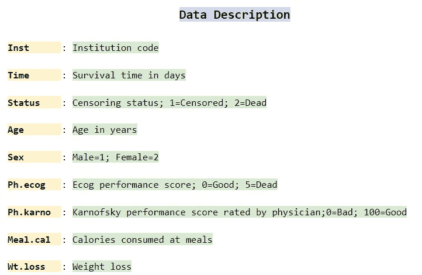

图 1:数据描述值。

# 2.卡普兰-迈耶估计理论与实例

**卡普兰-迈耶估计量**是一种非参数统计，用于根据生命周期数据估计生存函数(一个人存活的概率)。在医学研究中，它通常用于测量患者在治疗或诊断后存活特定时间的比例。例如:计算特定患者在被诊断患有癌症或开始治疗后的存活时间(年、月、日)。估计者以爱德华·l·卡普兰和保罗·梅尔的名字命名，他们向美国统计协会杂志提交了类似的手稿。

用 S(ti)表示的时间 ti 的生存概率计算如下:

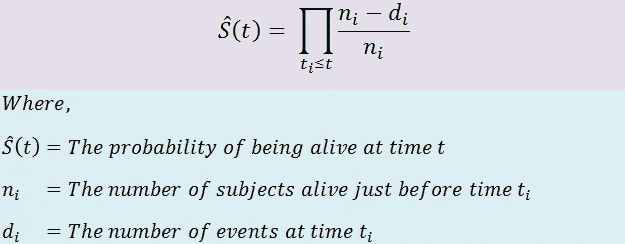

图 2:计算 t1 时刻生存概率的公式。

我们也可以将上面的等式写成如下的简单形式:

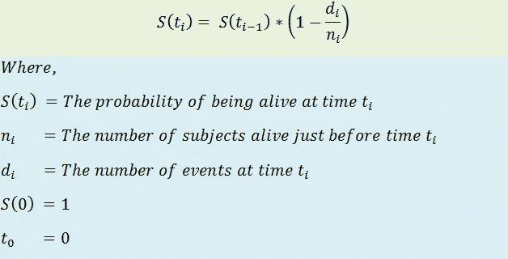

图 3:简单形式的生存时间概率 S(ti)。

例如:

**1)时间 t=1 时的生存概率:**


图 4:t = 1 时的生存概率公式

**2)时间 t=2 时的生存概率:**


图 5:t = 2 时的生存概率公式

**3)时间 t=3 时的生存概率:**


图 6:t = 3 时的生存概率公式

在更一般的情况下，特定时间的生存概率由下式给出。

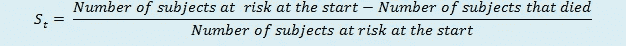

图 7:特定时间内生存概率的通用公式。

从上面的等式，我们可以自信地说。


图 8:表达生存泛化。

## 卡普兰-迈耶估计量(无任何分组)

**1)导入所需的库:**

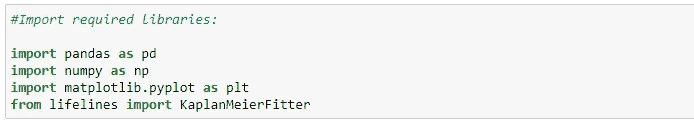

图 9:导入熊猫、numpty、matplotlib.pyplot 和生命线。

**2)读取数据集:**

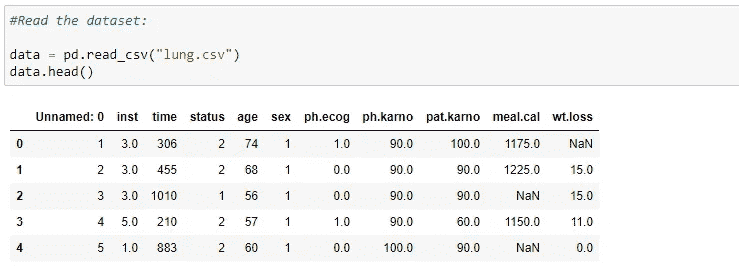

图 10:读取数据集。

**3)打印数据集中的列:**

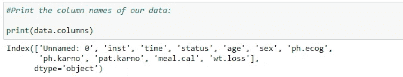

图 11:打印数据列。

**4)获取关于数据集的附加信息:**

它为我们提供了关于列的数据类型及其空值计数器的信息。对于一些生存分析方法，我们需要删除具有空值的行。

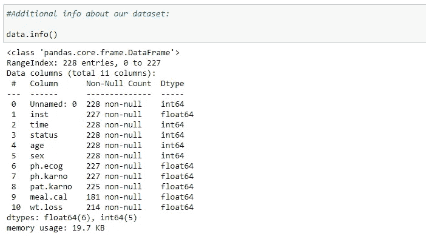

图 12:关于我们数据集的附加信息。

**5)获取数据集的统计信息:**

它为我们提供了一些统计信息，如总行数、平均值、标准偏差、最小值、第 25 个百分点、第 50 个百分点、第 75 个百分点以及每列的最大值。

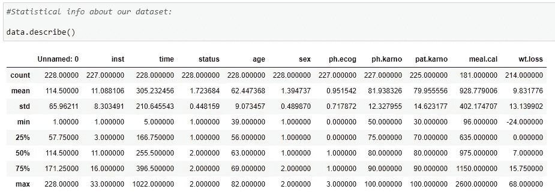

图 13:获取数据集的统计信息。

**6)使用直方图找出性别分布:**

这让我们对我们的数据是如何分布的有了一个大致的概念。在下图中，我们可以看到大约 139 个值的状态为 1，大约 90 个值的状态为 2，这意味着在我们的数据集中有 139 名男性和大约 90 名女性。

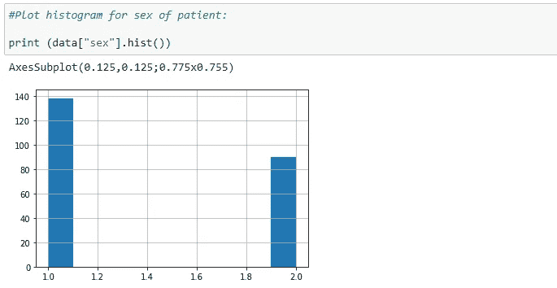

图 14:绘制患者性别的直方图。

**7)为卡普兰-迈耶-钳工创建一个对象:**

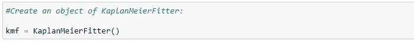

图 15:为 Kaplan-Meier-Fitter 创建一个对象。

**8)组织数据:**

现在我们需要组织我们的数据。我们将在数据集中添加一个名为“dead”的新列它存储了关于作为我们实验一部分的人是死是活的数据(基于状态值)。如果我们的状态值是 1，那么这个人还活着，如果我们的状态值是 2，那么这个人已经死了。这是我们下一步需要做的关键一步，因为我们将把我们的数据存储在名为审查和观察的列中。其中，观察数据存储特定时间线内死亡人员的值，而删截数据存储活着的人或我们不打算调查的人的值。

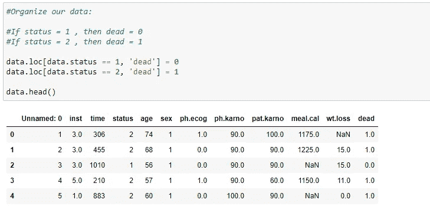

图 16:组织我们的数据。

**9)将我们的数据放入一个对象:**

在这里，我们的目标是找出病人在死亡前存活的天数。我们感兴趣的事件将是“死亡”，它存储在“死亡”列中。第一个参数是我们实验的时间表。

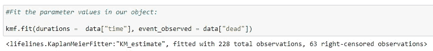

图 17:在我们的对象中拟合参数值。

**10)生成事件表:**

kmf 对象最重要的方法之一是“event_table”它为我们的生存分析提供了各种信息。让我们一栏一栏地看一下。

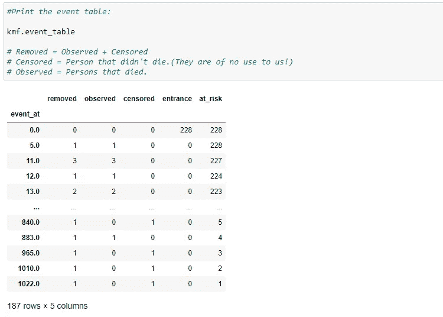

图 18:打印事件表。

a) event_at: 它为我们的数据集存储时间线的值。即在我们的实验中观察患者的时间或进行实验的时间。它可以是几分钟、几天、几个月、几年等等。在我们的情况下，这将是很多天。它存储了受试者的存活天数。

**b) at_risk:** 存储当前正在观察的患者数量。开始时，这将是我们在实验中要观察的病人总数。如果在特定的时间增加了新的患者，那么我们必须相应地增加他们的价值。因此:

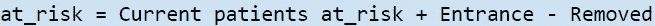

图 19:风险变量公式。

**c)入口:**存储给定时间线内新患者的值。有可能在做实验的同时，其他患者也被诊断出患有这种疾病。为了说明这一点，我们有入口栏。

我们的最终目标是找到病人的生存概率。在实验结束时，如果这个人还活着，我们会把他/她加入到审查类别中。我们已经讨论了审查的类型。

**e)观察:**存储实验过程中死亡的受试者人数的值。从广泛的角度来看，这些人遇到了我们感兴趣的事件。

**f)已删除:**它存储不再是我们实验一部分的患者的值。如果一个人死了或者被审查了，那么他/她就属于这一类。简而言之，它是观察数据和删失数据的补充。

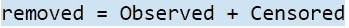

图 20:移除变量公式。

**11)计算各个时间线的生存概率:**

我们先来看特定人在给定时间的生存计算公式。

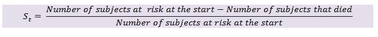

图 21:计算个体时间线的存活概率。

**a)仅在 t=0 时的生存概率:**

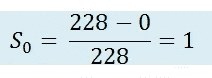

图 22:计算 t=0 的生存概率。

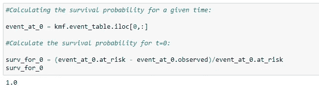

图 23:计算给定时间和 t=0 的生存概率。

**b)仅在 t=5 时的生存概率:**

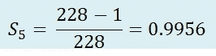

图 24:t = 5 的生存概率。

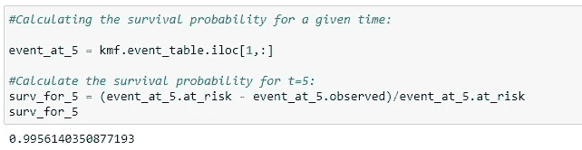

图 25:计算给定时间内的生存概率。

**c)仅在 t=11 时的生存概率:**

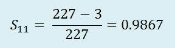

图 26:t = 11 时的生存概率。

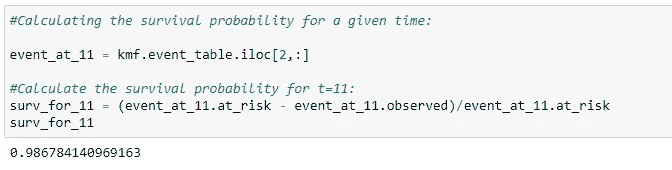

图 27:计算给定时间的生存概率。

现在我们发现的是特定时间的概率。我们想要的是病人在整个时间内的概率。即患者在所有实验中存活的概率。

简而言之，我们想知道一个人在被诊断后存活的概率。我们刚刚发现的只是一个特定实验的概率。

让我们举一个简单的例子来理解条件概率的概念。例如，我们在一个不透明的盒子里总共有 15 个球。在 15 个球中，我们有 7 个黑球，5 个红球和 3 个绿球。这是一个图示。

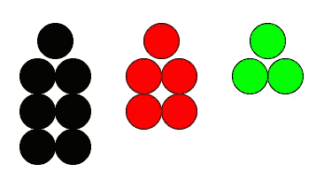

图 28:球图形示例。

**a)选择红球的概率:**


图 29:选择红球的概率。

**b)选择第二个红球的概率:**

因为我们拿走了一个红色的球，所以红色球的总数是 4，球的总数是 14。


图 30:选择第二个红球的概率。

如果我们的问题是找出两个球都是红色的概率，我们将乘以它，这正是我们在生存分析中要做的。我们知道一个病人在第一个时间间隔内存活了下来，假设他在第一个时间间隔内存活了下来，我们想知道他在第二个时间间隔内存活的概率。我在这里的观点是，我们不希望只找到第二个时间间隔的概率。我们想知道他在整个过程中存活的总概率。

在我们的例子中，两个球都是红色的概率如下:


图 31:计算两个球都是红色的概率。

在生存分析中，我们可以把公式写成如下:


图 32:计算 S(n)。

**12)寻找生存概率:**

我们想找出一个病人在所有时间线中存活到现在的概率。现在我们需要找到病人的实际存活概率。

**a)t = 0 时的生存概率:**


图 33:计算 t=0 的生存概率。

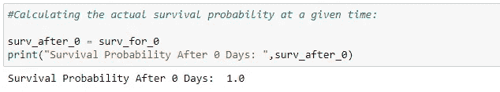

图 34:计算给定时间的实际生存概率。

**b)t = 5 时的生存概率:**


图 35:计算 t=5 的生存概率。

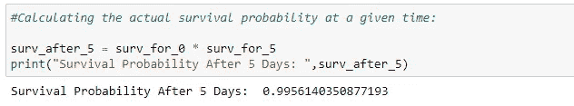

图 36:

**c)t = 11 时的生存概率:**


图 37:计算 t=11 的生存概率。

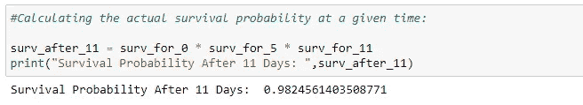

图 38:计算给定时间的实际生存概率。

**13)预测概率:**

现在 kmf 对象的预测函数为我们做了所有这些工作。然而，了解其背后的逻辑始终是一种很好的做法。

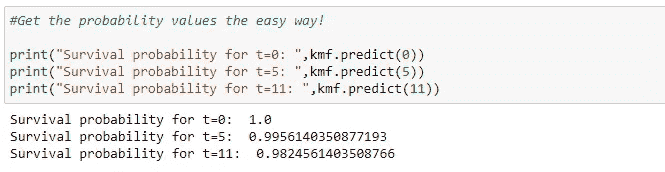

图 39:以简单的方式显示概率值。

**14)寻找时间线数组的生存概率:**

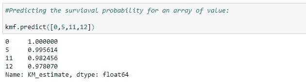

图 40:预测一组值的生存概率。

**15)获取整个时间线的生存概率:**

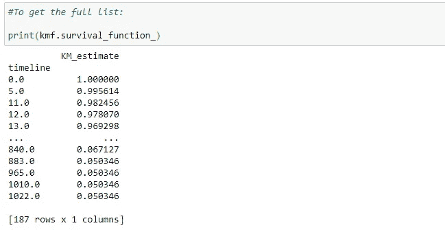

图 41:获得整个时间线的生存概率。

患者在时间线 0 的生存概率是 1。抓住我们的想法，然后我们得出一个人在确诊的第一天死亡的概率接近等于 0。所以我们可以说生存概率越大越好。随着时间线的增加，患者的存活概率降低。

**16)绘制图表:**

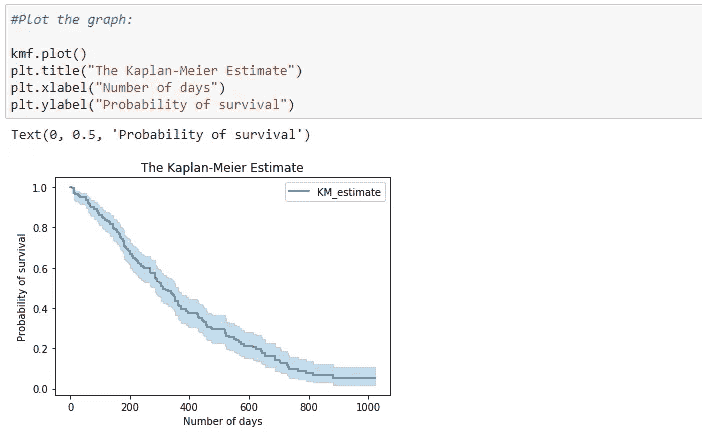

图 42:绘制生存概率。

**17)存活天数中位数:**

它提供了平均 50%的患者存活的天数。

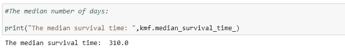

图 43:显示平均天数。

从上面的代码，我们可以说，平均来说，一个人在确诊后活了 310 天。

**18)有置信区间的生存概率:**

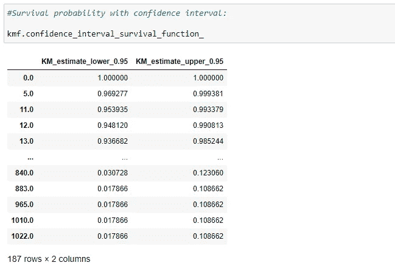

图 44:用置信区间估计生存概率。

**19)有置信区间的生存概率图:**

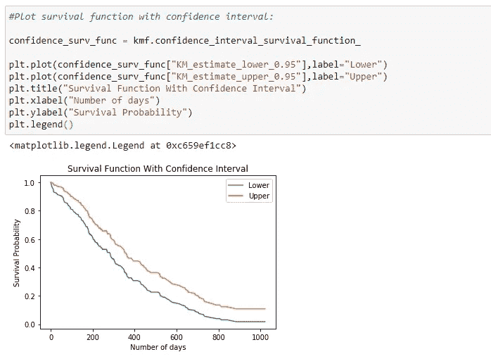

图 45:用置信区间绘制生存函数。

现在我们所有的信息都是为了一个人的生存。现在我们来看看一个人在特定时间线死亡的概率是多少。这里注意，较高的生存概率适合一个人，但较高的累积密度(一个人死亡的概率)就不那么好了！

**20)一个人死亡的概率:**

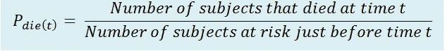

图 46:一个人死亡的概率。

此处，前一行中的分母值有风险。

累积密度的公式:


图 47:累积密度的公式。

a)一个人在 t=0 时死亡的概率:


图 48:一个人在 t=0 时死亡的概率。

b)一个人在 t=5 时死亡的概率:


图 49:一个人在 t=5 时死亡的概率。

c)一个人在 t=11 时死亡的概率:


图 50:一个人在 t=11 时死亡的概率。

求累积密度:

d)t = 0 时的累积密度:


图 51:计算 t=0 时的累积密度。

e)t = 5 时的累积密度:


图 52:计算 t=5 时的累积密度。

f)t = 11 时的累积密度:


图 53:计算 t=11 时的累积密度。

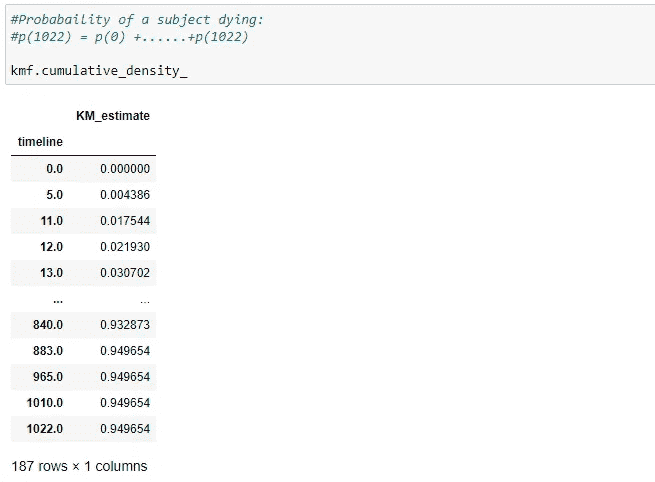

图 54:显示受试者死亡的概率。

**21)绘制累积密度图:**

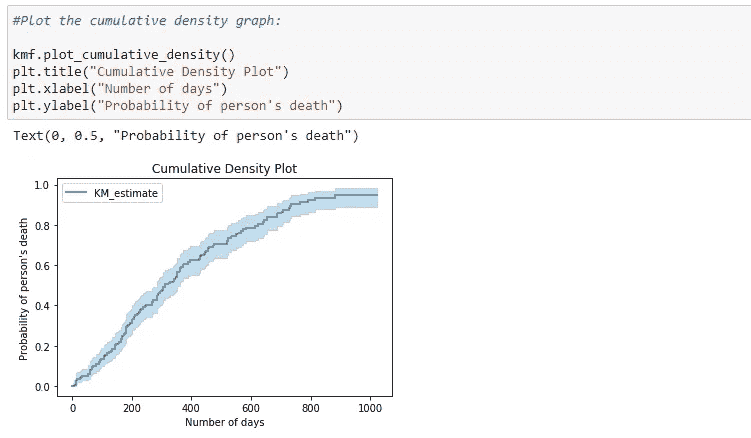

图 55:绘制累积密度。

请注意，随着存活天数的增加，一个人死亡的概率也会增加。

**22)具有置信区间的累积密度:**

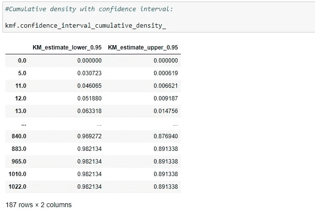

图 56:用置信区间计算累积密度。

**23)带有置信区间的累积密度图:**

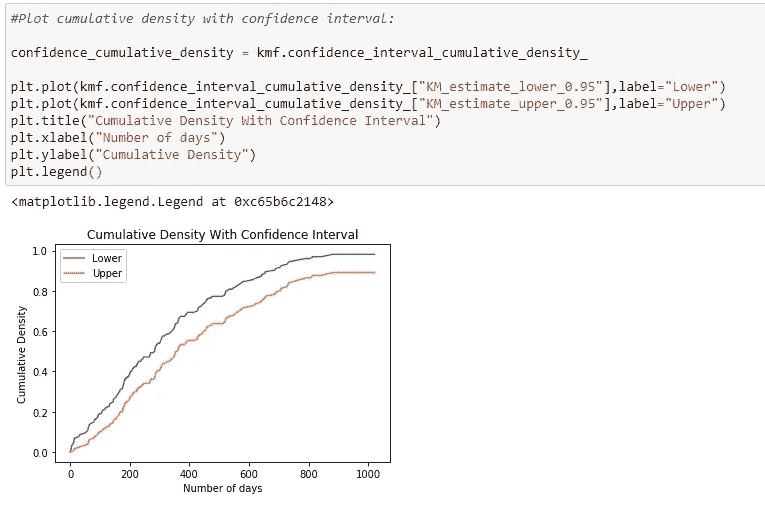

图 57:用置信区间绘制累积密度。

**24)获取特定一天的累积密度:**

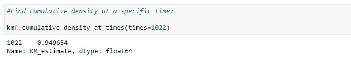

图 58:找出特定时间的累积密度。

**25)事件的平均时间:**

我们可以从平均存活时间得到剩余的时间。

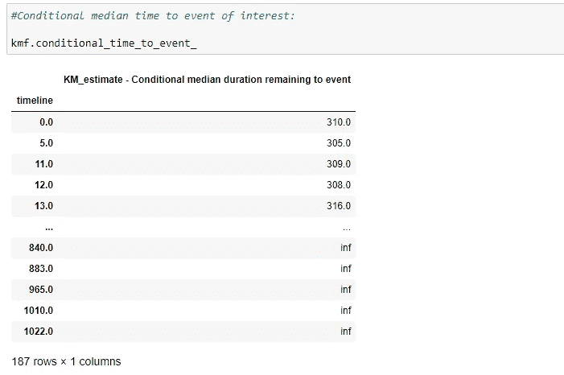

图 59:计算感兴趣事件的条件中值时间。

**26)事件中值时间图:**

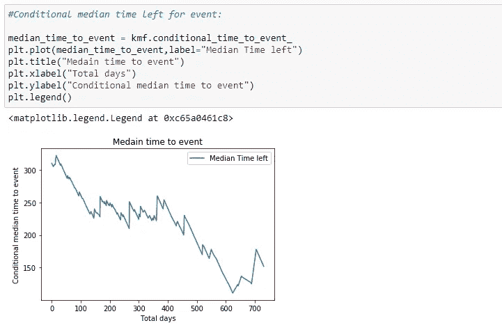

图 60:绘制事件的中值时间图。

# 3.使用 Nelson-Aalen 评估风险率

## 危险函数 H(t):

到目前为止，我们讨论了卡普兰-迈耶生存函数。利用这一点，我们可以得到感兴趣的事件(在我们的例子中是死亡)到那时不发生的概率。生存函数是总结和可视化生存数据集的好方法；然而，这不是唯一的方法。我们可以使用 Nelson-Aalen 风险函数 h(t)来可视化关于存活率的总体信息。风险函数 h(t)给出了在时间 t 接受观察的对象在该时间发生感兴趣的事件(死亡)的概率。为了得到关于风险函数的信息，我们不能转换 Kaplan-Meier 估计量。为此，*累积*风险函数有一个合适的非参数估计量:

累积危险函数:

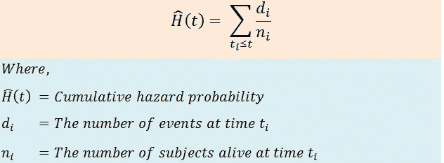

图 61:累积风险函数的计算公式。

**1)导入所需库:**

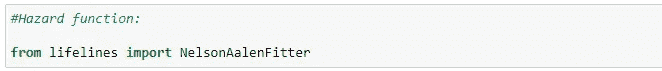

图 62:从生命线导入 NelsonAalenFitter。

**2)创建一个尼尔森-艾伦-菲特的对象:**

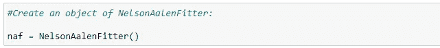

图 63:创建一个 Nelson-Aalen-Fitter 对象。

**3)拟合数据:**

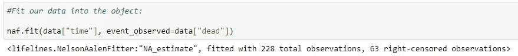

图 64:将数据放入对象中。

**4)寻找累积危险:**

这里，我们将使用上一部分中生成的事件表来理解 hazard 函数实际上是如何工作的。

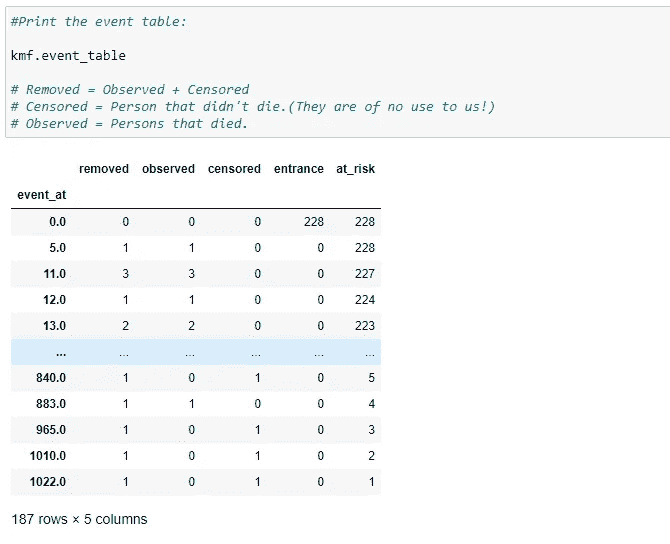

图 65:寻找累积危险。

下面是计算特定时间非累积风险概率的公式:


图 66:计算特定时间非累积危险概率的公式。

a)找出 t=0 时的危险概率:


图 67:找出 t=0 时的危险概率。

b)找出 t=5 时的危险概率:


图 68:找出 t=5 时的危险概率。

c)找出 t=11 时的危险概率:


图 69:寻找 t-11 的危险概率。

d)找出 t=0 时的累积危险概率:


图 70:寻找 t=0 时的累积危险概率。

e)找出 t=5 时的累积危险概率:


图 71:找出 t=5 时的累积危险概率。

f)找出 t=11 时的累积危险概率:


图 72:寻找 t=11 时的累积危险概率。

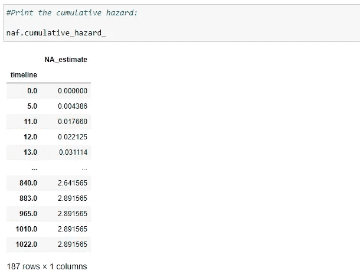

图 73:显示累积危险。

**5)绘制累积危险图:**

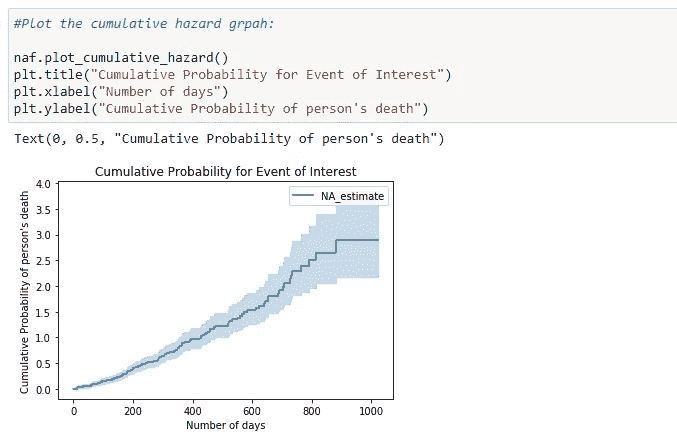

图 74:绘制累积危害图。

累积风险的理解不如生存函数清晰，但风险函数基于更先进的生存分析技术。

**6)预测一个值:**

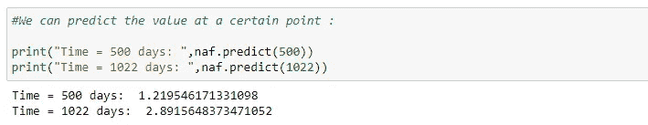

图 75:预测某一点的值。

**7)带置信区间的累积危险概率:**


图 76:用置信区间计算累积危险概率。

**8)带置信区间的累积危险概率图:**


图 77:绘制置信区间。

**9)累积危害与累积密度:**


图 78:绘制累积危害和累积密度

# 4.带群的 Kaplan-Meier 估计量

到目前为止，我们看到了如何找到我们所有观测的生存概率和风险概率。现在是时候对我们的数据进行一些分析，以确定如果我们根据具体特征将数据分组，存活概率是否有任何差异。让我们根据性别将数据分为两组:男性和女性。我们的目标是检查如果我们根据性别划分数据集，存活率是否有显著差异。在本教程的后面，我们将会看到我们在什么基础上将数据分组。

**1)导入所需库:**


图 79:从 Python 中的生命线导入 pandas、numpy、matplotlib.pyplot 和 KaplanMeierFitter。

**2)读取数据集:**


图 80:读取数据集。

**3)组织我们的数据:**


图 81:组织数据。

**4)创建 Kaplan-Meier-Fitter()的两个对象:**


图 82:创建 Kaplan-Meier-Fitter 的两个对象。

**5)将数据分组:**


图 83:将数据分组。

**6)男性数据:**


图 84:查看男性组的数据。

**7)女性数据:**


图 85:显示女性组的数据。

**8)将数据放入我们的对象:**


图 86:将男性和女性数据放入对象中。

9)男子组项目表:


图 87:男性组的事件表。

**10)女子组项目表:**


图 88:女性组的事件表。

**11)预测生存概率:**

现在我们可以预测两组的生存概率。


图 89:基于时间预测值。


图 90:基于时间预测值。

获得生存概率的完整列表

**a)男性群体的生存概率:**


图 91:获得男性群体生存函数的完整数据。

**b)女性组的存活概率:**


图 92:获得男性群体生存函数的完整数据。

绘制生存概率图:


图 93:绘制生存概率图。

这里我们可以注意到，女性肺癌存活的概率高于男性。因此，从这个数据中，我们可以说，医学研究者应该更多地关注导致男性患者生存率差的因素。

**14)得到累积密度:**

**a)男子组:**


图 94:男性群体的累积密度。

**b)女子组:**


图 95:女性群体的累积密度。

**15)绘制累积密度图:**


图 96:绘制两组的累积密度图。

**16)危险功能:**


图 97:导入 NelsonAalenFitter。

**17)将数据放入我们的对象:**


图 98:将数据放入我们的对象中。

**18)累积危险概率:**

**a)男性组:**


图 99:男性群体的累积危害。

**b)女性组:**


图 100:女性群体的累积危害。

**19)绘制累积危险概率图:**


图 101:绘制累积危害图。

**20)男性组的平均事件时间:**


图 102:寻找感兴趣事件的条件中位数。

**21)男性组的中位事件时间图:**


图 103:绘制男性组的条件事件时间。

**22)女性组的中位事件时间:**


图 104:为女性组寻找感兴趣事件的条件中值时间。

**23)女性组的中位事件时间图:**


图 105:女性组事件的条件中值剩余时间。

**24)男性组具有置信区间的生存概率:**


图 106:用置信区间计算男性组的生存概率。

**25)男性组具有置信区间的生存概率图:**


图 107:男性组的置信生存函数和置信区间图。

**26)女性组具有置信区间的生存概率:**


图 108:女性组有置信区间的生存概率。

**27)女性组的具有置信区间的生存概率图:**


图 109:用置信区间绘制女性组的生存函数。

**28)累积密度与累积危险的比较:**

**a)男性组:**


图 110:绘制累积危害和累积密度。

**b)对于女性组:**


图 111:绘制累积危害和累积密度。

# 5.对数秩检验:

对数秩检验是一种假设检验，用于比较两个样本的生存分布。

目标:我们的目标是看看被比较的组之间是否有任何显著的差异。

**无效假设**:无效假设表示被研究的两组之间没有显著差异。如果这些组之间有显著差异，那么我们必须拒绝我们的零假设。

**我们怎么说有显著差异呢？**

介于 0 和 1 之间的 p 值表示统计显著性。p 值越小，被研究组之间的统计差异越显著。请注意，我们的目标是找出我们正在比较的组之间是否有任何差异。如果是的话，我们可以根据各种信息，比如他们的饮食、生活方式和其他信息，对为什么某个特定群体的存活率较低进行更多的研究。

**小于(5% = 0.05) P 值**表示我们比较的各组之间存在显著差异。我们可以根据性别、年龄、种族、治疗方法等对我们的小组进行划分。

**这个测试是为了找出 p 的值**

**1)获取对数秩检验的变量:**


图 112:定义对数秩检验的变量。

**2)执行对数秩检验:**


图 113:执行对数秩测试。

**3)打印 p 值:**


图 114:打印 p 值。

我们使用著名的统计方法，对数秩检验，比较了两个不同组的生存分布。这里我们可以注意到两组的 p 值是 0.00131(<0.005)，这表明我们必须拒绝零假设并承认两组的生存函数有显著差异。p 值给了我们有力的证据，证明“性别”与存活天数有关。简而言之，我们可以说，一个人的“性别”对生存概率有显著影响。

# 6.Cox 比例风险模型

cox 比例风险模型是医学研究人员通常使用的回归模型，用于确定受试者的存活时间与一个或多个预测变量之间的关系。简而言之，我们想找出不同的参数如年龄、性别、体重、身高如何影响受试者的存活时间。

在上一节中，我们看到了卡普兰-迈耶、纳尔逊-阿伦和 Log-Rank-Test。然而，在这种情况下，我们一次只能考虑一个变量，还有一点需要注意的是，我们只对性别、地位等分类变量进行运算。它不能用于年龄、体重或身高等非分类数据。作为一个解决方案，我们使用 Cox 比例风险回归分析，**，它对定量预测非分类变量和分类变量都有效。**

## 我们为什么需要它？

在医学研究中，我们通常会考虑多个因素来诊断一个人的健康状况或存活时间。也就是说，我们通常利用他们的性别、年龄、血压和血糖来发现不同组之间是否有任何显著差异。例如，如果我们根据一个人的年龄对我们的数据进行分组，我们的目标将是确定哪个年龄组有更高的生存机会。那是儿童组、成人组还是老年人组？现在我们需要发现的是我们在什么基础上组成一个团体？为了找到这一点，我们使用 cox 回归并找到不同参数的系数。让我们看看它是如何工作的！

## Cox 比例风险法的基础

cox 比例风险方法的最终目的是注意我们数据集中的不同因素如何影响感兴趣的事件。

**危险功能:**


图 115:危险函数公式。

exp(bi)的值称为危险比(HR)。我们举个例子就明白这一点了。


图 116:定义危险比。

## 让我们编码:

**1)导入所需库:**


图 117:用 Python 导入所需的库。

**2)读取 CSV 文件:**


图 118:读取 CSV 文件。

**3)删除包含空值的行:**

接下来，我们需要删除具有空值的行。我们的模型不能处理包含空值的行。如果我们不预处理我们的数据，那么我们可能会得到一个错误。


图 119:删除空值行。

**4)为 KapanMeierFitter 创建一个对象:**


图 120:为 KapanMeierFitter 创建一个对象。

**5)组织数据:**


图 121:组织数据。

**6)将数据放入一个对象:**


图 122:使数据适合一个对象。

**7)生成事件表:**


图 123:生成事件表。

**8)获取所需的列:**


图 124:从数据中获取所需的列。

9)拟合数据并打印摘要:


图 125:使用 CoxPHFitter 获得摘要。


图 126:显示数据。

在上图中，请注意我们数据集中每一列的 p 值。接下来，我们知道 p 值<0.05 is considered statistically significant. Here we can see that “sex” and “ph.ecog” have p-values less than 0.05\. So we can say that while grouping our data for analysis, we should focus on dividing the data based on these two factors.


Figure 127: Hazard Ratio formula.


Figure 128: Hazard Ratio values.

Here notice the p-value for “sex” is 0.01, and the Hazard Ratio(HR) is 0.57, which indicates a strong relationship between the patients’ sex and decreased risk of death. For example, holding the other covariates constant,**为女性(性别=2)会将风险降低 0.57 倍，即 43%。这意味着雌性有更高的生存机会。接下来，ph.ecog 的 p 值为< 0.005，风险比(HR)为 2.09，这表明 ph.ecog 值与死亡风险增加之间存在密切关系。保持其他协变量不变，ph.ecog 值越高，存活率越低。**这里 ph.ecog 值高的人死亡风险高 109%。**所以，简而言之，我们可以说，医生应该通过提供相关药物来尽量降低患者的 ph.ecog 值。接下来，注意年龄的风险比(HR)是 1.01，表明年龄越大，风险比只增加 1%。所以我们可以说，不同年龄段之间没有显著差异。**

**10)从图表中检查哪个因素影响最大:**

在下图中，我们可以注意到“性别”和“ph.ecog”数据的差异。


图 129:在图表上绘制结果。

用真实的观察来检验我们的理论:

让我们用我们观察到的真实数据来检验我们的结论。


图 130:结论表。


图 131:绘制我们的数据。

在上图中，我们可以看到，23 号人物的生存几率最高，17 号人物的生存几率最低。通过检查主表，我们可以注意到 ph.ecog 值的显著变化。我们还可以看到，21 岁和 23 岁的人有更高的生存机会，因为他们的 ph.ecog 值最低。

好了，这就是本教程的内容。感谢您的阅读。我们随时欢迎您的反馈。

这是发表在 [**KDNuggets**](https://www.kdnuggets.com/2020/07/complete-guide-survival-analysis-python-part1.html) 上的原始文章的修改版。

> 📚如果你喜欢这篇文章，看看我们的[神经网络教程](https://towardsai.net/neural-networks-with-python)从头开始，详细介绍 Python 代码和数学。📚

[](https://www.buymeacoffee.com/pratu)

给普拉蒂克买杯咖啡！

**免责声明:**本文表达的观点为作者个人观点，不代表卡内基梅隆大学的观点。这些文章并不打算成为最终产品，而是当前思想的反映，同时也是讨论和改进的催化剂。

通过[向艾](https://towardsai.net/)发布

## 引用

对于学术背景下的归属，请引用该工作为:

```
Shukla, et al., “Survival Analysis with Python Tutorial - How, What, When, and Why”, Towards AI, 2020
```

## BibTex 引文:

```
@article{pratik_iriondo_2020, 
 title={Survival Analysis with Python Tutorial - How, What, When, and Why}, 
 url={[https://towardsai.net/survival-analysis-with-python](https://towardsai.net/survival-analysis-with-python)}, 
 journal={Towards AI}, 
 publisher={Towards AI Co.}, 
 author={Pratik, Shukla}, 
 editor={Iriondo, Roberto}, 
 year={2020}, 
 month={Sep}
}
```

# 7.资源

[谷歌 Colab 实现](https://colab.research.google.com/drive/1zc6uf91Gw3bkrieJCzfDAzya16qvOHOV?usp=sharing)

[Github 库](https://github.com/towardsai/tutorials/tree/master/survival_analysis_in_python)

# **8。参考文献:**

[1]生命线的例子，[https://lifelines.readthedocs.io/en/latest/Examples.html](https://lifelines.readthedocs.io/en/latest/Examples.html)

[2] Kaplan — Meier Estimator，维基百科，[https://en . Wikipedia . org/wiki/Kaplan % E2 % 80% 93 Meier _ Estimator](https://en.wikipedia.org/wiki/Kaplan%E2%80%93Meier_estimator)

[3]生命线，单变量 NelsonAalenFilter，[https://Lifelines . readthe docs . io/en/latest/fitters/Univariate/NelsonAalenFilter . html](https://lifelines.readthedocs.io/en/latest/fitters/univariate/NelsonAalenFitter.html)

[4] STHDA，高通量数据分析的统计工具，[http://www . sth da . com/English/wiki/Cox-proportional-hazards-model](http://www.sthda.com/english/wiki/cox-proportional-hazards-model)