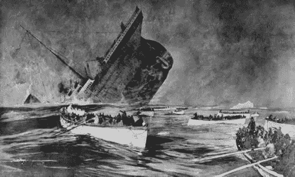
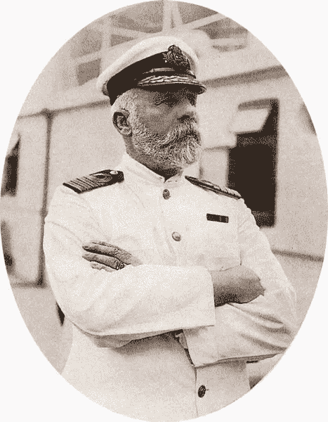
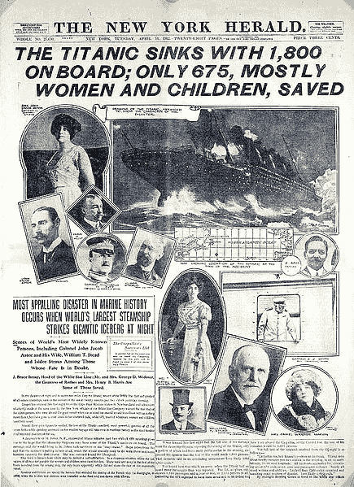
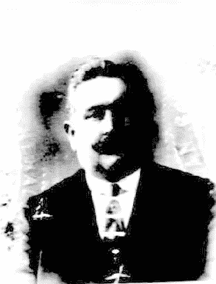
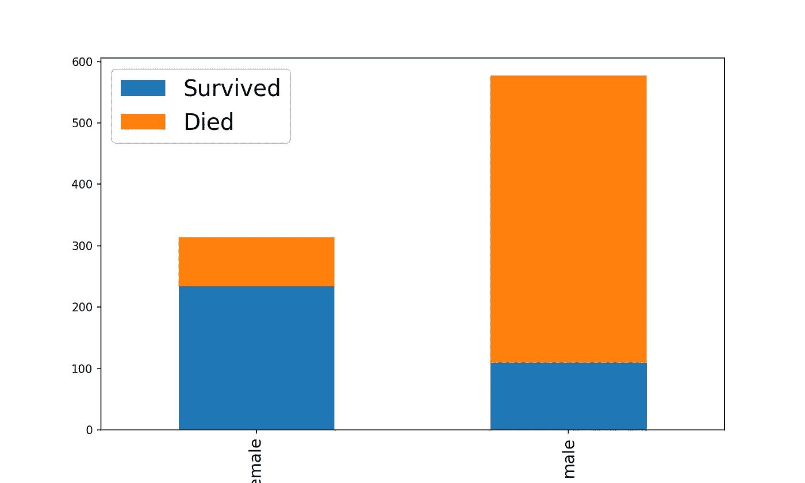
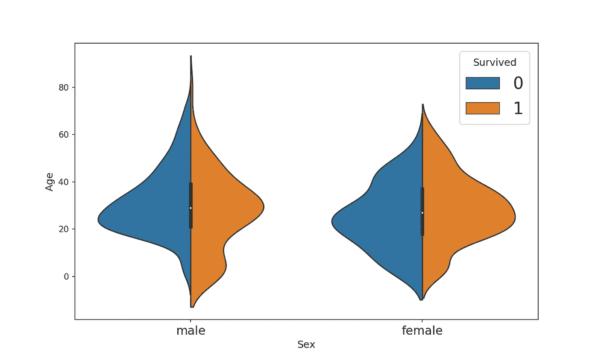
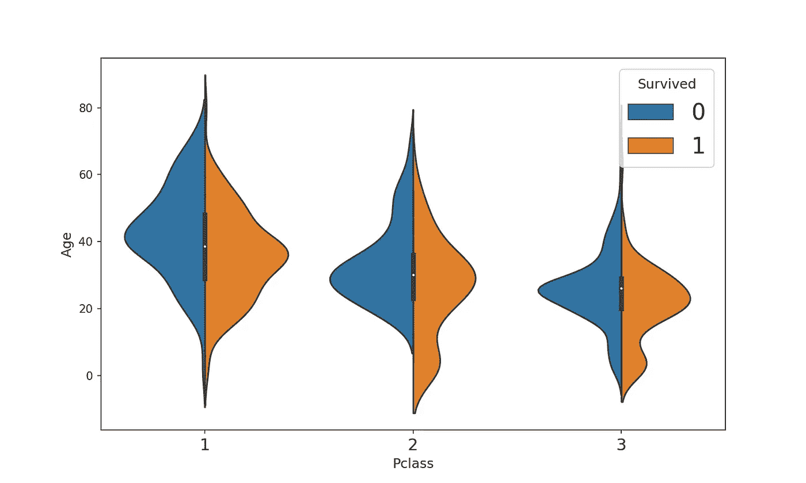
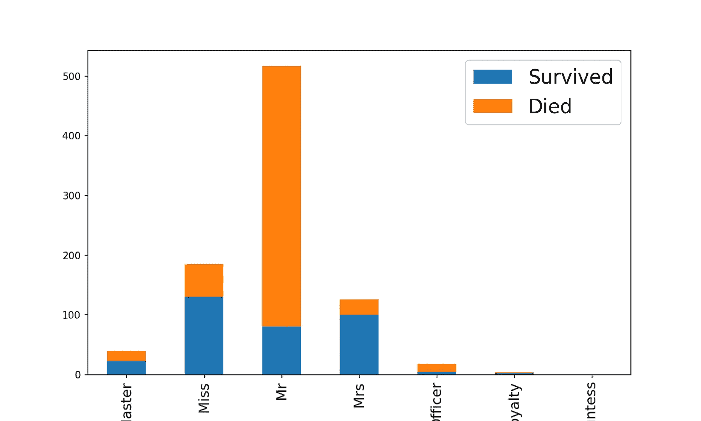
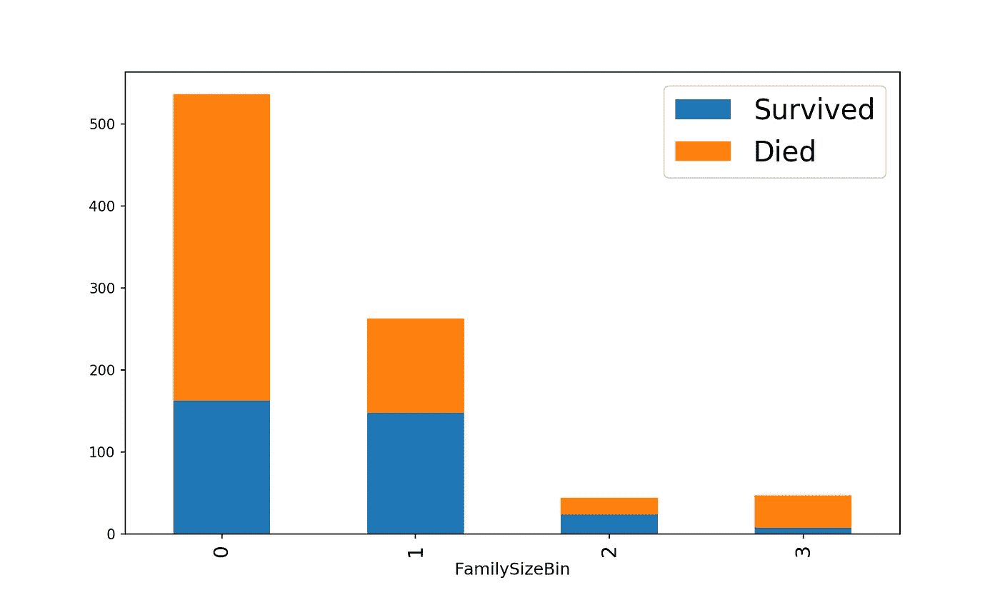

# 在人工智能的帮助下从泰坦尼克号的灾难中幸存

> 原文：<https://pub.towardsai.net/surviving-the-titanic-disaster-with-the-help-of-ai-74e5aeba17ef?source=collection_archive---------4----------------------->

## AI 能帮助泰坦尼克号吗？| [走向 AI](https://pub.towardsai.net)

我一直很喜欢弗朗西斯科·德·格雷戈里(Francesco De Gregori)的歌曲，他是意大利最著名的作曲家之一，可以说是当地鲍勃·迪伦的追随者。1982 年 6 月，当我刚刚一岁的时候，他发行了一张名为[泰坦尼克号](https://itunes.apple.com/ca/album/titanic/254217152)的概念专辑，在这张专辑中，1912 年的灾难被用来比喻当时的社会和他的国家的状况——我很想说从那以后两者都没有太大的变化。尤其是标题歌曲，其拉丁美洲的节奏非常讨人喜欢，让人们得以一瞥踏上命运之旅的最后时刻，这一旅程将改变他们的生活，无论是好是坏。



皇家邮轮泰坦尼克号的沉没，由威利·斯托尔于 1912 年拍摄

> 第一级是一千英里/第二级是一百英里/第三级是一百英里和一百英里
> 
> 一等价值 1000/二等 100 /三等会让你付出痛苦和恐惧
> 
> 你认为我是男生吗？/请给我一封信，如果我在的话
> 
> 谁说三等舱旅行这么糟糕？/这个铺位看起来像特大号床/比住医院好

实际价格分别为 150 美元、60 美元和 30 美元，相当于现代的 3000 美元、1200 美元和 600 美元。有趣的是，这个价格范围与你今天从英国飞往美国所支付的费用没有太大差别

船长 E. J .史密斯是个乐观主义者。他手里拿着当时最好的技术。弗朗西斯科·德·格雷戈里在歌曲《船长的肌肉》中提醒我们，在 20 世纪之交，每个人都热衷于现代主义，对永不沉没的进步有着太多的信心。音乐家想象了船长和一个没有经验的服务员之间的对话，服务员担心他在水中看到的东西。



皇家海军泰坦尼克号的船长爱德华·约翰·史密斯。

> 我不知道你在说什么，我知道你在说什么，我不知道你在说什么。
> 
> 船长，我不想告诉你/但是海里有一个白色的女人/在星光下如此巨大/人们永远不会厌倦看她
> 
> 他说:“Giovanotto，我不知道。/Cèsolo un po di Neb ia/che annuncia il sole。/Andi amo avanti tranquillante”。
> 
> 而船长告诉机舱服务员/“小伙子，没什么好看的。/有雾/但是太阳很快就会升起。/我们和平地走下去吧。”

像泰坦尼克号这样的船上有富裕和贫穷的乘客，一些官员，但也有许多工人阶级的个人，他们作为船员横渡大西洋，寻求更好的生活。

> 妈妈和我在一起，我的生活充满了欢乐，每一天都充满了欢乐。/在这个问题上，我不同意你的观点
> 
> 妈妈，他们偷走了我的生命，他们让我在海平面下的锅炉房工作/只为了几美元/在这艘据说是不沉的漆黑的船上工作


皇家邮轮泰坦尼克号的锅炉房。每个双头锅炉是 15 英尺。9 英寸。直径和 20 英尺。长，包含六个熔炉。

事实上，这艘船在大西洋中部沉没，一个多世纪后仍在那里(北纬 41.7325 度，西经 49.9469 度)。在 2200 名乘客和 989 名船员中，共有 706 人在四个小时后抵达事发地点的皇家卡帕西亚号船的帮助下幸存。


皇家邮轮泰坦尼克号的真正沉船。这艘船在潜入大西洋深处时分成了两截。

你认为你会是幸存者之一吗？有生存的策略吗？虽然我们永远无法确定，但在事件发生后，一些细节很快就清晰地浮现出来。妇女和儿童优先登上为数不多的救生艇。很容易怀疑年轻和富有的人有更好的机会获救，但是这也可以用统计数据来评估吗？事实上，我们知道关于乘客的足够多的细节，这些信息，如果正确地存储在数据库中，可以通过算法进行处理。



事实证明，在 [Kaggle](https://www.kaggle.com/c/titanic) 网站上，你可以做到这一点！

> 在这个挑战中，我们要求你完成对什么样的人可能幸存的分析。特别是，我们要求您应用机器学习的工具来预测哪些乘客在悲剧中幸存。你的工作是预测泰坦尼克号沉没时是否有乘客幸存。对于测试集中的每个变量，您必须预测该变量的值为 0 或 1。

可用的信息类型编码在两个逗号分隔的文件中，这两个文件包含以下字段:

*   *Pclass* 车票等级(:1 =上铺，2 =中铺，3 =下铺)
*   *性别:*性别
*   *年龄:*以年为单位的年龄(婴儿为小数)
*   *Sibsp* :兄弟姐妹和配偶的数量。兄弟姐妹=兄弟，姐妹，继兄弟，继姐妹。配偶=丈夫、妻子(情妇和未婚夫被忽略)
*   *Parch* :船上父母或子女人数。父母=母亲，父亲。孩子=女儿，儿子，继女，继子。有些孩子只和保姆一起旅行，因此对他们来说 parch=0。
*   *票号*:票号(一串字符)
*   *票价*:乘客票价(美元)
*   *舱室*:舱室编号(一串字符)
*   *登船*:登船港(S =南安普顿，Q =昆斯敦(今科布)，C =瑟堡)

在由 891 个条目组成的训练集中，一个名为*的附加字段幸存下来*标记该乘客是否是幸运儿。游戏的名称是在这个集合上训练一个分类器，然后在测试样本(由 418 个条目组成)上运行它，以预测它们的命运。幸存者的旗帜没有出现在第二个文件中，只有挑战的组织者知道——虽然他们的名字*包括了*，但是使用谷歌来解决挑战有什么意义呢？



一份 1922 年的文件中有一张路易吉·菲诺里的照片，当时他离开那不勒斯回到他在纽约的家人身边，可能是在意大利远洋客轮克里斯多福·哥伦布号上。

顺便提一下，船上有几个意大利人。其中， [Luigi Finoli](https://www.giulianovanews.it/2013/08/abruzzo-luigi-finoli-un-abruzzese-sul-titanic/) (条目#1103)是唯一一名来自阿布鲁齐的乘客，我也来自意大利的这个地区。和许多移民一样，他带着一张三等船票离开了家乡阿萨登上了泰坦尼克号。此前，他于 1905 年移民到美国，并与另一位年轻的意大利人罗莎·西科内结婚。我们不知道是什么让他回到意大利，可能是家庭损失。事情是这样的，1912 年 Luigi 在南安普敦和他在美国的妻子团聚。事实上他最终做到了，因为他是从第 15 号救生艇上获救的幸存者之一。其他意大利人活到足以讲述他们的故事。其中，安东尼奥·马蒂内利于 2001 年去世，享年 89 岁。当他第一次在母亲的怀抱中横渡大西洋时，他还不到一岁。相反，24 岁的 Argene Genovesi(测试集条目#907)与她的丈夫 Sebastiano Del Carlo(火车集条目#362)在二等舱旅行。她从 11 号救生艇上获救并安全抵达纽约，但塞巴斯蒂安就没那么幸运了。然而，她生下了玛丽亚·萨尔瓦塔(“被拯救的玛丽”)，她最终在 2008 年去世，享年 96 岁。

我们想做的第一件事是看一看原始数据。网上有很多教程可以看，比如[这个](https://www.kaggle.com/eraaz1/a-comprehensive-guide-to-titanic-machine-learning)和[这个](https://towardsdatascience.com/kaggle-titanic-machine-learning-model-top-7-fa4523b7c40)。我将描述我做了什么，正如我在 GitHub 上的[代码中记录的那样。](https://github.com/rdisipio/titanic)

在我们实际查看数据之前，让我简单地讨论一下一些有用的操作。从兄弟姐妹和父母的数量可以推断出家庭的规模。反过来，这种分布可以被“分类”或“汇集”成几类:独生子女、小家庭。此外，从船票的名字可以知道船舱在哪个甲板上。同样，从*姓名*字段中提取乘客的头衔，并将他们重新分组为有意义的类别，在我的例子中是*军官*、*皇室成员*、*先生*、*夫人*、*小姐*、*主人*。

那么谁更有可能活下来呢？正如报纸反复报道的那样，女性乘客更有可能生还。从我们掌握的数据来看，这一点非常清楚:



以这种方式呈现的数据可能掩盖了年龄在存活率中也起一定作用的事实。例如，年轻男性(< 20 岁)比年长男性更有可能存活。此外，女性的年龄分布情况也有所不同，年龄较大的个体更有可能存活下来。



乘坐头等舱旅行显然是年轻人难以负担的，这一点从年龄分布中也可以看出。大多数三等舱乘客都是 30 多岁，二等舱接近 40 多岁。第一类似乎讲述了一个耐人寻味的故事，因为存活年龄的峰值并不像其他两种情况那样对齐。



可以说，有一张三等票对你没有帮助。事实上，绝大多数死者都睡在床下。



最后，我相信还有最后一个讲故事的图。如果你一个人旅行，你很可能会被“撞上”(今天仍然适用于超额预订)。最让我不安的是这个大家庭。这些人不太可能把他们的孩子留在一艘正在下沉的船上，他们可能更愿意去营救他们或者一起死去。我们永远无法确定。



做预测的时间。这种机器学习任务称为分类，意味着目标是将条目归属于给定的唯一类别(又名类别)。在这种情况下，这是一个二元分类问题，因为一个人可以是死的或活的，但不能同时是两者，除非你碰巧是奥地利理论物理学家的[猫。为了达到挑战的目标，不一定要重新实现分类算法，而是可以使用软件库。在我的例子中，我选择了](https://en.wikipedia.org/wiki/Schr%C3%B6dinger%27s_cat) [scikit-learn](https://scikit-learn.org/stable/) 和 [xgboost](https://xgboost.readthedocs.io/en/latest/) ，这是该领域中事实上的*标准，因为它们的完整性和易用性。这些基于 python 的库提供了许多非常常见的分类器，每个数据科学家都应该至少熟悉这些分类器:*

*   [随机森林](https://en.wikipedia.org/wiki/Random_forest)(射频)
*   (助推)[决策树](https://en.wikipedia.org/wiki/Decision_tree) (BDT)
*   [逻辑回归](https://en.wikipedia.org/wiki/Logistic_regression) (LogReg)
*   [朴素贝叶斯分类器](https://en.wikipedia.org/wiki/Naive_Bayes_classifier) (NB)
*   神经网络/ [多层感知器](https://en.wikipedia.org/wiki/Multilayer_perceptron) (MLP)
*   支持向量机 (SVM)

例如，要设置一个基本的随机森林分类器，您只需:

```
from sklearn.ensemble import RandomForestClassifier
rf = RandomForestClassifier(n_estimators=100)
rf.fit(X_train, Y_train)
```

训练结束后，我们希望评估准确性并预测测试样本上的幸存者标记:

```
acc_rf = round(rf.score(X_train, Y_train) * 100, 2)
cv_rf = cross_val_score(rf, X_train, Y_train, cv=20, scoring="accuracy")
mean_rf = round(cv_rf.mean(), 2)
std_rf = round(cv_rf.std(), 2)
```

*cross_val_score()* 函数执行一个名为 [k 倍交叉验证](https://en.wikipedia.org/wiki/Cross-validation_(statistics))的过程，这实际上是一种测试模型预测新数据能力的方法，这些新数据并未用于对其进行估计。

如果我们对所有的分类器重复相同的过程，我们可以根据它们的准确性对它们进行排序。在本练习中，它通常在 85%左右。更高的值是可能的，但必须记住，对于小数据集，过度训练的可能性(*即*记忆而不是学习)是很大的。

原来，*随机森林*和*决策树*分类器是得分最高的。虽然通常情况下这并不总是正确的，但一个很好的经验法则是记住，在小训练数据集的情况下，建议从 RF、DT(可能还有 SVM)开始，而神经网络更适合在非常大的样本中发现模式。

也就是说，人们永远无法只用一种方法来确定。如果可能的话，我们应该对许多不同的分类器进行平均。实现这一点的两种简单方法被称为*集合硬投票和软投票计数*。硬投票很容易:阶级由多数票决定，就像在民主选举中一样。软投票稍微高级一些:输出由加权平均值给出，其中权重是与每个单个分类器的输出相关联的概率。在某些情况下，这些简单的方法是不够的，而是使用神经网络(具有补充输入)。


干得好，那是个好位置！

顺便说一下:根据我发现的最好的分类器，我不会在泰坦尼克号灾难中幸存。这些是我添加到测试样本中的输入。我想我会和我的家人(妻子，两个孩子，我的父母)一起坐三等舱旅行。

```
10000,3,"Di Sipio, Mr. Riccardo",male,37,1,4,0000000,10.0,C000,S
```

总之，皇家邮轮泰坦尼克号的沉没是一场巨大的灾难，一个多世纪后仍在回响。以某种扭曲的方式，船上人们的故事仍然可以告诉我们一些关于我们社会的变化，以及研究过去的不公正如何帮助我们创造一个更好的地方。即使借助人工智能。