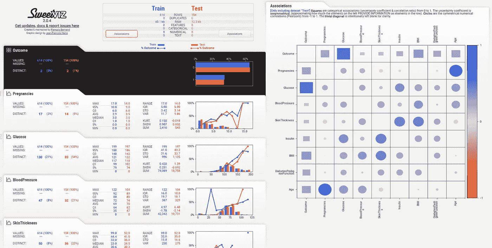

# SweetViz 用于更快速的深度探索性数据分析

> 原文：<https://pub.towardsai.net/sweetviz-for-quicker-in-depth-exploratory-data-analysis-aaf8791e7f9c?source=collection_archive---------2----------------------->

## [数据分析](https://towardsai.net/p/category/data-analysis)

## 目标分析，特征分析，关联，都在几行代码里——我有截图。


来自 [Pexels](https://www.pexels.com/photo/rabbit-chocolate-2072158/?utm_content=attributionCopyText&utm_medium=referral&utm_source=pexels) 的【Giftpundits.com】T2 的照片

让我猜猜:作为一名数据科学家，你喜欢探索性的数据分析。你喜欢从数据中展现洞察力。你喜欢报告这些见解，看到你不太懂技术的经理敬畏你。我也喜欢。

无论我们多么喜欢做这件事，我们能花在探索性数据分析(EDA)上的时间都是有限的。除了 EDA，我们在数据科学生命周期中还有功能工程、模型开发、部署等工作要做。

如果我告诉你有一个工具可以帮助你做你喜欢的事情，你会怎么样？快速跟踪 EDA 阶段，但仍然让您享受这个过程？那不是很甜蜜吗？作为对我之前一篇关于熊猫概况的文章的反馈，我被指引到这个方向去尝试一个名为 SweetViz 的库。在我最近的一个项目中使用过它之后，我喜欢它所提供的东西。

本文将首先介绍一个名为 SweetViz 的 python 库，涵盖从安装、特性到如何在日常项目和分析中使用它们的所有内容，并使用一个真实的例子。

# SweetViz 有什么特别之处？

我是 Pandas-Profiling 的忠实用户，它用几行代码帮助我在几分钟内检查和理解数据。所以当我被告知试用 SweetViz 时，我很不情愿。但事实证明，熊猫概况激发了 SweetViz 的作者，他们甚至重用了一些代码来构建它。

SweetViz 基本上扩展了熊猫的特征分析功能。

> "使用最好的工具来解决手边的问题."—高效的数据科学家

一个高效的数据科学家做得很好:**使用解决手头问题的最佳工具。**只要在短时间内需要深入的 EDA，SweetViz 就是您的选择。了解它的功能以有效地使用它是至关重要的，所以你知道什么时候使用它。它们有很多功能，但主要的是，

*   检查和探索数据
*   比较两个数据集和特征/目标分析。

现在让我们来看一下例子中的每一个特性，这样你就会对这个库感到舒适，并在你的下一个项目中使用它！

# 现实世界的例子:糖尿病预测

早期治疗糖尿病可以在很大程度上避免严重的并发症，如肾衰竭、失明、截肢和心脏病[。了解因素、症状和预测糖尿病的发病对医疗保健有着持久的影响。](https://aspe.hhs.gov/report/diabetes-national-plan-action/importance-early-diabetes-detection#:~:text=Early%20detection%20and%20treatment%20of,limb%20amputations%2C%20and%20kidney%20failure.)


你应该对自己为医疗保健做出的每一个(最小的)贡献感到满意。一直都是。(照片由[娜塔莎·斯潘塞](https://www.pexels.com/@natasha-spencer-1249036?utm_content=attributionCopyText&utm_medium=referral&utm_source=pexels)从[派克斯](https://www.pexels.com/photo/healthcare-text-screenshot-near-green-fern-leaf-2383010/?utm_content=attributionCopyText&utm_medium=referral&utm_source=pexels)拍摄)

以下示例的数据最初来自美国国家糖尿病、消化和肾脏疾病研究所，可在 Kaggle 上获得[。](https://www.kaggle.com/uciml/pima-indians-diabetes-database)该数据包含至少 21 岁的皮马印第安族女性的信息。

当我们定义和理解了手头的问题，我们的下一步是理解和探索数据。为了快速跟踪这一过程，让我们尝试一下 SweetViz。首先，我们必须安装库，这非常简单。启动您的终端并运行以下命令。

```
pip install sweetviz
```

确保您的脚本都不被命名为 sweetviz.py，因为这会干扰库本身。现在我们已经准备好了环境，让我们快速检查和研究数据。

# 检查和探索数据

只需几行代码，我们就可以生成数据的 SweetViz 报告，并使用它来检查和研究这些数据。

使用上面的代码片段生成的报告非常有用。这一部分与熊猫轮廓相同，但设计更好。你们自己看吧。


作者提供的 SweetViz EDA 报告截图

让我们来看看一些有用的功能。

## 1.数据概述

报告顶部的这一部分在几分钟内为您提供了数据的完整概述。您可以浏览并挑选各种重要信息，如大小、功能和数据类型，汇总到一个小表中，这在时间不够时非常有用。

## 2.描述统计学

在概述部分下面，我们有数据中每个变量的描述性统计。这些变量可用的一些统计数据有最大值、最小值、四分位间距、总和、峰度系数、偏度系数等。

在 python 中，我们通常使用一些类似`statsmodels`的统计包或者使用 pandas 的`pd.describe()`来生成这个。但是，当这些都在报告中现成可用时，为什么不加以利用呢？

## 3.缺少值

这是一个重要的特性，尤其是因为我们往往会忘记进行缺失值检查。在进入建模阶段之前，需要处理*缺失值。如果处理不当，缺失值可能会极大地改变我们在建模后获得的结果。*

对于每个变量，SweetViz 都会列出缺失值的百分比/计数。

## 4.直方图分布

生成的报告有数值变量的直方图和分类的条形图。当您需要检查异常值和整个分布时，这非常有用，而 SweetViz 做得很好。

## 5.关联/相关性

在我看来，这是所有功能中最有用的。我不断地回到关联，有时甚至直接从报告中分析它们。

为什么？机器学习是关于相关性和关联性的。记得吗？如果没有相关性，你不可能做出比随机猜测更好的预测。

分析相关性有助于我们在数据科学生命周期的后期进行功能工程和功能选择。

# 比较训练和测试数据

一旦我们探索了数据，我们需要将数据分成训练和测试。我们还需要决定哪个是我们的目标变量。目标变量可以从问题定义本身导出。

我们试图预测什么？无论患者是否患有糖尿病。

哪个变量给了我们这些信息？在我们的数据中，它是`outcome`变量。

这就是我们的目标变量。

这个想法是从训练数据中建立一个模型来预测目标变量，并根据测试数据对其进行评估。

重要的是:训练和测试的分布应该是相似的。有时随机分割可以改变分布。当您的数据不平衡时，这通常是一个问题。为了更好地分析这一点，我们可以使用 SweetViz 的比较数据功能。

在上面的代码中，我们使用 Sklearn 的`train_test_split()`函数将数据分成 80–20%进行训练和测试。然后我们将这两个数据帧传递给 Sweetviz 的`compare()`函数。

这会等着你。



作者提供的比较 SweetViz 报告的扩展屏幕截图

您仍然可以获得我们之前讨论过的所有功能。但是还有更多。

## 6.特征分析

有了训练和测试数据的这种比较，我们可以容易地分析训练和测试分裂之间的所有特征的分布。为了模型的最佳性能，在分割中分布应该是相似的。

快速浏览一下可以发现，我们的拆分就是这种情况。通过将光标悬停在任何特征上，可以看到每个特征的相关性/关联性。

## 7.目标分析

因为我们在生成时指定了目标变量，所以在报告的顶部有一个目标分析部分(黑色阴影)。我们注意到没有任何丢失的值，并且在分割之间分布保持不变。在特征直方图的顶部，目标的变化被画成线。

我们大多数人都忘记了在传统的工作流程中进行这种分析。即使我们做到了，也需要更多的代码行。既然你已经拿到了这份报告，为什么还要费事呢？

在分析相关性时，我们注意到血糖水平、身体质量指数和年龄是三个最重要的相关特征。*功能工程阶段的有用见解*。

# 最后的想法

本文介绍了一个名为 SweetViz 的新库，它帮助我们快速跟踪探索性数据分析阶段。我们浏览了一个真实世界的糖尿病预测示例，使用该库进行了彻底的数据理解，并在将数据分成训练和测试后继续进行了深入的分析。

虽然我们在文章中使用这个工具发现了许多真知灼见，但还有更多。如果没有，那你这个数据科学家还有什么意义？

你是个聪明人。你是个高效的数据科学家。你尝试使用最好的工具来补充你的工作。你总是知道还有更多。您付出了额外的努力来发掘更多见解，并努力成为世界级的数据科学家。

你可能还没有到达那里，我也没有。我们都在互相帮助的学习旅程中。这才是最重要的。

*我希望你喜欢阅读，就像我喜欢为你写这篇文章一样。我在这里的* [*Medium*](https://arunnthevapalan.medium.com/) *中广泛地写了我在数据科学方面的学习经历。欢迎在*[*LinkedIn*](https://www.linkedin.com/in/arunn-thevapalan/)*上与我联系，我很乐意听到各种反馈。*