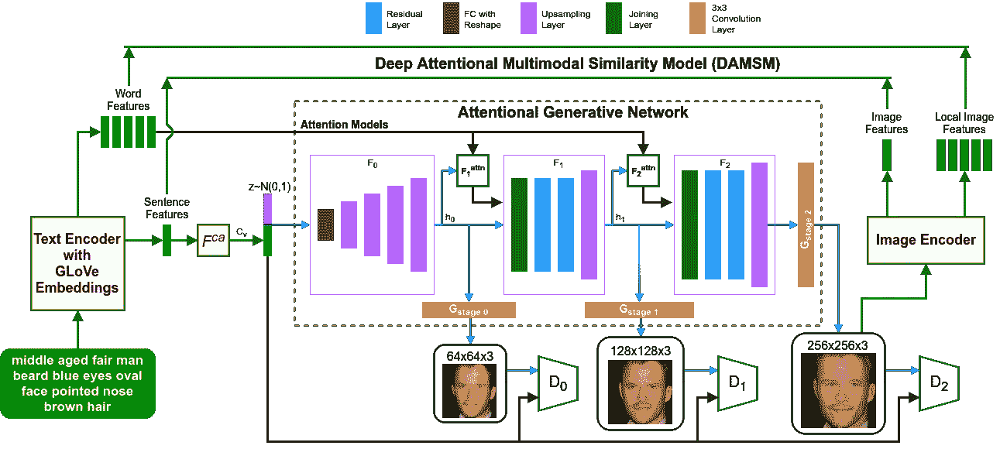
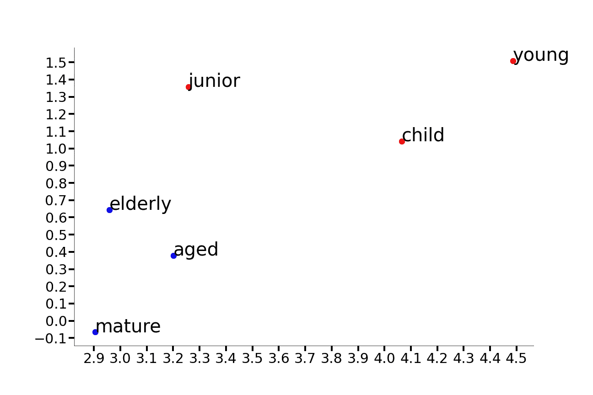
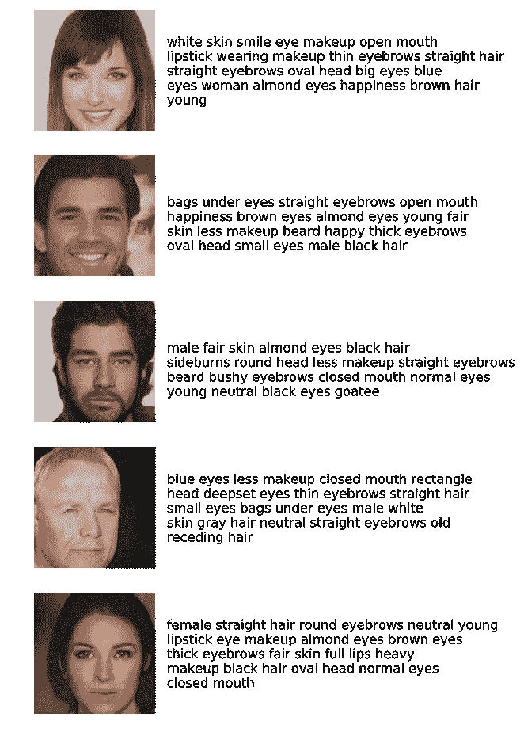
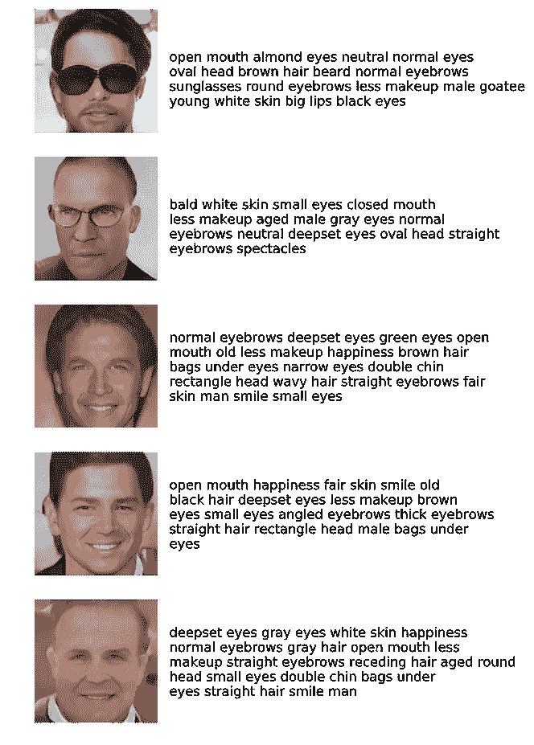
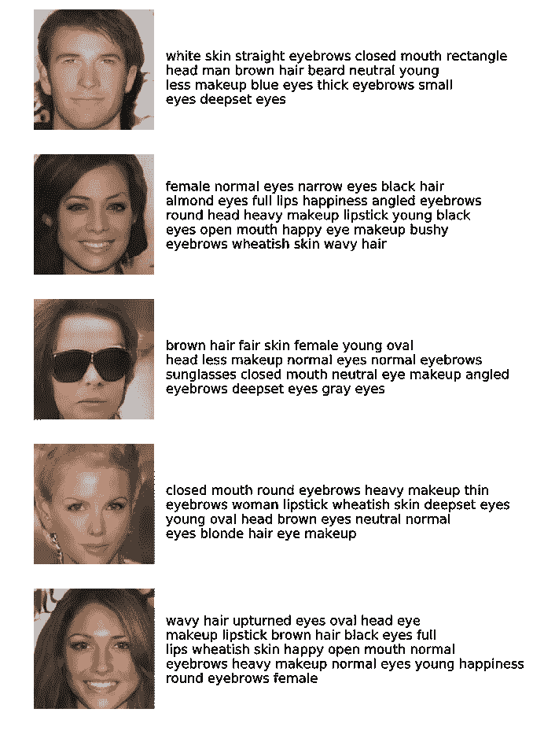
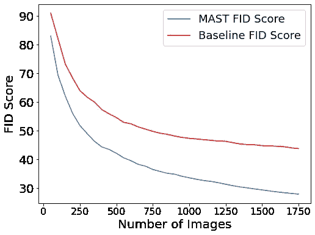

# 概要:多属性和结构化的文本-人脸合成

> 原文：<https://pub.towardsai.net/synopsis-multi-attributed-and-structured-text-to-face-synthesis-ec3755166ad0?source=collection_archive---------2----------------------->

## [要咀嚼的字节大小的信息](https://rohanwadhawan.medium.com/byte-size-information-to-chew-on-ca1d02a9a5c1)

**题目:**多属性结构化文本人脸合成(2020)

**作者:** Rohan Wadhawan，Tanuj Drall，Shubham Singh，Shampa Chakraverty

**发布链接:**[https://ieeexplore.ieee.org/abstract/document/9557583](https://ieeexplore.ieee.org/abstract/document/9557583)

**预印链接:**[https://arxiv.org/abs/2108.11100](https://arxiv.org/abs/2108.11100)

**关键词:**生成对抗网络，图像合成，文本到人脸合成，MAST 数据集，多模态学习，弗雷歇初始距离

# 摘要

这篇文章的结构如下:

*   [问题陈述](#51ac)
*   [论文投稿](#6a7e)
*   [方法论概述](#f323)
*   [结论](#6cf8)
*   [限制](#3b57)
*   [未来工作](#54a6)
*   [应用](#ffbd)
*   [参考文献](#ff26)
*   [附加资源](#9721)

对生成对抗网络(GAN) [ [1](https://arxiv.org/abs/1406.2661) ]和图像合成等主题的详细分析超出了本文的范围。但我提供了相关资源的链接，在阅读论文时会派上用场。此外，这里分享的可视化是取自原始手稿。

## **问题陈述**

开发一种使用文本描述作为输入来生成高保真度和多样性的人脸的技术。

## **论文投稿**

*   提出使用生成对抗网络从结构化文本描述中合成人脸。
*   证明了在文本注释中增加面部属性的数量增强了生成的面部的多样性和保真度。
*   通过用文本注释补充取自 CelebA-HQ [ [3](https://arxiv.org/abs/1710.10196) ]数据集的 **1993 张人脸图像**，合并了一个**多属性和结构化的文本到人脸(MAST)[**[**2**](https://zenodo.org/record/3865238)**]数据集**。

## 方法概述

*   MAST 数据集中的每个注释由可能的 30 个属性中的 15 个或更多个面部属性组成。其中，以下七项:脸型、眉毛大小、眉毛形状、眼睛颜色、眼睛大小、眼睛形状、皮肤肤色是通过作者进行的数据众包获得的[ [4](http://face-descriptions.herokuapp.com/) ]。此外，从 CelebA-HQ 和微软 API [ [5](https://azure.microsoft.com/en-in/services/cognitive-services/face/#overview) ]中提取了八个或更多属性，如胡须、年龄、性别和配饰，总共有 23 种可能性。
*   结构化的文本描述只包括面部特征，没有标点符号、介词和助动词。作者通过随机连接这些属性来模拟经过处理的自由流动的文本，为每幅图像生成五个描述，如下所示。

```
**Free flowing description -** An old man with gray hair and blue eyes. He is smiling**Processed description that resembles description in MAST dataset -** old man gray hair blue eyes smiling
```

*   AttnGan [ [6](https://arxiv.org/abs/1711.10485) ]已经被用于从结构化文本数据中有条件地生成人脸。作者用嵌入层中的手套向量[ [7](https://nlp.stanford.edu/projects/glove/) ]替换了原始技术中使用的预训练文本编码器。这些向量覆盖了大量的词汇，并呈现单词之间的语义关系。GAN 架构如下所示。



具有手套文本嵌入的 AttnGAN 架构

*   手套嵌入也有助于从嵌入空间中的词簇中采样看不见的属性值。例如，根据年龄属性值(如“老年人”和“老年”)训练的模型将能够理解新的类似值(如“成熟”)，如下所示。



在手套嵌入空间中，具有相似含义的单词聚集在一起

*   在 GAN 训练过程中，鉴别器的单侧标号平滑[ [8](https://arxiv.org/abs/1606.03498) ]和交替历元权重更新被用来解决由于鉴别器学习快于生成器而导致的梯度递减问题。
*   弗雷歇初始距离(FID) [ [9](https://arxiv.org/abs/1706.08500) ]用于衡量生成人脸的质量，人脸语义距离(FSD)和人脸语义相似度(FSS) [ [10](https://arxiv.org/abs/1904.05729) ]用于衡量生成人脸与真实人脸的相似度。

## **结论**

*   作者根据经验证明并说明了在文本描述中增加面部属性的数量，在可能的 30 个属性中增加 15 个或更多，有助于提高使用该文本生成的面部的保真度和多样性。



从文本生成的面孔

*   他们证明 FID 度量计算取决于数据集的大小，建议使用大型测试集来报告准确的值。



## 限制

GAN 网络学习将文本属性与训练集中的人脸图像相关联。较小的训练集可能是潜在偏差的来源，并限制了模型可以生成的面部的多样性。

## **未来工作**

*   用于文本-人脸合成的新型 GAN 结构。
*   直接测量跨模态生成的指标。
*   更大和更多样化的数据集，以进一步改善人脸生成。

## **应用**

*   根据目击证人的描述，对嫌疑人进行可靠而详细的面部生成。
*   用视觉提示增强阅读体验。

## **参考文献**

1.  I. Goodfellow，J. Pouget-Abadie，M. Mirza，B. Xu，D. Warde-Farley，S. Ozair，a .，Y. Bengio，“[生成对抗网络](https://arxiv.org/abs/1406.2661)”，载于《神经信息处理系统进展》，2014 年，第 2672-2680 页。
2.  [主数据集](https://zenodo.org/record/3865238)
3.  T.Karras、T. Aila、S. Laine 和 J. Lehtinen，“[为提高质量、稳定性和变化而进行的 gans 渐进种植](https://arxiv.org/abs/1710.10196)，”arXiv 预印本 arXiv:1710.10196，2017 年。
4.  [主数据集众包网站](http://face-descriptions.herokuapp.com/)
5.  [微软 Azure Face API](https://azure.microsoft.com/en-in/services/cognitive-services/face/#overview)
6.  T.Xu，P. Zhang，Q. Huang，H. Zhang，Z. Gan，X. Huang 和 X. He，“att ngan:[利用注意生成对抗网络进行细粒度文本到图像的生成](https://arxiv.org/abs/1711.10485)，”IEEE 计算机视觉和模式识别会议论文集，2018 年，第 1316-1324 页。
7.  [手套:单词表示的全局向量](https://nlp.stanford.edu/projects/glove/)
8.  T.Salimans，I. Goodfellow，W. Zaremba，V. Cheung，a .，X. Chen，“[训练 gans](https://arxiv.org/abs/1606.03498) 的改进技术”，《神经信息处理系统进展》，第 29 卷，第 2234–2242 页，2016 年。
9.  米（meter 的缩写））Heusel，H. Ramsauer，T. Unterthiner，B. Nessler 和 S. Hochreiter，“通过双时标更新规则训练的 [Gans 收敛到局部纳什均衡](https://arxiv.org/abs/1706.08500)”,载于《神经信息处理系统进展》，2017 年，第 6626–6637 页。
10.  X.陈，L. Qing，X. He，X. Luo，和 Y. Xu， [Ftgan:一个用于面向文本生成的完全训练的生成对抗网络](https://arxiv.org/abs/1904.05729)，arXiv 预印本 arXiv:1904.05729，2019。

## 额外资源

*   [Ian good fellow 介绍 GANs，NIPS 2016](https://www.youtube.com/watch?v=9JpdAg6uMXs)
*   [https://github . com/rohan 598/research sh-Papers-Artificial-Intelligence](https://github.com/rohan598/Researsh-Papers-Artificial-Intelligence)
*   [Coursera-GANs 专业化在线学习资源](https://www.coursera.org/specializations/generative-adversarial-networks-gans)

*感谢您阅读本文！如果你觉得这篇文章增加了你的知识，请点击拍手图标来表达你的感激，并与你认为可能从中受益的人分享。如果您有任何问题或发现可能出现的错误，请在下面留下评论。*

[*跟随我*](https://medium.com/@rohanwadhawan) *在我开发 AI 研究心智地图的旅程中及其影响，在*[*【www.rohanwadhawan.com】*](https://www.rohanwadhawan.com/)*了解我更多，在*[*LinkedIn*](https://www.linkedin.com/in/rohan-wadhawan/)*联系我！*