# 甘和变形金刚——驯服变形金刚进行高分辨率图像合成:简介

> 原文：<https://pub.towardsai.net/synopsis-taming-transformers-for-high-resolution-image-synthesis-vq-gan-transformer-15c29b2d529d?source=collection_archive---------2----------------------->

# 摘要

这篇文章总结了由 *Patrick Esser，Robin Rombach 和 bjrn Ommer*所做的作品“ [**”驯服高分辨率图像合成的变形金刚**](https://arxiv.org/abs/2012.09841) ”。它强调了关键的带回家的信息，改进的范围，以及这项工作的应用。本文有助于有兴趣了解卷积神经网络(CNN)[ [1](https://dl.acm.org/doi/10.5555/109230.109279) 、变压器[ [2](https://arxiv.org/abs/1706.03762) ]、自动编码器[ [3](https://www.science.org/doi/10.1126/science.1127647) ]、GAN[ [4](https://arxiv.org/abs/1406.2661) ]和矢量量化码本[ [5](https://arxiv.org/abs/1711.00937) ]等最先进的神经架构和技术如何结合用于图像合成的读者，而无需深入研究它们中的每一个。下面展示的思维导图是一个先决条件的知识金字塔，一个人必须拥有或随后获得，以理解在讨论的论文中定义的技术和正在*转变*生成性人工智能领域的类似方法。

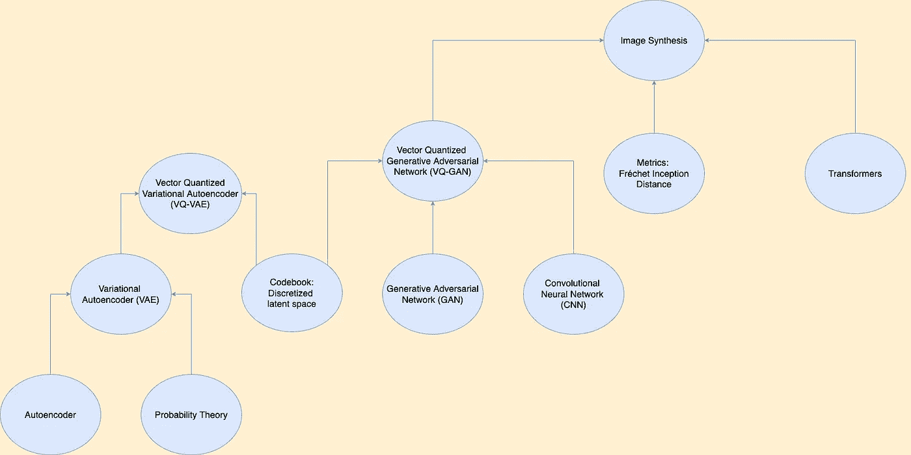

本文中使用的概念思维导图(图片由作者提供)

这篇文章的结构如下:

*   [问题陈述](#e05c)
*   方法论背后的直觉
*   [结论](#e651)
*   [机遇](#5b07)
*   [应用](#ffbd)
*   [参考文献](#ff26)

## 问题陈述

证明将细胞神经网络的感应偏差与变压器的表现力相结合，以无条件或受控的方式合成高分辨率和感知丰富的图像的有效性。

## 方法论背后的直觉

为了理解驯服变压器如何促进高分辨率合成，我们需要从头开始，矢量量化——变分自动编码器(VQ-VAE)[ [5](https://arxiv.org/abs/1711.00937) ]。VQ-VAE 是一种变分自动编码器网络，将图像信息编码到一个离散的潜在空间。它将编码器产生的潜在向量映射到一个最接近它的向量，该向量属于一个固定的向量列表，称为向量码本。使用像欧几里德距离( **𝘓₂范数**)这样的度量来计算亲密度。为了确保生成的输出的多样性，编码器输出潜在向量的网格而不是单个潜在向量，并且每个潜在向量被映射到属于同一码本的向量之一。这个过程被称为潜在空间的*量化。因此，我们获得了表示潜在空间的整数的 2D 网格，其中每个网格值对应于码本列表内的向量的索引。最后，潜在空间的量化后选择的向量被馈送到解码器以生成输出图像。下面的体系结构图展示了这一点:*

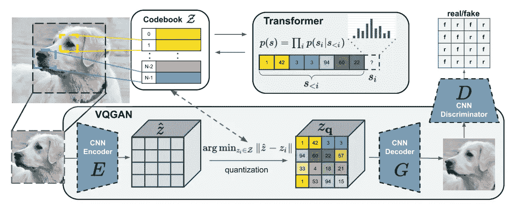

整体架构:VQ-GAN +变压器(来源: [Esser 等人](https://openaccess.thecvf.com/content/CVPR2021/papers/Esser_Taming_Transformers_for_High-Resolution_Image_Synthesis_CVPR_2021_paper.pdf))。)

在数学上，VQ-VAE 模型模拟了训练期间的图像重建问题。编码器子网络模拟函数 **E(x)** ，该函数输出图像 **x** 的潜在向量网格。使用函数 **q(ẑ)** 对网格中的每个潜在向量进行量化，该函数将其映射到来自可用向量码本的向量 **(ẑ)** 。最后，解码器模拟函数 **G(zᵩ)** ，该函数从码本向量网格 **(zᵩ)** 中重构图像**(x’)**。*(此处ᵩ = q)*

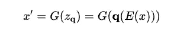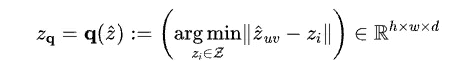

其中 **ẑᵤᵥ** 表示网格中 **(u，v)** 位置的编码器预测潜向量， **zᵢ** 表示码本向量， **h** 表示网格高度， **w** 表示网格， **𝒹** 为每个码本向量的维数长度。

通过优化以下目标函数来联合学习 VQ-VAE 和码本向量:

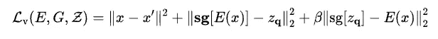

其中 **𝘓ᵥ** 是用于一起训练模型和码本的**向量量化损失**，第一项是**重构损失(𝘓ᵣ)** ，第二项也称为**码本对齐损失，**帮助将码本向量与编码器输出对齐，第三项也称为**承诺损失，**帮助反向对齐，即编码器输出与码本向量对齐，其对总损失的重要性由可调超参数 **β缩放。sg[]** 代表**停止梯度**，即通过[]内的变量不会发生梯度流动或重量更新。对于这些概念的详细和直观的理解，你可以参考这些帖子 [VAE](https://www.jeremyjordan.me/variational-autoencoders/) 和 [VQ-VAE](https://ml.berkeley.edu/blog/posts/vq-vae/) 。

现在是讨论文件中提出的对 VQ-VAE 法案的一系列改进。用感知损失[ [6](https://arxiv.org/abs/1603.08155) ]代替了 **𝘓₂重建损失**，并引入了一个带有基于补丁的鉴别器[ [7](https://arxiv.org/abs/1611.07004) 的对抗训练程序来区分真实图像和重建图像。*这一改变确保了压缩率提高后的良好感知质量*。我将解释压缩的相关性，同时讨论变形金刚如何帮助图像合成过程。作者将这种方法命名为向量量化生成对抗网络(VQ-GAN)。以下是总体目标函数:

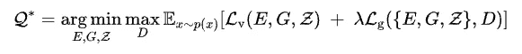

这里 **𝘓g** 是生成性对抗网络损耗， **λ** 是由下式给出的自适应权重，其中 **𝛿** 是数值稳定性。

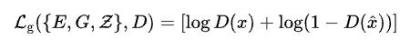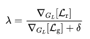

让我们暂时离题，从概率的角度来看看 VQ-甘框架。我们在潜在空间上有一个先验 **p(z)** ，编码器近似潜在空间的后验分布 **p(z|x)** ，解码器近似潜在空间经由分布 **p(x|z)的重建。**为了定义先验，我们展平形成量化潜在空间的码本矢量索引的 2D 网格，并获得索引序列 **s.** 到目前为止，在所有潜在代码上假设一致的先验，使得它们在序列中的步骤 **i** 中的选择同样可能并且独立于先前的步骤。但对于模型试图学习的给定数据集，这可能不成立。换句话说，应该从数据中学习潜在代码的分布。这将有两个好处。首先，我们通过从新的训练过的先验中采样潜在值而生成的数据将更好地代表底层数据集。第二，如果潜在值的分布不均匀，那么代表潜在值序列的比特可以通过应用标准霍夫曼或算术编码来进一步压缩。这就是我在帖子前面提到的压缩。

学习潜在先验会产生自回归问题。最近，变压器已成为自回归和顺序建模任务的首选架构，在低分辨率图像合成方面优于卷积型(CNN)。在这篇[博客](https://jalammar.github.io/illustrated-transformer/)中，我们用一个 NLP 例子很好地解释了转换器的工作原理。传统上，图像转换器处理*离散值*并在像素级执行顺序学习，其成本与图像分辨率成平方比例。虽然它们非常适合需要模型来学习局部真实感和理解全局构图的高分辨率图像合成，但计算成本一直是抑制因素。然而，通过将图像表示为一系列码本向量索引**，**，使用变换器模型在计算上变得容易处理。在选择了 **s** 中指数的一些排序之后，学习先验可以公式化为自回归下一指数预测( **sᵢ** )问题。

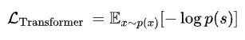

其中 p(s)是完整图像表示的可能性，

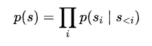

最后，注意机制是转换器架构的本质，它为输入到转换器的序列 **s** 的长度设置了一个计算上限。为了缓解这一问题并生成百万像素级别的图像，在滑动窗口方法的帮助下，将 transformer 应用于图像补丁，如下图所示。VQ-甘确保可用的背景仍然足以忠实地模拟图像，只要数据集的统计数据近似空间不变或空间条件信息可用。

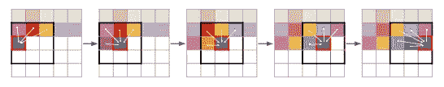

滑动注意窗(来源:[埃塞尔等人](https://openaccess.thecvf.com/content/CVPR2021/papers/Esser_Taming_Transformers_for_High-Resolution_Image_Synthesis_CVPR_2021_paper.pdf)。)

## 结论

*   所提出的方法能够通过 CNN 架构对图像成分进行建模，并通过通用和通用的 transformer 架构对它们的组成进行建模，从而充分挖掘它们在图像合成中互补优势的潜力。
*   对于高分辨率图像合成，它优于最先进的卷积方法，对于条件生成任务，它接近最先进的方法。一些结果如下所示，

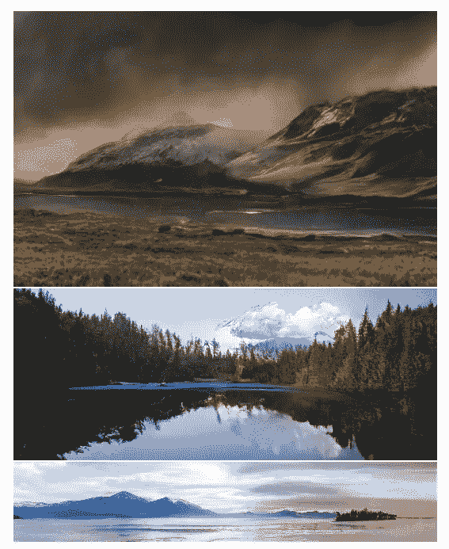

从语义布局生成的高分辨率样本(来源:[埃塞尔等人](https://openaccess.thecvf.com/content/CVPR2021/papers/Esser_Taming_Transformers_for_High-Resolution_Image_Synthesis_CVPR_2021_paper.pdf))。)

*   VQ-GAN 的性能优于最接近的可比网络 VQ-VAE-2[ [8](https://arxiv.org/abs/1906.00446) ]，同时提供显著更高的压缩率，有助于降低计算复杂性。

## 机会

*   方法来增强这种方法的实时可用性，因为基于普通变压器的技术计算量很大。
*   扩展给定的多模态图像合成过程，如文本到图像的生成。

## 应用程序

*   **高分辨率图像合成**
*   **语义图像合成**，以语义分割掩膜为条件。
*   **结构到图像的合成**，其以深度或边缘信息为条件。
*   **姿势引导合成**，其以人类主体的姿势信息为条件，如时装造型。
*   **随机超分辨率合成**，以低分辨率图像为条件
*   **类别条件合成**，以定义感兴趣类别(物体、动物、人类等)的单一索引值为条件。

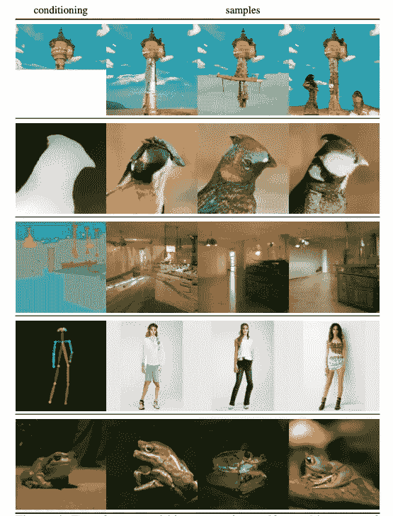

顶行:ImageNet 上无条件培训的完成情况。第二行:深度到图像合成。第三行:语义引导的合成。第四行:姿势引导的人物生成。底部一行:类条件合成。(来源:[埃塞尔等人](https://openaccess.thecvf.com/content/CVPR2021/papers/Esser_Taming_Transformers_for_High-Resolution_Image_Synthesis_CVPR_2021_paper.pdf)。)

## 参考

1.  Y.LeCun 等人，“[用反向传播网络](https://dl.acm.org/doi/10.5555/109230.109279)进行手写数字识别”，在 Proc .神经 Inf。过程。系统。，1990 年，第 396-404 页。
2.  A.Vaswani，N. Shazeer，N. Parmar，J. Uszko- reit，L. Jones，A. N. Gomez，L. Kaiser 和 I. Polosukhin，“[注意力是你所需要的全部](http://iv.org/abs/1706.03762)，”神经信息处理系统进展 30:神经信息处理系统年度会议，NeurIPS，2017 年。
3.  G.辛顿和 r .萨拉胡季诺夫。"[用神经网络降低数据的维度](https://www.science.org/doi/10.1126/science.1127647)"科学 313.5786(2006):504–507。
4.  I. Goodfellow，J. Pouget-Abadie，M. Mirza，B. Xu，D. Warde-Farley，S. Ozair，a .，Y. Bengio，“[生成对抗网络](https://arxiv.org/abs/1406.2661)”，载于《神经信息处理系统进展》，2014 年，第 2672-2680 页。
5.  A.作者声明:Steven k .[神经离散表示学习](https://arxiv.org/abs/1711.00937)。神经信息处理系统进展 30 (2017)。
6.  J.约翰逊，亚历山大和李。[实时风格转换和超分辨率的感知损失](https://arxiv.org/abs/1603.08155)欧洲计算机视觉会议。施普林格，查姆，2016。
7.  页（page 的缩写）Isola，J. Zhu，T. Zhou，A. Efros，“条件对抗网络下的[图像到图像翻译](https://arxiv.org/abs/1611.07004)”，2017*IEEE 计算机视觉与模式识别会议*，*，2017。*
8.  A.Razavi，A. Oord 和 O. Vinyals，“[使用 vq-vae-2](https://arxiv.org/abs/1906.00446) 生成多样化的高保真图像”，2019 年。

*感谢您阅读这篇文章！如果你觉得这篇文章增加了你的知识，请点击拍手图标来表达你的感激，并与你认为可能从中受益的人分享。如果您有任何问题或发现可能出现的错误，请在下面留下评论。*

[*跟随我*](https://medium.com/@rohanwadhawan) *在我开发 AI 研究心智地图的旅程中及其影响，在*[*【www.rohanwadhawan.com】*](https://www.rohanwadhawan.com/)*了解我更多，在*[*LinkedIn*](https://www.linkedin.com/in/rohan-wadhawan/)*联系我！*