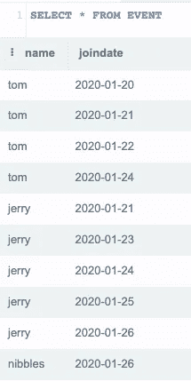
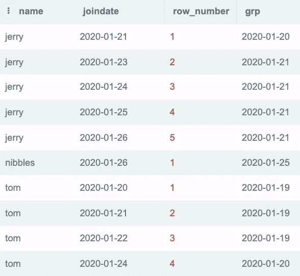
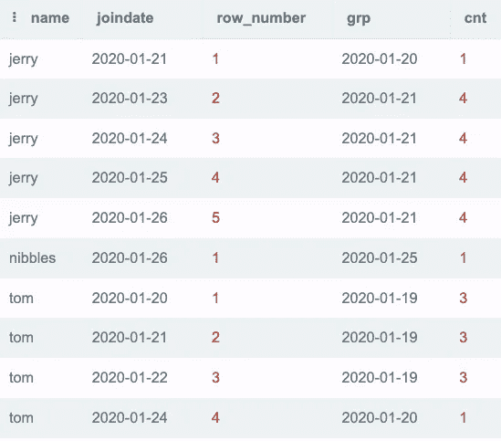
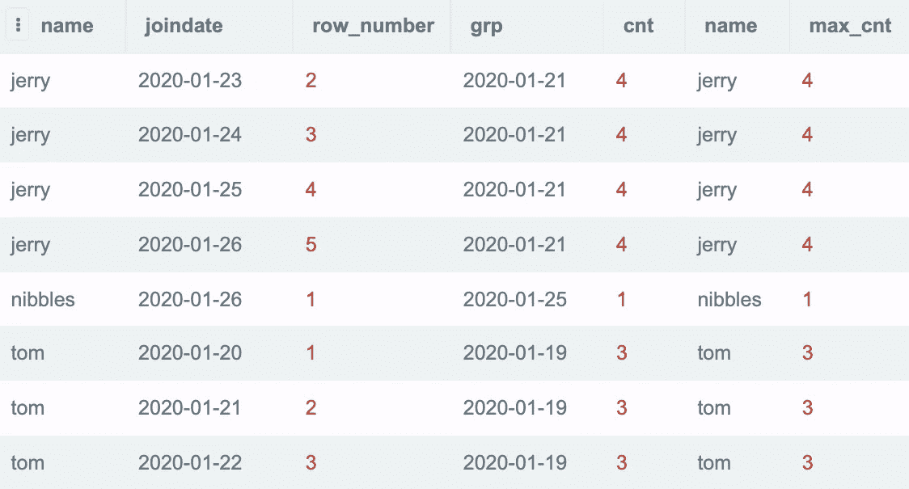
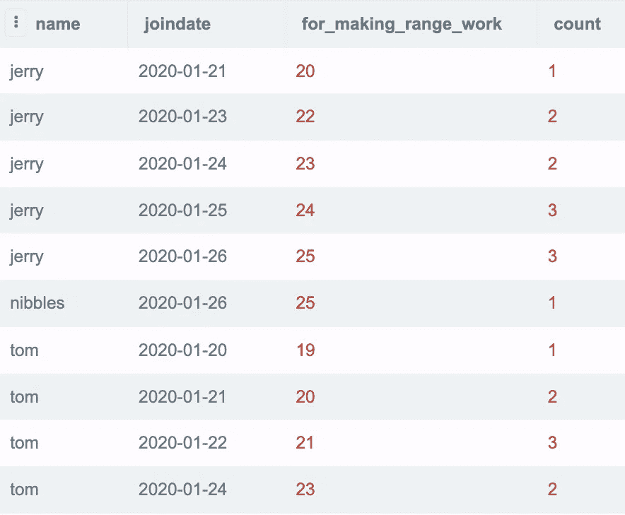

# 连续 SQL 问题的 Tabibitosan

> 原文：<https://pub.towardsai.net/tabibitosan-for-consecutive-sql-problems-52c8159f7090?source=collection_archive---------3----------------------->

## 将您从痛苦的交叉连接和滞后/超前窗口功能中解救出来


[阿斯瓦西 N](https://unsplash.com/@abnair?utm_source=medium&utm_medium=referral) 在 [Unsplash](https://unsplash.com?utm_source=medium&utm_medium=referral) 上的照片

令人惊讶的是，谷歌搜索“tabibitosan sql”只返回几年前文章的链接。尽管自从 Oracle 12c 以来，`match_recognize`已经可以取代 tabibitosan 方法，但我认为提高对这种技术的认识仍然是有价值的，不仅可以解决非 Oracle SQL 风格的问题，更重要的是可以培养一般的问题解决技能。

# 谁至少连续 3 天参加活动？



作者图片

数据显示，我们有 3 个人 tom、jerry 和 nibbles 在 2020 年 1 月下旬左右参加了一次活动。

目标是能够确定 Tom(1 月 20 日至 22 日)和 Jerry(1 月 23 日至 26 日)至少连续 3 天参加了活动，而 nibbles 没有。

## 这项技术

```
select 
      name,
      joindate,
      row_number() over(partition by name order by joindate),
      joindate - row_number() over(partition by name order by joindate)::int grp
from event
```



作者图片

该技术旨在创建一个新的分组列(grp ),我们可以用它来回答这个问题。查看 grp，我们看到它包含 2020 年 1 月 21 日的 4 个副本，标记 jerry 连续参加的 4 天。我们还看到 2020 年 1 月 19 日的三个副本，标记汤姆连续参加的三天。对于 jerry 在 2020 年 1 月 21 日的非连续访问，它有自己的 grp 值。类似地，对于 nibbles 的唯一访问和 tom 在 2020 年 1 月 24 日的非连续访问。

“派生的 grp”列中日期的确切值根本不重要。该技术的目标是创建一列值(任何类型),其中包含我们所关心的相同值(对于该问题为连续事件访问)和我们想要划分的边界的不同值(非连续事件访问)。

## 这是什么魔法？


照片由[美元吉尔](https://unsplash.com/@dollargill?utm_source=medium&utm_medium=referral)在 [Unsplash](https://unsplash.com?utm_source=medium&utm_medium=referral) 上拍摄

整个技术归结为 SELECT 中的这一行`joindate - row_number() over(partition by name order by joindate)::int grp`。

减法运算有两个操作数。左操作数是一个值，有时增加 1 个单位，有时增加超过 1 个单位。右边的操作数是一个自动生成的行号(在它自己的每个分区中)，始终增加 1 个单位。总的来说，左操作数有机会比右操作数移动得更快。

沿着 grp 列中的行往下看(差值的结果)，当天数连续时，两个操作数以 1 个单位的相同速度增加，因此它们的差值保持不变。但是，当日期不连续时，左操作数(暂时)比右操作数移动得快，导致它们的差值变为新的增加值。

再次强调，这个值是什么，一点也不重要。上面的查询对生成的 row_number()进行了`::int`整数转换，仅仅是为了处理`operator does not exist: date - bigint`，因此差异是可能的。您可能需要进行其他您认为合适的转换，以使这项技术发挥作用。

需要注意的是，当这种技术用于分区时，grp 列不一定单调增加，相同的 grp 值可以出现在不同的分区中。(2020–01–20 分别出现在 jerry 和 tom 的第一行和最后一行)。如果我们想进行下游分析，我们必须小心，不仅要用 grp 列进行分组，通常还要用分区列(本例中为 name)进行分组。

```
WITH tbb as ( 
  select 
      name,
      joindate,
      row_number() over(partition by name order by joindate),
      joindate - row_number() over(partition by name order by joindate)::int grp
  from event
)
SELECT 
 DISTINCT name
FROM tbb
GROUP BY name,grp
HAVING COUNT(*) >= 3
```

**输出:**

姓名
————
汤姆
杰瑞

我们可以简单地将前面的查询包装在一个 CTE 中，并查询多于或等于 3 行的组。选择不同的名称对于消除由于同一个人连续出现多个符合 having 条件的重复名称非常重要。对此的另一种观点是，最终的 GROUP BY 作用于(name，grp ),因此如果只查看 name 列，可能会有重复项。

敏锐的读者现在应该意识到，这个解决方案不仅仅局限于解决问题 3，也不仅仅适用于`>=`算子。

# 问题:列出每个人连续就诊时间最长的行


由 [Kaysha](https://unsplash.com/@kaysha?utm_source=medium&utm_medium=referral) 在 [Unsplash](https://unsplash.com?utm_source=medium&utm_medium=referral) 上拍摄的照片

一分耕耘一分收获，之前的问题太简单了，让我们扩展一下。

## 生成一些统计数据

为了能够过滤具有最长条纹的行，首先计算一些关于哪些行是最长条纹的一部分的统计数据是有帮助的。

```
WITH tbb as (
  select 
      name,
      joindate,
      row_number() over(partition by name order by joindate),
      joindate - row_number() over(partition by name order by joindate)::int grp
  from event
),
count_stats AS ( 
  select 
    *,
    COUNT(*) over(partition by name,grp order by joindate rows BETWEEN unbounded preceding and unbounded following) cnt
  from tbb 
)
SELECT * FROM count_stats
```



作者图片

上述查询的关键技术是将窗口函数的框架从默认的`RANGE BETWEEN UNBOUNDED PRECEDING AND CURRENT ROW`扩展到两个方向都是无界的，这样我们就可以计算整个组的统计数据。这里的分区是多级的，由 name 和 grp 列定义。

对于不熟悉窗口功能的人来说，这一步也可以通过通常的`GROUP BY name, grp`来实现，然后将`cnt`统计数据重新加入到这个表中。我展示无界窗口函数只是为了让读者了解其他选择。

## 过滤行

```
WITH tbb as (
  select 
      name,
      joindate,
      row_number() over(partition by name order by joindate),
      joindate - row_number() over(partition by name order by joindate)::int grp
  from event
),
count_stats AS ( 
  select 
    *,
    COUNT(*) over(partition by name,grp order by joindate rows BETWEEN unbounded preceding and unbounded following) cnt
  from tbb 
),
longest_streak AS (
  SELECT name, max(cnt) max_cnt
  FROM count_stats
  GROUP BY name
)
SELECT * From count_stats cs join longest_streak ls on cs.name = ls.name and cs.cnt = ls.max_cnt
```



作者图片

我们可以再通过两步来得到答案，通过计算每个名字的 longest_streak 来生成`max_cnt`，然后使用一个连接来过滤上一步的数据。

此解决方案找到了导致人均最大条纹数的所有行，但没有确定它在哪个条纹中。假设相同的最大条纹出现多次，通过查找第一个、最后一个或第 n 个最大条纹的行，问题会变得更加困难。

## 用这种超能力你还能解决什么

1.  每组的第一天和最后一天
2.  连续跑了多少次

# 不知道 Tabibitosan，原问题怎么解？


乔纳森·博尔巴在 [Unsplash](https://unsplash.com?utm_source=medium&utm_medium=referral) 上的照片

**问题:谁至少连续 3 天出席活动？**

```
SELECT 
name,
    joindate,
    joindate-'2020-01-01' for_making_range_work,
    COUNT(*) over(partition by name order by joindate-'2020-01-01' range between 2 preceding and current row)
FROM event
```



作者图片

这里我们使用 RANGE 关键字从当前行到当前行(包括当前行)回溯 2 天。如果我们数到 3，那就意味着有一连串的 3。如您所见，这个解决方案必须将查询中的值 2 硬编码为连续 3 天的答案，因此不如 tabibitosan 灵活。

## 行数与范围

如果您在前面的例子中尝试使用行作为窗口，将会产生误报。行只计算物理行数，而不关心行中的值。RANGE 查看单元格中的值，并向前和向后查看，在两个方向上扩展窗口框架，同时列中的值(按“超过”的顺序排列)仍在相对于当前行的值的范围内。

## 细枝末节

`joindate-'2020-01-01'`只是为了处理`RANGE with offset PRECEDING/FOLLOWING is not supported for column type date and offset type integer HINT: Cast the offset value to an appropriate type`而做的。令我惊喜的是，Postgres 实际上告诉你如何破解数据类型来使它工作。选择`2020-01-01`完全是任意的。任何日期都可以，目标是将日期转换为整数，以便定义的偏移量(在本例中向后 2 个值，向前 0 个值)可以在整数窗口排序列上工作。其他数据库可能能够直接处理日期偏移。

# 不知道 Tabibitosan 或者 Window 函数，怎么解原问题？

这个解决方案和之前的解决方案一样是静态的，没有使用 Tabibitosan，但是有一个窗口函数，但是编写起来更加繁琐。

1.  自连接 3 个表，写出定义连续性的条件
2.  生成另外 4 列，(lag2，lag1，lead1，lead2)并基于它们进行筛选

# 相关链接

我只展示了冰山一角，下面是一些有用的链接:

1.  [https://towards data science . com/top-SQL-interview-test-questions-techniques-part-1-971 bdccc 745 c](https://towardsdatascience.com/top-sql-interview-test-questions-techniques-part-1-971bdccc745c)(交叉连接和滞后，引导模式，对练习连接条件有价值)
2.  http://rwijk.blogspot.com/2014/01/tabibitosan.html[(在 tabibitosan 中交换谁跑得快/谁跑得慢，改变时间序列的粒度，向前/向后填充空值)](http://rwijk.blogspot.com/2014/01/tabibitosan.html)
3.  [https://community . Oracle . com/tech/developers/discussion/4417554/pl-SQL-101-grouping-sequence-ranges-tabi tosan-method](https://community.oracle.com/tech/developers/discussion/4417554/pl-sql-101-grouping-sequence-ranges-tabibitosan-method)(更多 tabi tosan，用`dense_rank()`代替`row_number()`处理重复项)
4.  [https://social . TechNet . Microsoft . com/wiki/contents/articles/51523 . transact sql-simulating-ignore-nulls-functionality-on-first-value-last-value-functions . aspx](https://social.technet.microsoft.com/wiki/contents/articles/51523.transactsql-simulating-ignore-nulls-functionality-on-first-value-last-value-functions.aspx)(通用 SQL 数据操作技巧)
5.  [https://blog . jooq . org/10-sql-tricks-that-you-not-think-be-possible/](https://blog.jooq.org/10-sql-tricks-that-you-didnt-think-were-possible/)(更多 SQL 操作技巧)
6.  [https://learnsql.com/blog/range-clause/](https://learnsql.com/blog/range-clause/)(实际使用范围，链接备忘单非常好)
7.  [https://sonra . io/data-warehouse/window-function-rows-and-RANGE-on-redshift-and-big query/](https://sonra.io/data-warehouse/window-function-rows-and-range-on-redshift-and-bigquery/)(更多范围)
8.  [https://stack overflow . com/questions/47908423/DB2-SQL-finding-rows-with a-gap-of-1-minute-other-rows](https://stackoverflow.com/questions/47908423/db2-sql-finding-rows-with-a-gap-of-1-minute-with-other-rows)(自我测试的新挑战，不仅要跨行进行比较，还要跨列进行比较)

# 本文的代码:

在 Postgres 14.1 中创建了关于 www.sqliteonline.com 的例子。sqlfiddle.com共享 SQL 片段会更容易，但他们的 SQL 引擎太旧了，无法处理可变的窗口框架。

## 桌子摆好了

```
CREATE TABLE event(name varchar, joindate date);
INSERT into event(name, joindate) values 
('tom','2020-01-20'),
('tom','2020-01-21'),
('tom','2020-01-22'),
('tom','2020-01-24'),
('jerry','2020-01-21'),
('jerry','2020-01-23'),
('jerry','2020-01-24'),
('jerry','2020-01-25'),
('jerry','2020-01-26'),
('nibbles','2020-01-26')
```

## 谁至少连续 3 天参加活动？

```
WITH tbb as ( 
  select 
      name,
      joindate,
      row_number() over(partition by name order by joindate),
      joindate - row_number() over(partition by name order by joindate)::int grp
  from event
)
SELECT 
 DISTINCT name
FROM tbb
GROUP BY name,grp
HAVING COUNT(*) >= 3
```

## 列出每个人连续就诊时间最长的行

```
WITH tbb as (
  select 
      name,
      joindate,
      row_number() over(partition by name order by joindate),
      joindate - row_number() over(partition by name order by joindate)::int grp
  from event
),
count_stats AS ( 
  select 
    *,
    COUNT(*) over(partition by name,grp order by joindate rows BETWEEN unbounded preceding and unbounded following) cnt
  from tbb 
),
longest_streak AS (
  SELECT name, max(cnt) max_cnt
  FROM count_stats
  GROUP BY name
)
SELECT * From count_stats cs join longest_streak ls on cs.name = ls.name and cs.cnt = ls.max_cnt
```

## 无 tabibitosan，硬编码窗口大小

```
SELECT 
name,
    joindate,
    joindate-'2020-01-01' for_making_range_work,
    COUNT(*) over(partition by name order by joindate-'2020-01-01' range between 2 preceding and current row)
FROM event
```