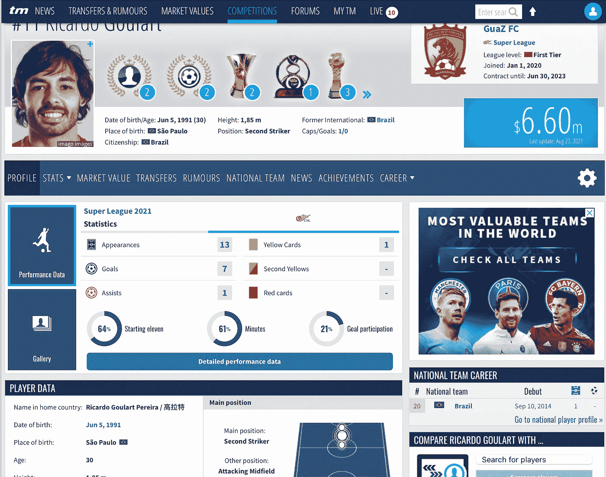
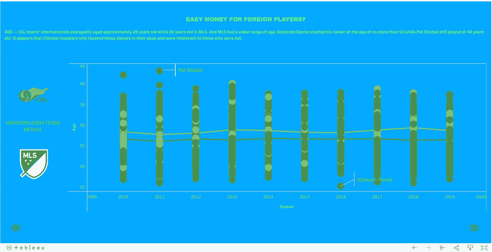
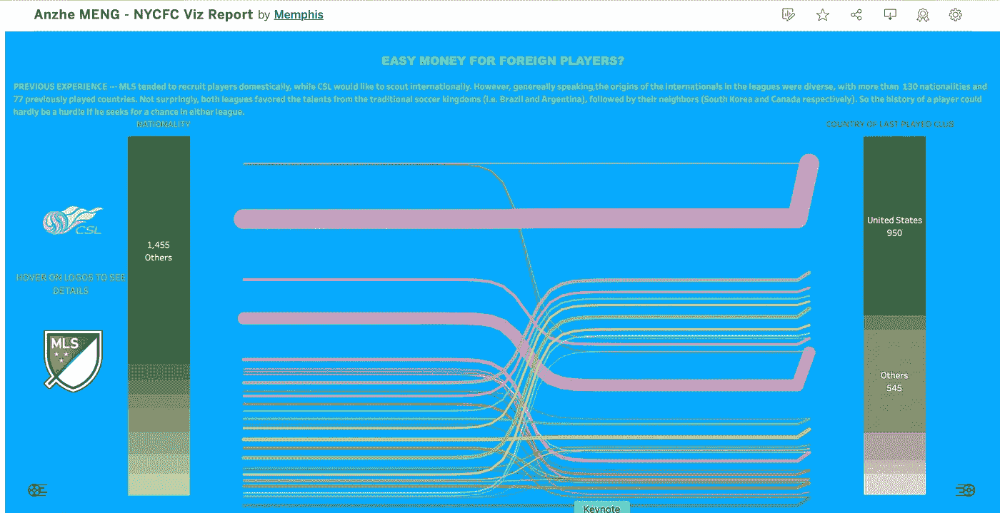
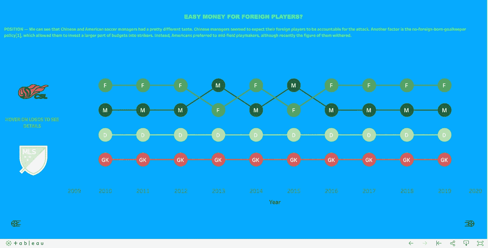
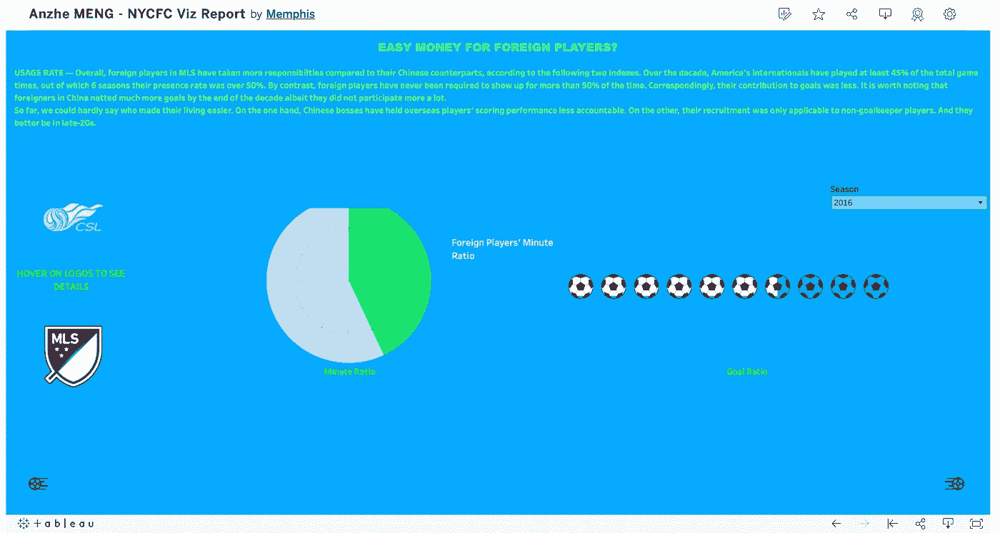
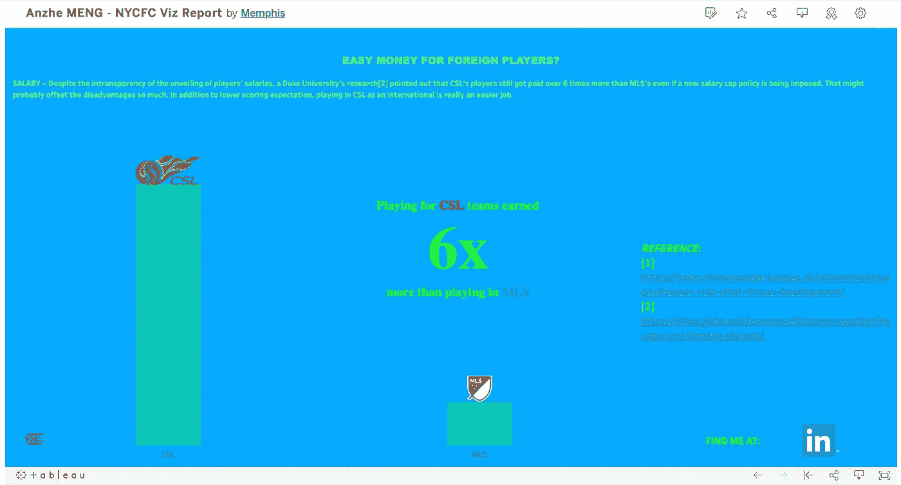

# Tableau Dashboard 案例研究:对美国大联盟和 CSL 之间外国球员身份的调查

> 原文：<https://pub.towardsai.net/tableau-dashboard-case-study-investigation-into-foreign-player-status-between-mls-csl-179f529a51dc?source=collection_archive---------5----------------------->

## [数据可视化](https://towardsai.net/p/category/data-visualization)

我的真实场景展示


[Teemu Paananen](https://unsplash.com/@xteemu?utm_source=unsplash&utm_medium=referral&utm_content=creditCopyText) 在 [Unsplash](https://unsplash.com/s/photos/presentation?utm_source=unsplash&utm_medium=referral&utm_content=creditCopyText) 上的照片

自从我上次在这里发表文章已经有一段时间了。那是因为我很难找到新的想法来装饰你的舞台设计，给你的老板留下深刻印象。与其让你久等，我想分享一些我在使用 Tableau 之前做过的事情。今天我将展示我最喜欢的舞台作品(剧透:是关于足球的！)以及我是如何设法建造它的。

在我们开始之前，如果你对我还不熟悉，看看我的 LinkedIn 主页或者之前关于让你的 vizzes 变得有趣的创意技巧的文章！

[](/make-your-dashboard-stand-out-dendrogam-chart-13f4ca1cc39b) [## 让您的仪表板脱颖而出—树状图

### 打动你的观众和老板！

pub.towardsai.net](/make-your-dashboard-stand-out-dendrogam-chart-13f4ca1cc39b) [](/make-your-dashboard-stand-out-3d-bar-chart-e58cba848c0f) [## 让您的仪表板脱颖而出—三维条形图

### 打动你的客户和老板！

pub.towardsai.net](/make-your-dashboard-stand-out-3d-bar-chart-e58cba848c0f) [](/make-your-dashboard-stand-out-sunshine-chart-7e6049d6b5a7) [## 让您的仪表盘脱颖而出—阳光图表

### 打动你的观众和老板！

pub.towardsai.net](/make-your-dashboard-stand-out-sunshine-chart-7e6049d6b5a7) [](/make-your-dashboard-stand-out-radial-pie-guage-chart-482ecc7c80f8) [## 让您的仪表板脱颖而出—棒棒糖图表

### 打动你的客户和老板！

pub.towardsai.net](/make-your-dashboard-stand-out-radial-pie-guage-chart-482ecc7c80f8) 

# 背景

当我在面试中得到一个带回家的作业时，这个项目是我的可交付成果之一。MLS 的一支足球队打电话给我，要求我通过一次实际挑战展示我的分析和数据科学能力。任何美国足球的地标都会被认为是一个好话题。鉴于我自己的中国背景，在美国职业大联盟和 CSL(中超联赛)之间做一些比较听起来非常有趣。由于这两个联赛长期以来被视为外国球员的“大钱”联赛，我想到了一个比较这两个联赛在 2010 年代外国球员地位的想法。

我的目标是用可视化找出哪里是更好的赚钱的地方。

# 头脑风暴

老实说，这真的有很多可供比较。但为了我的目标，我把尺度归结为以下几个方面:

*   年龄。
*   国籍&前俱乐部的国家。
*   位置。
*   在实地的贡献。
*   收入。

# 数据

值得注意的是，对数据来源没有任何限制。我决定从 [transfermarkt.us](https://www.transfermarkt.us) 收集数据，在那里你可以找到每个赛季 MLS 和 CSL 外籍球员的完整名单。如果您感兴趣，请查看以下网址:

*   [https://www . transfer markt . us/major-league-soccer/gastarbeiter/wettbewerb/ml S1/](https://www.transfermarkt.us/major-league-soccer/gastarbeiter/wettbewerb/MLS1/)
*   [https://www . transfer markt . us/major-league-soccer/gastarbeiter/wettbewerb/CSL/](https://www.transfermarkt.us/major-league-soccer/gastarbeiter/wettbewerb/CSL/)

我设法用 [Scrapy](https://scrapy.org) 抓取了所有想要的数据，但这不是这篇文章的重点。您可以忽略它，看看原始数据包含的列:

*   出生日期
*   季节
*   当前联赛(美国职业大联盟/CSL)
*   国籍(如果一个球员有双重/多重国籍，只考虑他在国际上代表的国家)
*   姓氏俱乐部
*   最后一个俱乐部的国家
*   位置
*   播放分钟数
*   目标参与



[transfermarkt.us](https://www.transfermarkt.us) 上玩家资料页面的样貌(图片由作者提供)

# 仪表板开发

## 年龄偏好

首先想看的是各个联赛国脚的年龄带宽。因为我只拿到了球员的出生日期，所以有必要做一些计算。这是一个新的领域:

```
Age:[Season] - YEAR([Date of Birth])
```

你可能会认为这是每年 1 月 1 日玩家的年龄。

完成后，我构建了一个散点图和一个折线图。散点图代表运动员的年龄，而折线图显示了十年来平均年龄的变化。



作者图片

上面的仪表盘是最后的作品。你可能想知道左边的标志是做什么用的。事实上，他们只是不超过 2 分，而我申请过滤他们。所以当你点击任何一个，来自某个联盟的球员将被过滤(这将在接下来的几页中重复使用)。我还为感兴趣的人标注了图表中最老和最年轻的记录。

## 他们来自哪里？

要回答这个问题，你需要把它分解到它们最初来自哪里，从哪里来。我的解决方法是创建两个堆叠的条形图，每个代表不同国籍的百分比，以及他们最近玩的国家的百分比。我还用桑基图把它们联系起来，以展示一个球员的出生地和他曾经效力的国家之间的关系。



作者图片

## 位置

不同俱乐部的利益相关者对球员位置有不同的偏好是很正常的。我将通过想象前锋、中场、后卫和守门员的等级来反映这一点。用哑铃图很容易做到这一点，所以你应该很熟悉，看看我之前的文章的链接。



作者图片

## 贡献

如果真的一头扎进对球员场上表现的评价，那就一言难尽了。然而，这可以简化为一名球员占本方进球的多少以及他踢了多长时间。这就是为什么我从网站上刮掉了“上场时间”和“进球参与度”。

虽然这两个指标都是百分比，但我试图用两种不同的方式来呈现它们，只是为了使视觉效果多样化:分钟显示在一个像时钟一样的饼状图上，而目标显示在一个[点状条形图](/make-your-dashboard-stand-out-dotted-progress-chart-69b6a064a7d4)上。



作者图片

## 收入

不幸的是，由于球员隐私的性质，关于他们工资的信息几乎不公开。我的选择是参考杜克大学的[调查](https://public.tableau.com/app/profile/memphis4346/viz/AnzheMENG-NYCFCVizReport/Intro)，该调查发现 CSL 的外国球员可能比他们在美国职业棒球大联盟的同行多挣 6 倍。然后，这被呈现为一个简单的条形图，其中填充了其他指示性元素，例如徽标和注释。



# 结论

如果一个 viz 不能提供任何信息或有见地的东西，那就不是一个好的 viz。为了提取任何有用的信息，我们需要根据我们绘制/构建的内容讲述一个有说服力的故事。

到目前为止，基于可视化，我们已经观察到:

*   美国职业棒球大联盟的外国球员年龄范围更广，而中国俱乐部投资者似乎更青睐壮年球员，对非壮年球员难以容忍。年轻或接近职业生涯末期的球员可能会发现在中国找工作不太友好。
*   大联盟倾向于在国内招募，而 CSL 倾向于在国际上招募。但不足为奇的是，两国都更喜欢在一些足球王国(如巴西、阿根廷)和邻国(如中国的韩国、美国的墨西哥)寻找人才。
*   中国人希望他们的国际球员承担更多的进攻，这就是为什么前锋/前锋的进口数量总是排名第一。另一方面，在美国，组织核心几乎和前锋一样受欢迎。
*   美国国脚的出勤率更高，因此进球贡献也更大。
*   中国的国际球员比他们在美国的同行挣得多。

> 简而言之，我的结论是:尽管有一些因素可能成为海外球员在中国俱乐部踢球的障碍，例如年龄和职位(在 CSL 不允许守门员代表中国以外的其他国家)，但我们仍然可以看到，当球员工资高但责任少时，中国联赛是一个更容易赚钱的地方。

# 在我走之前…

感谢你来到这里！这是我第一次分享我的日常商业智能任务，所以如果你真的喜欢我的新鲜尝试，我将非常感谢！如果你有任何你认为我想知道的事情，请在下面评论！

我的完整仪表板:

[https://public . tableau . com/views/anzhe Meng-nyfcvizreport/Intro？:language = en-US&:display _ count = n&:origin = viz _ share _ link](https://public.tableau.com/views/AnzheMENG-NYCFCVizReport/Intro?:language=en-US&:display_count=n&:origin=viz_share_link)

> 今天使用我的[邀请](https://anzhemeng.medium.com/membership)成为中等会员。那你就和我以及平台上千千万万更不平凡的作家一起敬请期待吧！