# Tableau UI 概述:Tableau 桌面专家认证之路

> 原文：<https://pub.towardsai.net/tableau-ui-overview-a-road-to-tableau-desktop-specialist-certification-a30982c963db?source=collection_archive---------1----------------------->

## 第 2 章:深入 Tableau 用户界面

欢迎来到第二章，在这一章中，我们将进行一次虚拟的 Tableau UI 之旅。

> 如果你想浏览其他章节，请访问: [Tableau](https://medium.com/u/fcbe60d0bf8b?source=post_page-----a30982c963db--------------------------------) **:这是什么？为什么它是最好的？；Tableau 桌面专家认证之路。**

> 如果你想直接上 Tableau 桌面专家笔记，请在这里访问→[https://dakshtrehan . comment . site/Tableau-Notes-c 13 fceda 97 b 94 BDA 940 edbf 6751 cf 303](https://dakshtrehan.notion.site/Tableau-Notes-c13fceda97b94bda940edbf6751cf303)
> 
> 使用链接访问免费 Tableau 认证转储(有效期至 2022 年 7 月 6 日):
> 
> [https://www . udemy . com/course/tableau-desktop-specialist-certification-dumps-2022/？coupon code = e3f 08189 fa 4 bafae 72 BC](https://www.udemy.com/course/tableau-desktop-specialist-certification-dumps-2022/?couponCode=E3F08189FA4BAFAE72BC)

# 目录:

*   **起始页**
*   **数据源页面**
*   **Tableau 工作场所**
*   **本题的样题**

# 起始页

起始页充当中央存储库，它允许用户:

*   连接新数据
*   访问以前的工作表
*   探索 Tableau 产品、服务和教程

## 连接新数据

在“连接”面板中，Tableau 允许:

*   **连接数据** → Tableau 允许连接来自两个来源的数据:
    -来自本地目录 *(JSON，CSV，PDF，XLSX，Stats 文件)*
    -来自服务器 *(MySQL，RedShift，SAP，Hive，Google Cloud，Snowflake)*

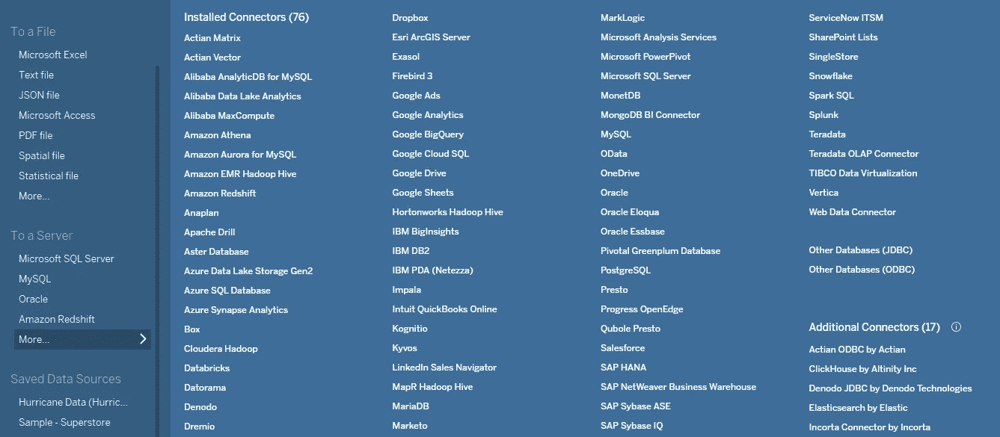

*   **打开保存的数据源** →允许打开*我的 Tableau 存储库目录中已经保存的数据。*

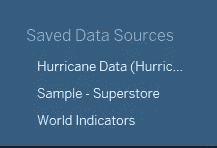

## 访问以前的工作表

此窗格允许您打开以前/最近的工作表，您也可以锁定它们以便于访问。

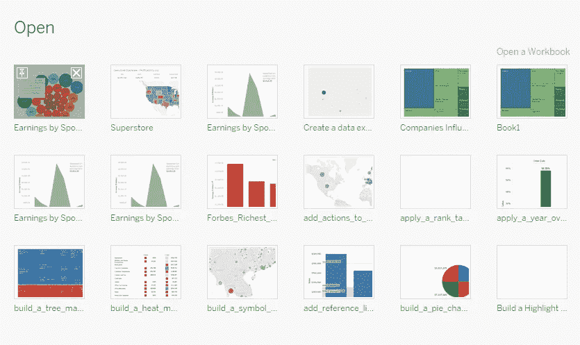

## 探索 Tableau 产品、服务和教程

它提供了对文档、教程视频和其他有用的 Tableau 产品的方便访问。

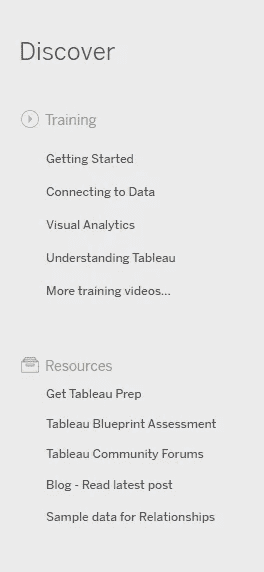

# 数据源页面

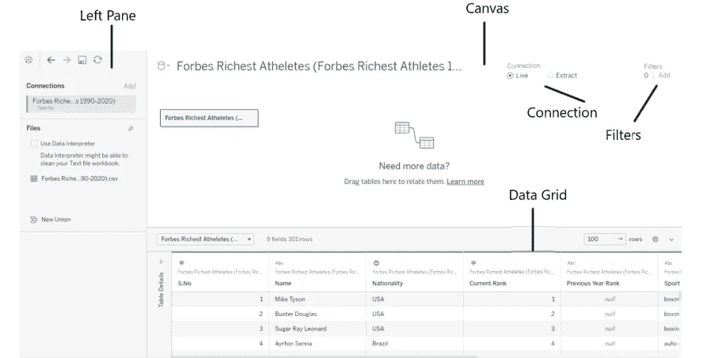

**左窗格→** 显示连接的数据源，数据中的工作表&联合数据。

**Canvas →** 这里用户可以定义逻辑表之间的关系。(关于连接数据的更多信息将在后面的章节中介绍)

**连接→** Tableau 允许用户进行实时连接或提取连接。Live 速度慢但实时，extract 是实时数据的快照，速度很快。

**过滤器→** 我们可以直接从起始页添加数据过滤器。(关于过滤器的更多内容将在后面的章节中介绍)

**数据网格→** 它显示我们数据中的字段。该窗格还允许进行常规修改，如排序、隐藏、重命名、重置、创建计算、添加别名。

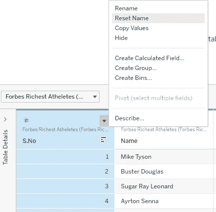

# Tableau 工作区

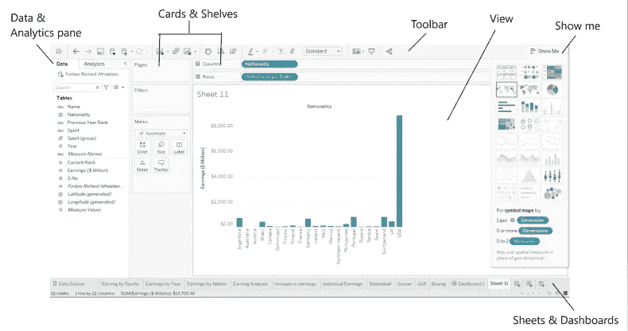

**数据&分析窗格→** 该窗格包含关于数据的信息，即维度&度量(关于维度和度量的更多信息将在后面的章节中介绍)、选定的数据连接，以及包括统计汇总(如中值、众数、平均线等)的分析窗格。

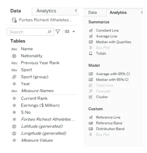

**卡片&货架** →在此拖放数据窗格中的数据字段，将字段添加到视图中。它由行&列架和页面、过滤器和标记卡组成。

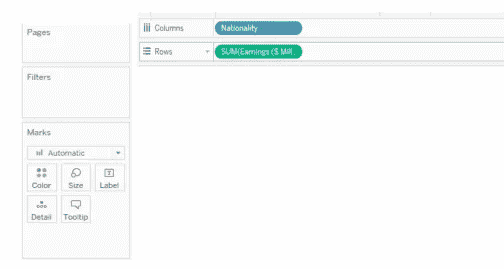

**工具栏→** 它用于访问命令和导航。

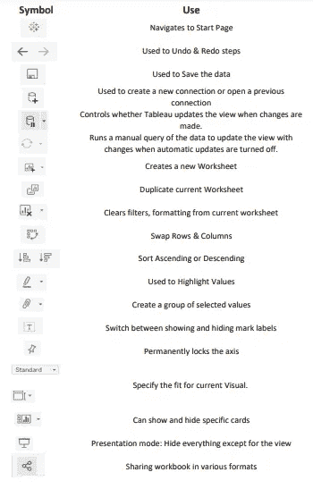

**视图** →这是我们创建可视化的地方。

**示范→** 该面板提供了不同的选项，用户可以根据所选的维度或度量来创建 viz。

**工作表、仪表板&故事→** 该窗格允许用户创建和访问工作表、仪表板&故事。(关于仪表板的更多信息&将在后面的章节中介绍)

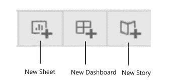

# **本题的样题**

**在哪里可以找到 Tableau 保存的数据源？**

1.  我的 Tableau 存储库
2.  我的文档
3.  Tableau 数据源
4.  下载

**解决方案**:我的画面库

**解释**:默认情况下，Tableau 保存你的数据源、文件、自定义形状等。在我的 Tableau 仓库

**您会选择哪个选项来连接数据窗格中的 CSV 文件？**

1.  文本文件
2.  统计文件
3.  PDF 文件
4.  JSON 文件

**解决方案:**文本文件

**Tableau 中可以连接文件的两个数据源是什么？【选择题】**

1.  从文件
2.  从本地存储库
3.  从服务器
4.  从外部磁盘

**解决方案**:来自服务器的文件&

**Tableau 中允许哪两种连接？【选择题】**

1.  活着
2.  来自本地回购
3.  提取
4.  快照

**溶液**:活体，提取

**Marks 卡有哪些默认选项？** **【多项选择题，任选 3 项】**

1.  详述
2.  工具提示
3.  形状
4.  小路

**解决方案**:细节，工具提示，形状

> 使用链接访问免费 Tableau 认证转储(有效期至 2022 年 7 月 6 日):
> 
> [https://www . udemy . com/course/tableau-desktop-specialist-certification-dumps-2022/？coupon code = e3f 08189 fa 4 bafae 72 BC](https://www.udemy.com/course/tableau-desktop-specialist-certification-dumps-2022/?couponCode=E3F08189FA4BAFAE72BC)

# 参考资料:

[1] [Tableau 帮助| Tableau 软件](https://www.tableau.com/support/help)

[2] [个人笔记](https://dakshtrehan.notion.site/Tableau-Notes-c13fceda97b94bda940edbf6751cf303)

[3] [Tableau 桌面专家考试(新模式— 2021) — Apisero](https://apisero.com/tableau-desktop-specialist-exam-new-pattern-2021/)

# 感谢阅读！

请随意鼓掌，这样我就知道这篇文章对你有多有帮助，并在你的社交网络上分享它，这对我很有帮助。

如果你喜欢这篇文章，想了解更多关于**机器学习，数据科学，Python，BI。**请考虑订阅我的简讯:

> [达克什·特雷汉的简讯](https://mailchi.mp/b535943b5fff/daksh-trehan-weekly-newsletter)。

在网上找到我:[www.dakshtrehan.com](http://www.dakshtrehan.com/)

在 LinkedIn 与我联系:[www.linkedin.com/in/dakshtrehan](http://www.linkedin.com/in/dakshtrehan)

阅读我的科技博客:[www.dakshtrehan.medium.com](http://www.dakshtrehan.medium.com/)

在 Instagram 和我联系:[www.instagram.com/_daksh_trehan_](http://www.instagram.com/_daksh_trehan_)

# 想了解更多？

[YouTube 是如何利用 AI 推荐视频的？](/how-is-youtube-using-ai-to-recommend-videos-38a142c2d06d)
[利用深度学习检测新冠肺炎](https://towardsdatascience.com/detecting-covid-19-using-deep-learning-262956b6f981)
[逃不掉的 AI 算法:抖音](https://towardsdatascience.com/the-inescapable-ai-algorithm-tiktok-ad4c6fd981b8)
[GPT-3 向一个 5 岁的孩子解释。](/gpt-3-explained-to-a-5-year-old-1f3cb9fa030b)
[Tinder+AI:一场完美的牵线搭桥？](https://medium.com/towards-artificial-intelligence/tinder-ai-a-perfect-matchmaking-b0a7b916e271)
[一个内部人士的使用机器学习卡通化指南](https://medium.com/towards-artificial-intelligence/an-insiders-guide-to-cartoonization-using-machine-learning-ce3648adfe8)
[谷歌是如何做出“哼哼来搜索？”](/how-google-made-hum-to-search-865f224b70d0)
[一行神奇的代码执行 EDA！](/one-line-magical-code-to-perform-eda-f83a731fbc35)
[给我 5 分钟，我给你深度假！](/give-me-5-minutes-ill-give-you-a-deepfake-ce83a645b0f9)

> *欢呼*