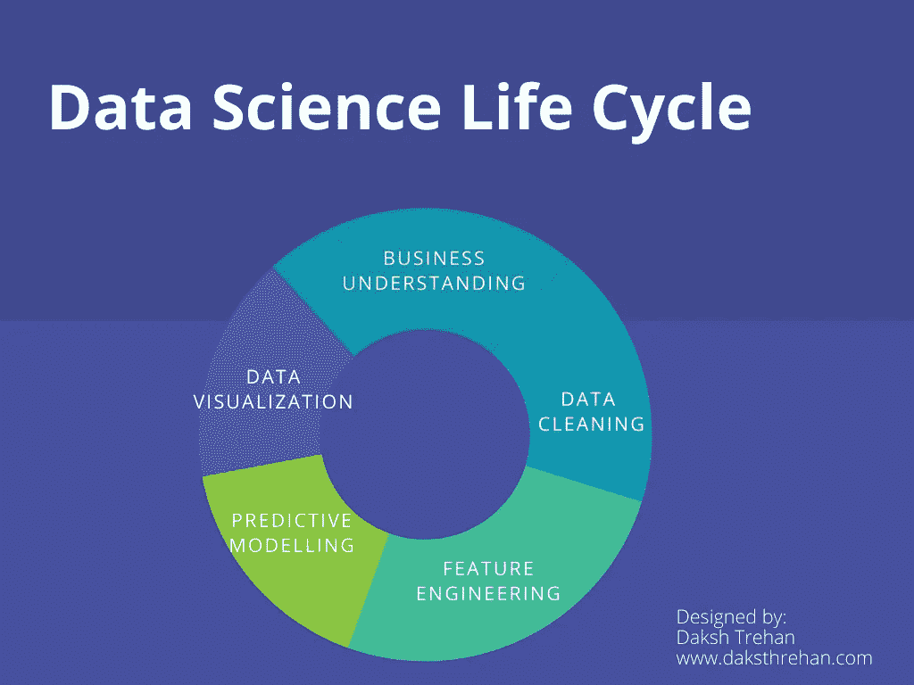
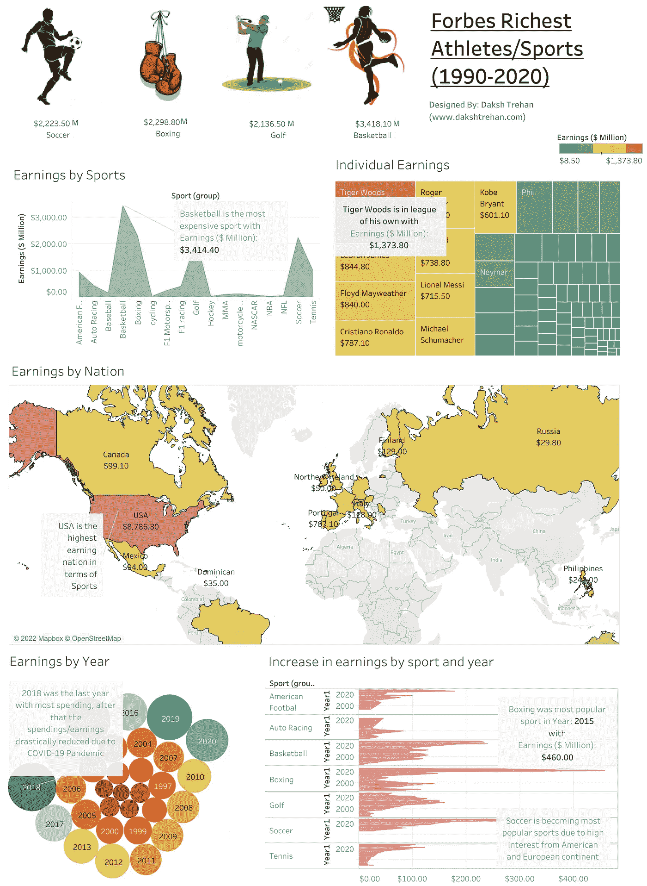
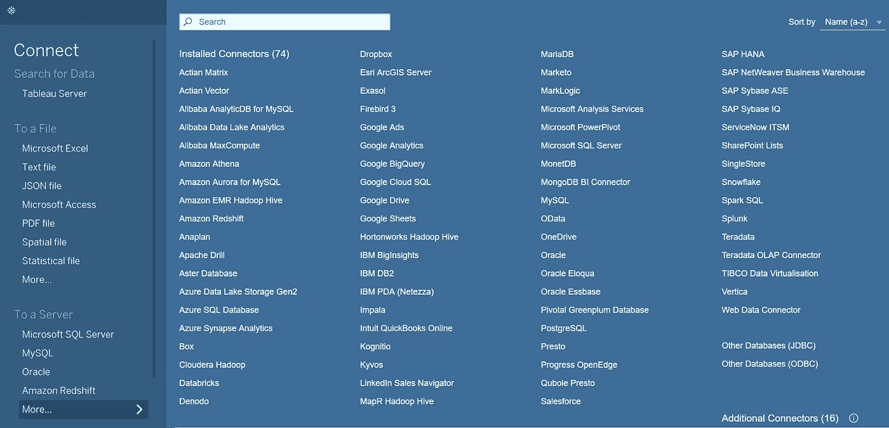
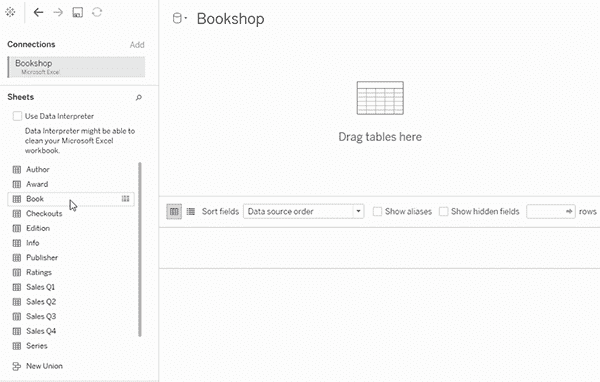
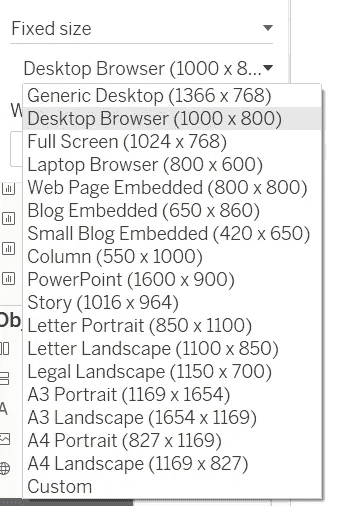
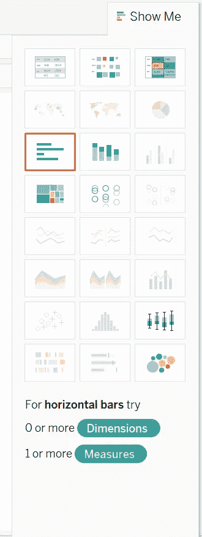
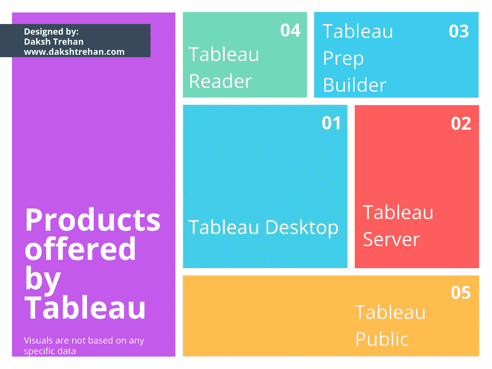
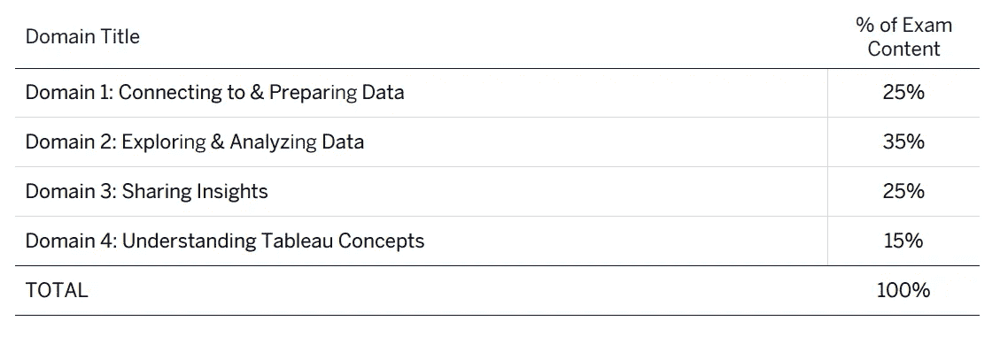

# 画面:这是什么？为什么它是最好的？Tableau 桌面专家认证之路(带示例问题)

> 原文：<https://pub.towardsai.net/tableau-what-it-is-1e2cdff35440?source=collection_archive---------1----------------------->

## 第 1 章:Tableau、商业智能、数据可视化和免费 Udemy 转储的 Tableau 认证的综合指南

很难在数据领域保持相关性，但仍然不了解 [Tableau](https://medium.com/u/fcbe60d0bf8b?source=post_page-----1e2cdff35440--------------------------------) 。这是“*数据*”世界正在经历的最强大和新兴的技术之一。

本系列旨在帮助每个准备 **Tableau 桌面专家认证、**的人，或者每个试图学习如何使用 Tableau 并发现其所有功能的人。本课程将分为几章，每一章都将提供每个 Tableau 功能的详细内容。

以下是本系列将涵盖的文章:

*   **第 1 章→** [**Tableau:是什么？为什么它是最好的？**](https://dakshtrehan.medium.com/tableau-what-it-is-1e2cdff35440?source=user_profile---------12----------------------------)
*   **第二章→** [**Tableau UI 概述**](https://dakshtrehan.medium.com/tableau-ui-overview-a-road-to-tableau-desktop-specialist-certification-a30982c963db?source=user_profile---------11----------------------------)
*   **第三章→**[**Tableau 中的数据类型:使用&清理**](https://dakshtrehan.medium.com/data-types-in-tableau-using-cleaning-a-road-to-tableau-desktop-specialist-certification-7793111f60bd?source=user_profile---------10----------------------------)
*   **第四章→** [**现场 vs 抽取 Tableau 中的连接**](https://dakshtrehan.medium.com/live-vs-extract-connection-a-road-to-tableau-desktop-specialist-certification-8206a18213ec?source=user_profile---------9----------------------------)
*   **第 5 章→**[**Tableau 中的联接数据(关系、联合、联接、混合)**](https://dakshtrehan.medium.com/joining-data-in-tableau-a-road-to-tableau-desktop-specialist-certification-eae58200260?source=user_profile---------8----------------------------)
*   **第六章→** [**蓝色 vs 绿色:维度、度量、连续、离散**](https://dakshtrehan.medium.com/blue-vs-green-dimensions-vs-measures-discrete-vs-continuous-a-road-to-tableau-desktop-specialist-4bcfef832a66?source=user_profile---------7----------------------------)
*   **第七章→** [**文件夹，群组&层次**](https://dakshtrehan.medium.com/folders-groups-hierarchies-a-road-to-tableau-desktop-specialist-certification-5eb97989829e?source=user_profile---------6----------------------------)
*   **第八章→** [**过滤 Tableau 中的数据**](https://dakshtrehan.medium.com/filtering-data-in-tableau-a-road-to-tableau-desktop-specialist-certification-2fe0cecad3ff?source=user_profile---------5----------------------------)
*   **第九章→** [**在 Tableau**](https://dakshtrehan.medium.com/sets-parameters-in-tableau-a-road-to-tableau-desktop-specialist-certification-fa08c9ba3931?source=user_profile---------4----------------------------) 中设置&参数
*   **第十章→** [**计算表**](https://dakshtrehan.medium.com/sorting-analytics-pane-in-tableau-a-road-to-tableau-desktop-specialist-certification-5edae8077823?source=user_profile---------3----------------------------)
*   **第十一章→** [**排序&分析窗格中的 Tableau**](https://dakshtrehan.medium.com/calculations-in-tableau-a-road-to-tableau-desktop-specialist-certification-6c2bcc3ab5d3?source=user_profile---------2----------------------------)
*   **第十二章→**[**Tableau 图表综合小抄**](https://dakshtrehan.medium.com/a-comprehensive-cheat-sheet-on-tableau-charts-a-road-to-tableau-desktop-specialist-certification-d2d433872cef?source=user_profile---------1----------------------------)
*   **第十三章→** [**仪表盘&故事表**](https://dakshtrehan.medium.com/dashboards-stories-in-tableau-a-road-to-tableau-desktop-specialist-certification-e93f1f3a0614?source=user_profile---------0----------------------------)
*   **第 14 章→在 Tableau 中保存数据**

> 如果您想直接访问 Tableau 桌面专家笔记，请在此处访问它们→[https://dakshtrehan . comment . site/Tableau-Notes-c 13 fceda 97 b 94 BDA 940 edbf 6751 cf 303](https://dakshtrehan.notion.site/Tableau-Notes-c13fceda97b94bda940edbf6751cf303)
> 
> 使用链接访问免费 Tableau 认证转储(有效期至 2022 年 7 月 6 日):
> 
> [https://www . udemy . com/course/tableau-desktop-specialist-certification-dumps-2022/？coupon code = e3f 08189 fa 4 bafae 72 BC](https://www.udemy.com/course/tableau-desktop-specialist-certification-dumps-2022/?couponCode=E3F08189FA4BAFAE72BC)

在这一块，我们来谈谈:**是什么？为什么你必须考虑升级画面？**

# 目录:

*   **什么是 Tableau？**
*   **什么是商业智能？**
*   **什么是数据可视化？**
*   **为什么画面最好？**
*   **Tableau 提供的产品**
*   **Tableau 提供的认证**
*   **本题的样题**

# **什么是 Tableau？**

Tableau 是一种数据可视化工具，创建于 2003 年，是斯坦福大学计算机科学项目的成果，旨在简化分析流程，并帮助非技术人员使用交互式和迷人的视觉效果来了解更多数据。市场领先的工具于 2019 年被 Salesforce 收购。

使用 Tableau，用户可以组织/清理原始数据，并构建仪表板&强大的可视化功能来发现隐藏的 acumens。Tableau 的功能不仅限于集成的分析平台，它还可以帮助客户根据他们的需求部署和扩展数据驱动的文化。

要了解有关 Tableau 功能的更多信息，让我们来看一下数据科学的生命周期:

作者设计的视觉效果

如果我们思考数据科学管道，Tableau 可以在第一步帮助我们，即数据清理，这涉及根据我们的需要修改数据，并试验可用的属性，进一步定义我们的结果范围。

一旦数据被清理、探索并预测了结果。结果可以通过强大的交互式 Tableau 仪表盘发布/部署/呈现，这有助于了解我们整个数据科学管道的要点。

因此，Tableau 可以被视为商业智能行业中的一个杰出工具。

# 但是，什么是商业智能？

商业智能(BI)帮助组织做出数据驱动的决策，这些决策有助于推动变革、最大限度地降低效率以及适应最新的市场趋势。

举例来说，让我们考虑有一个足球队里士满亚足联在冠军联赛和英超联赛之间周旋，每个球队的目标是留在英超联赛，因为它更有利可图，吸引更多的观众。里士满亚足联也想参加英超联赛，但为此，他们需要一支强大的球队，而且他们购买新球员的资金也非常有限。现在，里士满亚足联不能像曼联或马努那样尝试购买多名球员。因此，他们可以利用数据的帮助，他们可以分析不同球员的数据，并根据历史数据，他们可以决定哪个球员更适应他们的团队风格，并使事情积极地进行。不能保证新引进的球员能为俱乐部带来财富，但是根据数据，可能性很高。

这是一个简单的例子，说明了 BI 如何改变行业并帮助组织做出更好的决策。

## BI 是如何工作的？

BI 与数据科学家和数据分析师密切合作。数据科学家将提取数据，修改数据以满足客户的需求，使用预测模型来猜测未来的场景，并预测未来的模式。数据分析师将采用所有这些场景和模式来创建一个集中的存储库，这将使理解数据的核心和描绘的模式变得更加容易。商业智能将获取所有数据、建模和预测，并将其转换为可操作的语言，帮助公司做出更好的决策。

展示商业智能最常见的方式是通过数据可视化。

# 但是，什么是数据可视化？

数据可视化可以被认为是表示数据的最简单而有效的方式。它通常使用图表、图形和地图，并带有一点创造性。

数据可视化非常强大，因为我们的眼睛容易受到颜色和形状的影响。我们可以很容易地识别红色和绿色之间的区别，从三角形中圈出，这有助于我们关注趋势、异常值和信息。

这是一种讲故事的方式，但不是用文字，而是用符号、图表、形状和地图。

举例来说，我为福布斯富豪运动员数据集设计了以下愿景，其中包括 1990 年至 2020 年的数据。仪表板/演示很容易理解 301 行 8 列的要点。这就是数据可视化的力量。

按作者分类的仪表板，[来源](https://public.tableau.com/app/profile/daksh.trehan#!/?newProfile=&activeTab=0)

数据可视化可以包括许多类型的图表，这些图表专用于几种用例。

例如，**箱线图**在我们试图识别异常值和四分位数区域时可能是最好的。

# 为什么 Tableau 是最好的？

*   **支持不同的数据源** → Tableau 支持多种存储介质，您可以从中连接数据。

Tableau 可以连接来自云服务器或本地目录的文件。

*   ***面条*因素** →大概是画面最重要也是最独特的特点。忘记连接，关系就在这里。Tableau 会根据你需要的列自动在不同的表之间创建一个契约。但是，我们仍然可以创建手动连接和联合。

[来源](https://help.tableau.com/current/pro/desktop/en-us/relate_tables.htm)

*   **数据混合** →这是另一个只有 Tableau 才有的最强大的功能。它允许在没有相同文件格式的情况下连接来自多个源的数据，唯一的问题是两个文件中必须有相同的列。数据混合大致是在主数据集上定义的左外连接。
*   **实时数据分析** → Tableau 使用户能够连接实时数据或提取数据。实时数据是直接来自云服务器的实时数据，遵循一个例程来创建仪表板。另一方面，摘录是实时数据的快照，当我们想要加快我们的进度和工作时可以使用。

*   **移动支持&交互式仪表盘** →使用 Tableau 创建的仪表盘可以根据需要调整为各种大小，用户可以根据需要调整参数来改变仪表盘中的数据定义。

*   **Apt 可视化** → Tableau 支持大量的可视化，尽管基于数据的有限数量可以显示在主页上。但是，它允许您调整现有的图表来创建自定义图表。

# Tableau 提供的产品

Tableau 提供各种各样的产品，每种产品都针对不同类型的消费者:

作者设计的视觉效果

**1。Tableau 桌面:**是最常见的 Tableau 工具。它主要由个人用户使用，也允许他们直接从数据仓库连接数据进行数据分析。该工具使用户能够将其交互式仪表板直接导出到 Tableau 服务器或在线环境中。此应用程序需要 Windows 或 Mac 操作系统。

**2。Tableau 服务器:**可以认为是企业级的 Tableau 产品。它主要由组织使用，因为它可以通过实时连接利用快速数据库。当您的数据达到阈值或满足特定条件时，该产品还可以发送自动通知。

**3。Tableau Prep Builder:** 用来更直观的准备数据。从加入、联合到创建关系的每个过程都涉及一个可视化的工作流。它还跟踪数据中所做的更改，从而使用户能够访问历史更改。

**4。Tableau Reader:** 这是一个免费的桌面应用程序，可以查看分析和底层模式。但是，没有实时数据的自动刷新或任何安全功能，如打包工作簿的密码保护。此工具也不能在手机上使用。它限制用户过滤/深入数据，但他们不能参与任何表/仪表板。

**5。Tableau Public:** 这个工具的工作方式类似于 Tableau Reader，但唯一的区别是，它也可以安装在移动设备上，不需要本地安装，但可以在浏览器上工作。这个工具的动机是与世界共享数据和可视化。

# Tableau 提供的认证

*   **Tableau 桌面专家** →该认证将使您能够进入 Tableau 生态系统并探索更多相关信息。这也证明了你是 Tableau 的基本用户，掌握了 Tableau 的基本技能。

> 60 分钟，45 个问题，100 美元

在这一系列中，我们将重点关注 Tableau 桌面专家考试

> 了解更多关于考试的信息:
> 
> [TableauDesktopSpecialist _ Exam guide . docx](https://mkt.tableau.com/files/TableauDesktopSpecialist_ExamGuide.pdf)

*   **Tableau 认证数据分析师** →该认证仍处于测试模式，证明用户能够在 Tableau 中探索和展示数据。

> 150 分钟，60 个问题，199 美元

*   **Tableau 服务器认证助理** →该认证对精通 Tableau 服务器功能的用户进行评判。目标受众是顾问或系统管理员。

> 90 分钟，55 个问题，250 美元

*   **Tableau 认证助理顾问→** 仅适用于 Tableau 合作伙伴。
*   **Tableau 认证助理建筑师→** 仅适用于 Tableau 合作伙伴。

# 本主题的试题示例:

**____ 允许您在 Tableau Desktop 中创建工作簿和视图、仪表板以及数据源，然后将这些内容发布到个人服务器。**

1.  Tableau 公共
2.  Tableau 服务器
3.  Tableau 阅读器
4.  Tableau 准备

**解决方案** : Tableau 服务器

**____ 是 Tableau 服务器生产使用的最小建议 RAM。**

1.  32GB
2.  128GB
3.  16GB
4.  8GB

**解决方案** : 32GB

**哪种 Tableau 工具的门槛最低？**

1.  Tableau 准备
2.  Tableau 公共
3.  Tableau 阅读器
4.  Tableau 服务器

**解** : Tableau 公开

**解释** : Tableau Public 可以通过浏览器访问，甚至可以在手机上访问，无需任何显式安装。

**在没有数据集的情况下，能否在 Tableau 中创建数据可视化？**

1.  真实的
2.  错误的

**解**:真

**解释**:我们可以使用计算字段创建可视化效果。

**Tableau 中最多可以加入多少张桌子？**

1.  16
2.  64
3.  128
4.  32

**解决方案** : 32

> 使用链接访问免费 Tableau 认证转储(有效期至 2022 年 7 月 6 日):
> 
> [https://www . udemy . com/course/tableau-desktop-specialist-certification-dumps-2022/？coupon code = e3f 08189 fa 4 bafae 72 BC](https://www.udemy.com/course/tableau-desktop-specialist-certification-dumps-2022/?couponCode=E3F08189FA4BAFAE72BC)

# 参考资料:

[1] [Tableau 帮助| Tableau 软件](https://www.tableau.com/support/help)

[2] [个人笔记](https://dakshtrehan.notion.site/Tableau-Notes-c13fceda97b94bda940edbf6751cf303)

[3] [Tableau 桌面专家考试(新模式— 2021) — Apisero](https://apisero.com/tableau-desktop-specialist-exam-new-pattern-2021/)

# 感谢阅读！

请随意鼓掌，这样我就知道这篇文章对你有多有帮助，并分享到你的社交网络上，这对我会很有帮助。

如果你喜欢这篇文章，想了解更多**机器学习，数据科学，Python，BI。请考虑订阅我的时事通讯:**

> [**达克什特里汗的通迅**](https://mailchi.mp/b535943b5fff/daksh-trehan-weekly-newsletter) **。**

在网上找到我:[www.dakshtrehan.com](http://www.dakshtrehan.com/)

在 LinkedIn 与我联系:[www.linkedin.com/in/dakshtrehan](http://www.linkedin.com/in/dakshtrehan)

阅读我的科技博客:[www.dakshtrehan.medium.com](http://www.dakshtrehan.medium.com/)

在 Instagram 跟我连线:[www.instagram.com/_daksh_trehan_](http://www.instagram.com/_daksh_trehan_)

# 想了解更多？

[YouTube 是如何利用 AI 推荐视频的？](/how-is-youtube-using-ai-to-recommend-videos-38a142c2d06d)
[利用深度学习检测新冠肺炎](https://towardsdatascience.com/detecting-covid-19-using-deep-learning-262956b6f981)
[逃不掉的 AI 算法:抖音](https://towardsdatascience.com/the-inescapable-ai-algorithm-tiktok-ad4c6fd981b8)
[GPT-3 向一个 5 岁的孩子解释。](/gpt-3-explained-to-a-5-year-old-1f3cb9fa030b)
[Tinder+AI:一场完美的牵线搭桥？](https://medium.com/towards-artificial-intelligence/tinder-ai-a-perfect-matchmaking-b0a7b916e271)
[一个内部人士的使用机器学习卡通化指南](https://medium.com/towards-artificial-intelligence/an-insiders-guide-to-cartoonization-using-machine-learning-ce3648adfe8)
[谷歌是如何做出“哼哼来搜索？”](/how-google-made-hum-to-search-865f224b70d0)
[一行神奇的代码执行 EDA！](/one-line-magical-code-to-perform-eda-f83a731fbc35)
[给我 5 分钟，我给你深度假！](/give-me-5-minutes-ill-give-you-a-deepfake-ce83a645b0f9)

> *欢呼*