# 闪电使表格分类和回归变得容易

> 原文：<https://pub.towardsai.net/tabular-classification-and-regression-made-easy-with-lightning-flash-d33bea76a645?source=collection_archive---------0----------------------->


插图图片来自[Pexels](https://www.pexels.com/photo/person-holding-white-printer-paper-and-pen-2058136/?utm_content=attributionCopyText&utm_medium=referral&utm_source=pexels)Oleg Magni

## [机器学习](https://towardsai.net/p/category/machine-learning)

## 这篇文章介绍了通过两个最常见的机器学习(ML)任务来解决表格原始数据——分类和回归，使用 Lightning Flash，这使它变得非常简单。

当谈到关于深度学习的文章时，计算机视觉或自然语言处理(NLP)的进展受到了最大的关注。在 CV 和 NLP 方面的进步是梦幻般的和超级令人兴奋的；然而，许多数据科学家的日常工作都围绕着表格数据处理。

表格数据分类和回归是基本任务。它们通常用经典方法建模，如[随机森林](https://en.wikipedia.org/wiki/Random_forest) s、[支持向量机](https://en.wikipedia.org/wiki/Support-vector_machine) s、[线性/逻辑回归](https://en.wikipedia.org/wiki/Linear_regression) s 和[朴素贝叶斯](https://en.wikipedia.org/wiki/Naive_Bayes_classifier)，在许多标准库中的一个中实现— [scikit-learn](https://scikit-learn.org/stable/) 、 [XGBoost](https://xgboost.readthedocs.io/en/stable/) 等。

尽管如此，尝试更新的深度学习方法来用更复杂的数据建模是有益的。

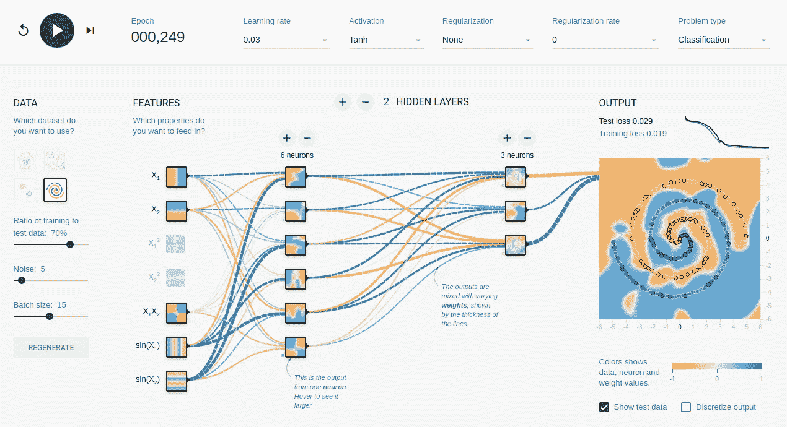

截图来自[https://playground.tensorflow.org](https://playground.tensorflow.org/)用神经网络进行简单分类。

在本帖中，我们将展示如何使用 [Lightning Flash](https://lightning-flash.readthedocs.io/en/stable/) 用几行代码准备数据和训练模型。

这个建立在 PyTorch Lightning 之上的开源 AI 工厂为表格、图像、文本等多个领域提供了开箱即用的解决方案。和所有基本任务。我们在两个简单的 Kaggle 竞赛中展示了该解决方案(并在下面链接了特定的内核):

*   使用[泰坦尼克号数据集](https://www.kaggle.com/c/titanic/data)的表格分类，参见文档[示例](https://github.com/PyTorchLightning/lightning-flash/blob/0.5.2/flash_examples/tabular_classification.py)

[](https://www.kaggle.com/jirkaborovec/titanic-crash-with-lightning-flash) [## 🚢泰坦尼克号与 Lightning⚡闪电相撞

### 使用 Kaggle 笔记本探索和运行机器学习代码|使用来自 Titanic 的数据-灾难中的机器学习

www.kaggle.com](https://www.kaggle.com/jirkaborovec/titanic-crash-with-lightning-flash) [](https://www.kaggle.com/code/jirkaborovec/starter-flash-spaceship-titanic) [## Starter⚡Flash:宇宙飞船🚀泰坦尼克

### 使用 Kaggle 笔记本探索和运行机器学习代码|使用来自泰坦尼克号飞船的数据

www.kaggle.com](https://www.kaggle.com/code/jirkaborovec/starter-flash-spaceship-titanic) 

*   使用[房价数据集](https://www.kaggle.com/c/house-prices-advanced-regression-techniques/data)进行表格回归，参见文档[示例](https://github.com/PyTorchLightning/lightning-flash/blob/0.5.2/flash_examples/tabular_regression.py)

[](https://www.kaggle.com/jirkaborovec/house-prices-predictions-with-lightning-flash) [## 🏠房子💵价格预测与 Lightning⚡闪光

### 使用 Kaggle 笔记本探索和运行机器学习代码|使用房价数据-高级回归…

www.kaggle.com](https://www.kaggle.com/jirkaborovec/house-prices-predictions-with-lightning-flash) 

在下面的小节中，我将介绍表格建模的四个阶段(外加两个奖励)，包括:
1。数据准备
2。模型创建
3。培训模式
4。评估/推理

Lightning Flash API 统一了各种数据加载和任务，确保分类和回归代码相似且易于阅读。

# 1.数据准备

一般来说，数据准备是一个宽泛的主题，所以在本教程中，让我们缩小范围。对于本帖，我们将使用[房价数据集](https://www.kaggle.com/c/house-prices-advanced-regression-techniques/data)。

我们假设数据是干净的，并且已经针对我们正在解决的任务进行了检查。对于**分类**，预测是映射到预定义标签的正离散值。对于**回归**，预测是一个没有任何界限的浮点值。

任何训练管道的第一步都是加载数据和识别数据(每列)类型。我们需要区分连续输入和分类输入。连续(数值)值是示例性的，但是分类(主要是字符串)值需要通过一些内部映射转换成数值。

别担心。所有这些都是在 Flash 内部完成的！作为用户，你不需要考虑它，除非你想。

当您对数字和分类输入进行排序时，您可以手动转换它们，或者使用一些启发式/统计来推断类型。

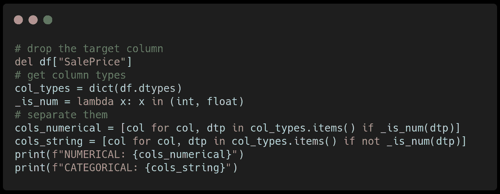

用于转换数字列和分类列的代码段。

接下来，我们使用`from_csv`方法创建一个**数据模块**。为此，我们指定输入 CSV 文件，设置训练和训练/验证分割的批量大小，我们希望用作特征的数字和分类列，以及我们希望预测的目标列。

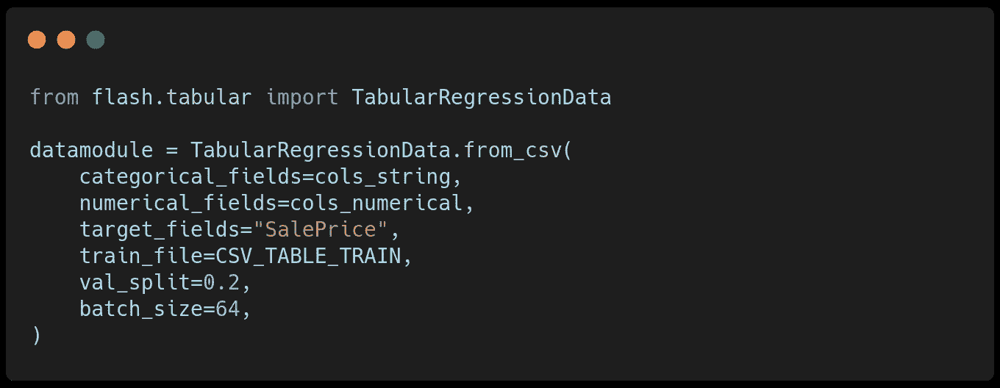

用于创建 Flash 数据的代码段。经验法则是使用所提供数据的 20%-40%之间的验证分割。

# 2.模型创建

下一步是创建任务模型。在这种情况下，我们将创建一个表格回归模型，其中我们提供了我们的 **DataModule、**以及其他一些特定于模型的属性，比如优化器和学习率。


用于创建 Flash 模型的代码段。

# 3.训练模型

训练一个模型通常是一项非常复杂的任务，但闪电使它变得简单明了。由于 Flash 是由 [PyTorch-Lightning](https://www.pytorchlightning.ai/) (PL)支持的，所以您可以利用所有 PL 回调和功能来训练您的模型。

在这种情况下，我们将使用 CSV 记录器方便地将训练统计数据绘制到 IPython 笔记本上。

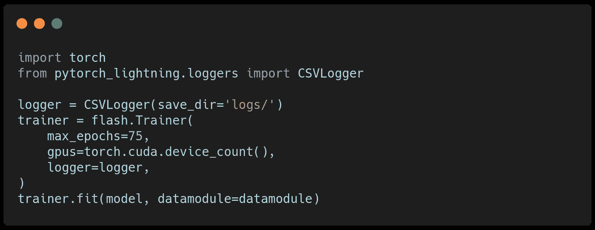

用于培训 Flash 模型的代码段。我们训练 75 个纪元，并利用我们机器上的所有 GPU。

培训完成后，我们用`seaborn`包绘制流程中收集的所有指标和损失:

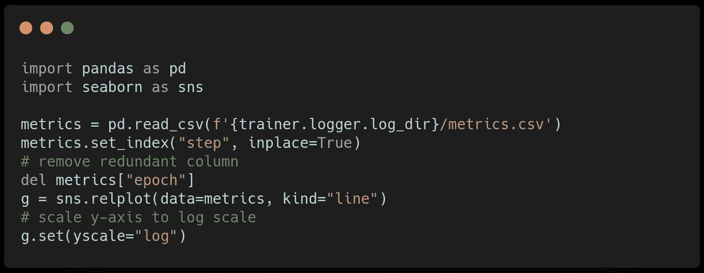

用于绘制收集的指标的代码片段。

如果您不知道您的模型/数据的最佳学习率，您可以使用 [PyTorch Lightning 学习率探测器](https://pytorch-lightning.readthedocs.io/en/stable/advanced/lr_finder.html)。您需要在训练器中启用 LR，并在`fit`方法之前调用`tune`方法:

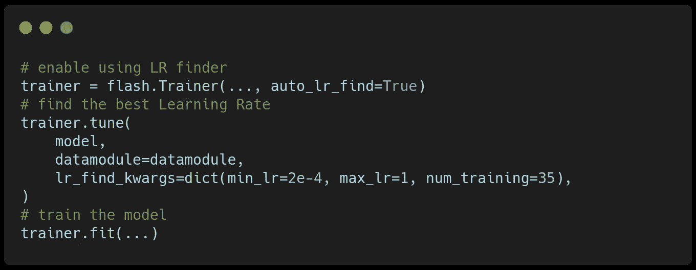

寻找最佳学习率的代码片段。

当您运行此代码时，您应该会看到类似下图的训练曲线，表明您的模型正在收敛和学习。

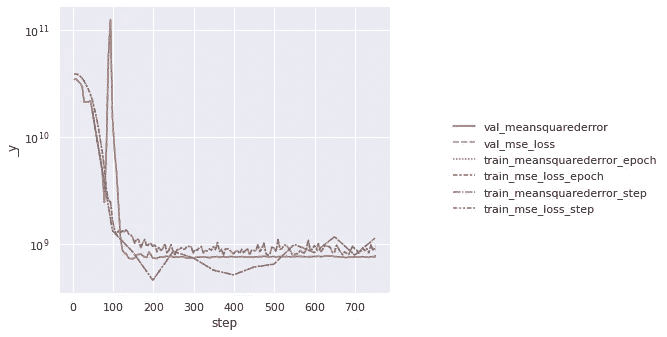

绘制培训指标。

# 4.模型推理

表格建模的最后一部分是对新数据进行推理。同样，Flash 使推断变得简单明了，因为模型会记住在训练期间使用了哪些列，并在数字列和分类列之间进行了分隔。

我们传递一个加载的表或者一个路径到我们想要评估的 CSV 文件，FFlash 会给我们模型预测:

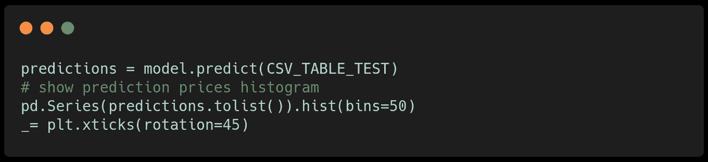

让我们看看预测价格分布是什么:

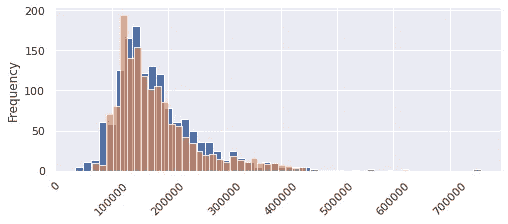

列车与测试数据的价格分布。

# 后续步骤

## 零代码 CLI 培训的闪存归零

[Flash Zero](https://lightning-flash.readthedocs.io/en/stable/general/flash_zero.html) 是 Lightning Flash 的零代码机器学习扩展，它提供了 Lightning Flash 功能，而不需要一行 python 脚本。

Flash zero 对于快速原型和超参数搜索非常有用，这些搜索定义了给定选项或云平台(如 [grid.ai](https://docs.grid.ai/) )的外部循环。

[](https://towardsdatascience.com/hyperparameter-optimization-with-grid-ai-and-no-code-change-b89218d4ff49) [## 使用 Grid.ai 进行超参数优化，无需更改代码

### 用 PyTorch 闪电和网格点实例在 Kaggle 上排名的最佳实践(第 4/5 部分)

towardsdatascience.com](https://towardsdatascience.com/hyperparameter-optimization-with-grid-ai-and-no-code-change-b89218d4ff49) 

让我们在 Kaggle 的另一个简单的表格分类任务上演示 Flash Zero—[表格游乐场系列—2021 年 11 月](https://www.kaggle.com/c/tabular-playground-series-nov-2021)。

[](https://www.kaggle.com/jirkaborovec/playing-tabular-with-lightning-flash) [## (演奏等的)表现，风格；(乐曲)演奏📋带 Lightning⚡闪光的表格。

### 使用 Kaggle 笔记本探索和运行机器学习代码|使用来自表格游乐场系列的数据-2021 年 11 月

www.kaggle.com](https://www.kaggle.com/jirkaborovec/playing-tabular-with-lightning-flash) 

在这种情况下，我们将替换我们所写的 python 训练脚本，该脚本连续创建数据、模型和训练器:

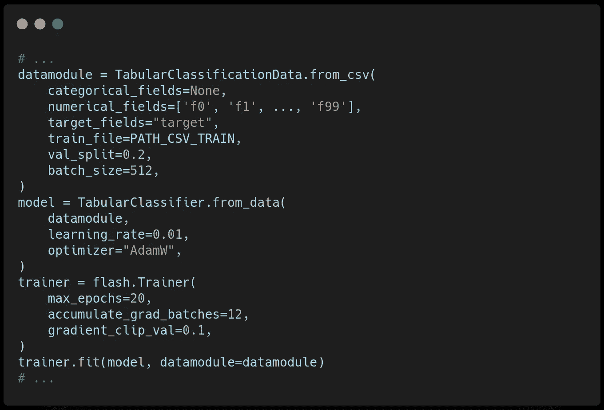

只需一次 CLI 调用:

```
flash tabular_classification \
    --model.learning_rate=0.01 \
    --model.optimizer="AdamW" \
    --trainer.max_epochs 20 \
    --trainer.accumulate_grad_batches=12 \
    --trainer.gradient_clip_val=0.1 \
    from_csv \
    --train_file=/home/jirka/Downloads/train.csv \
    --numerical_fields="['f0', 'f1', ..., 'f99']" \
    --target_fields="target"
    --batch_size=512
```

最后，我们可以用 [TesorBoard](https://www.tensorflow.org/tensorboard) 浏览训练进度，因为它也是默认的闪电记录器:

```
tensorboard --logdir ./lightning_logs
```

## 时间序列数据的表格预测

最近，Lightning Flash 还推出了带有时间序列的[表格预测](https://lightning-flash.readthedocs.io/en/stable/reference/tabular_forecasting.html)，我们在实际运行的[竞争预测加密](https://www.kaggle.com/c/g-research-crypto-forecasting)值目标值上展示了它。

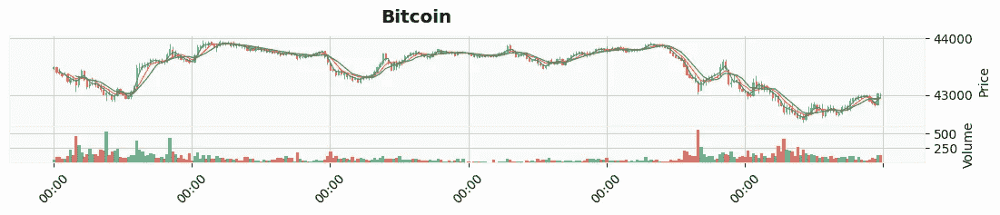

使用`mplfinance`包的示例加密时序绘图。

正在进行的带加密的 Kaggle 内核演示可以在这里找到:

[](https://www.kaggle.com/jirkaborovec/crypto-forecasting-with-lightning-flash) [## 🪙Crypto📈使用 Lightning⚡闪光灯进行预测

### 使用 Kaggle 笔记本探索和运行机器学习代码|使用 G-Research 加密预测的数据

www.kaggle.com](https://www.kaggle.com/jirkaborovec/crypto-forecasting-with-lightning-flash) 

***您对更酷的 PyTorch Lightning 集成感兴趣吗？
关注我，加入我们神奇的*** [***懈怠***](https://join.slack.com/t/pytorch-lightning/shared_invite/zt-pw5v393p-qRaDgEk24~EjiZNBpSQFgQ) ***社区！***

# 关于作者

Jirka Borovec 拥有 CTU 大学的计算机视觉博士学位。他已经在几家 IT 创业公司和公司从事机器学习和数据科学工作几年了。他喜欢探索有趣的世界问题，用最先进的技术解决这些问题，并开发开源项目。