# 表格学习—梯度推进与深度学习(评论)

> 原文：<https://pub.towardsai.net/tabular-learning-gradient-boosting-vs-deep-learning-critical-review-4871c99ee9a2?source=collection_archive---------0----------------------->

得益于技术进步和经济实惠的计算，复杂的系统正在被开发出来，以分析指数级增长的数据并生成可操作的见解。作为这些复杂系统的核心，神经网络在同质(文本和图像)数据上表现出了非凡的性能。然而，直到最近，神经网络才被用于异构表格数据，这是最古老和最常见的数据形式。基于树的模型在表格数据上的竞争性能也可能是神经网络利用不足的一个因素。对于提出的各种模型，我们试图对它们进行分类，并为其中一些声称是最先进的模型提供一些基本的理解。这项工作试图回答已建立的基准的可用性，以及是否是时候从基于树的模型跳到基于神经网络的表格数据模型了。

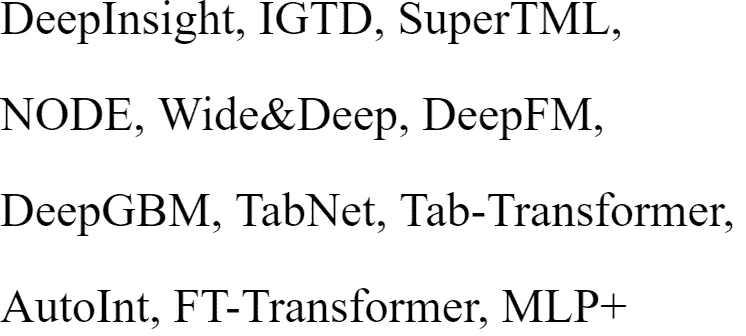

评论中的一些模型

# 介绍

表格数据由固定长度向量(列作为特征)的样本(行)组成，可以存储在文本、CSV、TSV 等平面文件中。这是数字时代之前收集的唯一形式的数据，使其成为现实世界应用中最古老和最常见的数据。Kaggle(2017)最近的一项调查报告称，关系数据是结构化数据或表格数据的一个细分，是业内最受欢迎的数据形式，在总共 14，000 名数据科学家中，至少有 65%的人每天都在使用它[16]。从生物信息学、电子商务、医学、银行、金融到其他基于关系数据库的领域，它无处不在。一些问题包括客户流失预测、医疗诊断、风险分析、欺诈检测、用户和产品推荐等。

## 神经网络与梯度推进模型

深度学习解决方案已被广泛用于涉及同质数据(如图像、语音和文本)的任务。它们出色的表现可以归因于它们独特的结构设计来模拟特定的数据模式，如 CNN 捕捉空间局部性和 RNN 模拟序列依赖性。虽然表格深度学习不是未知领域，但近年来仍未得到充分探索。尽管在理论上优于梯度推进树，但在大多数应用中，基于“浅”树的集成方法的变体仍然主导深度学习模型。这种较差的性能可能是由于数据集的不同统计属性或者缺乏关于数据集结构的先验知识。虽然改变一个对象需要许多像素，但是在表格数据的情况下，对输入的微小改变可能会改变标注或预测。基于树的模型最受欢迎的优点是它们的可解释性和可解释性，这是许多现实应用中的一个基本问题。然而，它们不适合流数据的连续训练，无监督的预训练和用图像和文本等其他形式的训练，这导致了近年来对表格深度学习的兴趣不断增加。

此外，神经网络是灵活的，并提供许多好处，例如减轻对手动分类编码和特征工程的需要，这是基于树的学习的一个基本方面。这些原因导致了几种基于深度学习的表格数据解决方案，同时新的解决方案也在不断开发。而其中的一些(AutoInt[14]，FT-Transformer[4]，TabNet[1]，TabTransformer[6]等。)声称优于基于树的模型，但由于缺乏既定的基准(如用于计算机视觉的 ImageNet 和用于 NLP 的 GLUE)，它们使用不同的数据集和度量进行评估，这使得很难对算法进行排名或调查它们是否普遍优于基于树的算法[4]。虽然它们可以推动最先进的技术，但是在某些情况下，由于软件工程和实现的挑战，它们仍然没有被广泛采用。人们可以快速训练流行的基于树的模型(CatBoost、LightGBM、XGBoost 等)。)在一条线上，对于，例如。

```
Model = Model = CatBoost().f it(X, y)
```

这与流行的基于表格深度学习的模型不同。像 fasta.ai(让神经网络再次变得不酷)、Deep Tables(针对表格数据的深度学习工具包)和 PyTorch Tabular 这样的旨在让深度学习易于使用的库，给了未来一些希望。

## 方法学

如前所述，表格数据包含作为样本的行和作为特征的列。这些特征可以是相关的或独立的，可以有也可以没有关系，并且不遵循任何位置顺序。它们可以是连续的(数字的)也可以是离散的(分类的)，但在方式上是有挑战性的。虽然数字属性可能是多模态的或者可能不遵循任何已知的分布，但是离散特征是定性的。正如 David M. Lane 在他的定义[9]中所描述的，他们可以从有限的唯一的一组值中获取值，并且可以不遵循任何特定的顺序。在传统的机器学习模型中，特征处理或工程是必不可少的，这些模型使用领域知识来提取预测特征并将分类特征转换为数字特征。可以应用一维(一键编码、目标编码、二进制编码或留一编码)或多维编码技术，使得在类别或特征内不引入人工排序。当分类特征(基数)的不同值变得显著时，由于稀疏特征向量，它可能会增加整体大小。

## 转换模型

受视觉神经科学启发的深度神经网络(DNNs)和卷积神经网络(CNN)在计算机视觉任务中表现出优异的性能。但是，由于缺少要素之间的空间关系，它们不适合用于表格数据。由于表格或结构化数据中的要素被认为是相互独立的，因此它们顺序的任何变化都不会影响数据。

## DeepInsight 和 IGTD

最近的算法，如 Deep Insight[12]和 IGTD[17](表格数据的图像生成器)，建议在 2-D 空间中重新排列这些特征，以表示关系，并使用 CNN[12，17]将表格数据转换为用于预测建模的图像。这种转变将消除特征工程，因为 CNN 可以通过隐藏层从图像中提取特征。这两种算法都建议重新排列特征以创建空间关系；然而，他们的方法并不相似。Deep Insight 使用非线性降维技术，如 t-SNE 或核主成分分析(k-PCA)，以获得 2-D 平面和凸包算法，以找到包含所有点的最小矩形[12，17]。然后旋转矩形生成的图像，使其水平或垂直对齐，并通过 CNN 进行分类[12，17]。图 1 中还提供了流程的可视化表示。IGTD 还旨在保持图像表示中的相似特征，但最小化特征距离排序和像素距离排序之间的差异[17]。作者还报告说，虽然 Deep Insight 从同一数据集生成图像的速度更快，但 IGTD 创建了更紧凑的图像表示，减少了内存消耗，并缩短了 CNN 的训练时间。IGTD 似乎对不同的超参数也很稳健[17]。

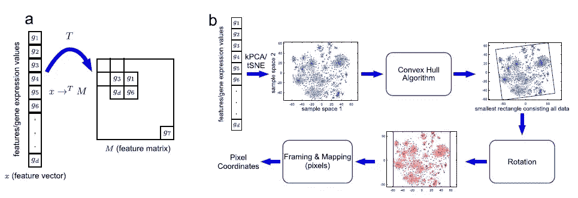

图 1: DeepInsight pipeline 包括(a)从特征向量到特征矩阵的转换，以及(b)将特征向量转换为图像像素的方法[12]。

## SuperTML

另一种方法 SuperTML[16](超级表格数据机器学习)，也提出将表格/结构化数据转换为图像，但受超级字符[15]的启发，将文本转换为图像，并使用 CNN 对产生的问题执行图像分类[16]。图 3 和图 2 给出了 SuperTML 和超级字符的一个例子。SuperTML 和 Super Characters 都将每个样本的内容(文本或特征行)转换为二维矩阵或图像，其中每个像素都表示为样本的每个特征[16，15]。然后，将在较大数据集上预训练的 CNN 应用于结果图像，用于图像分类问题，以实现更高的精度。虽然 Deep Insight 或 IGTD 算法在要素之间没有或几乎没有空间关系或相互独立时可能会失败，但 SuperTML 尚未报告任何此类限制。虽然上面提到的算法(IGTD、Deep Insight、SuperTML)在它们出现的数据集上表现良好，但在它们在一系列数据集上进行评估之前，不应推荐它们。

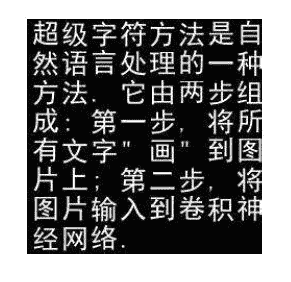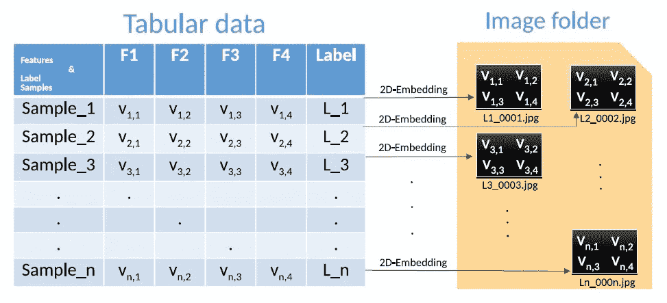

图 2:一个超级角色的例子[15]。图 3:一个将训练数据从表格转换成图像的例子，在表格数据中嵌入二维特征[16]。

## 混合模型

混合模型融合了神经网络和基于树的模型，以获得两个世界的最佳效果-神经网络的自动特征工程和基于树的模型的表格数据的卓越性能。这些模型已被制成可区分的，以用于端到端的培训管道，并利用梯度优化。

## 结节

基于成功的梯度推进模型，CatBoost 作者提出了 NODE——使用 entmax 变换和软分裂的完全可微分决策树的集合。随着适当的实施，它在研究论文中提到的一些数据集上优于基于树的模型，这导致了它在行业中的采用[11]。图 4 给出了节点架构示意图。

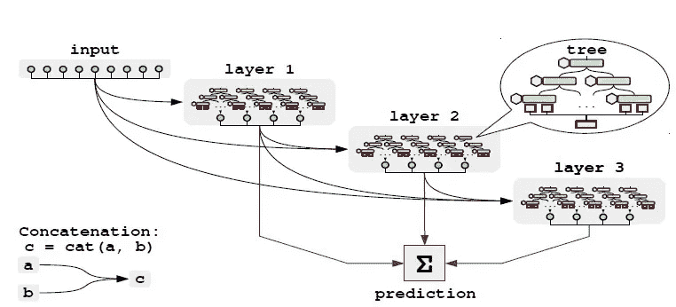

图 4:节点架构，由密集连接的节点层组成。每一层包含几个树，它们的输出被连接起来，作为下一层的输入。通过平均所有层的所有树的输出来获得最终预测[11]。

## Wide&Deep、DeepFM 和 DNN2LR

Cheng 等人在 2016 年提出了 Wide&Deep[2] —一种线性模型，它利用手工制作的特征逻辑表达式以及 n 维分类嵌入，并将它们与非线性层相结合[2]。宽、深和宽深模型的架构如图 5 所示。为了取代人工特征工程的需要，DeepFM 中的 Guo 等人提出用学习分解机器来取代它们，这在学习高维稀疏数据中的关联方面是有效的[5]。Liu 等人在 DNN2LR 中提出了一种自动特征交叉方法，该方法能够通过逻辑回归实现比复杂神经网络更高的性能[10]。

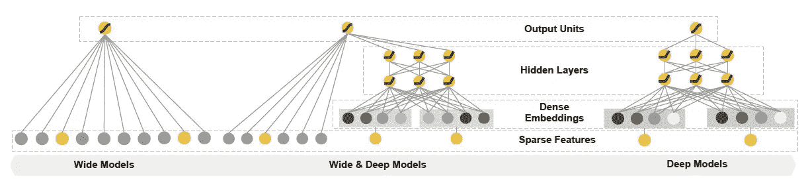

图 5:宽和深模型的光谱图[2]。

## DeepGBM

Ke 等人提出的 DeepGBM[8]是部分可微的，具有强大的学习能力，它结合了两个神经网络，用于处理稀疏分类特征的 CatNN 和用于密集数值特征的 GBDT2NN。它在在线预测上优于梯度提升树的性能是值得称赞的；然而，它缺乏可解释性，并拥有一些数据相关的问题。DeepGBM 模型的架构如图 6 所示。

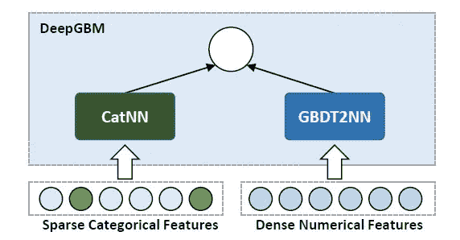

图 DeepGBM 的框架，包括两个组件，CatNN 和 GBDT2NN，分别处理稀疏分类和密集数字特征[8]。

## 基于变压器的模型

由于各种转换器(基于注意机制)在同质数据上的普遍成功，一些作者主张将它们用于表格学习。

## **TabNet**

TabNet[1]是首批基于注意力机制的深度表格学习模型之一，旨在提供卓越的性能和可解释性[1]。就像一个基于树的模型，其中每个决策步骤都是按层次顺序处理的，它在每个决策步骤都利用了一个子网络，该子网络使用顺序注意力特征选择[1]。最终预测是所有决策步骤输出的集合。它还可以通过自我监督学习利用未标记的数据来提高预测质量[1]。TabNet 的编码器、解码器和特征转换器的架构如图 7 所示。

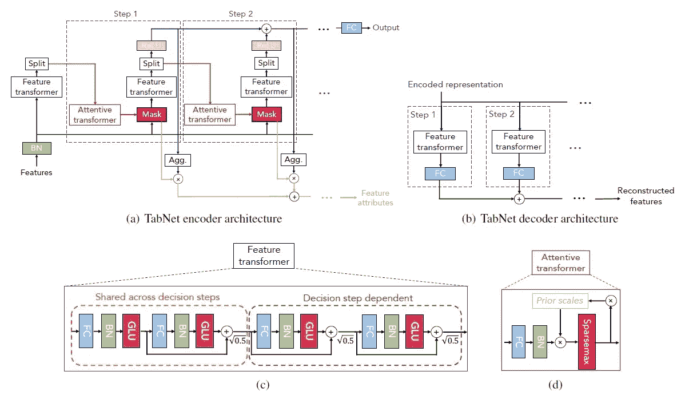

图 7:(a)TabNet 编码器，(b) TabNet 解码和 TabNet 特性转换器模块的示例[1]。

## tab-变压器

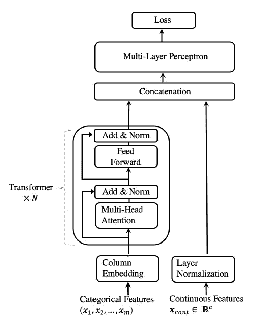

图 8:Tab-Transformer 的架构[6]。

与 Tab-Net 类似，TabTransformer[6]也提出了监督和自监督方法[6]。它使用多层感知器，输入是映射到上下文嵌入自我注意机制的数字特征和分类特征的组合[6]。无监督的预训练(对未标记的数据)使用基于多头注意力的转换器来创建对缺失和噪声数据鲁棒的上下文嵌入[6]。TabTransformer 模型的架构如图 8 所示。

## 自动点火

AutoInt[14]最初是为点击率(CTR)预测而提出的，基于自我注意机制，可以学习高阶特征交互及其相关性[14]。它使用多层具有剩余连接的多头自关注神经网络来模拟低维空间中的特征交互，在该低维空间中分类和数字特征都被映射[14]。AutoInt 模型的架构如图 9 所示。

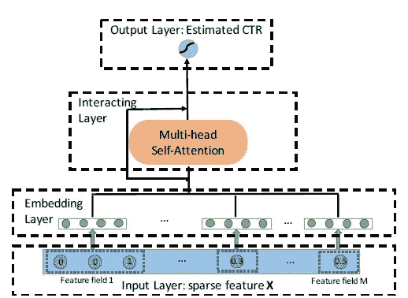

图 AutoInt 的架构[14]。

## 傅立叶变换变压器

FT-Transformer[4](Feature Tokenizer+Transformer)类似于 AutoInt，但有一些关键的区别，这是其相对优越的性能的原因。它与 AutoInt 一样，将所有特性转换成嵌入，作为 transformer 层的输入[4]。此外，FT-Transformer 的嵌入层也使用特征偏差，并且在 Transformer 的前范式变体中使用[CLS]令牌的最终表示用于推理机制[4]。然而，与其他深度学习方法相比，由于引入的开销，它被发现是缓慢的和计算昂贵的，这在较大的数据集中更明显可见[4]。FT-Transformer 模型的架构如图 10 所示。

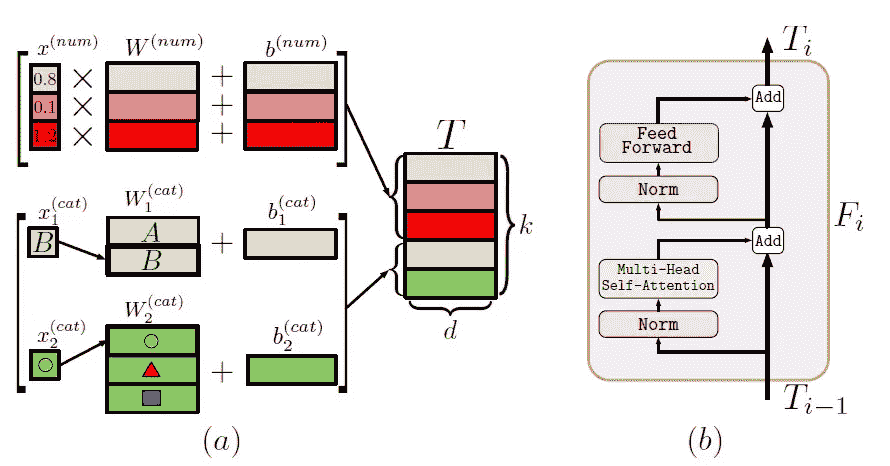

图 10: (a)特征记号赋予器；在这个例子中，有三个数字特征和两个分类特征；一个变压器层[4]。

## 规范和修改

一些从业者还提出了对现有神经网络的正则化技术，以提高它们的性能。他们认为，基本架构，如多层感知器，可以调整到与梯度提升算法相当的性能，甚至在某些情况下超过它们。

## 正规化学习网络(RLN)

在一项早期研究中，Ira Shavitt 和 Eran Segal 引入了使用反事实损失进行微调的正则化学习网络[13]。由此产生的稀疏网络是可解释的，揭示了基本特征[13]。然而，该论文仅涉及数字特征，使得它们不太适合于一般用途。

## 规范化鸡尾酒

Kadra 等人提出了“正则化鸡尾酒”，这是一种用于选择正则化技术子集及其附属超参数的优化范式[7]。该方法似乎是有效的，但是使用大量资源来寻找最佳参数和超参数。

## MLP+

James Fiedler 也认为现有的网络没有得到充分利用，一些修改可以使简单的架构如多层感知器与其他模型和梯度提升树相竞争[3]。他创造了“MLP+区块”，即漏门、MLP 子区块、跳过层和加权平均的组合[3]。漏门结合了基于元素的线性变换和 LeakyReLU，有助于解释和特征选择[3]。受 TabNet 启发的 Ghost batch norm (GBN)被用来代替批处理规范化，以提高泛化能力和训练速度[3]。原始 MLP 模块和被称为 MLP+的修改后的 MLP 模块的架构如图 11 所示，修改以灰色背景标记。

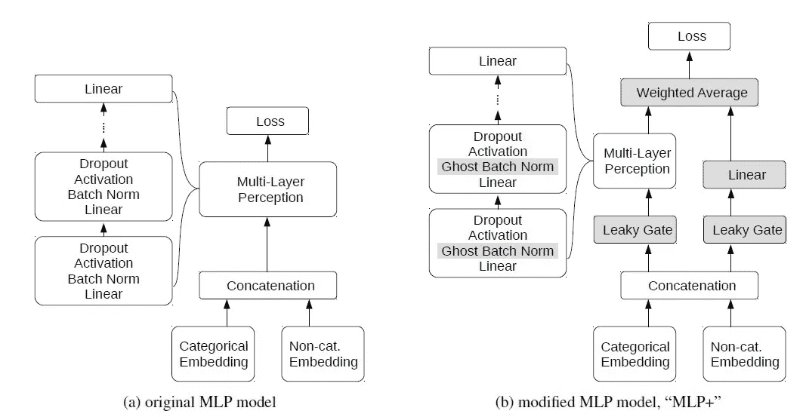

图 11:MLP 模型的原始版本和修改版本。修改被赋予灰色背景[3]

## 结论

该调查解释了表格数据，其受欢迎程度及其在行业中的广泛使用。它承认基于树的模型优于基于深度学习的表格数据解决方案，并解释了基于深度学习的解决方案必须提供的优势。最显著的好处是它们在端到端学习中与不同形式的数据一起使用，并减少了对特征工程的需求。我们讨论了利用 CNN 的模型，并通过将表格数据转换为图像从迁移学习中受益，然后讨论了混合模型，该模型将基于树的模型和神经网络相结合，以创建可区分的架构。基于注意力的体系结构在同质数据(文本和图像)上的成功，提出了一些用于异质表格数据的基于注意力的模型。我们还考虑了一些可以提高现有模型性能的正则化技术。表格数据现在开始得到应有的重视。尽管如此，缺乏既定的基准已经导致在各种数据集上评估不同的模型，从而导致不准确的比较。我们也看到一些模型在新数据集上表现不佳。由于没有基于深度学习的模型始终优于包括梯度推进模型在内的其他模型，基于树的模型仍然是一种有效的基线模型，具有在现实世界用例中必不可少的高解释性。现在还没有一个确定的模型。

## 参考

[1]塞尔詹·奥·阿里克和托马斯·菲斯特。TabNet:专注的可解释表格学习，2020。

[2]Cheng-Tze Cheng，Levent Koc，Jeremiah Harmsen，Tal Shaked，Tushar Chandra，Hrishi Aradhye，Glen Anderson，Greg Corrado，，Mustafa Ispir，Rohan Anil，Zakaria Haque，Hong，Jain，和 Hemal Shah。推荐系统的宽深度学习，2016。

[3]詹姆斯·费德勒。改进表格神经网络的简单修改，2021。

[4] Yury Gorishniy、Ivan Rubachev、Valentin Khrulkov 和 Artem Babenko。表格数据的深度学习模型再探，2021 年。

[5]郭惠峰，唐瑞明，叶云明，，何秀强.Deepfm:基于因子分解机器的神经网络，用于 ctr 预测，2017。

[6]黄鑫、阿希什·赫坦、米兰·茨维特科维奇和佐哈尔·卡尔宁。Tabtransformer:使用上下文嵌入的表格数据建模，2020。

[7] Arlind Kadra、Marius Lindauer、Frank Hutter 和 Josif Grabocka。调整良好的简单网络在表格数据集上表现出色，2021。

[8]柯，徐，，，和。Deepgbm:由 gbdt 提炼的用于在线预测任务的深度学习框架。在 2019 年 8 月举行的第 25 届 ACM SIGKDD 知识发现数据挖掘国际会议上。

[9]戴维·莱恩。2003 年统计学导论。

[10]刘兆成、刘强、张和陈。Dnn2lr:现实世界表格数据的解释启发特征交叉，2021。

[11]塞尔戈·波波夫、斯坦尼斯拉夫·莫罗佐夫和阿尔滕·巴本科。用于表格数据深度学习的神经遗忘决策集成，2019。

[12] Alok Sharma、Edwin Vans、Daichi Shigemizu、Keith Boroevich 和 Tatsuhiko Tsunoda。DeepInsight:一种将非图像数据转换为图像以用于卷积神经网络架构的方法。科学报告，2019 年 9 月 8 日。

13 Ira sha vitt 和 Eran Segal。正则化学习网络:表格数据集的深度学习，2018。

[14]，陈策士，肖志平，段志坚，，徐，，等.自动点火。2019 年 11 月第 28 届 ACM 信息与知识管理国际会议论文集。

[15]孙宝华、、帕特里克·董、·张、贾森·董和查尔斯·杨。超级人物:从情感分类到图像分类的转换，2018。

[16]、、、张、、董、杨和董。SuperTML:结构化表格数据预测的二维单词嵌入，2019。

[17]朱、Thomas Brettin、夏方方、Alexander Partin、Maulik Shukla、Hyunseung Yoo、Yvonne Evrard、James Doroshow 和 Rick Stevens。用卷积神经网络将表格数据转换为深度学习的图像。科学报告，2021 年 5 月 11 日。