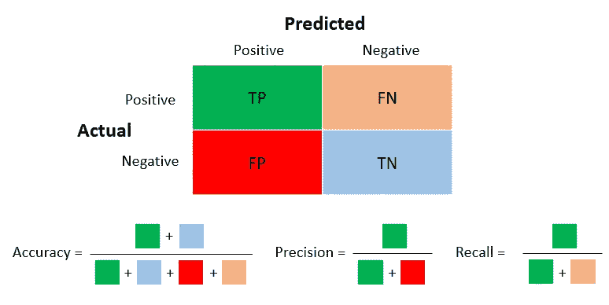
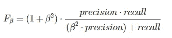
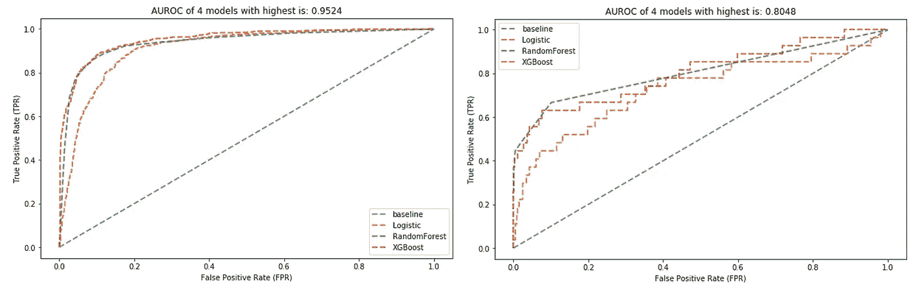
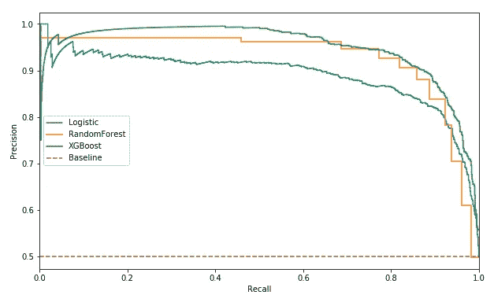
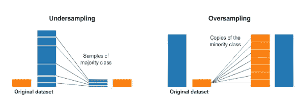
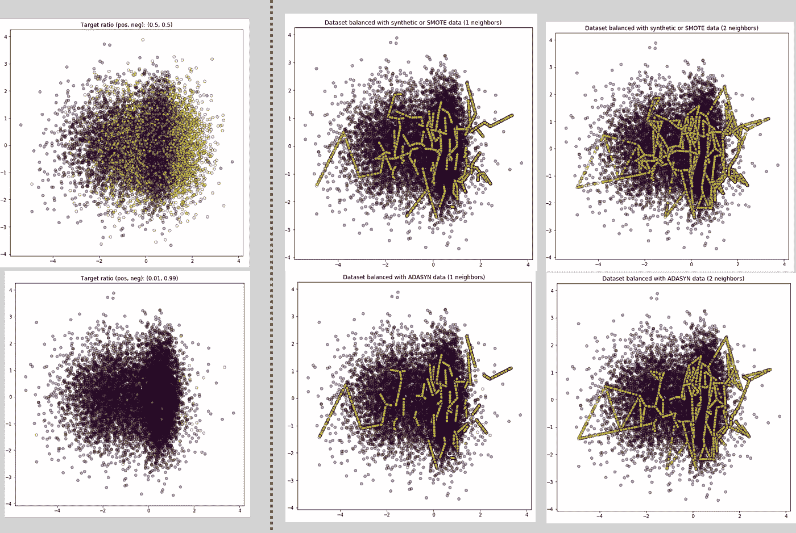
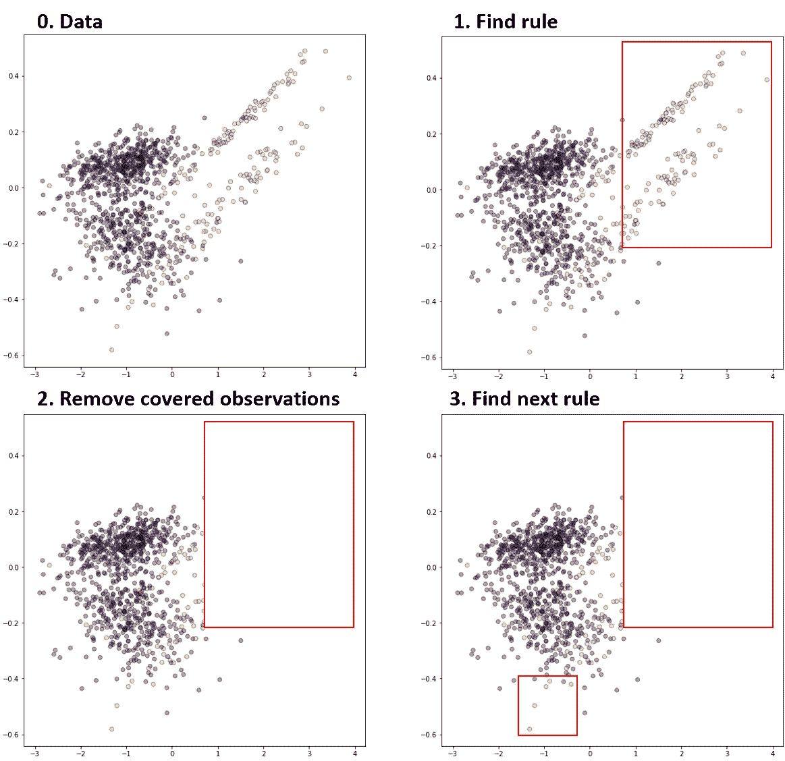
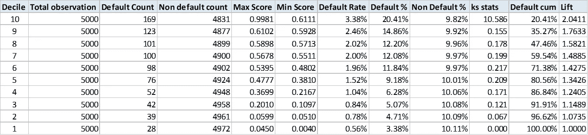

# 解决不平衡的学习

> 原文：<https://pub.towardsai.net/tackle-imbalanced-learning-84f64677a923?source=collection_archive---------0----------------------->

鲁珀特·布里顿在 [Unsplash](https://unsplash.com/s/photos/umbrella?utm_source=unsplash&utm_medium=referral&utm_content=creditCopyText) 上的照片

## 不平衡学习| [走向 AI](https://towardsai.net/)

## 关于如何解决不平衡的学习问题，你所需要知道的

# 介绍

如果你一直在数据科学领域工作，并一直作为团队的一部分或领导团队，你很可能会遇到数据不平衡的问题。那些在金融领域工作的人，你可能需要建立一个欺诈检测模型(识别欺诈交易，而不是合法的、非常常见的交易)。在工业领域，您可能需要确定哪些设备即将出现故障，而哪些设备将继续运行。

事实上，我们试图解决的大多数问题都与数据不平衡有关。对于分类问题来说，真的没有 50-50 的正类和负类分布。

# 这些问题

不平衡学习的问题可以分为三个主要问题。

1.  当我们没有足够的信息来定义学习问题时，出现了问题定义级别的问题。这也包括对如何正确判断/衡量分类器的理解。
2.  **数据层面的问题**发生在我们没有足够的训练数据的时候。一个例子是“绝对罕见”，我们没有足够数量的少数民族类的例子来学习。
3.  **算法级问题**是算法无法针对目标评估标准优化学习。任何使用贪婪搜索方法的算法在寻找稀有模式方面都有问题。

# 不平衡问题的评价指标

在第一部分中，重要的是理解我们将如何对不平衡数据使用有意义和适当的评估指标，这将最终转化为向学习算法提供准确的成本信息。*选择正确的评估指标是解决* ***问题的一种方法——定义级别*** *问题*。

## 混淆矩阵、精确度、召回率和 F 值

让我们回顾一下混淆矩阵；通常，我们想要预测/分类的类将是'*正'*。而精度和召回率，当我们提到的时候，将基于正类。

混淆矩阵和度量标准

分类的精确度本质上是与那些规则相关联的准确性，而召回是被正确预测的指定类别的例子的百分比。**召回的另一个含义是测量少数民族阶层**的覆盖率。

另一个流行的度量是 ***F* -measure** ，它是参数化的，可以调整以指定精度与召回的相对重要性，F1-measure 是从不平衡数据中学习时最常用的度量(它对精度和召回的权重相等)。下面我们来观察一下它的公式。

f-测度公式

对于 F2-measure，这将使β等于 2。F2 测量背后的直觉是，它的权重回忆高于精度。因此，在我们希望强调正确分类尽可能多的阳性样本的重要性的某些应用中，使 F2 测量更合适。

## ROC 和 AUROC

ROC 分析有时可以识别最优模型，忽略不依赖于成本背景或类别分布的次优模型。更简单地说，ROC 分析对那些以牺牲多数类为代价在多数类上表现良好的模型没有任何偏见。AUROC 将这些信息汇总成一个数字，这有助于在没有主导 ROC 曲线时进行模型比较。

ROC 分析是 TPR(真阳性率)对 FPR(假阳性率)的图，用于 0 到 1 之间的多个不同的候选阈值。它是针对 0.0 和 1.0 之间的多个不同候选阈值的假阳性率(x 轴)与真阳性率(y 轴)的关系图。换句话说，它绘制了虚警率与命中率的关系图。

高(左)与低(右)性能模型的 ROC 曲线示例

## 精确召回曲线和 AUCPR

如前一节所述，精确度和召回率是评估二进制分类，尤其是不平衡类的良好指标。

计算这两个度量的关键是与正类的正确预测密切相关，因此是这个问题的少数类。

精确度-召回曲线示例(AUCPR 可使用 AUC(召回，精确度)计算)

精确度-召回率曲线是不同阈值的精确度(y 轴)和召回率(x 轴)的曲线图，很像 ROC 曲线。

与 ROC 曲线的一个区别是基线不再固定(在 ROC 中，这是一条对角线)。但是精确召回曲线的基线是由正类和负类的比率决定的，并且是一条水平线。

## 那么什么时候在 ROC 曲线和精确回忆曲线之间做出选择呢？

在大多数情况下:

*   当每类的观察值大致相等时，应使用 ROC 曲线。
*   当存在中等到大的类别不平衡时，应该使用精确召回曲线。

> ROC 可以在不平衡的类数据集上呈现模型的乐观图景。并且它可能是欺骗性的，并导致对模型能力的不正确解释。

— [在不平衡数据集上评估二元分类器时，精确召回图比 ROC 图提供的信息更多](https://www.ncbi.nlm.nih.gov/pmc/articles/PMC4349800/)，2015。

# 修复数据

在本节中，我们将重点讨论如何解决发生在数据层面的问题。

实际上，解决这一问题的最好(或更好的方法)之一是通过获取更多正面样本或向现有数据添加更多特征来丰富数据。

然而，获得更多的阳性样本可能是困难的；否则应该是数据不平衡的问题。有几种方法可以减轻不平衡数据的影响。

## 过采样、欠采样和扩充数据

有两种方法直接处理数据集，另一种方法在少数类上使用合成(或增强)技术。

1) **过采样** —这是复制少数类的一些观察结果以增加其基数的方法。主要优点是没有信息损失，因为来自多数和少数类的所有数据都被保留。但是，这个过程容易出现过拟合。

2) **欠采样** —这是对多数类数据进行采样以平衡少数类数据的方法。考虑到这涉及到删除观察值，我们可能会丢失训练数据集中的有用信息。

过采样和欠采样方法的可视化

*   生成合成数据包括从少数类创建新的合成点(例如参见 SMOTE 方法)以增加其基数

3) **增加/合成数据** —这是我们从少数类创建新的合成点(另一种增加方法)的方法。

流行的方法有**击打** ( **S** 合成**M**in ority**O**versampling**Te**technique】和 **ADASYN** ( **Ada** 感受性 **Syn** 合成。

**SMOTE** 的工作原理是查看现有的少数数据，并在当前观察值与其 K 个最近邻点之间的直线上的随机位置合成新的数据点(此 K 是函数所必需的)。

**ADASYN** 建立在 SMOTE 方法的基础上，根据不同少数群体的学习难度，对他们使用加权分布。因此，将为难以学习的少数实例生成更多合成数据(有助于移动分类边界)。

使用 SMOTE 和 ADASYN 在不同邻居设置下创建合成数据的示例

作为本节的结尾，所有取样方法都应谨慎使用；这里有两点需要考虑。

*   采样方法只应在训练数据上进行**只**。
*   任何采样方法都可以被视为我们试图改变数据如何表现的现实，**，因此需要小心**，并牢记这对我们分类器的输出结果意味着什么。

# 优化学习算法

当所有方法都失效后，有时我们需要退一步，重新审视问题。也许我们需要重新思考和优化我们如何使用和调整分类器算法来处理少数类，特别是。

## 避免各个击破的搜索方法

该算法利用分治法的搜索方法来递归地划分搜索空间，在发现稀有模式时会有困难，因为它倾向于多数类的分离。有人建议，当存在不平衡数据时，避免或最小化这两种方法的学习方法往往会表现得更好。一个例子是*遗传算法*，这是一种全局搜索技术，它与候选解群体而不是单一解一起工作，并采用随机算子来指导搜索方法。

## 通过使用为处理不平衡数据而设计的指标来优化搜索方法

我们已经在前面的部分探讨了几个评估指标，以帮助解决问题级别的问题。然而，它们也可以在算法层面发挥作用，指导搜索过程。

它使用基于遗传算法的分类系统和 F-measure 来控制适应度函数中精度和召回率的相对重要性，因此进化出一组不同的分类规则，其中一些具有高精度，而另一些具有高召回率。我们的期望是，这将最终导致具有高精度和高召回率的规则。

另一种方法是分成两个阶段；首先，通过召回进行优化以最大化覆盖范围，其次，通过精度进行优化以去除假阳性。

## 隐含有利于少数阶级的算法

代价敏感学习算法是处理不平衡数据最流行的算法之一。为了更好地理解它，让我们想想检测欺诈交易和合法交易有多重要。我们可以看到，与错误地将合法交易标记为欺诈(由于付款而延迟到客户端)相比，欺诈交易会给公司带来更大的成本(财务和声誉)。基于这个例子，错误分类之间的**误差不再等于**。

有几种实现方法，包括以成本比例的方式对训练观察进行加权，以及将成本敏感性构建到学习算法中。

## 只学小众类

有几种方法只学习少数类的分类规则。一种是基于识别的方法；它 l **仅从与**少数类**相关联的训练观察中获得**来识别训练观察中共享的隐藏模式。

另一种更常见的方法是从属于所有类的训练观察中学习，但是**首先学习覆盖少数类的规则**。最流行的算法是 **Ripper 算法**，它使用分而治之的方法建立规则。Ripper 为每个类生成规则，从最罕见的到最常见的。在每个阶段，它通过添加条件来增加一个目标类的规则，直到没有属于另一个类的观察被覆盖(见下图)。

RIPPER 算法如何通过创建规则和删除已被这些规则覆盖的数据点来按顺序工作的示例

## 概率截止值

这种方法并不试图解决上述任何问题，而是处理如何使用分类器结果。这里，我们将使用预测输出作为观察的每个类别的概率。然后，我们可以进行预测，并产生增益/升力表，以评估分界点。

以下面的样本增益表为例，我们可以使用此信息(观察次数、命中率、违约百分比、累积和提升信息)结合业务/问题目标来选择使用哪个分数/预测概率。

增益/提升表示例

# 结尾注释/要点

如果你已经读到这里，祝贺你！！希望你已经学到了一些概念，并在实际问题中使用了它们。

*   有时候，思考和重新思考问题会更好。有一个明确的目标，如果可能的话，把它们分解成可实现的大小。
*   在处理不平衡的学习时，使用适当的评估标准；这些指标应该基于你想要达到的目标。
*   优化机器学习算法以处理不平衡学习。成本敏感学习、一类学习、类重新加权是一些例子。
*   可以使用重采样技术(过采样、欠采样)，但要小心。因为这样做，我们是在把现实的数据变成学习的算法。

感谢阅读，快乐学习！！！

 [## Satsawat Natakarnkitkul — AVP，高级数据科学家—渣打银行—暹罗商业银行| LinkedIn

### 我是一名数据爱好者，利用技术和业务知识来推动和传递对…

www.linkedin.com](https://www.linkedin.com/in/satsawat/)