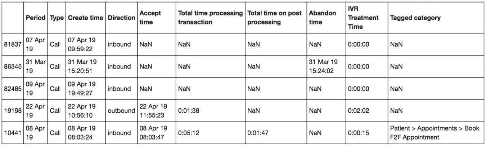
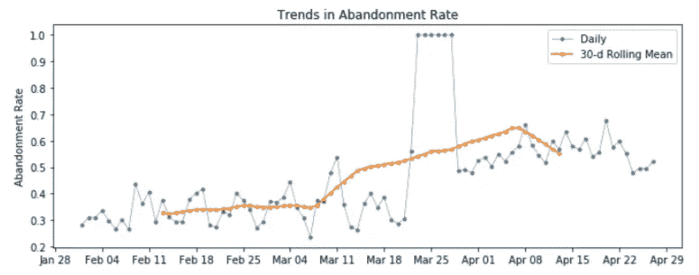
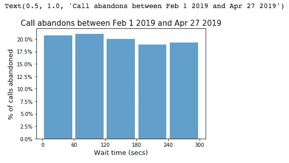
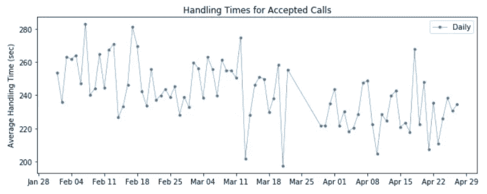
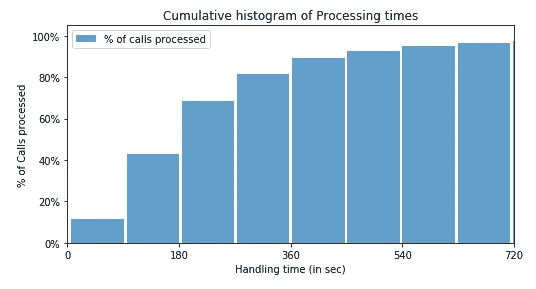
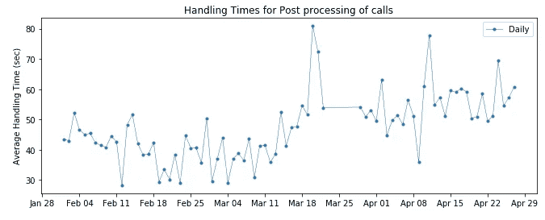
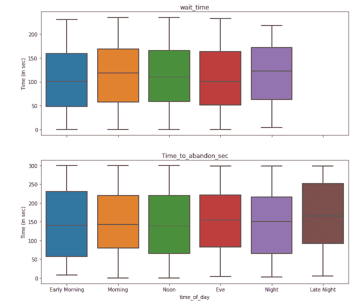
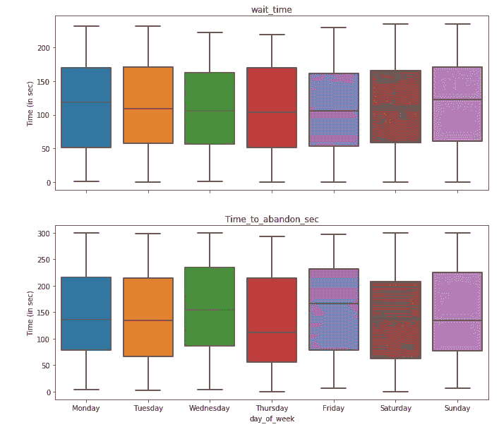

# 处理时间序列的带回家作业:Python 中的一个案例研究

> 原文：<https://pub.towardsai.net/tackling-the-time-series-take-home-assignment-a-case-study-in-python-b2a3bd78d956?source=collection_archive---------0----------------------->

## [机器学习](https://towardsai.net/p/category/machine-learning)， [Python](https://towardsai.net/p/category/programming/python)

## 利用呼叫中心分析改善客户支持


来自 [Pexels](https://www.pexels.com/photo/gray-double-bell-clock-1037993/?utm_content=attributionCopyText&utm_medium=referral&utm_source=pexels) 的[驼鹿照片](https://www.pexels.com/@moose-photos-170195?utm_content=attributionCopyText&utm_medium=referral&utm_source=pexels)的照片

欢迎学习时间序列分析的第 3 部分！正如我在上一篇文章中承诺的，我们将通过一个案例研究来分析呼叫中心生成的时间序列数据。这是我之前关于时间序列数据的帖子的延续。

在[第 1 部分](https://towardsdatascience.com/time-series-analysis-using-pandas-in-python-f726d87a97d8)中，我们介绍了许多时间序列分析的基础知识，包括季节性、趋势、自相关、重采样、一阶差分等概念的介绍。在[第 2 部分](https://towardsdatascience.com/time-series-modeling-using-scikit-pandas-and-numpy-682e3b8db8d1)中，我们对时间序列数据进行建模，对这些数据进行交叉验证，最后微调我们的模型超参数。请务必查看它们，因为我们将在这里使用那些文章中介绍的许多概念！

# 问题陈述

一家医疗保健公司的英国支持呼叫中心遇到了性能问题。他们的表现在 2 月和 4 月之间大幅下降，谷歌评论的评分大幅下降就是证明。他们怀疑性能的变化是由于代理性能差。

这项研究的主要目的是进行**呼叫中心分析**。

> 呼叫中心分析(CCA)涉及捕获和跟踪有关呼叫中心呼叫人员或被呼叫中心呼叫人员的重要数据。它提供了监控通话量、客户满意度、员工绩效的机会，并利用它来改善客户关系。

作为 CCA 的一部分，我们将确定一些可能推动这种变化的假设，然后进行相关分析来测试这些假设。此外，我们将提出一些建议，作为地区运营团队进行规范分析的一部分。

# 目标 KPI(关键绩效指标)

> KPI 是在任何业务问题中必须尽早定义的基本结构。它代表了对您的业务至关重要的指标，也是您为了实现业务目标而试图优化的指标。

我们可以关注各种呼叫中心关键绩效指标，如转移率、空闲时间、应答时间、呼叫处理时间等。对于这个特殊的案例研究，我们将限制我们对**废弃率(AR)** 的分析。

AR 表示呼叫在被应答之前丢失的百分比。

从数学角度来说，

> **AR =已放弃呼叫/(已放弃呼叫+已接受呼叫)**

# 让我们深入我们的数据集。

这是我们数据中五个(随机选择的)样本的样子:



数据列:

*   *周期*:拨打电话的日期
*   *类型*:联系人的类型是聊天还是通话
*   *创建时间*:调用时的时间戳
*   *方向*:呼叫是*呼入*(患者拨打)还是*呼出*(呼叫中心代理拨打)
*   *接受时间*:座席接受呼叫的时间戳
*   *处理交易总时间*:患者与代理通话总时间
*   *后处理的总时间*:总“总结”时间(完成任何呼叫后管理工作)
*   *放弃时间*:呼叫被放弃时的时间戳
*   *IVR 治疗时间*:患者在 IVR*阶段经过的时间
*   *标记类别*:用呼叫“标记”对呼叫类型进行分类

交互式语音应答是一个自动系统，通过菜单引导来电者:按 1 代表销售，按 2 代表支持。

## 为列设置正确的数据类型

正确的日期-时间格式的重要性怎么强调都不为过(您可能从第 1 部分就知道了)。因此，我们将修复包含日期和/或时间的所有列的列类型。

为*日期时间*列设置正确的数据类型:

为*时间*列设置正确的数据类型:

最后，我们将索引设置为*期间的*列:

```
df = df.set_index('Period')
```

## 将经过的时间转换为秒

我们将使用`dt.total_seconds()`将代表时间流逝的三列转换成秒。

# 框架假设

为了开始我们对不良代理性能的调查，我们将构建(并最终测试)六个初始假设:

*   H1:废弃率上升(超过 10%)。
*   H2:排队等候时间很长。
*   H3:未保持 80/20 的服务水平。
*   H4:电话处理时间长。
*   H5:后期处理时间长。

# 数据清理

首先，在分析呼叫中心记录时，我们必须从数据集中排除所有在进入系统的前五秒(或其他阈值)内放弃的呼叫。原因是，这些是 ***自暴自弃*呼叫！**

> 假设这些(自动放弃)呼叫是由错误地拨错号码或者可能认为他们拨错了号码而挂断的人发出的。

我们还将过滤掉所有既未被接受也未被放弃的**呼叫**。

最后，在计算 AR 时，我们必须排除任何**重新路由的呼叫**(其中*接受时间*与*创建时间*相同)。这是因为我们无法确定是呼叫被重新路由，还是座席在它一进入系统就拾取了它。

# 特征工程

我们首先创建一个名为`Call_Status`的新列，它接受值— `Abandoned`或`Accepted`。

我们还将创建`wait_time`列，即呼叫者在代理接受其呼叫之前必须在队列中等待的时间。

接下来，我们创建两个新列`time_of_day`和`day_of_week`来检查(稍后)AR 比率中是否存在任何每周或每天的季节性。

# 助手功能

我们将创建三个助手函数:

*   `calculate_AR`:使用之前讨论的公式计算 AR

*   `print_AR`:打印`calculate_AR`功能的结果

*   `calls_answered_under_sec`:计算在(用户自定义)秒数内接听的所有来电的百分比

# 让我们开始假设测试…

## H1:废弃率上升(超过 10%)。

我们首先检查 2 月和 4 月之间月份的 AR 值，但只检查*呼入*(这是因为我们只对呼叫者放弃呼叫的情况感兴趣，而不是代理)。行业标准认为 5-10%的 AR 是合理的。

如您所见，AR 比率远远超过行业标准，这意味着该公司的担忧并非毫无根据。

现在我们知道放弃呼叫的比例已经增加，一个简单的方法是用每月的`[rolling](https://towardsdatascience.com/time-series-analysis-using-pandas-in-python-f726d87a97d8)` [表示](https://towardsdatascience.com/time-series-analysis-using-pandas-in-python-f726d87a97d8)来形象化 AR 中的*趋势*。



观察 30 天的滚动平均时间序列，我们可以看到弃用率的长期趋势在 2 月 13 日至 3 月 6 日之间相当平缓。然而，在 3 月 9 日至 4 月 8 日期间，应收账款有一段急剧上升的时期，之后又开始下降。

## H2:排队等候时间很长。

队列等待时间，或放弃的*时间，是呼叫者在放弃(或挂断呼叫)之前在队列中停留的平均时间长度。*

*注意:我们假设 IVR 消息一结束，呼叫者就被放入队列。*

记住这一点，让我们使用以下公式计算放弃的*时间:*

> **放弃时间=呼叫放弃时的时间戳—呼叫创建时的时间戳—花费在 IVR 中的时间**



直方图中有一些观察结果:

*   显然，对于不同的等待时隙，放弃呼叫的比例或多或少是相似的。
*   至少 40%的放弃呼叫是在队列中等待 2 分钟内放弃的呼叫。
*   与等待时间在 2 到 3 分钟之间的呼叫相比，等待时间在 3 到 4 分钟之间的呼叫被放弃的比例略低(尽管这种差异几乎可以忽略不计)。

## H3:未保持 80/20 的服务水平。

行业平均水平保持在 80%的电话在 20 秒内被接听。

我们似乎远远落后于行业标准，**只有 6%的来电在 20 秒内得到接听**。这可能是呼叫中心性能下降的主要原因之一。

## H4:电话处理时间长。

虽然在解决客户问题上应该花费多少时间(大约 4-6 分钟)的行业标准各不相同，但我们都同意我们希望将这个数字保持在尽可能低的水平。

我们将从计算和可视化每天处理电话的平均时间开始。



接听客户电话的平均时间大约为 4 分钟(240 秒)。行业标准基本相同，因此我们可以确定，**绩效不佳不是因为员工培训问题**。

为了将处理时间与行业平均水平进行比较，让我们使用累积直方图来直观显示在 X 秒内可以处理的呼叫的百分比。



大约 40%的电话在 3 分钟内得到接听，而 80%的电话可以在 6 分钟内完成。即使这些数字是主观的，我们也可以设定一个基线(比如说 80%的电话是 4 分钟)，并尝试打破这个基线。

## H5:后期处理时间长。

行业标准是 20-30 秒完成收尾工作。但是，如果它高得多，则可能表明系统端或员工端存在一些效率问题，从而危及代理的工作效率。



正如我们从 6 位数总结中收集到的，大多数日子的平均后处理时间大约是 50 秒。有趣的是，3 月 18 日之后，后处理时间有所增加。由于更长的后处理时间占用了座席的大量时间，这意味着座席无法处理更多的呼叫，从而导致更长的等待时间并最终增加 AR。

# 假设检验的结果总结

*   H1:废弃率上升(超过 10%)。 **True** 与行业标准相比，AR%过高。
*   H2:排队等候时间很长。**真实** 漫长的等待时间迫使客户放弃通话。
*   H3:未保持 80/20 的服务水平。 **True** 需要雇用更多的代理来提供 80/20 服务级别。
*   H4:电话处理时间长。**假**
    绩效不佳不是因为员工培训问题。
*   H5:后期处理时间长。**真** 代理效率问题可能会危及生产力。

# 实践建议

*   设计互动方式，让来电者在等待期间保持参与。
*   实施备忘单以简化通话并减少通话处理时间。
*   投资软件解决方案，实现后处理操作的自动化。
*   解决任何代理培训问题，以减少后期处理时间。
*   考虑基于一天中的时间和一周中的日期的资源(代理)重新分配。

## 一天中的时间和一周中的某一天

为了评估关键交通时间(为了成功地重新分配资源)，我们将绘制关于等待时间和放弃时间的箱线图。



*注意:没有深夜等待时间的方框图，因为所有呼叫都在深夜被放弃(呼叫中心必须在午夜关闭)。*



从上面的箱线图可以明显看出:

*   早上和晚上需要更多的代理，因为等待时间(稍微)更长。
*   周末和周一需要更多的代理，因为等待时间更长。
*   周四也需要更多的代理，因为放弃的时间是最少的。

# 结尾注释

客户维系在公司的成功中起着重要作用，因此客户支持服务的质量在维护客户关系中起着关键作用也就不足为奇了。

呼叫中心分析绝对值得您花费时间，因为从这些分析中可以提取的大量可操作信息是无价的。如果你想深入了解你为客户服务的情况，衡量代理人的表现，或者询问你为什么会失去业务，那就试试吧！

通过这个关于呼叫中心数据的案例研究，我获得了很多乐趣。您可以随意使用上面的代码片段进行自己的分析。一如既往，我很乐意听到是否有更好的方法来做我提到的一些事情。

直到下次:)

[](https://towardsdatascience.com/time-series-analysis-using-pandas-in-python-f726d87a97d8) [## 使用 Python 中的 Pandas 进行时间序列分析

### 对季节性、趋势、自相关等关键词的额外介绍。

towardsdatascience.com](https://towardsdatascience.com/time-series-analysis-using-pandas-in-python-f726d87a97d8) [](https://towardsdatascience.com/time-series-modeling-using-scikit-pandas-and-numpy-682e3b8db8d1) [## 使用 Scikit、Pandas 和 Numpy 进行时间序列建模

### 直观地利用季节性来提高模型准确性。

towardsdatascience.com](https://towardsdatascience.com/time-series-modeling-using-scikit-pandas-and-numpy-682e3b8db8d1)