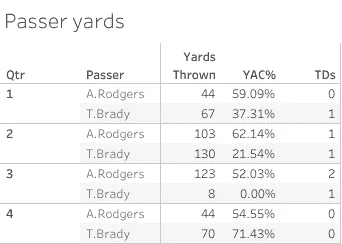
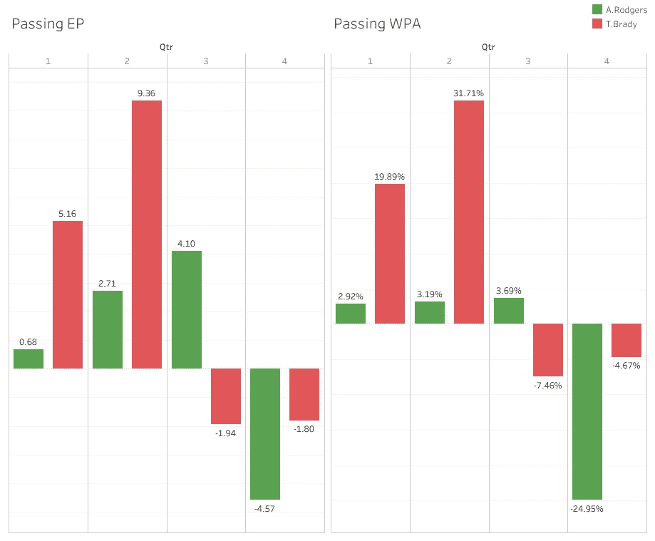
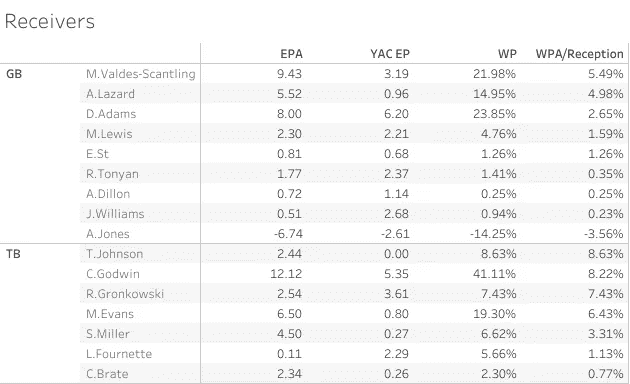
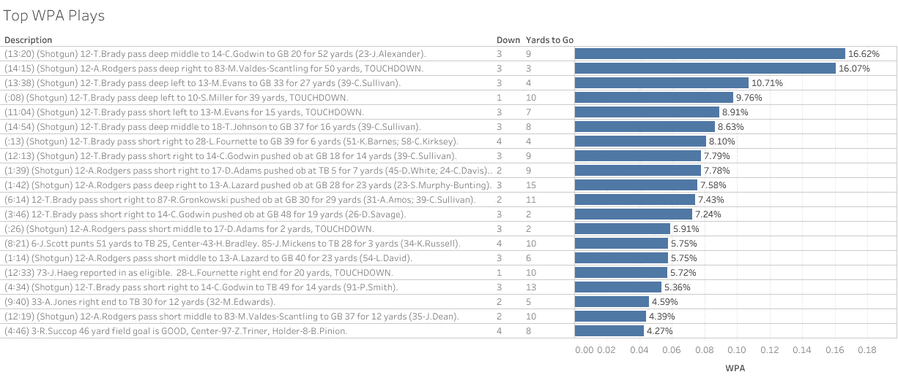
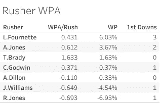
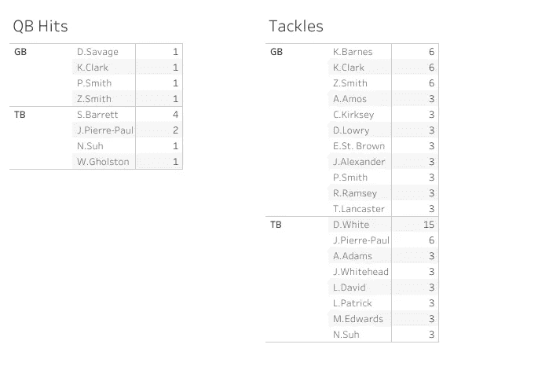

# 上周 NFC 冠军赛的统计谈话要点

> 原文：<https://pub.towardsai.net/talking-points-in-last-weeks-nfc-championship-game-c1101db6054d?source=collection_archive---------6----------------------->

## [意见](https://towardsai.net/p/category/opinion)

[Zoltan·塔斯](https://unsplash.com/@zoltantasi?utm_source=unsplash&utm_medium=referral&utm_content=creditCopyText)在 [Unsplash](https://unsplash.com/s/photos/buccaneer?utm_source=unsplash&utm_medium=referral&utm_content=creditCopyText) 上的照片

上周的 NFC 锦标赛见证了海盗队晋级超级碗，标志着汤姆·布拉迪第 10 次争夺戒指。比赛很接近，在下半场包装工队有很多机会缩小差距，但最终无法阻止回家。本文将讨论一些统计趋势，这些趋势来自对游戏的详细数据的分析。

## 关键术语

*   接球后码数
*   **EPA** —每场比赛的预期加分
*   **WPA** —每次游戏增加的获胜百分比
*   **EP** —预期点数(可作为 EPA 的总和计算)

## 布雷迪轻而易举地把比赛交给了步行者队，但包装工队马上就把它递了回去

作者图片

到上半场结束时，布雷迪已经投掷了 197 码，两次触地得分。当我们根据 YAC 和 Air Yards 对其进行细分时，我们看到布雷迪承担了大部分重任，尤其是与罗杰斯的关系。布雷迪的 197 码只有 53 码，相比之下，罗杰斯的 147 码有 90 码。在 21-10 领先的情况下，由于斯科特·米勒的最后一次进攻和 CB 凯文·金的一次失误(尽管我个人认为这场糟糕的比赛应该更多地归咎于协调人)，海盗队在半场时应该非常自信。接下来是布雷迪季后赛生涯最糟糕的一半。在上半场贡献了 14.52 EP 后，布雷迪在第二节继续投掷了 78 码，其中包括 8 码的第三节和 3 次拦截，同时在他的接球手的大力帮助下也获得了这一码数。

作者图片

然而，最终这并没有被证明是一个严重的问题，因为 Aaron Rodgers 未能利用他的防守创造的 3 次失误中的任何一次。虽然他投掷了 167 码和 2 次触地得分，但大部分都发生在第三节，从统计数据来看，他的第四节比布雷迪的下半场更糟糕，抹去了他试图在第三节卷土重来所做的所有工作。

第四季度的统计数据可能会被夸大。增加的获胜概率(WPA)和增加的期望点数(EPA)都是时间的函数，特别是在剩余比赛的比例中，因此，例如，在比赛即将结束时，一场重要的比赛对球队进攻获胜概率的影响比在比赛早期要大得多。这是可以理解的，一个 50 码的触地得分在第四节结束时领先 1 分意味着比第一节完全相同的比赛更多。观看比赛时，我怀疑你会发现有人会告诉你罗杰斯的下半场比布雷迪更糟糕，但如果你也考虑到罗杰斯一直在追逐比赛的事实，这个非常失败的第四节就开始有意义了。罗杰斯需要在第四季度完成，当他最终无法完成时，EPA 和 WPA 复合了一个破坏性的读数。

## 克里斯·戈德温在最关键的时候发挥了作用

作者图片

克里斯·戈德温在 110 码的距离内有 5 次接球，是海盗队接球员麦克·伊文斯 51 码的两倍多。不过，戈德温的单个接球手的码数并不多。那是马尔克斯·瓦尔迪兹·斯坎特林，他在 4 次接球后 115 码处触地得分。当你看 EPA 和 WPA 的数据时，我们真的开始看到 Godwin 对所有同行的影响。

作者图片

5.35 总 YAC EPA，超过任何其他接收器的 2 个完整预期点，Brady-Godwin 连接贡献了 Bucs 总 win %的 41.11%。这几乎是罗杰斯-MVS 的两倍，尽管 MVS 有 5 码，触地得分超过戈德温。每当布雷迪需要第一次进攻时，戈德温就是他要找的人，而且他总能完成任务。他的 5 次接发球中有 4 次进入了 WPA 前 20 名，所有的接发球都排在第三位，只有一次在短码的位置。布雷迪两次面对 3 号和 9 号，3 号和 14 号，3 号和 2 号，每次他都找到戈德温保持动力。克里斯·戈德温(Chris Godwin)是迄今为止这个接收器公司对抗包装工队(Packers)的无名英雄，他的表现可能会因其他亮点发挥而被忽视，如第四节 Gronk 的 21 码跑或 Scotty Miller 在第二节结束时的 39 码达阵。然而，统计数据没有错过戈德温的贡献，并明确承认他在 NFCC 的表现。

## 在整体表现不佳的比赛中，伦纳德·福内特脱颖而出

作者图片

当谈到他们在某一天决定控球多少时，海盗队往往是更不可预测的球队之一，当然，除非是第一次进攻。在这个季后赛中越来越流行的一个特征是伦纳德·福内特的出现。福内特在 NFCC 又打了一场精彩的比赛。Fournette 的 WPA 高于任何其他主要 rushers 和第二高的 wpa/rush，他在自己的班级中对抗预计对他来说是一场艰苦的比赛。海盗队和包装工队在每次冲刺允许的码数方面分别排名第 1 和第 10，而 Fournette 只跑了 55 码，他在 12 次进攻中有 3 次第一次触地得分，6 次成功得分和 1 次触地得分。Fournette 以前在季后赛中的表现也有助于包装工队如何试图为他制定计划，以及这在其他地方开辟了道路。根据 AWS Next Gen 统计，包装工队在 33.33%的 Fournette 比赛中有 8 名防守队员在禁区内。这比本赛季任何其他球队针对 Fournette 的计划都高，虽然这在一定程度上有助于控制 Fournette 的比赛，将他限制在 4.6 码/次，但它在后场制造了漏洞，Godwin，Evans 和 Miller 尽职尽责地利用了这一点。虽然 Fournette 的影响在纸面上看起来很好，但它并没有开始描述这对游戏的其他组件产生的蝴蝶效应。

## 无论你往哪里看，德文·怀特或沙克·巴雷特都可能在那里

作者图片

沙克·巴雷特和德文·怀特在包装工队的进攻上表现出色。巴雷特整场比赛都在恐吓罗杰斯，4 次 QB 安打，3 次 sacks 和 2 次 TFLs。托德·鲍尔斯的防守方式与他们两人在常规赛相遇时相似。这在当时很有效，在季后赛中也很有效，鲍尔斯随心所欲地发动闪电战，给罗杰斯带来持续的压力。没有大卫·巴赫蒂亚里，罗杰斯被击中 8 次，而布雷迪只有 4 次。当包装工队决定带球或投球时，德文·怀特就在现场。怀特总共有 15 次铲球，其中 9 次是单刀铲球。这两个家伙是海盗队防守的两个领导者，罗杰斯所到之处，要么是他们中的一个在他面前，要么是守卫着浅水区。不要怀疑其他海盗的防守，事实上他们都有一个相当合理的游戏，但这两个定义了这一次真正的统治。