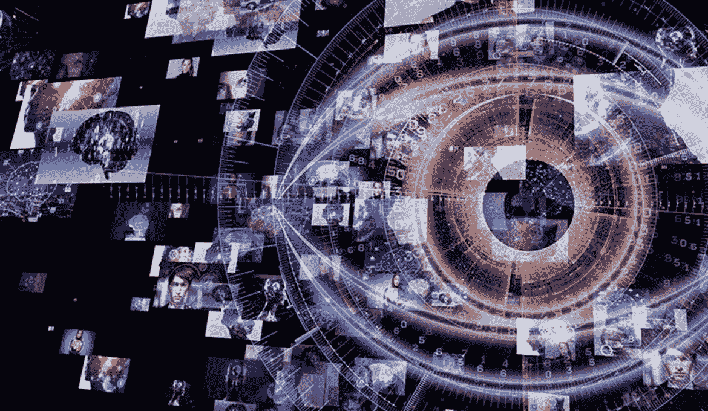
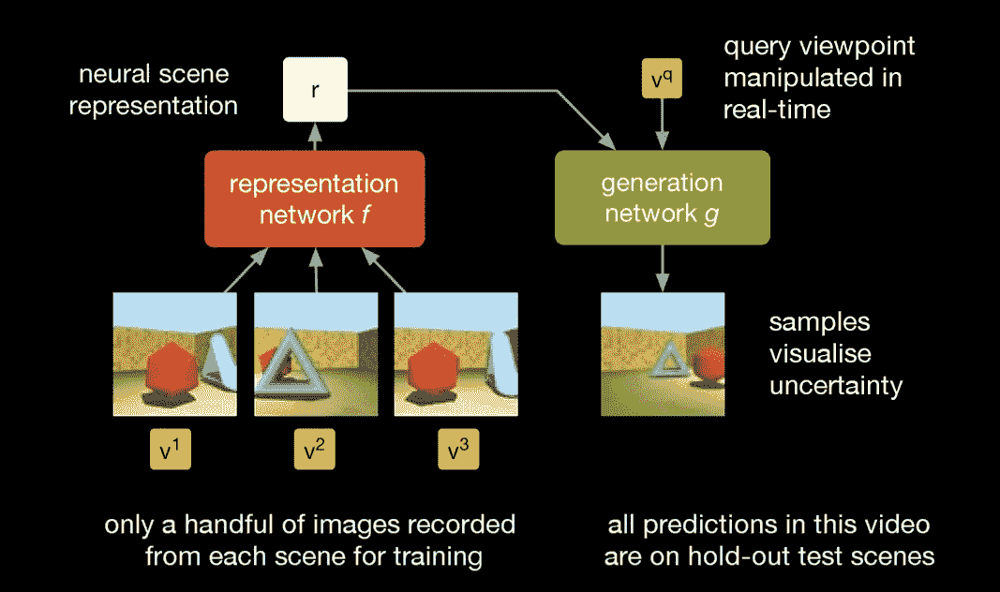
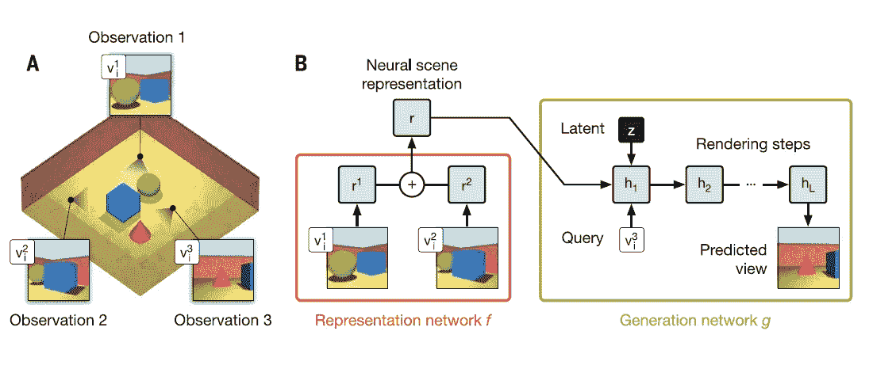
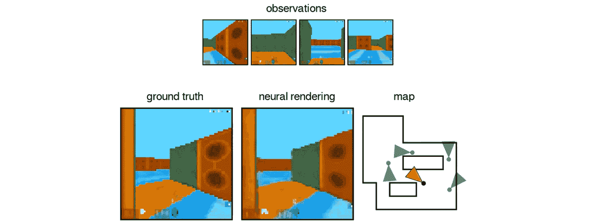
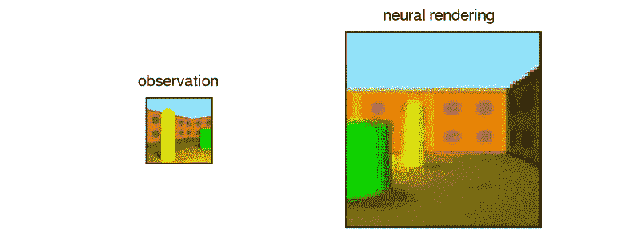

# 教人工智能像人类一样看东西

> 原文：<https://pub.towardsai.net/teaching-ai-to-see-like-human-36304b0fa642?source=collection_archive---------3----------------------->

## [计算机视觉](https://towardsai.net/p/category/computer-vision)

## DeepMind 生成查询网络可以在导航视觉环境时推断知识。

来源: [WORLDQUANT](https://www.weareworldquant.com/en/thought-leadership/understanding-images-computer-vision-in-flux/)

> 我最近创办了一份专注于人工智能的教育时事通讯，已经有超过 70，000 名订户。《序列》是一份无废话(意思是没有炒作，没有新闻等)的 ML 导向时事通讯，需要 5 分钟阅读。目标是让你与机器学习项目、研究论文和概念保持同步。请通过订阅以下内容来尝试一下:

 [## 序列

### 该序列解释了主要的机器学习概念，让你与最相关的项目和最新的…

thesequence.substack.com](https://thesequence.substack.com/) 

一幅图像胜过千言万语，这句古老的名言道出了视觉分析在人类学习过程中的重要性。每当我们看到一个视觉场景，我们的大脑就会对其中的物体及其背景性质做出成千上万的推断。例如，如果我们看到一个人坐着，我们会推断他下面有一把椅子。即使我们看不到物体，视觉推理也能起作用。例如，如果我们在卧室里看到一个壁橱，我们会假设里面有衣物，即使我们看不到它们。作为一种认知技能，视觉推理是记忆、计划或想象等其他能力的基础。

这些视觉认知任务对人脑来说毫不费力，但在人工智能(AI)代理中却难以复制。今天，视觉识别模型依赖于大数据集的标记图像来完成基本任务，如物体识别。生成这些带标签的数据集是一个劳动密集型的过程，并且通常情况下，它无法捕捉场景的许多上下文方面，如灯光位置、观看者的视角或对象之间的关系。人工智能视觉识别模型的下一个前沿是让人工智能代理从视觉场景中学习，进行类似于人类的推理。这是 DeepMind 在科学杂志上发表的 2018 年[研究论文](http://science.sciencemag.org/content/360/6394/1204.full?ijkey=kpkRRXA1ckHD6&keytype=ref&siteid=sci)的主题。

在标题[“自然场景表示和渲染”](http://science.sciencemag.org/content/360/6394/1204.full?ijkey=kpkRRXA1ckHD6&keytype=ref&siteid=sci)下，DeepMind 引入了生成查询网络(GQN)的概念，这是一种能够创建 AI 智能体的模型，当它们在视觉场景中导航时，可以从周围环境中学习。GQN 模型由两个神经网络组成:一个表示网络和一个生成网络。表示网络将代理的观察结果作为输入，并产生一个神经场景表示，该表示对关于底层场景的信息进行编码。每一个额外的观察都在同一表现中积累了关于场景内容的进一步证据。然后，生成网络从任意查询角度预测场景，必要时使用随机潜在变量在其输出中创建可变性。这两个网络以端到端的方式被联合训练，以最大化生成将从查询视点观察到的地面实况图像的可能性。

来源:[科学](https://science.sciencemag.org/content/360/6394/1204.full?ijkey=kpkRRXA1ckHD6&keytype=ref&siteid=sci)

GQN 模型的主要贡献是基于这样的事实，即表示网络不知道生成网络将被查询来预测哪些视点。因此，表示网络将产生包含所有信息(例如，对象身份、位置、颜色、数量和房间布局)的场景表示，这些信息是生成器网络做出准确预测所必需的。在训练过程中，生成器网络学习环境中典型对象之间的关系，这允许它从表示网络接收描述并填充细节。例如，表示网络将简洁地将“蓝立方”表示为一小组数字，并且生成网络将知道如何从特定视点将其自身表示为像素。下图显示了一个 GQN 模型，该模型分析了一个带有特定对象的空间房间。

来源:[科学](https://science.sciencemag.org/content/360/6394/1204.full?ijkey=kpkRRXA1ckHD6&keytype=ref&siteid=sci)

为了测试 GQNs 的有效性，DeepMind 团队使用生成的 3D 环境进行了一系列实验，其中多个对象具有任意位置、颜色、形状和纹理。实验突出了 GQNs 的一些显著特性。例如，GQN 模型表明，当视觉场景中的某些内容不是真正可见时，它们能够解释视觉场景中的不确定性。例如，下面的 GQN 模型通过其预测的可变性来表达其不确定性，这种可变性随着其在迷宫中的移动而逐渐减少。

来源:[科学](https://science.sciencemag.org/content/360/6394/1204.full?ijkey=kpkRRXA1ckHD6&keytype=ref&siteid=sci)

类似地，GQN 模型能够从新的视角“想象”未被观察到的场景。如下图所示，当给定场景表示和新的相机视点时，GQN 模型能够生成清晰的图像，而无需事先指定任何透视法则。

来源:[科学](https://science.sciencemag.org/content/360/6394/1204.full?ijkey=kpkRRXA1ckHD6&keytype=ref&siteid=sci)

GQNs 是一种非常新颖的技术，与传统的深度学习图像分析方法相比，它仍然有许多局限性。然而，GQNs 表明，在没有任何人类标记这些场景内容的情况下，人工智能代理可以感知、解释和表示合成场景，这代表了图像分析方法演变的一个重大突破。