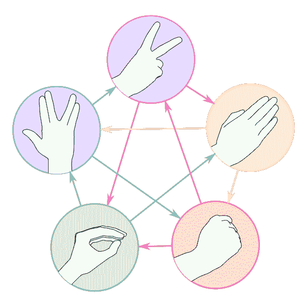

# 教安 AI 石头剪刀布！

> 原文：<https://pub.towardsai.net/teaching-an-ai-rock-paper-scissors-6c49fd9173a8?source=collection_archive---------0----------------------->

## [机器学习](https://towardsai.net/p/category/machine-learning)

## 使用机器学习方法来教人工智能在两个石头、布、剪刀玩家做出选择时谁会赢。全湾可用[在我的回购](https://github.com/arditoibryan/Projects/tree/master/20210215_Rock_Papaer_Scissors)。

在这篇文章中，我将创建一个非常简单的分类软件，能够通过例子学习石头、布、剪刀的规则。这不是一个传统的 ML 模型，我下载了一个数据集作为例子，将它分成训练和测试分区，然后训练模型以获得准确性分数。因为 ML 可以很容易地记忆数据集(这种做法被称为过拟合，是训练 ML 模型时的主要问题)，所以我会通过例子让这个 AI 过拟合数据集来记忆它的规则。


石头、剪刀、布的最高级版本:Kontrappali 和 Sheldon 玩石头、剪刀、布、蜥蜴、斯波克、大爆炸理论

如果您已经知道如何用 python 编程，您会注意到您可以使用一个简单的 If 语句来模拟相同的过程。这篇文章的重点，不要被误解，不是集中在一个复杂的算法来解释，而是采取一个非常简单的问题，如石头，布，剪刀，并找到另一种方法来解决它。如果你是机器学习的新手，这可能会帮助你更好地理解分类。

# 导入库

```
import itertools
import pandas as pd
import numpy as np
```

我要做的第一件事是创建所有可能的石头、剪子、布比赛中每个玩家的所有可能的选择组合。

```
#permutation with repetitions
df = pd.DataFrame([p for p in itertools.product(['Rock', 'Paper', 'Scissor'], repeat=2)])
df
```

然后，我将添加 Player1 的结果分数，并将这一列值用作标签。1 表示赢，0 表示平，-1 表示输。例如，当玩家 1 选择石头，玩家 2 选择纸时，玩家 1 获胜，因此相应的标签为 1。

```
#add results after index based encoding
df['result'] = ['0', '-1', '1', '1', '0', '-1', '-1', '1', '0']
```

## One_hot 编码

现在，我需要对数据执行 one_hot 编码。如果我没有遵循这一步，模型可能会将数据解释为连续的。

```
#perform one_hot on players (otherwise the data is interpreted as sequential)
from sklearn.preprocessing import OneHotEncoderdef one_hot(df, partitions):
  #togliamo le colonne da X
  for col in partitions:
    k = df.pop(col)
    k = pd.get_dummies(k, prefix=col)
    df = pd.concat([df, k] , axis=1)
  return dfdf = one_hot(df, df.columns[:-1])
df
```

## 提取要素和标注

```
#extract features
X = df[df.columns[1:7]]
X#extract labels
y = df[df.columns[0]]
y
```

## 训练模型

现在是时候使用一个非常简单(并且非常不灵活)的分类模型来训练模型了。我选择使用支持向量机作为主要模型。

```
#classification model
from sklearn import svmclf = svm.SVC(probability=True)
clf.fit(X, y)
```

## 用预测做实验

现在模型完成了！人工智能是否正确地学习了石头、布、剪刀的规则？让我们来测试一下:如果两个玩家都使用 Rock ([0，1，0，0，1，0])，结果是 0，到目前为止工作得很好！

```
#predict output
#0_Paper 0_Rock 0_Scissor 1_Paper 1_Rock 1_Scissor
clf.predict([[0, 1, 0, 0, 1, 0]])
clf.predict_proba([[0, 1, 0, 0, 1, 0]])
```

## 下一步是什么？

显然，石头、剪刀、布的最高级版本仍然需要以人工智能的形式来设计，那就是石头、剪刀、布、蜥蜴、斯波克！！！



石头剪刀布蜥蜴史波克逻辑