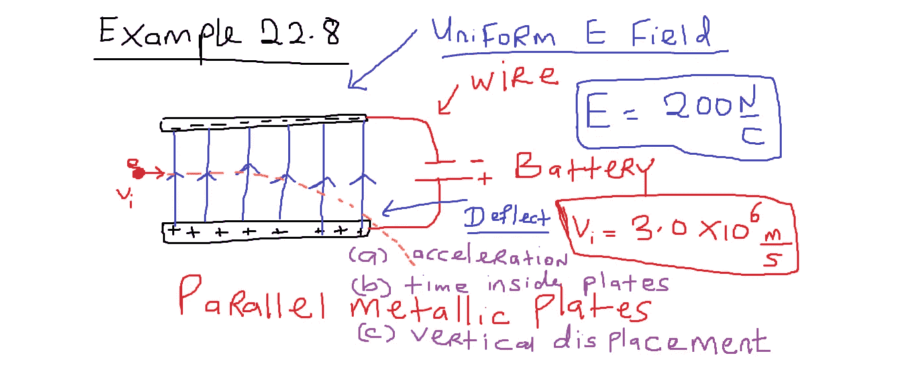
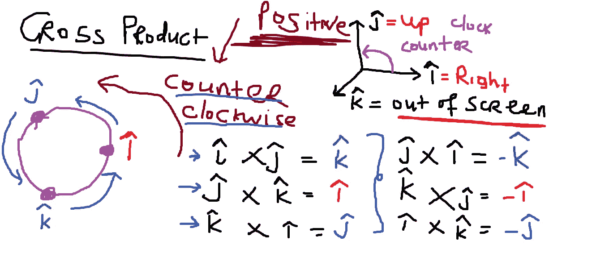
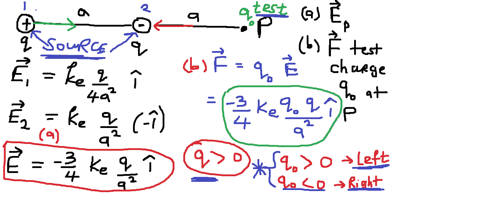
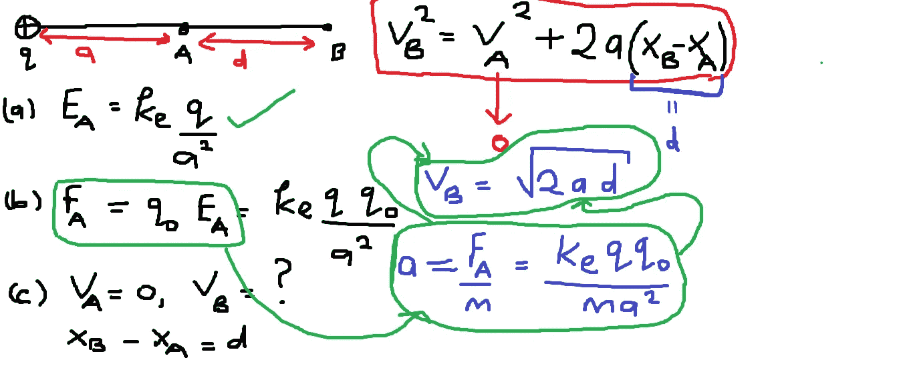
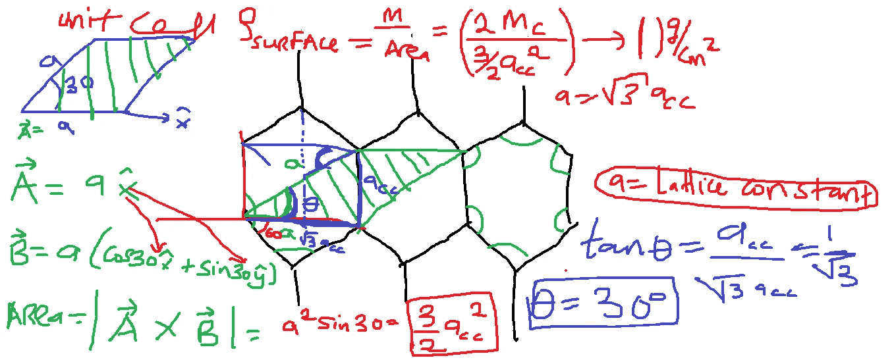
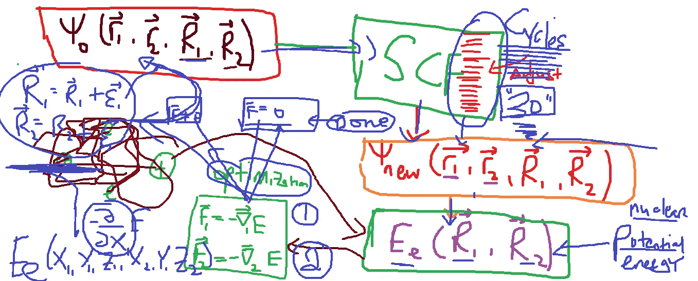
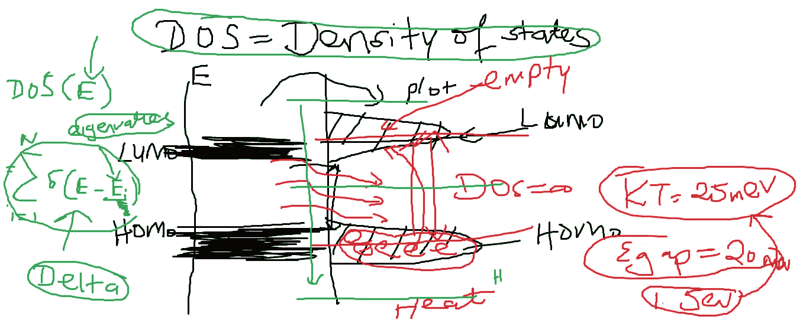
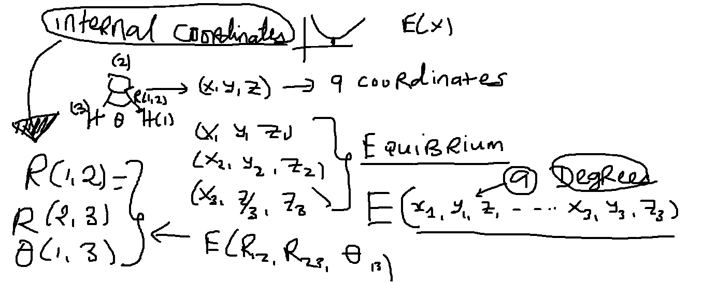

# 用 Zoom 教物理

> 原文：<https://pub.towardsai.net/teaching-physics-with-zoom-99291fd8614a?source=collection_archive---------4----------------------->

Benjamin O. Tayo 的图片

## 物理、教育

## 结合使用 PowerPoint 幻灯片和 Paint 应用程序，Zoom 上的实时物理讲座可以模拟面对面的交付

# 一.导言

由于冠状病毒(新冠肺炎)引起的全球疫情，大学和学术机构已经将课程转移到在线交付系统。因为过渡到在线授课的决定是在春季学期中期做出的，我们要求大多数教师继续使用替代的授课系统授课。在我的大学(中俄克拉荷马大学)，这意味着使用 Zoom 或微软团队等平台进行现场授课。因此，除了虚拟授课之外，课程仍将如期进行。

通过 Zoom(或任何其他虚拟平台，如微软团队或 Webex)教授物理非常具有挑战性。在面对面授课中，我通常使用 PowerPoint 幻灯片和白板的组合来教授我的物理课。我总是把使用白板详细解释基本概念作为一个目标。此外，我认为，当教师使用白板来解释理论概念，而不是仅仅浏览 PowerPoint 幻灯片上的方程时，学生更容易掌握理论和数学概念。

为了创建一个模拟面对面授课的虚拟课堂环境，我结合使用 PowerPoint notes 和 Paint 应用程序来讲授我的 Zoom 讲座。我发现这种方法非常有效，因为有了 Paint 应用程序，我可以使用绘图工具来解释理论和基本概念。我也用这个工具来做例子，我用一步一步的方式慢慢地检查问题。

在本文中，我将从我的虚拟课堂上演示几个例子，说明如何在直播 Zoom 讲座中使用 Paint 应用程序来解释关键概念。

# 二。在实时缩放讲座期间使用画图应用程序创建的虚拟笔记示例

## 1.解释向量叉积

在这里，我解释了基本单位向量的叉积之间的基本关系(见**图 1** )。Paint 应用程序使演示非常漂亮和艺术，因为人们可以为插图创建图表，并使用各种不同的颜色来区分结果。

**图一**。在线缩放讲座中解释矢量叉积。

## 2.利用叠加原理计算电荷系统的电场矢量

这是一个课堂上的例子。在本例中，我们执行了以下操作:

*   计算 2 个大小相等 *q* 但符号相反的源电荷在 *P* 点产生的电场矢量(见**图 2** )。
*   然后，我们使用电场矢量来计算由源电荷系统施加在位于点 *P* 的测试电荷上的力。
*   最后，我们确定，如果测试电荷带正电，那么其上的净力将指向左边，但如果它带负电，净力将指向右边。

**图 2** :利用叠加原理计算电荷系的电场。

## 3.由于源电荷的电场，计算测试电荷的电场、力和速度。

这也是一个课堂上的例子。在本例中，我们执行了以下操作:

*   计算源点电荷 *q* 在 *A* 点产生的电场矢量(见**图 3** )。
*   然后利用电场，我们计算了放在 a 点的测试电荷上的力。
*   最后，我们确定了测试电荷在 B 点的速度，如果它被放置在源电荷附近的 A 点。

**图 3** 。计算置于源电荷附近的测试电荷的电场、力和最终速度。

## 4.解释石墨烯的晶格结构

这个例子来自一个研究小组会议。在这里，我解释了石墨烯的晶格结构以及如何计算单位电池面积和表面质量密度(参见**图 4** )。

**图 4** 。解释石墨烯的晶格结构和参数

## 5.用密度泛函理论解释电子结构计算

这是一个研究小组会议的例子。在这里，我解释了用于从理论上计算分子系统的平衡几何和分子能级的物理学的理论背景(见**图 5** )。

**图 5** 。用密度泛函理论解释电子结构计算。

## 6.解释状态密度

这也来自一个研究会议。在这里，我解释了如何计算态密度(DOS)(见**图 6** )。

**图 6** 。解释状态密度。

## 7.示出了水分子几何优化的内部坐标

这节课我讲解了 *(x，y，z)* 坐标和水分子内部坐标的区别(见**图 7** )。

**图 7** 。说明水分子几何优化的内部坐标。

# 三。总结和结论

物理是一门教得很多的学科。实际上，教物理对老师和学生来说都是非常具有挑战性的。通过结合 PowerPoint notes 和 Paint 应用程序，人们可以使用 Zoom 以模拟面对面交付的方式交付实时物理讲座。