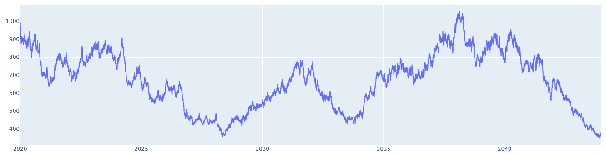
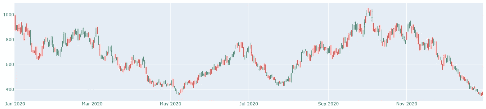
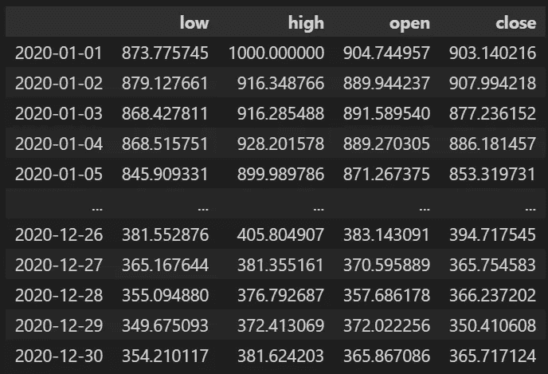
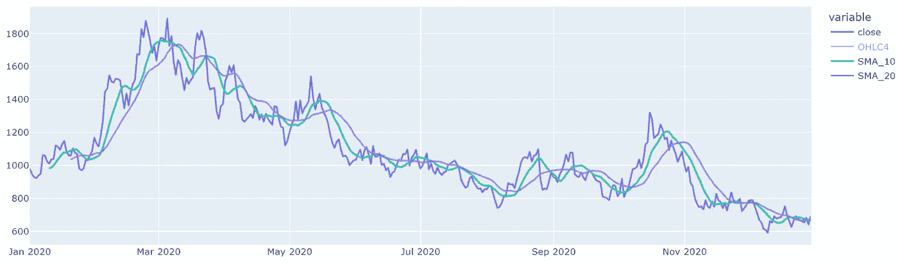
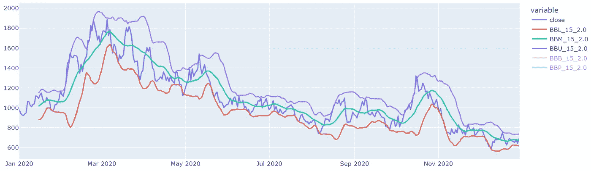

# python 技术分析:熊猫快速入门指南 _ta

> 原文：<https://pub.towardsai.net/technical-analysis-with-python-quickstart-guide-for-pandas-ta-fe4b152e95a2?source=collection_archive---------1----------------------->

## [数据分析](https://towardsai.net/p/category/data-analysis)

## 用熊猫 _ta 做技术分析。完整的代码[可在我的回购](https://github.com/arditoibryan/Projects/blob/master/20211106_pandas_ta/pandas_ta.ipynb)。

互联网上最简单、最强大的技术库之一叫做 pandas_ta。这个 python 库为您提供了一个简化的 API，允许您从时间序列中提取技术分析指标。

虽然您可能会将这些函数应用于股票价格，但您可以将任何时间序列与股票价格配对，例如情绪甚至经济指标。


TradersDNA 发布的照片

## 为什么要用熊猫 _ta？

与竞争对手的库相比，pandas_ta:

*   更易于使用

有几种方法可以从股票价格中提取技术分析指标，其中一种方法是自己编码。如果你只需要使用像移动平均线这样的简单指标，这种方法不会给你带来太多的麻烦，但是当你可能需要使用更复杂的数学模型时，你可能想要使用预制的库:这就是 API 的用途，它们提供了一个简化的高级接口，调节了低级代码的复杂性。

*   易于安装
*   使用熊猫数据框架

当存储股票信息时，我能想到的第一个方法是使用熊猫数据框架。这种方法在 python 用户中非常普遍，pandas_ta 将使事情变得更容易。因为 pandas 库仅限于 Python，所以还有其他存储多维数据(如股票价格)的常见方法，例如使用 JSON 文件。

*   在编码人员中很常见

当一个开发人员社区使用一个产品或库时，社区建议的持续反馈和改进会使产品变得更强大。它也帮助初学者寻找像这样的快速入门指南。当没有人决定撰写或发布关于一个库的代码时，从例子中学习如何使用它是不可能的，除非库指令是透明的，而这通常不是这样。

*   仍在开发中

pandas_ta 的另一个优势是它的开发者和它的社区仍然在更新软件和进行升级，使这个库日益强大。

## 安装熊猫 _ta

与安装起来有些困难的许多其他库相比，这个库既容易安装，又可以作为最流行的 python 电子表格管理系统 pandas 的扩展。

```
pip install pandas_ta
```

## 下载股票价格

用技术分析库做实验的美妙之处，首先是不断地在新股票上做实验。下载股票价格总是具有挑战性，因为对它们有巨大的需求。因此，没有供应商会免费或不经注册就给你股票价格。个人建议 alpha vantage ( [文章带说明此处](/stock-downloader-api-a9e95c913363)，API 免费使用)。

然而，如果你的目标不是直接在市场上实验，而是对你的算法进行回溯测试，你可以使用一个程序性股票生成器(我把它开源，并在本文中描述了[)，或者更好的是一个 OCHL 股票生成器(](/random-stock-generator-monte-carlo-simulations-in-finance-b9951a174271)[链接此处](/procedural-ochl-stock-generator-54ce041931be))。

请注意，pandas_ta 要求数据以特定的格式组织:

*   日期必须采用 pandas.datetime 格式
*   这些列必须采用 OCHL 格式

OCHL 指的是金融中存储价格的一些常用指标:开盘、收盘、盘高和盘低。不同的技术分析指标可能只需要这些列中的一列或多列，所以拥有全部四列将允许我们模拟库中大多数可用的指标。

# 运行算法

## 生成程序库存

在我们的例子中，我已经在一个笔记本中准备了一组函数，它们将生成一个用于实验目的的过程化 OCHL 库存。

```
df_OCHL = simulate_OCHL_stock(simulate_stock(1000, 0, 0.01, 0, 365), graph_timeseries=True, graph_OCHL=True)
```

正如我们所看到的，每当我运行该算法，一个新的时间序列就会产生 4 个维度，每个维度代表股票的一个 OCHL 数据。默认情况下，该股票只工作 365 天(毕竟是为了测试)。让我们看看生成的数据。

通过使用嵌入的布尔参数 **graph_timeseries** 和 **graph_OCHL** ，我们可以很容易地将数据图形化。



收盘股票价格生成数据



OCHL 生成的数据

如果我们看一下数据帧，这就是生成的数据的样子。注意，这种格式正是 pandas_ta 所要求的数据模式。



有开盘、收盘、高、低柱的股票

## 创建备份

如果你不熟悉熊猫是如何工作的，我们不能简单地将一个数据帧分配给第二个变量来复制它。我们需要使用复制功能来克隆原始数据帧。

```
df_backup = df_OCHL.copy()
```

我制作数据副本的原因是，pandas_ta 将直接编辑我们正在应用技术分析策略的数据集。它不像常规函数那样工作，在常规函数中，我们可以输入数据帧并接收副本作为输出。

如果我们对过程模式的外观感到满意，我们可能不希望每次运行算法时都创建一个全新的股票价格。这样，我们就可以安全地开始试验备份副本了。

## 应用熊猫 _ta 策略:SMA

最流行的技术分析策略叫做简单移动平均线。该技术包括创建两条不同长度的均线，并用交叉点作为买卖信号。

```
#import backup
df = df_backup.copy()MyStrategy = ta.Strategy(
    name="DCSMA10",
    ta=[
        {"kind": "ohlc4"},
        {"kind": "sma", "length": 10},
        {"kind": "sma", "length": 20},
    ]
)# (2) Run the Strategy
df.ta.strategy(MyStrategy)
df = df.drop(['low', 'high', 'open'], axis=1)
graph_stock(df)
```

应用该策略后，我们可以看到新列是如何添加到原始数据集中的。



两个不同长度的简单移动平均线

## 布林线

当然，我们也可以采用更复杂的技术，如布林线:这种策略包括当价格低于较低波段时买入股票，当价格高于较高波段时卖出股票。

假设是当趋势的导数(即瞬时变化率)已经达到根据我们的参数的最大容差，并且是股票反转其趋势的适当时间。

```
#import backup
df = df_backup.copy()MyStrategy = ta.Strategy(
    name="strategy_3",
    ta=[{
        "close": 'close', 
        "kind": "bbands", 
        "length": 15,
        "std": 2
    }]
)# (2) Run the Strategy
df.ta.strategy(MyStrategy)
df = df.drop(['low', 'high', 'open'], axis=1)
graph_stock(df)
```



标准偏差为 2 的布林线

# 结论

熊猫 _ta，尤其是设置后，非常简单和直观的使用，并有 80 多个可用的指标，你可以简单地调用字符串。