# 自我关注生成对抗网络中的技术

> 原文：<https://pub.towardsai.net/techniques-in-self-attention-generative-adversarial-networks-22f735b22dfb?source=collection_archive---------0----------------------->

## 自我关注甘(SAGAN) | [对艾](https://towardsai.net/)

## 关于 SAGAN 的不同方法的讨论，如光谱归一化、条件批量归一化等。

经过 12 万次迭代后，我在 celebA 数据集上对 SAGAN 的[实现生成的图像](https://github.com/xlnwel/cv/tree/master/algo/sagan)

## 介绍

张寒等人在 PMLR 2019 年提出的自我注意生成对抗网络(SAGAN)结构，经实验证明，在图像合成方面明显优于现有的工作。在本文中，我们讨论了 SAGAN 中涉及到的几种技术，包括自注意、谱归一化、条件批量归一化、投影鉴别器等。

**奖励**:我们会给每个关键组件一个简单的示例代码，但是你应该知道这里提供的代码只是为了说明的目的而简化的。整个实现，你可以参考 GitHub 上[我的萨根回购](https://github.com/xlnwel/cv/tree/master/algo/sagan)，或者来自 Google Brain 的[官方实现。](https://github.com/brain-research/self-attention-gan)

## 自我关注

**动机**

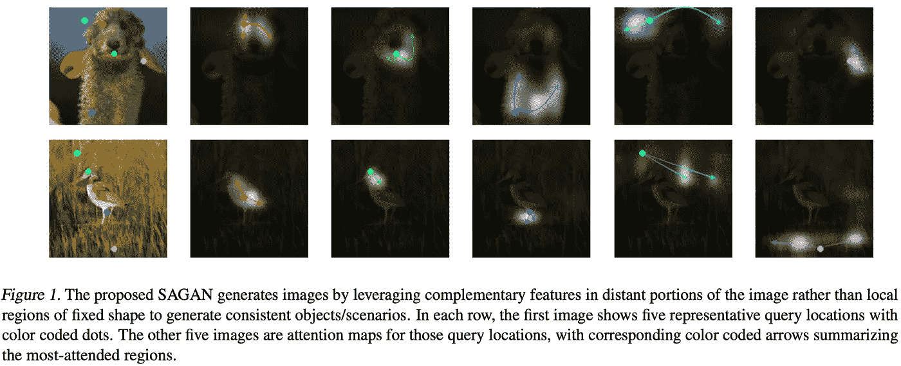

来源:自我关注生成对抗网络。

GANs 在结构纹理建模方面取得了成功，但它们往往无法捕捉到在某些类别中持续出现的几何或结构模式。例如，合成的狗通常绘制有逼真的毛发纹理，但没有明确定义的单独的脚。对此的一种解释是，卷积层擅长捕捉局部结构，但在发现长程相关性方面有困难:1)。尽管深度 ConvNets 在理论上能够捕捉长期依赖性，但优化算法很难找到仔细协调多个层以捕捉这些依赖性的参数值，并且这些参数在统计上可能是脆弱的，并且在应用于以前未见过的数据时容易失败。2).大的卷积核增加了表示能力，但是计算效率更低。

另一方面，自我关注在模拟长期依赖性的能力和计算及统计效率之间表现出更好的平衡。基于这些想法，张寒等人建议萨根斯在卷积高斯模型中引入自我注意机制。

**对图像的自我关注**

我们已经在[之前的文章](https://medium.com/towards-artificial-intelligence/attention-is-all-you-need-transformer-4c34aa78308f?source=friends_link&sk=a259e84597d542f812a155711e9c8e97)中讨论了自我注意机制，它被应用于 3D 序列数据以捕捉时间依赖性。为了将自我关注应用到图像中，张寒等人建议进行三大修改:

1.  用 1 乘 1 卷积层替换全连接层。
2.  在计算注意力之前，将 4D 张量整形为 3D 张量(合并高度和宽度),之后再将它们整形回来。
3.  将注意力图层的输出乘以比例参数，然后添加回输入要素地图:

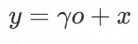

*   其中 *o* 是注意力层的输出，而 *γ* 是可学习的标量，它被初始化为 0。引入可学习的 *γ* 允许网络首先依赖本地邻域中的线索——因为这更容易——然后逐渐学习给非本地证据分配更多权重。我们这样做的原因很简单:我们想先学习简单的任务，然后逐步增加任务的复杂性。[1]

**Python 代码**

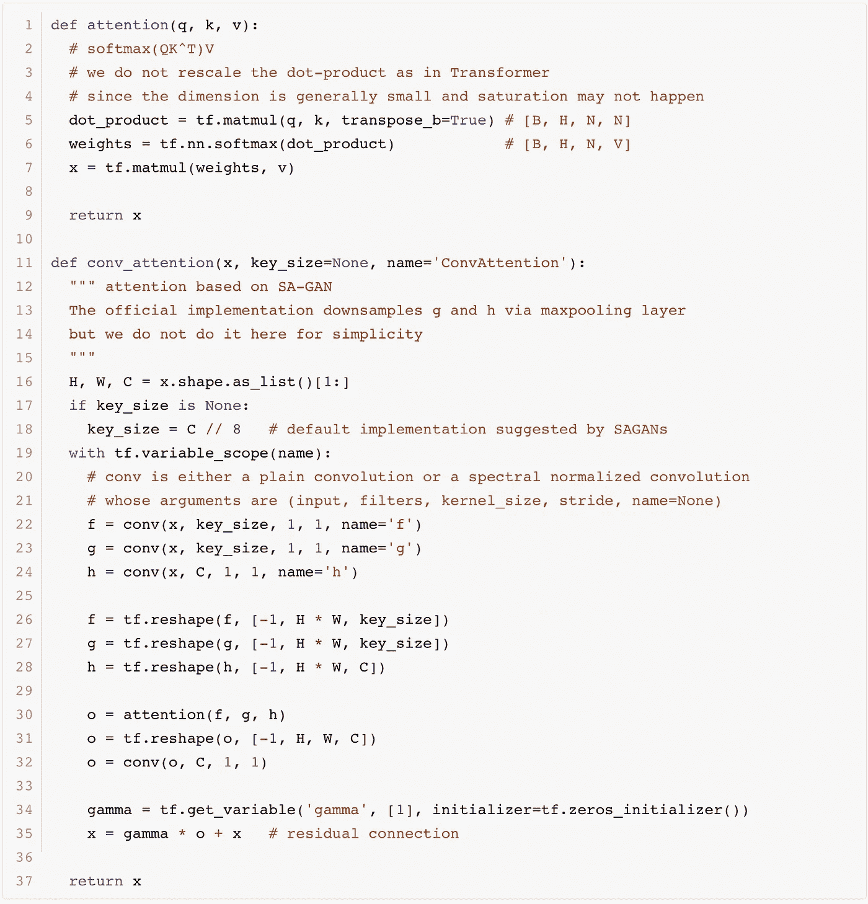

用 4D 张量实现自我关注的 Python 代码

## 光谱归一化

**动机**

在讨论频谱归一化的细节之前，我们先简要介绍一些基本概念，以确保我们在同一页上。

1.  函数的平坦局部最小值对输入扰动不太敏感。
2.  Hessian 矩阵描述了多变量函数[在局部最小值](https://math.stackexchange.com/a/492420/401382)处的局部曲率；它测量一个函数在局部最小值时对其输入的敏感度。
3.  实矩阵的谱范数等于其最大奇异值。具体地，对于对称实矩阵(例如，Hessian 矩阵)，其谱范数是其最大特征值。关于谱范数和 K-Lipschitz 连续函数的相应概念的更详细讨论，请参考[ [6](https://christiancosgrove.com/blog/2018/01/04/spectral-normalization-explained.html) ]。

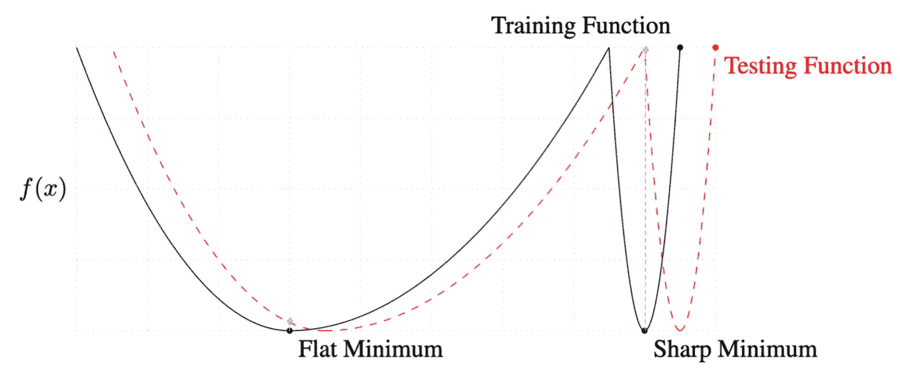

黑色曲线上平坦的局部最小值被投影到测试函数(红色虚线曲线)的局部最小值附近的某处(蓝色菱形)，而尖锐的局部最小值投影偏离测试函数的局部最小值。来源:关于深度学习的大批量训练:泛化差距和尖锐极小值

在[3]中，Yuichi Yoshida 等人强调，损失函数的平坦局部最小值比尖锐局部最小值概括得更好(根据(1))，并且他们将平坦性公式化为损失函数的 Hessian 矩阵的特征值(根据(2))。遵循这一思想，他们证明，在某些约束下，为了实现平坦的局部最小值，在每一层限制权重矩阵的谱范数是足够的(部分地根据(3))。因此，他们建议像 L2 正则化一样正则化损失函数中每个权重矩阵的谱范数。

基于 Y. Yoshida 的工作，Takeru Miyato 等人在[2]中开发了频谱归一化，它明确地归一化每一层中权重矩阵的频谱范数，使得它满足 Lipschitz 约束 *σ(W)=1* :

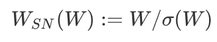

其中 *σ(W)=1* 是 *W* 的谱范数，一个常数。我们可以通过展示来验证它的谱范数

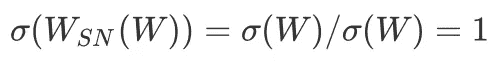

Takeru Miyato 等人进一步证明，谱归一化使 *W* 的梯度规则化，防止 *W* 的列空间向一个特定方向集中。这阻止了每层的转换在一个方向上变得敏感。

**如何计算谱范数？**

假设 *W* 的形状为 *(N，M)* 并且我们有一个随机初始化的向量 *u.* 幂迭代法计算 *W* 的谱范数如下

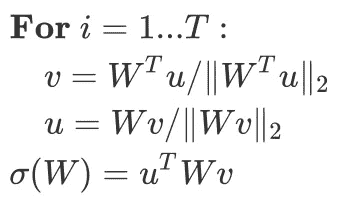

其中 *u* 和 *v* 近似为 *W* 的第一个左右奇异向量。实际上， *T=1* 就足够了，因为我们也会逐渐更新 *W* 。

**Python 代码**

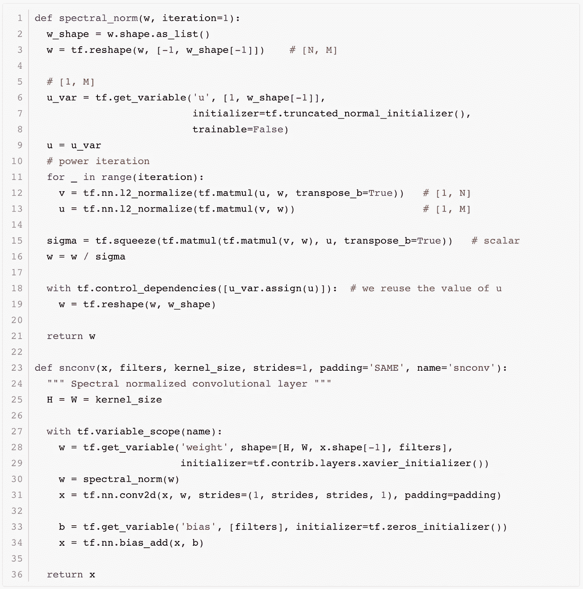

**条件批量规范化**

条件批处理规范化首先由 Harm de Vries、Florian Strub 等人提出[4]。中心思想是将批规范化的 *γ* 和 *β* 条件化在某个 *x* (例如语言嵌入)上，这是通过将 *f(x)* 和 *h(x)* 分别添加到 *γ* 和 *β* 上来完成的。这里， *f* 和 *h* 可以是任何函数(例如一个隐藏层 MLP)。这样，他们可以用最小的开销将一些附加信息合并到预先训练的网络中。

通过将类标签集成到生成器和鉴别器中，可以将 SAGAN 实现为条件 gan(cgan)的一种形式。在生成器中，这是通过有条件的批量标准化层来实现的，其中我们给每个标签一个特定的 gamma 和 beta。在鉴别器中，这是通过投影来完成的，我们将在下一节很快看到这种方法。在这里，我们提供了[7]中的条件批处理规范化的代码和一些注释。

**Python 代码**

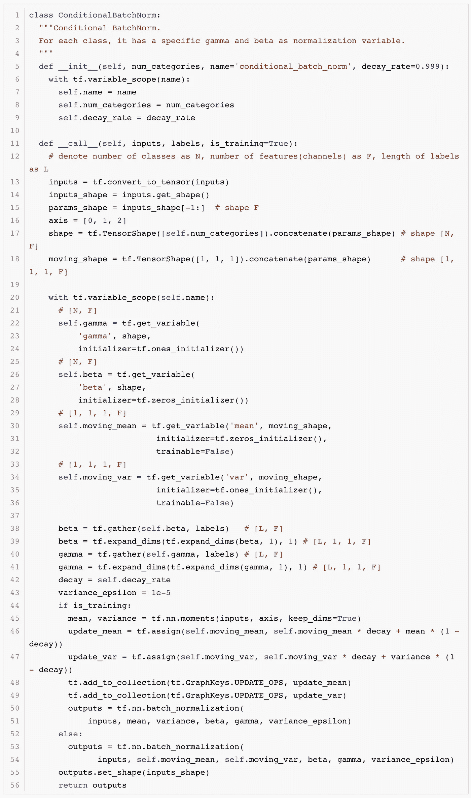

**投影鉴别器**

在[5]中，Takeru Miyato 提出将类别标签纳入鉴别器。为了了解其工作原理，我们将条件鉴别器表示为 *D(x，y)=σ(f(x，y))* ，其中 *f(x，y)* 是 *x* 和 *y* 的函数。我们首先通过将 *D* 的导数设置为零来导出最佳鉴别器

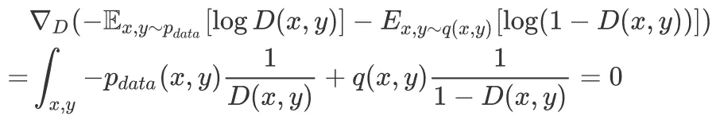

求解这个方程，我们得到了最佳鉴别器

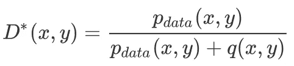

通过用 *σ(f(x，y))* 替换鉴别器，我们得到

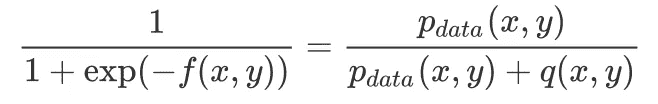

这给了我们逻辑

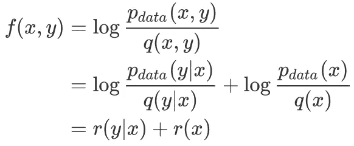

现在我们仔细看看 *p(y|x)* ，这是一个分类分布，通常表示为 softmax 函数。其对数线性模型为

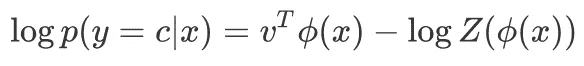

其中*z(ϕ(x)*是配分函数。因此，对数似然比将采用以下形式:

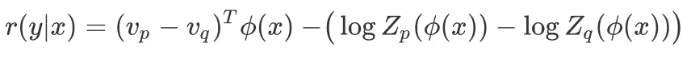

现在，如果我们把 *v=v_p-v_q* ，把归一化常数和 *r(x)* 一起放入一个表达式*ψ(ϕ(x)】*，我们可以把 *f(x，y)* 改写为

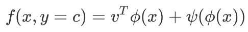

如果我们使用 *y* 来表示标签的独热向量，并使用 *V* 来表示由行向量 *v* 组成的嵌入矩阵，我们可以通过以下方式重写上述模型

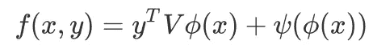

该配方通过内部产品引入标签信息，如下图所示。

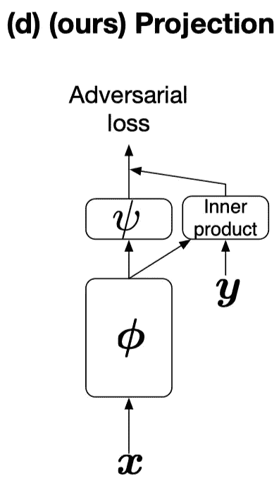

投影鉴别器。来源:带投影鉴别器的 cGANs

**Python 代码**

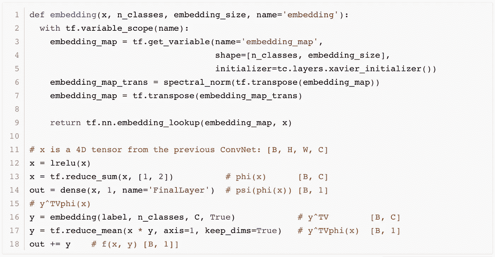

**杂记**

在这一节中，我们将简要介绍萨根斯采用的其他几种技术

*   SAGANs 使用铰链损失作为对抗性损失，其定义为

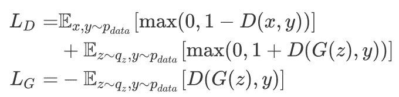

*   SAGANs 对生成器和鉴别器使用不同的学习速率，这就是所谓的双时标更新规则(TTUR)。对于 ImageNet，他们对鉴别器使用 0.0004，对生成器使用 0.0001。在我的实现中，对于 celebA 数据集，我使用 0.0001 作为鉴别器，0.00005 作为生成器。

# 结束

希望这篇文章能帮助你对萨根有所了解。如果你碰到一些错误或不清楚的地方，欢迎发表评论。

# 参考

1.  张寒等。自我注意生成敌对网络。在 2019 年的 ICML。
2.  生成对抗网络的谱归一化。在 2018 年的 ICLR
3.  Yuichi Yoshida 等人.谱范数正则化用于提高深度学习的可推广性
4.  通过语言调节早期视觉处理
5.  宫藤忠俊，小山正德。带投影鉴别器的 cGANs
6.  [萨根的官方代号](https://github.com/brain-research/self-attention-gan)
7.  克里斯蒂安·科斯格罗维对谱范数的详细讨论