# 技术游戏规则改变者——航空电子物联网(IOAT)像火一样吞噬了航空业

> 原文：<https://pub.towardsai.net/technological-game-changer-internet-of-avionics-things-ioat-has-engulfed-aviation-like-fire-4f36e4b5be82?source=collection_archive---------3----------------------->

## [IoT](https://towardsai.net/p/category/iot)

利用 IOT 无穷无尽的令人兴奋的可能性。
能力要深入得多，天空不是极限。
所以，让我们乘着这一变革的浪潮

# 介绍

物联网(IoT)是一个流行词，现在已经涵盖了我们生活的方方面面。它是一种伞状技术，正逐步覆盖任何物理领域。它已经从汽车、机器人、消费电子、医疗保健、工业自动化、物流、能源、零售、运动和健身、可穿戴设备、电信、家庭自动化、保险、银行、建筑、酒店、农业、国家安全等等领域延伸开来。这份清单绝非详尽无遗。物联网潜力巨大。在这场革命中，航空航天工业也没有落后。

航空航天行业的物联网(IoT)发展迅猛。它从发动机开始，现在已经在很大程度上包含了航空电子系统。这一发展的关键因素是嵌入飞机每个系统的无数传感器，这些传感器产生大量实时处理的数据。作为一个新创造的术语，物联网(IOAT)已经渗透到航空航天工业的各个领域。随着互联设备的增加、更好的飞机数据网络和更高的带宽，飞机连接性大大提高了。爆炸是如此巨大，以至于它有能力把黑匣子变成一个简单的备份设备。该行业的各个领域现在都希望保持全天候连接，因此由连接、数据分析和物联网(IoT)驱动的新一代飞机正在达到堪称典范的水平。

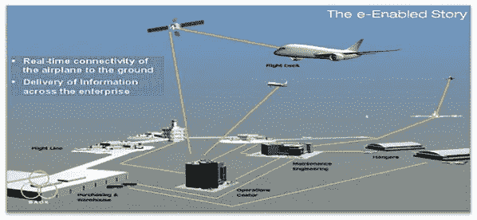

实时飞机连接(【http://articles.sae.org/11572/】来源—)

# 航空航天行业的物联网应用

# 飞机发动机中的物联网

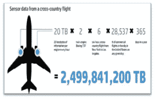

波音 737 每年生成的传感器数据(来源—[http://www . Forbes . com/sites/sap/2015/02/19/how-big-Data-keep-planes-in-the-air/# 3066 d28d 43 e 3)](http://www.forbes.com/sites/sap/2015/02/19/how-big-data-keeps-planes-in-the-air/#3066d28d43e3))

发动机传感器在飞行中生成的信息不仅用于优化喷气燃料消耗和燃料燃烧，从而提高发动机效率，还用于改善发动机噪音和排放性能，调整推力水平，直接记录发动机循环和飞行时间，调整飞机飞行方式，在早期阶段管理和维修飞机发动机，并在小故障变成大故障之前进行检测。它们还在飞行的所有阶段生成连续的操作性能数据，通过检测趋势和异常来优化发动机的性能，从而减少计划外的发动机拆卸。这改善了飞机的整体健康状况，并且从长远来看降低了维护成本。GTF(齿轮传动涡轮风扇)发动机的油耗已经降低了 10%到 15%。

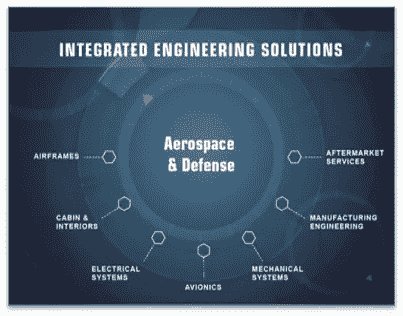

跨航空航天领域的应用

发动机预测分析是未来创新的重要驱动力。燃油性能的提高将为航空公司每架飞机每年节省 75，000 至 100，000 美元。起飞时对一个引擎征税，已经为其中一家航空公司的每次飞行节省了 60 公斤燃料，许多航空公司也在走同样的路。可以说，这些飞机物联网解决方案将为发动机制造商和原始设备制造商带来额外的业务和增加的收入。

**未来工厂中的物联网**

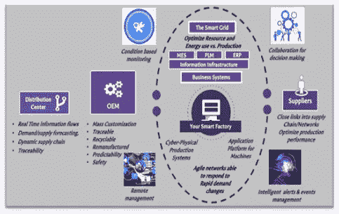

行动中的未来工厂

通过物联网和数据分析(工业自动化)的应用，航空航天领域的工厂效率预计将提高 40%以上，他们称之为“未来工厂”。物联网不仅应用于产品，还应用于工人在制造过程中用来拧紧成千上万个螺栓的工具。通过将人和这些工具连接到物联网平台，制造业实现了优化。其中一个用例是:工厂车间的一名工人使用平板电脑或智能眼镜扫描飞机的金属机身，并确定给定孔中需要多大尺寸的螺栓，以及安装它所需的扭矩。这些信息被立即发送到机器人工具，机器人工具完成任务。

这种方法有助于整合飞机组装中的数千个步骤，从而优化价值链。这就是所谓的“*信息物理系统方法*”一架飞机平均仅使用多达 40 万个螺栓和螺钉以及 1100 多种不同的工具。通过连接这些工具，该过程不仅高效且有效，而且比手动拧紧螺栓更加可靠和坚固。事实证明，物联网将重新定义制造流程。它将改变全球竞争力，增加设计、制造和服务的搭配。

# 航空电子系统中的物联网

航空电子系统将数据和信息实时传输给地面维护团队。该系统能够通知供应商需要更换的零件，并向维护人员发出警报，最大限度地减少因在正确位置没有正确零件而导致的飞机停机时间。此外，他们能够更新仪表盘以显示航班信息，决定优化的航线，即时做出决策，支持对飞行计划和空速进行微小的更改以减少飞行时间，根据飞行时间和不同的尾号进行预测，并避免任何此类错误。

他们可以智能地检测相关硬件、软件或系统中的异常情况，以防止事故发生，对飞机和部件运行进行预测评估，以生成定制的维护程序，从而为客户创造价值，不仅减少维护时间，还为预测性维护推荐任务序列的最佳重新安排，查看飞机系统在一段时间内的健康状况，并使用其逐渐恶化来预测潜在的风险场景，并实际上多次防止风险。

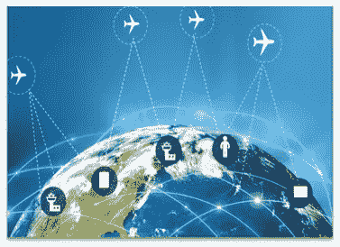

互联飞机(来源——blogs.ramco.com/tag/aviation-it)

例如，像梦想飞机这样的新机型预先设计了支持 IP 的航空电子系统，可以将飞行条件和飞行中观察到的差异的实时数据传输到驾驶舱和地面操作中心。在飞机还在空中时做好所有这些准备工作，将有助于航空公司极大地减少飞机被放置在 AOG(地面)的机会，从而有助于降低维护成本并让乘客满意。通过这种方式，航空公司将不必按照“一直飞到坏掉”的理念来驾驶任何飞机。从长远来看，防止飞机在“非正常但安全”的模式下运行将为航空公司节省更多成本(避免 AOG 情况)。物联网有望产生广泛的影响。

**航空领域的物联网**

机场也在投资物联网。伦敦城市机场(London City Airport)是早期采用者，它继续实施计划，通过使用机器之间的数据传输来改善乘客体验，以减少行李丢失和航班延误，分析机场的乘客流量模式，以估计飞机起飞前的停机时间，跟踪运输中的宠物，以及设备监控，甚至减少安检线的排队人数。正在使用的人员识别软件帮助机场识别乘客的位置，并在造成不便之前防止排队。在航空领域，它的作用包括减少旅行时间，提高安全性和乘客舒适度。例如，能够通过智能手机、平板电脑或笔记本电脑上的应用程序跟踪您的包，甚至跟踪您位置的包。

如果包能感应到你并进入行李区，选择离你最近的传送带并进入那个传送带，那该多好啊。现在完全不是想象了。基于许可的传感将被大规模部署。航空公司将能够就何时打开和关闭登机口做出明智的决定。想象一下登机口在显示屏上显示你:‘我看到你已经着陆了。到您的转机登机口似乎需要大约六分钟的步行时间。大门将在 10 分钟后关闭。所有设备，包括电梯、行李传送带、售货亭、行李投递点和登机口，都将配备传感器。工作人员和乘客将被连接。行李手推车和轮椅等设备也将在机场连接。甚至用于运送乘客、行李的公共汽车，频繁移动的停车场等都将嵌入传感器。在飞机内，传感器将用于测量机舱温度、空调、空气质量和光强度水平，并跟踪餐饮和免税手推车。

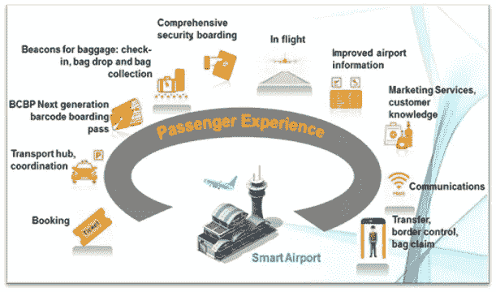

航空旅客体验(来源—[http://msairportassociation . com/newsletter/q 42015/smart . html)](http://msairportsassociation.com/newsletter/Q42015/smart.html))

大约一半的航空公司使用所有这些，对于乘客来说，这肯定会转化为一个更好的消息灵通的旅程和最大限度的舒适，减少焦虑。

**物联网在监测空气湍流**

气象公司正在从商务飞机上的无数传感器收集大量实时数据，同时测量和分析这些数据，以监测空气湍流。这无疑有助于提高乘客安全。TWC 的湍流检测算法——被称为湍流自动 PIREP(飞行员报告)系统(或 TAPS ),正在被加载到超过 6800 架商务飞机的机载通信服务器上。每个服务器都能够访问飞机的传感器和其他所需的航空电子设备输入。这使得湍流自动 PIREP 系统能够测量、计算和分析湍流强度的处理数据。处理后的数据通过 Gogo 的空对地和全球卫星通信网络实时提供给飞行员和地面控制人员。

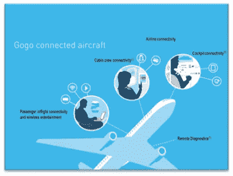

Gogo 连接(来源——[)https://www . sec . gov/Archives/Edgar/data/1537054/000119312514436134/d 834182 dex 991 . htm)](https://www.sec.gov/Archives/edgar/data/1537054/000119312514436134/d834182dex991.htm))

所有这些都将非常有利，因为实时收集的数据可用于跟踪湍流和整体天气预报。同样的数据可以提供给航空气象学家，用于在全球范围内发出与天气相关的风险警报。这将为穿越不同地区(可能是更敏感和受影响的地区/区域)的所有航班提供指导，并根据 TWC 的要求改善航空公司和乘客的安全。

**飞机连接和娱乐中的物联网**

卫星导航系统比目前的雷达和无线电导航系统精确得多。这将支持航空公司更精确地获得关于航班到达/离开及其位置的信息。目前，许多航空公司已经开始让乘客能够在全球范围内的飞行中轻松浏览互联网并进行视频会议。乘客可以通过他们的笔记本电脑、智能手机或平板电脑登录，然后访问各种程序。

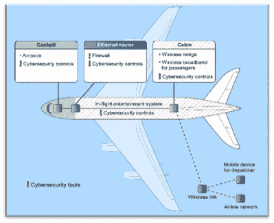

机上娱乐系统连接(来源—[https://security ledger . com/2015/04/Gao-warns-of-cyber-risks-in-flight/)](https://securityledger.com/2015/04/gao-warns-of-cyber-risks-in-flight/))

有人建议，对于这些设备，飞机可以在旅行前提供一个免费的应用程序，并在乘客登机后激活该程序。那些没有平板电脑或智能手机的人可以从航空公司租借设备。此外，可以添加其他选项，如网络游戏等。他们可以一起在网络上聊天和玩游戏。

其他服务，如转机航班信息、菜单选择、机组人员的饮料订单或机上商店的订单都很容易安装。75%的航空公司计划到 2019 年向乘客设备直接提供互联网接入和多媒体文件流。

**物联网在飞机乘客便利方面**

如今，随着来自机场系统的实时数据与谷歌地图结合在一起，乘客可以获得个性化的指示和更新。这些信息不仅包括他们的预订详细信息、航班时间、位置等，还包括实时提醒办理登机手续、出发/到达航站楼、登机口位置、行李托运点方向以及行李认领的行李带位置。乘客通过短信和电子邮件被直接通知到他们的手机上。通过将信标嵌入行李、行李车和卡车、行李标签等，运营和客户服务得到了显著改善。用于一些机场的行李管理。为了支持客户基于他们在机场的位置的导航和其他个性化服务，蓝牙低能耗(BLE)信标已经部署在测试模式中。其中一家航空公司最近开始借助信标跟踪和监控设备状况，例如救生衣和工具箱。这降低了对它们进行物理检查的成本。

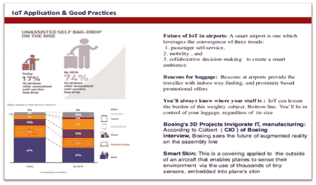

**IOT 在机场(来源—**[**http://www . slide share . net/ashutosh . p/IoT-in-aircraft-manufacturing tech-m**](http://www.slideshare.net/ashutosh.p/iot-in-aircraft-manufacturingtech-m)**)**

有几种显示器，可穿戴设备如手表、眼镜和手机等。可配备传感器，帮助乘客导航，并在地面上获得所有这些服务的警报。同样的情况也可以发生在空中，智能客舱在座位上安装了传感器，可以监控乘客的疲劳和水合程度，自动调整机舱气氛或提醒机组人员提供所需的款待。最近在一些国内航班上，推出了 GPS 跟踪服务。这监测宠物在运输过程中所经历的湿度和温度条件以及它们的位置。

**物联网:航天运营和商业模式的新愿景**

如果飞机不在空中，它就赔钱。一个例子是“空中客车中国”，它估计一架停飞的 A380 空中客车的每日成本为 125 万美元。航空公司一直面临着降低成本和增加收入的压力。因此，飞机上的物联网在防止“飞机着陆”(AOG)事件和确保飞机最大限度地飞向天空方面发挥着重要作用。AOG 事件代价高昂，会导致运营严重中断，导致飞机长时间停飞。

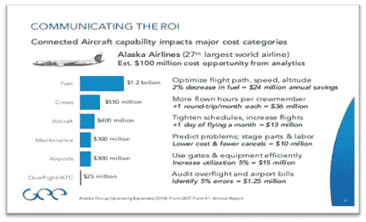

阿拉斯加航空公司阿拉斯加集团运营费用投资回报率(2014 年)，来自 DOT 表格 41，年度报告

阿拉斯加集团运营费用(2014 年)，来自 DOT 表格 41，年度报告

因此，为了最大化正常运行时间和投资回报率，航空公司和原始设备制造商找到将 AOG 事件保持在最低水平的解决方案至关重要。

物联网是航空航天行业的一场革命，它正在改变该行业的每个部分，从飞机制造和组装到维护和其他飞行安全领域。在构建或改进成功的物联网战略时，需要考虑以下四个首要任务:

1 互联工厂

2 连接的飞机

3 有联系的人

4 连接的供应链

**物联网:前景和潜力**

由于现有的连通性，客机的优势正在迅速变化，特别是在商务航空领域，很快它将实现空中办公室的体验。除了“驾驶舱”或“控制室”之外，我们已经在许多地方实时管理飞机，距离客机无人驾驶的日子不远了。在未来几年，航空公司将最大限度地利用物联网、数据分析和相关方法来扩展其商业模式，并使其达到新的高度。焦点显然是飞机健康监控方面，而乘客体验方面也不会被忽视。基本上，对于在海洋环境中飞行的航空公司来说，连接是一个主要挑战，他们可以从这种实时数据中受益，这种实时数据可以提供几乎准确的飞机位置数据和坐标(纬度和经度)。

航空航天行业越来越试图将联网飞机定位为天空中的一个节点。因此，这一天已经不远了:

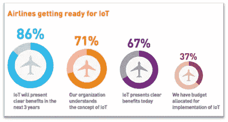

IOT 航空公司的准备情况(来源—[http://pioneeringooh . com/Airlines-look-to-beacons-to-improve-their ' s-internet of things-infra structure/)](http://pioneeringooh.com/airlines-look-to-beacons-to-improve-their-internet-of-things-infrastructure/))

每架连接的飞机都将成为天空中的一个活跃节点，以当前系统无法做到的速度与其他飞机、地面操作团队和空中交通管制员共享数据。

不久的将来，飞机上的连接将相当于我们在家里使用的东西。未来，每架飞机都将相互连接。不仅地面团队能够清楚地看到飞机上每个部件的运行情况，而且机组人员也能够分享来自其他飞机的信息。这将提高安全性和效率，降低运营成本。

## **结论**

总之，航空领域的物联网代表着巨大的收入潜力，行业正准备将其最大化。一家领先的飞机发动机原始设备制造商最近的一项研究估计，如果物联网能够增加 1-2%的燃油节省和维护，那么它可以在未来 15- 20 年内为航空公司节省 300 多亿美元。仅发动机维护就占每年 600 亿美元维护费用的 43%。这可以被驯服为最大的收入机会和增长。三分之二的受访者认为物联网目前为他们的航空公司带来了好处。86%的人认为物联网将在未来几年产生效益。37%的航空公司已经为物联网实施分配了预算。未来几年，58%的人计划投资试点项目，16%的人准备投资重大项目。这无疑将有助于航空航天业在未来十年及以后的稳定市场份额和可持续发展。