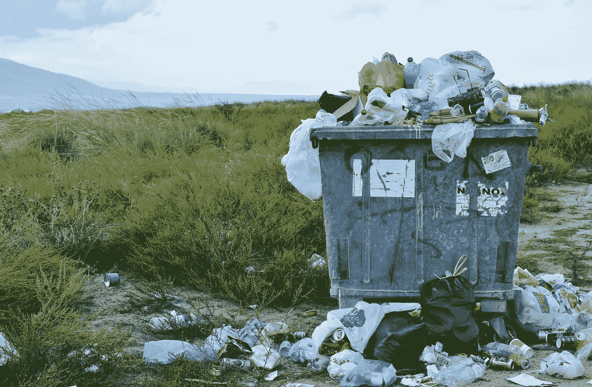
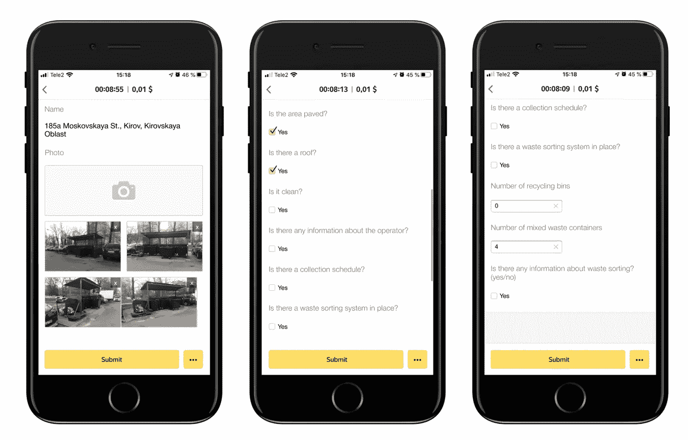
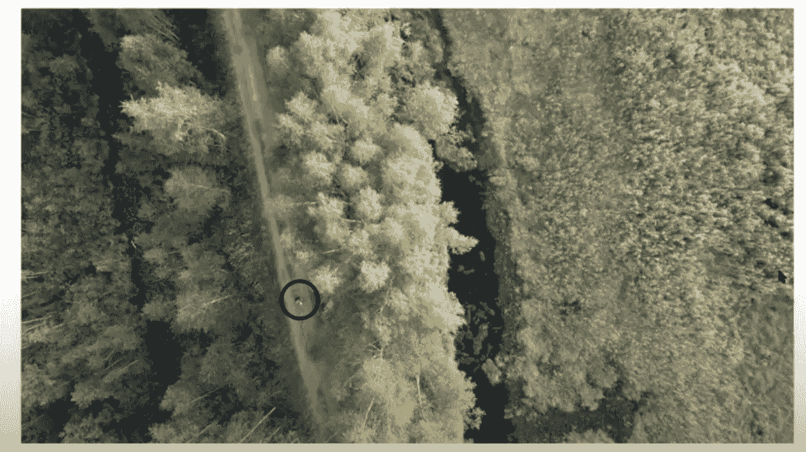

# 通过众包产生社会影响

> 原文：<https://pub.towardsai.net/technology-6e344eabaf51?source=collection_archive---------2----------------------->

## [技术](https://towardsai.net/p/category/technology)

## **tolo ka 等众包平台最初是为人工智能模型设计的，如何用于社会公益**

图片由来自 [Pixabay](https://pixabay.com/?utm_source=link-attribution&utm_medium=referral&utm_campaign=image&utm_content=4529717) 的 [Bob Dmyt](https://pixabay.com/users/bob_dmyt-8820017/?utm_source=link-attribution&utm_medium=referral&utm_campaign=image&utm_content=4529717) 提供

**简介**

众包是一种流行的工具，用于收集不同行业中用于训练机器学习模型的数据，并具有这些项目的可扩展性和自动化的额外优势。它允许此类项目的可伸缩性和自动化，然而，它并不是唯一使用众包的领域。

我想重点谈谈众包和新兴技术如何有效应对当今的一些挑战并产生社会影响。

**环境保护**

[Toloka](https://toloka.ai/) ，最大的众包平台之一，用于环保项目。让我们看一个垃圾溢出问题的例子。不幸的是，在许多城市和公共户外区域，溢出的垃圾是一个常见的眼中钉。

来自 [Pixabay](https://pixabay.com/?utm_source=link-attribution&utm_medium=referral&utm_campaign=image&utm_content=2729608) 的 [RitaE](https://pixabay.com/users/ritae-19628/?utm_source=link-attribution&utm_medium=referral&utm_campaign=image&utm_content=2729608) 的图像

对于城市和市政会来说，检测垃圾箱何时需要清空通常是一个后勤挑战。结果，其中一些总是人满为患，而另一些却没有真正的需求。

在一些城市，这个问题已经通过 Toloka 和一个所谓的*‘空间众包’*或实地数据收集项目得到了解决。人群工作者被要求参观附近的垃圾场，提交它的照片，并回答一些关于周围环境的附加问题。作为补偿，他们会因为完成这项任务而获得一笔小额奖金。

罗曼·盖夫摄

Toloka 使用 GPS 监控来检测该人是否真的访问过该网站，然后将信息和照片发送给委员会，以报告垃圾网站的状态。

由于这个项目，已经检查了 2500 个不同的人口中心。目前，每月对大约 10，000 个垃圾站进行监测。研究结果有助于地方政府更有效地管理垃圾收集服务，以获得更清洁的公共空间。

**寻找失踪人员**

组织垃圾收集服务并不是众包可以用于社会公益的唯一地方。你知道全世界每年有成千上万的人失踪吗？

正如非营利组织 Liza Alert 的一项举措所示，众包可以成为扩大和协调搜索工作的有效工具，该组织搜索据报失踪的人。

让我们来看看这是如何工作的。你能在下面的照片里看到一个人吗？

你能在这张照片里看到一个人吗？—图像由 Roman Gaev 提供

如果你对这个问题的回答是肯定的，你就对了。照片里有一个人。

图像由 Roman Gaev 提供

那么这怎么能帮助 Liza 在寻找人的时候保持警惕呢？答案很简单。Liza Alert 使用无人机拍摄荒野地区的照片，然后发送航空图像进行分析。他们的内部志愿者团队处理数千张照片需要很长时间，所以他们使用 Toloka 来帮助他们扩大这些工作。一旦 Toloka 用户在照片中识别出一个人，问题就会升级，专家团队会决定他们是否需要派遣救援队。

Liza Alert 现在每月能够检查 25，000 张照片，速度惊人，每分钟 1500 张照片！这是不可能实现的使用内部志愿者为这个非营利组织工作。志愿者资源现在得到了更有效的利用，失踪人员也能更快地与亲人团聚。

**总结**

在本文中，您了解了 Toloka 这样的众包平台如何被用于推动能够产生社会影响的项目的不同用例。你能想出任何其他的使用案例吗？或者你可能已经将众包用于对我们的社会有积极影响的其他类型的项目。请在评论中分享。

如果你想了解更多关于这篇文章中提到的社会公益众包项目的细节，请观看罗曼·盖夫的这个[演讲](https://www.youtube.com/watch?v=cf8Guj9BVOo)。此外，你可以在这个数据赋能社区[中找到他和其他人分享他们的众包经验。](https://tolokacommunity.slack.com/join/shared_invite/zt-sxr745fr-dvfZffzvQTwNXOE0gEqysg#/shared-invite/email)

*PS:我正在 Medium 和***上撰写深入浅出地解释基本数据科学概念的文章。你可以订阅我的* [***邮件列表***](https://medium.com/subscribe/@konkiewicz.m) *每次我写新文章都会收到通知。如果你还不是中等会员，你可以在这里加入**[***。***](https://medium.com/@konkiewicz.m/membership)**

**下面还有一些你可能喜欢的帖子**

** [## 用户生成内容的审核渠道

### 欧洲科技巨头如何利用 Toloka 的人群来调节其内容

towardsdatascience.com](https://towardsdatascience.com/moderation-pipeline-for-user-generated-content-59e7f3c320e0)  [## Jupyter 笔记本中的 8 大魔法命令

### 通过学习最有用的命令来提高您的生产力

towardsdatascience.com](https://towardsdatascience.com/top-8-magic-commands-in-jupyter-notebook-c1582e813560)  [## 关于 jupyter 笔记本你不知道的 9 件事

### 用这些建议提高你的工作效率

towardsdatascience.com](https://towardsdatascience.com/9-things-you-did-not-know-about-jupyter-notebook-d0d995a8efb3)**