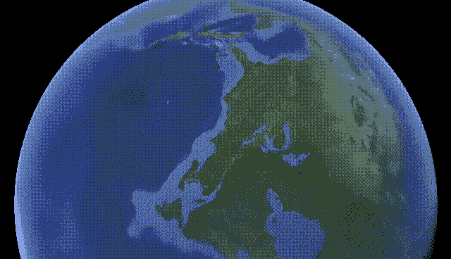
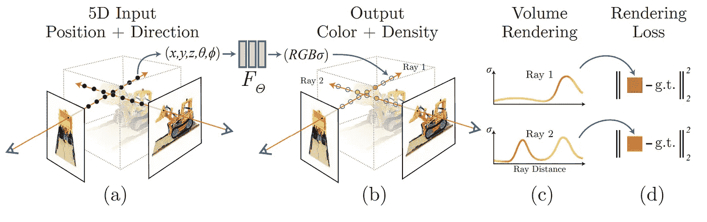
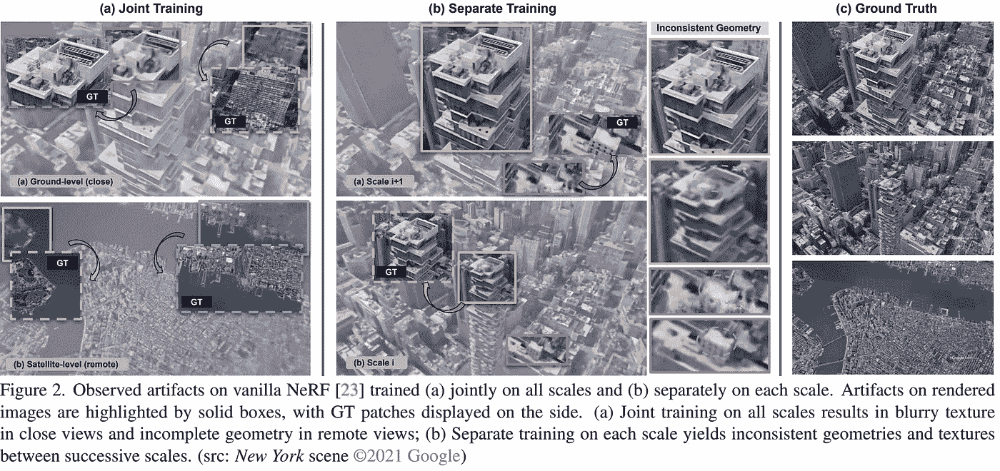
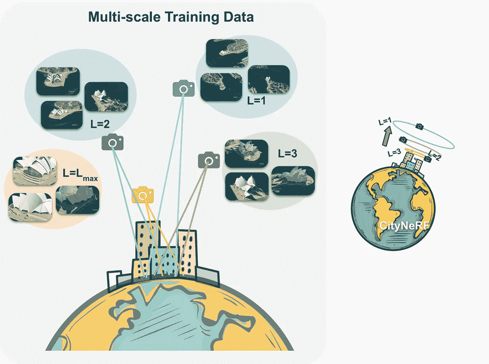
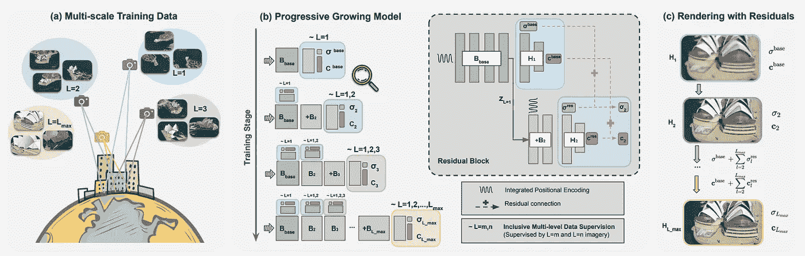
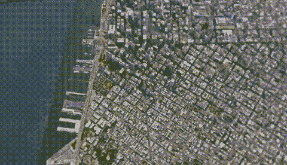

# CityNeRF:城市比例的 3D 渲染！

> 原文：<https://pub.towardsai.net/technology-fcb0fbfa9c00?source=collection_archive---------2----------------------->

## [技术](https://towardsai.net/p/category/technology)

## 以任何比例生成具有高质量细节的城市级 3D 场景！

> 原载于 [louisbouchard.ai](https://www.louisbouchard.ai/citynerf/) ，前两天在[我的博客](https://www.louisbouchard.ai/citynerf/)上看到的！

去年，我们看到 NeRF、NeRV 和其他网络能够使用人工智能从图像中创建 3D 模型和小场景。现在，我们正在迈出一小步，生成一个更复杂的模型:整个城市。是的，你没听错，本周的文章是关于在任何比例下生成具有高质量细节的城市级 3D 场景。它从卫星视角到地面，用一个模型就能工作。多神奇啊。！我们在一年内从一个看起来还可以的物体变成了整个城市！接下来是什么！？我都不敢想象。

地球尺度的曼哈顿。图片来自 [CityNeRF 的网站](https://city-super.github.io/citynerf/)。

这个模型被称为 CityNeRF，它是从 NeRF 发展而来的，我之前在我的频道中介绍过。NeRF 是首批使用辐射场和机器学习从图像中构建 3D 模型的模型之一。但是 NeRF 并不是那么有效，而且只适用于单一规模。在这里，CityNeRF 同时应用于卫星和地面图像，为任何视点生成各种 3D 模型比例。简而言之，他们将 NeRF 带到了城市规模。但是怎么做呢？

如果你还没有听说过这个模型的话，我将不会讨论 NeRF 是如何工作的，因为我已经在文章[中讨论过了。相反，我将主要介绍不同之处，以及 CityNeRF 为最初的 NeRF 方法带来了什么，使其具有多种规模。](https://medium.com/what-is-artificial-intelligence/generate-a-complete-3d-scene-under-arbitrary-lighting-conditions-from-a-set-of-input-images-9d2fbce63243)

NeRF 概述。图片来自[纸张](https://arxiv.org/pdf/2003.08934.pdf)。

在这里，他们不是拥有相距几厘米的不同照片，而是拥有相距数千公里的照片，从卫星到路上拍摄的照片。如你所见，NeRF 一个人无法使用如此截然不同的图片来重建场景。简而言之，使用多层感知器的权重，一个基本的神经网络，NeRF 将处理所有预先知道其视点位置的图像。NeRF 将使用来自相机的光线找到每个像素的颜色和密度。因此，它知道相机的方向，并可以使用所有阵列来了解深度和相应的颜色。然后，使用损失函数针对神经网络的收敛对该过程进行优化，该损失函数将使我们在训练时更接近地面真实情况，这是我们旨在实现的真实 3D 模型。

图片来自 [CityNeRF 的论文](https://city-super.github.io/citynerf/)。

正如您在上面看到的，问题是渲染场景的质量是在最具代表性的距离上平均化的，这使得特定的视点看起来模糊不清。尤其是因为我们通常可以获得比近景更多的卫星图像。我们可以尝试通过独立地用不同的尺度训练算法来解决这个问题，但正如他们解释的那样，这导致了连续尺度之间的显著差异。所以你不可能一直放大并拥有流畅好看的 3D 场景。

与使用 L 变量的秤的区别。图片来自 [CityNeRF 的论文](https://city-super.github.io/citynerf/)。

相反，他们以渐进的方式训练他们的模型。这意味着他们在多个步骤中独立地训练他们的模型，其中每个新步骤都从前一步骤的学习参数开始。这些步骤适用于基于相机与感兴趣对象的距离的特定分辨率，这里用 l。

因此，每一步都有其预处理过的图像包，这些图像包将被后续步骤训练和进一步改进。从远处的卫星图像到越来越多的放大图像，模型可以添加细节，并随着时间的推移建立更好的基础。

渐进式多尺度训练概述。图片来自 [CityNeRF 的论文](https://city-super.github.io/citynerf/)。

如此处所示，他们首先在 L1(最远的视图)上训练模型，并以地面图像结束，总是添加到网络中，并从学习到的参数步骤到不同的比例对模型进行微调。因此，这个简单的变量 L 控制细节层次，模型的其余部分在每个阶段保持不变，而不是像我们通常看到的那样，每个比例都有一个金字塔状的架构。该模型的其余部分基本上是针对这一任务的 NeRF 的改进和改编版本。

你可以在下面链接的伟大论文中了解更多关于实现的细节和与 NeRF 的区别！如果您感兴趣的话，很快就可以试用这些代码了。

洛杉矶。图片来自 [CityNeRF 的网站](https://city-super.github.io/citynerf/)。

瞧！这就是他们如何使 [NeRF](https://medium.com/what-is-artificial-intelligence/generate-a-complete-3d-scene-under-arbitrary-lighting-conditions-from-a-set-of-input-images-9d2fbce63243) 应用于城市规模的场景并产生惊人的效果！它具有不可思议的工业潜力，我希望很快看到更多这方面的工作！感谢您的阅读，如果您还没有跟上我，请考虑点击这个小按钮。这是免费的，你会学到很多东西！我保证；p

今年年底，我将分享一些特别的文章。

敬请期待！

如果你喜欢我的工作，并想了解人工智能的最新动态，你绝对应该关注我的其他社交媒体账户( [LinkedIn](https://www.linkedin.com/in/whats-ai/) ， [Twitter](https://twitter.com/Whats_AI) )，并订阅我的每周人工智能 [**简讯**](http://eepurl.com/huGLT5) ！

## 支持我:

*   支持我的最好方式是成为这个网站的成员，或者如果你喜欢视频格式，在 **YouTube** 上订阅我的频道。
*   跟我来这里上 [**中**](https://whats-ai.medium.com/)
*   想进入 AI 或者提升技能，[看这个](https://www.louisbouchard.ai/learnai/)！

## 参考

*   、杨、徐、林、潘、赵、饶、戴、林，2021。城市 NeRF:在城市尺度上建造 NeRF。[https://arxiv.org/pdf/2112.05504.pdf](https://arxiv.org/pdf/2112.05504.pdf)
*   项目链接:[https://city-super.github.io/citynerf/](https://city-super.github.io/citynerf/)
*   代码(即将发布):https://city-super.github.io/citynerf/