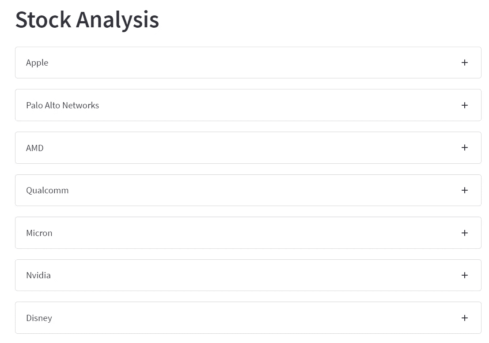
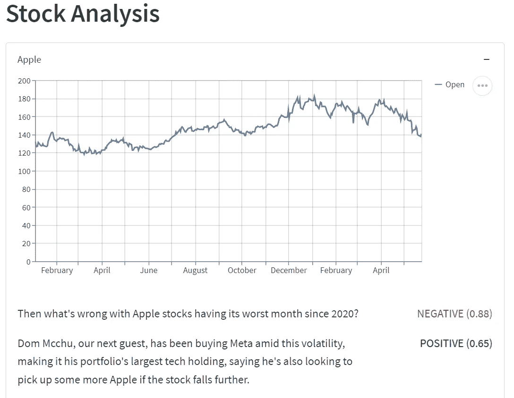
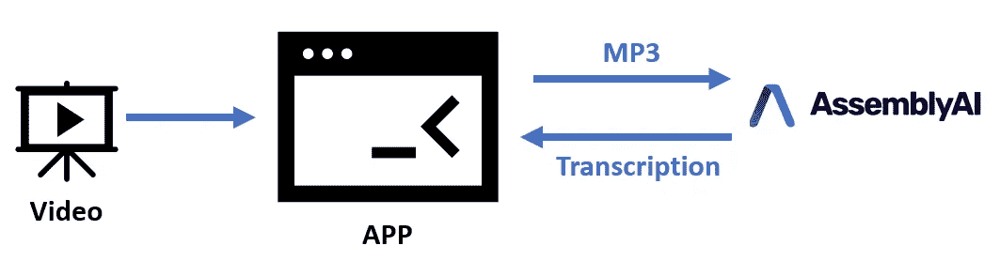
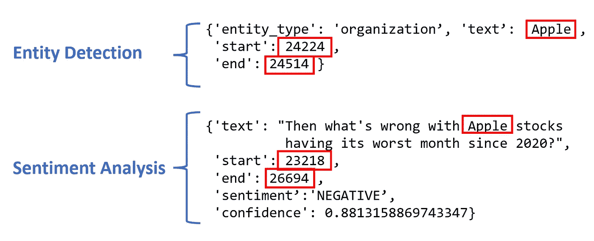
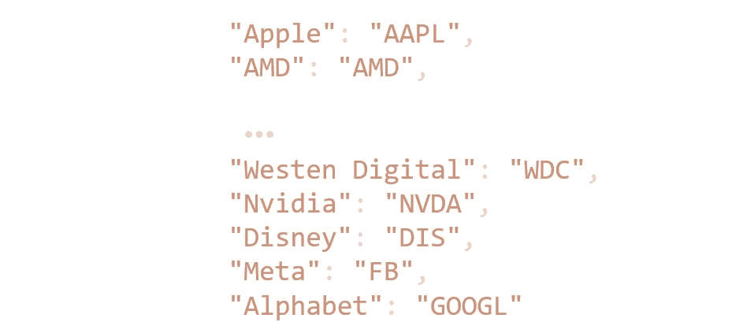
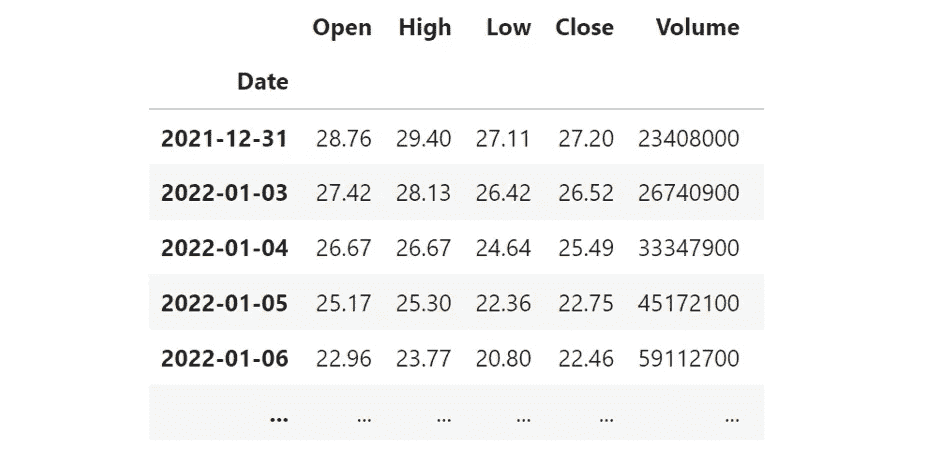
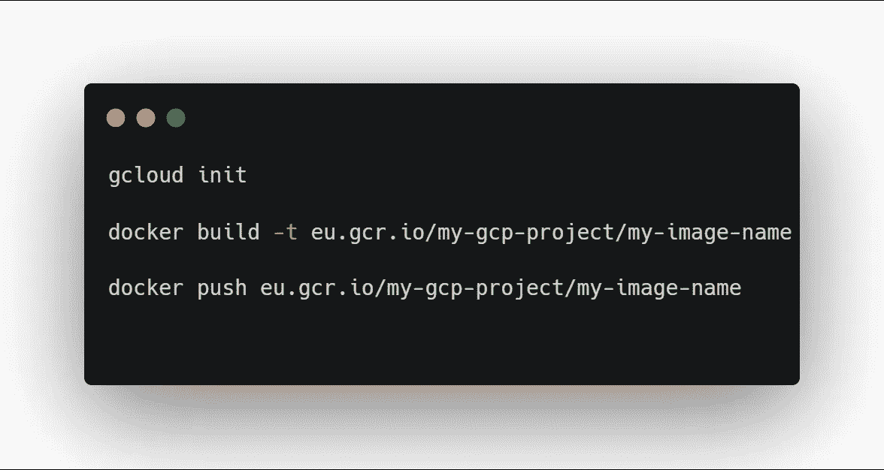

# 科技股汇总应用

> 原文：<https://pub.towardsai.net/technology-stocks-summary-app-254979ffb2d9?source=collection_archive---------4----------------------->

## 如何使用 Docker 和 Google Cloud 构建和部署 Python Web 应用程序

图片由[蒙特拉](https://www.pexels.com/@gabby-k/)在[派克斯](https://www.pexels.com/)拍摄

W ant 想知道如何把用 Python 编写的 web 应用程序部署到云上吗？这个 web 应用程序使用自然语言处理来总结最新的科技股新闻。

## 介绍

有时很难挤出足够的时间来跟上所有关于你的投资和投资组合的新闻。[这款 app](https://tech-check-7a4imn22oa-uc.a.run.app/) 可以汇总新闻，找到并整理你的股票的所有提及，并显示你的股票被提及的所有句子的情绪。

在本文中，我将首先展示我制作的应用程序及其功能。然后我会介绍一些我用来制作它的方法。最后，我将包含一些代码，这样您也可以将自己的应用程序部署到云中。

## 科技股摘要应用程序

该应用程序的目标是总结最新的科技股新闻。为此，我使用了美国消费者新闻与商业频道的 Youtube 频道，他们在那里上传每月的技术检查。

该应用程序显示新闻广播中提到的所有股票:

Web 应用程序的屏幕截图(图片由作者提供)

当您选择每只股票时，窗口会展开，向您显示最近的股票活动，以及股票中的所有句子(如中所述)及其情绪。

苹果股票和情绪分析(图片由作者提供)

这个应用程序提供了最近股票活动的良好摘要，可以节省大量时间，而不是试图跟上每只股票的所有新闻。

## 转录和实体检测

那么这个应用程序是如何工作的呢？该应用程序首先使用语音转文本 API (AssemblyAI)转录视频。该 API 还返回实体检测和情感分析。

作者图片

除了将 MP3 传递给文本，我们还需要找到文本中的所有股票，并为每只股票所在的句子赋予情感。

实体检测查找文本中的名词，并试图识别它们是哪种名词。一些类别包括:“人名”、“政治派别”、“职业”和“组织”。

从转写的文字来看，标注为“机构”的名词，多半会是我们感兴趣的股票。所以，首先我把所有标为“组织”的实体(股票)，然后循环通过股票，并发现每只股票的所有句子都提到了。

作者图片

上图显示了 API 返回的实体检测和情感分析。他们俩都在。json 格式。实体检测将文本“Apple”归类为“organization”，所以我们知道它是一只股票。“开始”和“结束”给我们一个指示，文本在转录中的位置。

图像的第二部分显示了情感分析。这句话表明的是:

> 那苹果股票出现 2020 年以来最差的一个月是怎么了？

这个句子显然是否定的。从情感分析中可以看到，该句已经以 88%的置信度被标注为否定。句子中包含单词“Apple ”,如您所见，单词 Apple (24224，24514)的开始和结束都在句子 start 和 end (23218，26694)中。所以我们知道这句话包含了苹果这个词，这是我们从实体检测中知道的一只股票。既然句子有负面情绪，我们可以给股票赋一个负面情绪。

我们可以对每只股票重复这一过程，这就是最终将在应用程序中显示的内容。

## 股票价格显示

为了获得最新的股票价格，我将每只股票映射到其报价器上。我使用了如下的字典来做这件事。

一旦我将股票转换为 tickers，我就使用 yahoo finance API 获取最新的股票价格。

雅虎财经的股票价格示例(图片由作者提供)

然后，我将每只股票的市场开盘价绘制成线图。

## API 使用、简化和应用制作

到目前为止，我已经展示了该应用程序的外观，以及我如何使用转录和实体检测结果来制作它。

在这一部分，我想快速介绍一下我用来将视频转录成文本的方法，以及我是如何得到实体检测和情感分析的结果的。为了使用 API，我使用了以下代码结构:

我首先将 MP3 文件上传到 API 端点，然后间歇性地轮询 API 端点，直到转录完成。

为了制作应用程序本身，我使用了 Streamlit，这是一个强大的 Python 库，用于快速制作应用程序原型。该应用程序的结构与我在本文的[中展示的类似。](https://towardsdatascience.com/using-ai-to-make-my-own-smart-assistant-app-5ad015449447)

## 将 Python 应用部署到云中

一旦我完成了应用程序，我想让它通过一个网址，所以你可以通过[这个链接](https://tech-check-7a4imn22oa-uc.a.run.app/)访问它。

为了部署 Streamlit 应用程序，我使用了 Docker 和 Google Cloud。我首先构建了一个 docker 文件:

*   初始化 python
*   将所有必要的文件复制到 docker 映像上
*   将所有必需的库安装到 python 环境中
*   运行命令以初始化 Streamlit 应用程序

安装 docker 文件后，我将图像推送到云容器注册中心，并使用 Google cloud 上的 cloud run 服务托管图像。

为了推送图像，我使用了以下命令:

构建 Docker 图像并将其推送到 GCP 集装箱注册中心(图像由作者提供)

一旦映像在容器注册表中，您就可以使用 Cloud run 托管它，方法是创建一个新服务并选择适当的映像。

完成后，Google Cloud 提供的 URL 应该可供任何人使用。

# 结论

学习使用 Python 制作和部署快捷的小应用程序是一项强大的技能。这篇文章展示了我用来制作[这个 app](https://tech-check-7a4imn22oa-uc.a.run.app/) 的方法。该应用程序使用自然语言处理和人工智能总结了最近的股票活动。在整篇文章中，我介绍了如何使用实体检测和情感分析来找到提到每只股票的句子。我还展示了如何将这些股票映射到 tickerss，以及如何使用 ticker 来获取每只股票的最新股价。最后，我展示了我如何使用 Streamlit 和 Google Cloud 在云上托管应用程序，以便任何人都可以访问它。

# 支持我

希望这对你有所帮助，如果你喜欢，你可以跟我来 [**！**](https://medium.com/@diegounzuetaruedas)

您也可以使用我的推荐链接成为 [**中级会员**](https://diegounzuetaruedas.medium.com/membership) ，并访问我的所有文章及更多:[https://diegounzuetaruedas.medium.com/membership](https://diegounzuetaruedas.medium.com/membership)

# 你可能喜欢的其他文章

[用 AI 做自己的智能助手 App](https://towardsdatascience.com/using-ai-to-make-my-own-smart-assistant-app-5ad015449447)

[利用人工智能分析语音](/using-ai-to-analyze-speech-3a3bbf6248ac)