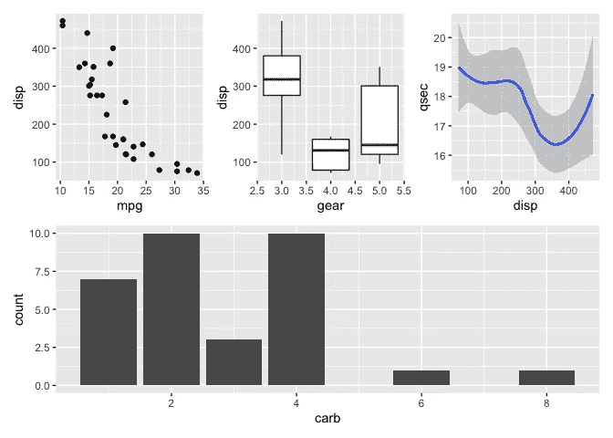
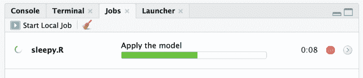

# 十个省时的 R Hacks

> 原文：<https://pub.towardsai.net/ten-time-saving-r-hacks-d5aa7866c456?source=collection_archive---------0----------------------->

## [R](https://towardsai.net/p/category/programming/r)

## 我经常用这些来尽量减少干扰，保持我的生产进度


照片由 [ThisisEngineering RAEng](https://unsplash.com/@thisisengineering?utm_source=unsplash&utm_medium=referral&utm_content=creditCopyText) 在 [Unsplash](https://unsplash.com/s/photos/fast-coding?utm_source=unsplash&utm_medium=referral&utm_content=creditCopyText) 上拍摄

我做的编码越多，对低效率就越敏感。对我来说，涅槃就是你可以超快地编码，而不需要在你最喜欢的代码编辑器之外做任何事情。

因此，当我不能使用精简、高效的代码做我想做的事情时，或者当我必须进入我的文件系统或另一个程序来配置某些东西，或者任何我认为占用了不必要的时间和精力的事情时，我会感到非常沮丧。

以下是我经常使用的十个方法，以尽量减少干扰，保持我的生产进度。当我把这些告诉一些人时，我经常会得到一些类似*‘为什么我不知道这件事？’*。所以我希望至少其中一些对你来说是新的和有用的。

# 1.直接从源文件下载和读取文件

这个技巧将帮助您最大限度地减少管理本地数据文件的时间，并使您的整个项目更容易被其他人复制。如果你有一个数据文件在网上的某个地方，比如在 Google Drive 或其他 URL 中，`readr`包允许你使用`read_csv()`或`read_rds()`之类的函数直接从 URL 读取到一个数据帧中。例如:

```
my_df <- readr::read_csv(url("https://www.website.com/data.csv"))
```

如果数据在 Github 回购中，你可以通过在 URL 中添加`?raw=true`来下载原始文件，所以下面是你如何从我的 Github 回购中获得一些关于快速约会的数据:

```
speed_dating_data <- readr::read_rds("https://github.com/keithmcnulty/speed_dating/blob/master/speed_data_data.RDS?raw=true")
```

如果你有一个奇怪的文件类型，`readr`不能处理，你可以简单地使用 base R 的`download.file()`函数把它放到你的会话中，然后你可以使用任何合适的包来读取它。你不需要这个 url 函数，所以用它来下载我的速配数据:

```
download.file("https://github.com/keithmcnulty/speed_dating/blob/master/speed_data_data.RDS?raw=true", destfile = "speed_dating_data.RDS") speed_dating_data <- readRDS("speed_dating_data.RDS")
```

这样做的好处是，其他人现在可以运行您的项目，而无需担心数据在本地可用。

对于需要认证的托管服务，比如 Box，你会发现越来越多的 R 包处理认证和文件下载，所以如果你从这些服务中进行大量的手动下载，你可能会浪费不必要的时间。如果你在 Box 工作，这是一个很好的包。它存储您的凭据，这样您就不必为每笔交易进行身份验证，并且像`readr`一样，它内置了读取功能，这样您就可以下载您的数据，并在一个命令中将它读入数据帧。

# 2.存储您的凭据以供常规使用

如果你频繁地输入数据库或其他服务的密码，那么你就是在浪费时间，如果它们暴露在你的代码中，那就是不好的做法。r 有一个名为`.Renviron`的隐藏文件，你可以将凭证存储到你的全局环境中，这样你就不必不停地输入或暴露它们。

使用`.Renviron`的最好方式是使用`usethis`包的`edit_r_environ()`功能。这将立即在您的会话中打开您的`.Renviron`文件，以便您可以添加环境变量。例如，假设您有一个经常使用的数据库密码。在`.Renviron`中会在新的一行中输入这个:

```
MY_DB_PWD="[your password]"
```

然后，在您的代码中，您只需输入以下内容来代替您的密码:

```
Sys.getenv("MY_DB_PWD")
```

记住，每当你保存一个新的环境变量到`.Renviron`中时，你需要重启 R 来使它生效。你可以用它来做各种事情，比如数据库登录、API 证书、博客证书等等。

# 3.RStudio 的快捷键

很多人不知道 RStudio 中的快捷键。他们可以节省很多编码时间。

一个大问题是管道函数`%>%`的 Ctrl-Shift-M。我总是得到至少一个“我怎么不知道这件事？”当我告诉别人这件事的时候。另一个是用于赋值`<-`的 Option- `-`(或 Alt- `-`)。(我真的希望你没有为此使用`=`！).

如果你在不同的文件中处理大量的代码，尝试 Ctrl- `.`打开一个文件或函数的搜索窗口，输入你的文件名或函数名，它会直接带你到你的项目中的位置。你不知道这为我节省了多少时间。

你可以在这里找到 RStudio 键盘快捷键[的完整列表。对程序员来说就像一包零食。](https://support.rstudio.com/hc/en-us/articles/200711853-Keyboard-Shortcuts)

# 4.RMarkdown 中的全局块选项

如果我在 RMarkdown 中写作，我经常发现无论我为我的文档决定了什么块选项，它们对所有的块都是一样的。所以在一个文档中，我可能想要回显我的代码，或者我可能不想显示警告或消息。

我可以在第一个代码块中将这些选项设置为全局块选项，而不必在文档的每个块中键入这些选项。下面是一个如何做到这一点的示例:

```
knitr::opts_chunk$set(echo = TRUE, warning = FALSE, message = FALSE)
```

# 5.用`patchwork`包轻松粘贴 gg 图

如果你把多个 ggplots 放在一起，`patchwork`包使用直观简单的语法，这样你就不必使用像`grid.arrange()`这样更复杂的函数。它还拥有比`cowplot`更多的处理复杂布局的能力。

将每个图分配给一个对象后，您可以使用像`|`和`/`这样的字符来指定您想要的列对齐和行对齐，软件包会为您进行对齐。这里有一个使用`mtcars`的[包 Github repo](https://github.com/thomasp85/patchwork) 的例子:

```
library(ggplot2)
library(patchwork)
p1 <- ggplot(mtcars) + geom_point(aes(mpg, disp))
p2 <- ggplot(mtcars) + geom_boxplot(aes(gear, disp, group = gear))
p3 <- ggplot(mtcars) + geom_smooth(aes(disp, qsec)) 
p4 <- ggplot(mtcars) + geom_bar(aes(carb)) (p1 | p2 | p3) / 
      p4
```



# 6.使用`Renv`进行更平滑的依赖管理

对于一个 R 程序员(和许多其他语言的程序员)来说，从别人那里拿起一个项目是很常见的经历，当他们试图让它工作时，他们意识到他们必须花很长时间来决定使用哪个包，解决版本控制问题和进行其他形式的依赖管理。

与以前的包依赖管理解决方案`packrat`相比，`Renv`包提供了一种更简单、更干净的方式来解决这个问题。

当您将项目开发到某一点，并且您认为您或其他人将来可能不得不再次回到它时，通过运行`renv::init()`，您可以发现所有您的包和版本依赖，并将其存储在一个名为`renv.lock`的文件中，您应该将它保存在项目 repo 中。随后，通过运行`renv::restore()`，你将能够从`renv.lock`重新安装所有的依赖项，以确保你已经在尽可能接近你离开的地方设置了你的项目，并且极大地减少了遇到与包版本相关的问题的机会。如此简单，如此重要，如此高效。

# 7.利用 RStudio 的工作进行多任务处理

你可能听说过 R 是单线程的，这会引起问题。确实，如果您在控制台中执行一个计算密集型命令，您可能会在命令执行完毕之前锁定 R 会话。

在 Javascript 异步编程的基础上，最近在用 R 构建函数方面有了很大的发展，允许程序员编写处理未来对象的异步代码。[如果你对此感兴趣，这里有一个很好的来源](https://rstudio.github.io/promises/)。

但是对于大多数日常的 R 程序员来说，可能最有用的开发是在 RStudio 1.2 中引入了 Jobs。

如果你有一个很长的 R 脚本需要完全执行，但你仍然想在你的控制台上做其他的事情，你会看到从 RStudio 的 1.2 版本开始，Source 按钮现在有一个下拉菜单，你可以在那里将脚本作为一个“本地作业”来获取。这将基本上在一个不同的 R 会话中运行您的脚本，允许您在现有的会话中工作。

请记住，一旦作业完成，它创建的所有对象都将消失，因此，如果您没有将需要的内容写入数据库或文件系统，您就已经丢失了它。如果您想浏览在本地作业期间创建的对象，您必须使用`save()`函数将会话工作空间的图像保存到脚本末尾的`Rdata`文件中。

当脚本运行时，您可以使用“作业”窗口中显示的绿色条来监视其进度，如果您用代码部分(至少有三个尾随破折号的注释)对脚本进行注释，作业窗口将在脚本移动时显示注释，以便您可以确切地看到它的位置。



在 RStudio 1.2+中使用注释运行本地作业

(如果您在 RStudio server/workbench 上工作，您还可以使用启动器作业在计算基础架构上运行您的脚本，如果您有机会的话——非常方便！)

更多关于工作的信息[点击这里](https://blog.rstudio.com/2019/03/14/rstudio-1-2-jobs/)。

# 8.重命名范围内的所有变量

这可能符合 RStudio 键盘快捷键的早期章节，但我认为它应该有自己的一节。所以你决定重命名你的一个对象，然后你意识到这个对象在你的代码中出现了 20 次，所以你必须去编辑那 20 个实例——听起来熟悉吗？

尝试高亮显示对象名称，然后按 Ctrl-Alt-Shift-M(或 Ctrl-Option-Shift-M)。您将立即看到，您现在对对象所做的任何更改都将在该对象出现在您当前作用域中的任何地方被更改。不客气😊

# 9.使用`.`保持管道畅通

随着现在管道在 R 代码中的广泛使用，以及大多数 tidyverse 函数将对象作为第一个参数的事实，人们似乎已经忘记了如何在 R 代码中使用`.`。例如，我经常看到编码人员一遇到不以对象作为第一个参数的函数就停止管道。他们移动到新的代码行并断开管道。

对于那些已经忘记了`.`，或者从来没有在第一时间了解过它的人来说，您可以使用`.`来表示您想要将之前的输出通过管道传输到您的函数中的位置。这使您可以通过管道传递不以对象作为第一个参数的函数。这里有一个例子:

```
vec <- c("hello", "jello", "is", "great") 
vec %>% grepl("lo", .) [1] TRUE TRUE FALSE FALSE
```

# 10.立即调用显示

我见过相当多的 R 程序员给一个命名的对象赋值，然后输入该对象的名称，然后立即查看它。您可以避免这一额外的步骤。如果你既想给一个对象赋值，又想同时查看它，只要把你的代码用括号括起来就行了。当您想检查代码中的一系列步骤，试图准确地找出它没有按照您的预期去做的地方时，这在调试中会很方便。我发现它还避免了我必须毫无意义地键入对象名来让它们显示在我的 RMarkdown 文档中。我的意思是:

```
## What I usually see 
mt_count <- mtcars %>% dplyr::count(cyl) 
mt_count # A tibble: 3 x 2
    cyl     n
  <dbl> <int>
1     4    11
2     6     7
3     8    14## Immediately invoked display 
(mt_count <- mtcars %>% dplyr::count(cyl)) # A tibble: 3 x 2
    cyl     n
  <dbl> <int>
1     4    11
2     6     7
3     8    14
```

你有时间拯救 R hacks 吗？欢迎在评论中添加它们。

最初我是一名纯粹的数学家，后来我成为了一名心理计量学家和数据科学家。我热衷于将所有这些学科的严谨性应用到复杂的人的问题上。我也是一个编码极客和日本 RPG 的超级粉丝。在 [*LinkedIn*](https://www.linkedin.com/in/keith-mcnulty/) *或*[*Twitter*](https://twitter.com/dr_keithmcnulty)*上找我。也可以看看我在*[*drkeithmcnulty.com*](http://drkeithmcnulty.com/)*的博客。*