# TensorFlow:使用 GPU 将 NumPy 速度提高 10，000 倍以上

> 原文：<https://pub.towardsai.net/tensorflow-accelerate-numpy-with-gpus-964e9087fdab?source=collection_archive---------0----------------------->


Marc-Olivier Jodoin 在 [Unsplash](https://unsplash.com?utm_source=medium&utm_medium=referral) 上拍摄的照片

## [数据科学](https://towardsai.net/p/category/data-science)，[机器学习](https://towardsai.net/p/category/machine-learning)

## 使用 TensorFlow 的实验 API 加速矩阵运算

如果您曾经使用 Python 进行过任何数据处理，那么您很可能使用过 NumPy(NumPy 的缩写)。它提供了丰富的复杂数据类型和有效的矩阵操作函数。其矢量函数的 C 加速实现为其赢得了以闪电般的速度处理 n 维数组的声誉。但是我们能走得更快吗？

> NumPy 的可向量化函数的 C 加速实现使我们能够高效地处理大型多维数组

接下来，TensorFlow 将采用 NumPy API。

由于 TensorFlow 的 GPU 加速，我们现在可以比现在更快地运行 NumPy **甚至比闪电还快。更好的是，Tensorflow 的 NumPy 还可以与 TensorFlow 的 API 和原始的 NumPy API 进行内部操作。这意味着我们可以将 TensorFlow 的`ndarray`传递给`tf.linalg`、`tf.data`、`tf.keras`、`tf.signal`等下的其他 Tensorflow 函数。我们甚至可以用`tf.distribute`进一步分配我们的工作量。**

> TensorFlow 的 NumPy API 试图通过 GPU 加速 NumPy，同时还能访问其他 TensorFlow API

> 注意:这仍然是 Tensorflow 的一个实验性 API，所以预计在不久的将来会有(显著的)变化。

在这篇博客中，我们将看看到底有多快，以及在什么情况下我们应该使用 Numpy 或 TensorFlow。我们将研究 Numpy 的 4 个非常常见的用例，我们作为数据科学家、软件工程师或机器学习实践者将在日常生活中使用这些用例:

1.  整理
2.  线性代数
3.  数学函数
4.  快速傅里叶变换

## 密码

为了确保数字在一定程度上可以被复制，这篇博客中的片段和数字可以在这个 [Colab 笔记本](https://colab.research.google.com/drive/15cDJUnUUebn7lbVEnYNx1LUhHH1kEbUa?usp=sharing)中找到。

## 张量流要求

NumPy API 在 TensorFlow 2.4 中的`[tensorflow.experimental.numpy](https://www.tensorflow.org/api_docs/python/tf/experimental/numpy)`下提供。要安装它，我们可以运行以下命令:

```
pip install tensorflow>=2.4
```

为了获得最佳性能，您还需要一个支持 CUDA 11 的 Nvidia GPU。我们还需要安装 Nvida 驱动程序至少在 450。关于 gpu 安装的详细说明，可以看一下[这里](https://www.tensorflow.org/install/gpu)。

如果您有兼容的 GPU，可以使用以下代码片段确保 TensorFlow 与 GPU 同步:

```
with tf.device("/device:GPU:0"): # put your workflow in this function
    def f():
        one = tnp.asarray(1)
        tnp.sort(tnp_matrix)
        with tf.device("CPU:0"):
            tnp.copy(one) f()
```

## 数组排序

让我们从简单的事情开始:对数组进行排序。NumPy 的`sort`(在两个 NumPy & TensorFlow 中)实际上支持不同的排序算法，具体取决于参数`kind`。默认情况下，如果你的 NumPy 版本比 1.12 新，它将使用`introsort` ( [快速链接到维基](https://en.wikipedia.org/wiki/Introsort))或`heapsort` ( [快速链接到维基](https://en.wikipedia.org/wiki/Heapsort))，最坏情况下复杂度为`O(n log(n))`。

**接口:**

```
import numpy as np
import tensorflow.experimental.numpy as tnp# NumPy APInp.sort(
    a: ***np.ndarray or tnp.ndarray***, 
    axis: ***int*** = -1, 
    kind: ***str*** = 'quicksort', 
    direction: ***str or list of str, optional*** = None
)# TensorFlow's NumPy APItnp.sort(
    a: ***np.ndarray or tnp.ndarray***, 
    axis: ***int*** = -1, 
    kind: ***str*** = 'quicksort', 
    direction: ***str or list of str, optional*** = None
)
```

**实验设置:**

我们将对一个预先生成的类型为`ndarray`的向量进行排序，该向量在[0。, 1.).Introsort 将用作排序算法。100 次运行的平均时间将作为最终读数。

**性能:**

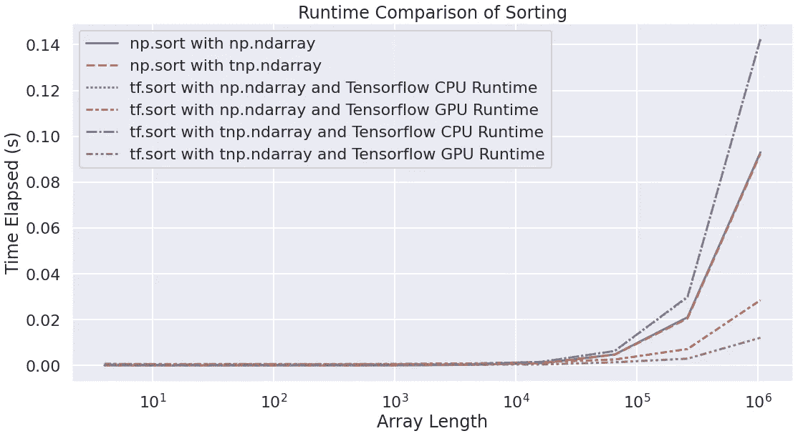

排序的运行时比较-按作者排序的图像

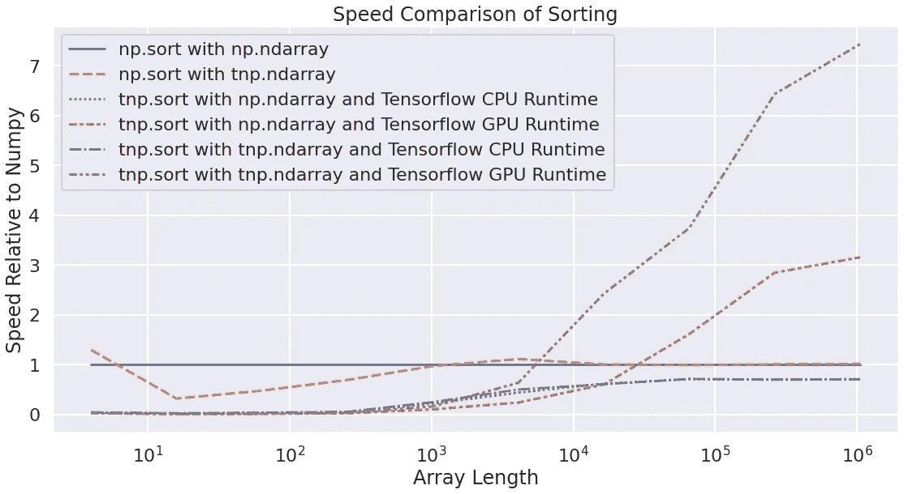

排序速度比较—按作者排序的图像

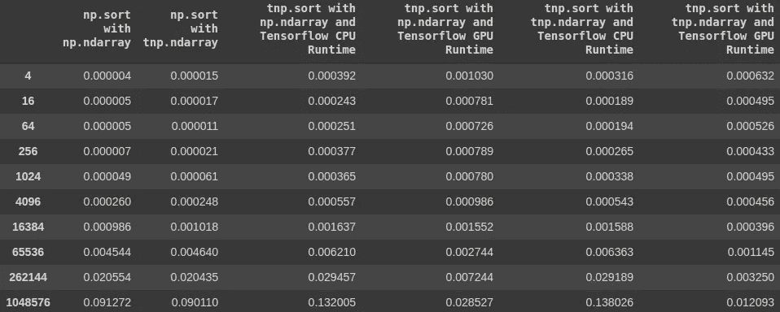

用于排序的时间表-按作者排序的图像


排序的相对速度—按作者排序的图像

由于 TensorFlow 在调度操作时比 NumPy 有更多的开销，TensorFlow 的 NumPy API 与 NumPy 相比将有明显更差的性能。根据经验， [TensorFlow](https://www.tensorflow.org/guide/tf_numpy#performance_comparisons) 建议使用 NumPy 的 API，如果操作预计在 10 毫秒内完成。

事实上，TensorFlow 的建议与我们在上面图表中的观察一致。TensorFlow 与 GPU 会话的相对速度高于 NumPy，因为数组长度会增加 10，000 到 100，000 个项目，具体取决于您是将`np.ndarray`还是`tnp.ndarray`传递给 TensorFlow 的 NumPy API。

另一点不足为奇的是，从长远来看，带 CPU 会话的 TensorFlow 提供了最坏的时间复杂度。如果 TensorFlow 不能使用 GPU 来加速，它基本上是在 NumPy 自己可以利用的尽可能多的资源上运行。这还没有考虑到 TensorFlow 的开销会进一步降低整体吞吐量，并不出所料地使其排名垫底。

## 线性代数

我们每天都在使用的另一个非常常见的任务是多维矩阵的线性代数。在博客的这一部分，我们将探讨矩阵乘法的不同表现

**界面:**

```
import numpy as np
import tensorflow.experimental.numpy as tnp# NumPy APInp.matmul(
    x1: ***np.ndarray or tnp.ndarray***, 
    x2: ***np.ndarray or tnp.ndarray***,
)# TensorFlow's NumPy APItnp.matmul(
    x1: ***np.ndarray or tnp.ndarray***, 
    x2: ***np.ndarray or tnp.ndarray***,
)
```

实际上还有额外的`kwargs`可以传递给`matmul`，但是它们通常不会被使用，除非你是超级用户并且想要覆盖`ufunc`行为(例如，为非数字类型定义矩阵乘法)。

**实验设置:**

我们将把一个预先生成的类型为`ndarray`的方阵与[0。, 1.)本身。100 次运行的平均时间将作为最终读数。

**性能:**

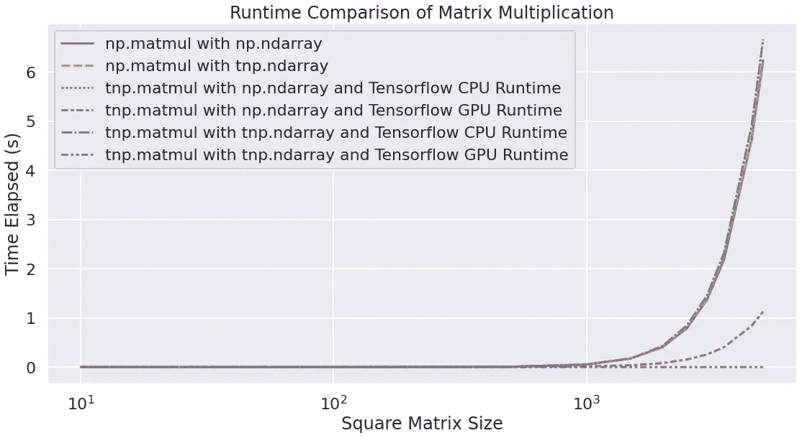

矩阵乘法的运行时比较—作者图片

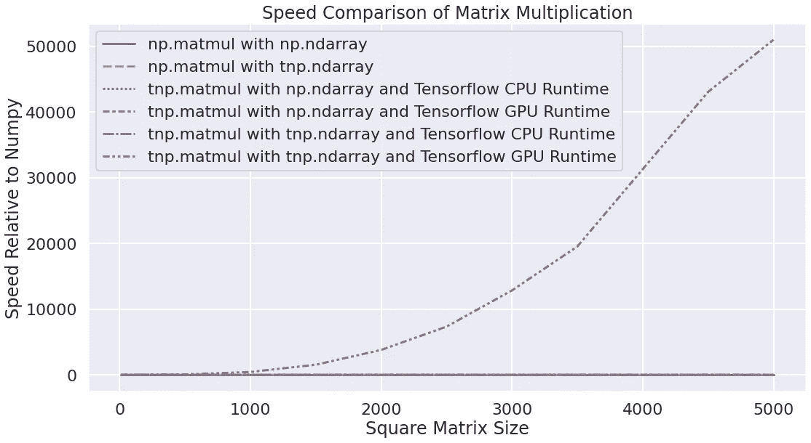

矩阵乘法的速度比较—图片由作者提供

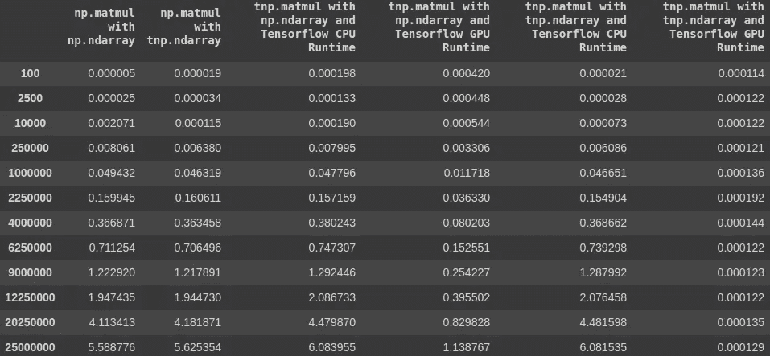

矩阵乘法的时间表-作者图片

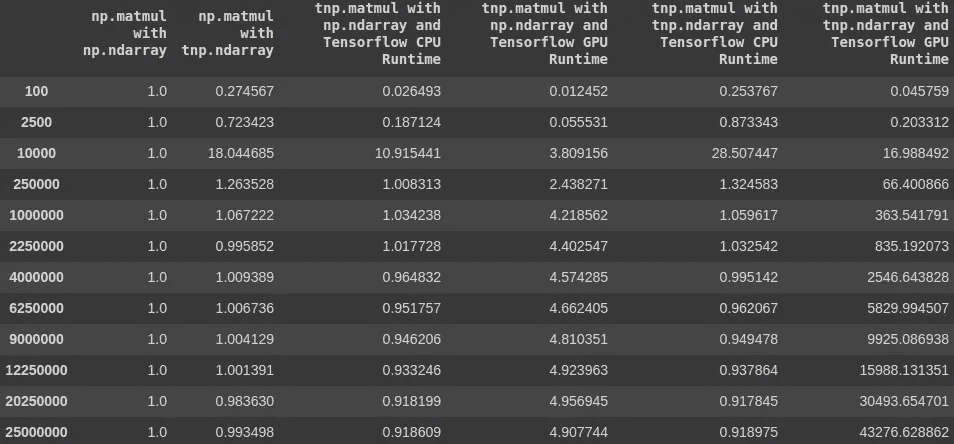

矩阵乘法的相对速度—图片由作者提供

在这个实验中，操作比我们之前的设置更简单，我们开始看到当方阵的维数为(5000，5000)时，TensorFlow 如何以高达 50，000 倍于 Numpy 的速度遥遥领先于 NumPy。TensorFlow 开始领先的临界阈值在 10，000 到 25，000 个元素之间。

从第一个图表中，我们还可以注意到在使用 TensorFlow 的 NumPy API 时，使用互操作的`np.ndarray`所带来的性能损失。由于 Tensorflow 需要在分派操作之前将其转换为 TensorFlow 兼容的类型，因此传递一个`np.ndarray`而不是`tnp.ndarray`会导致更大的开销并降低性能。

从前面的实验中也可以发现类似的观察结果，TensorFlow 的 NumPy API 和 CPU 会话的性能最差。

## 数学函数

在这个实验中，我们将研究应用神经网络中最常见的数学函数之一——双曲正切函数。对于那些不熟悉`tanh`的人来说，你可以把它想成一个`sigmoid`函数，但是取而代之的是一个(-1，1)的范围而不是`sigmoid`的(0，1)，并且与`sigmoid`相比，在零附近有一个更强的梯度。

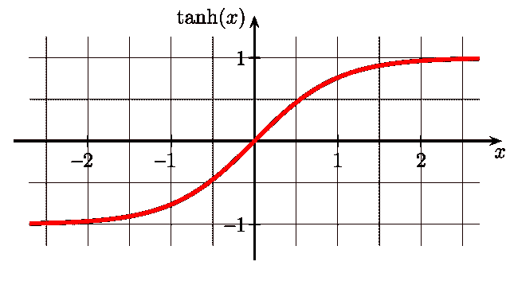

双曲正切——来源:[维基百科](https://upload.wikimedia.org/wikipedia/commons/thumb/8/87/Hyperbolic_Tangent.svg/640px-Hyperbolic_Tangent.svg.png)

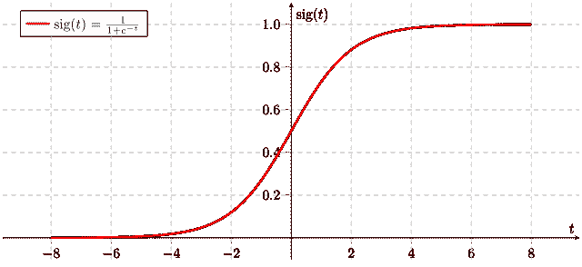

乙状结肠——来源:[维基百科](https://upload.wikimedia.org/wikipedia/commons/thumb/5/53/Sigmoid-function-2.svg/640px-Sigmoid-function-2.svg.png)

**接口:**

```
import numpy as np
import tensorflow.experimental.numpy as tnp# NumPy APInp.tanh(
    x: ***np.ndarray or tnp.ndarray***,
)# TensorFlow's NumPy APItnp.tanh(
    x: ***np.ndarray or tnp.ndarray***,
)
```

同样，实际上还有额外的`kwargs`可以传递给`tanh`，用于覆盖`ufunc`行为(例如，为非数字类型定义双曲正切)。

**实验设置:**

我们将计算一个类型为`ndarray`的预生成向量的双曲正切值，该向量在[0。, 1.).100 次运行的平均时间将作为最终读数。

**性能:**

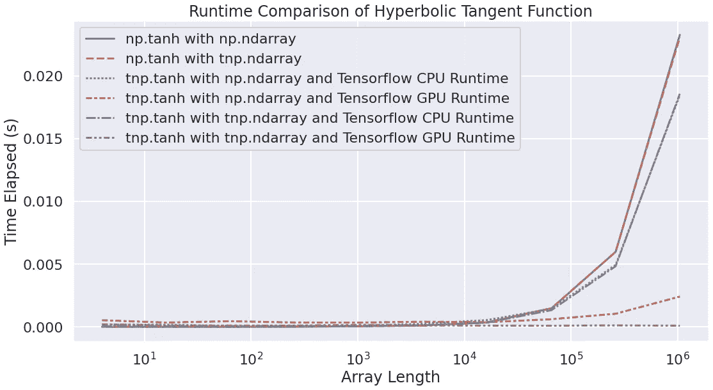

双曲正切的运行时比较—图片由作者提供

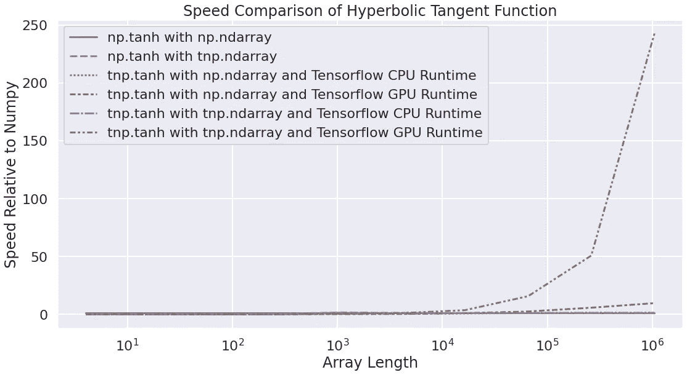

双曲正切速度比较—图片由作者提供

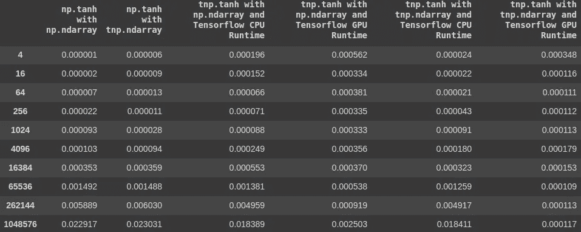

双曲正切时间表-作者图片

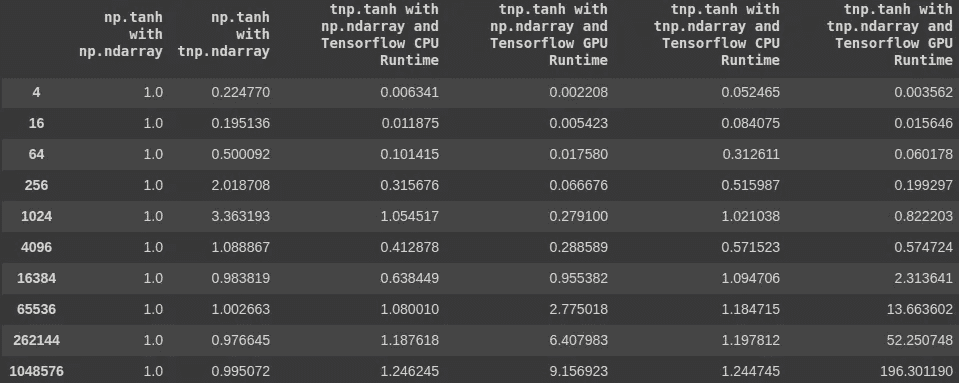

双曲正切的相对速度—图片由作者提供

在这个实验中，当我们使用 GPU 会话计算超过 15，000 个元素的向量的双曲正切时，TensorFlow 开始领先。我们仍然可以观察到相同的模式，将`np.ndarray`传递给 TensorFlow 的 NumPy API 比传递`tnp.ndarray`提供了更差的性能。然而，与之前的实验不同，我们观察到，一旦数组超过 100，000 个元素，即使带 CPU 会话的 TensorFlow 也开始持续比 NumPy 运行得更快。

## 快速傅里叶变换

让我们看看比上面更不常见的东西，作为博客的最后一个实验——快速傅立叶变换。对于不太熟悉快速傅立叶变换的人来说，你可以把它看作是把一个信号或一个时间序列分解成一组正弦波。一些过于简单的例子可以是，一段音乐由三个正弦波组成，一个为高音，一个为中音，另一个为低音，或者一个金融时间序列可以被分解为正弦波，分别代表年度趋势、月度趋势、周趋势和日趋势。这些正弦波中的每一个都有一个振幅，告诉你与其他正弦波相比，这个低音或每日趋势有多强。

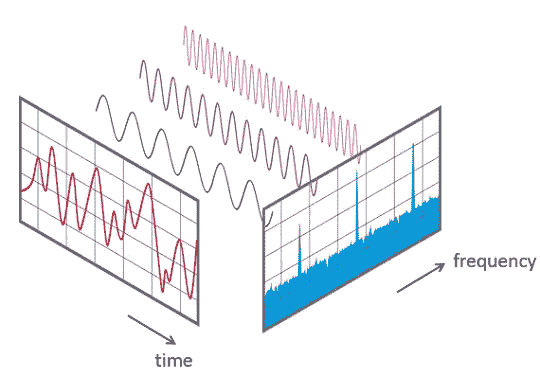

快速傅立叶变换的可视化图解—来源:[维基百科](https://upload.wikimedia.org/wikipedia/commons/6/61/FFT-Time-Frequency-View.png)

**界面:**

```
import numpy as np
import tensorflow as tf
import tensorflow.experimental.numpy as tnp# NumPy APInp.tanh(
    a: ***np.ndarray or tnp.ndarray***
)# TensorFlow's **Signal** APItf.signal.fft(
    input: ***np.ndarray or tnp.ndarray***
)
```

对于`np.fft`，您可以指定一些其他可选参数来微调快速傅立叶变换的范围。但是由于在`tf.signal.fft`中不存在相同的内容，为了保持客观，我们将省略它们。

**实验设置:**

我们将对预先生成的类型为`ndarray`的向量进行快速傅立叶变换，该向量在[0。, 1.).100 次运行的平均时间将作为最终读数。

**性能:**

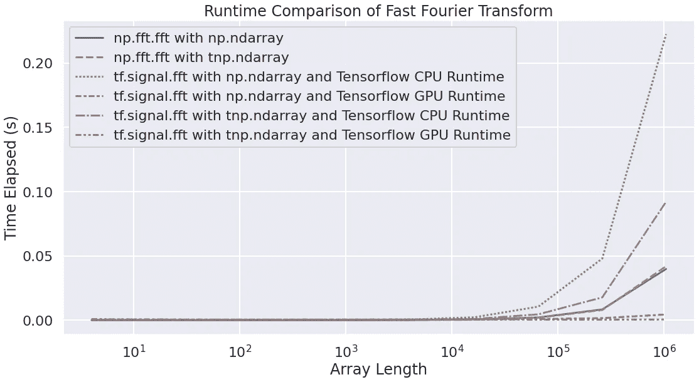

快速傅立叶变换的运行时比较—图片由作者提供

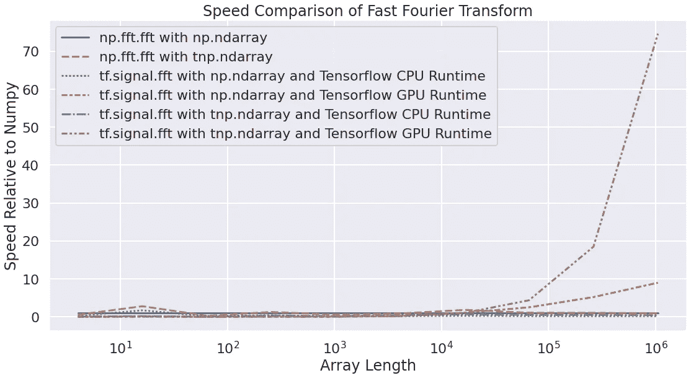

快速傅立叶变换的速度比较—图片由作者提供

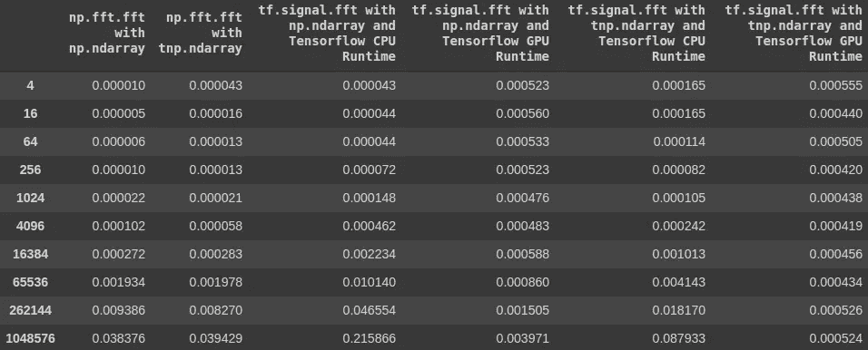

快速傅立叶变换的时间表-作者图片

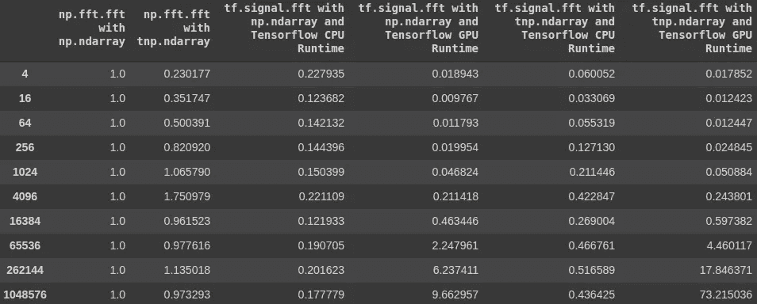

快速傅立叶变换的相对速度—图片由作者提供

这个决赛并没有偏离我们之前的理解和观察。当数组长度超过 50，000 时，带 GPU 的 TensorFlow 领先，通过`tnf.ndarray`是更好的选择。同时，带 CPU 的 Tensorflow 运行速度还是比 NumPy 慢。

## 判决和结案陈词

经过四轮测试，我们可以有把握地说，TensorFlow 的 NumPy API 在 GPU 会话中运行和处理相对较大的矩阵时，性能明显优于 NumPy。为了获得最佳性能，请记住将`tnf.ndarray`传递给任何 TensorFlow APIs。

> 如果您正在处理超过 10，000 个元素的数组，请在兼容的 GPU 上使用 TensorFlow 的 NumPy API。

但是，如果您没有兼容的 GPU，请坚持使用 NumPy。尽管 TensorFlow 在某些函数中的性能会更好，但性能的提升是有限的。另一个可能的解决方案是在 Google Colab 上工作，这将允许您在 GPU 上运行代码，从而充分利用 TensorFlow 的 NumPy API。

> 如果你没有 GPU，使用 NumPy 或者在 Google Colab 上运行你的代码，在那里你可以免费启动 GPU 会话。

到目前为止，我们在 TensorFlow 的 NumPy API 上的测试就是这样。由于它在 TensorFlow 2.4 中仍然是一个实验性的 API，因此并不是 NumPy 的所有 API 都包含在这个版本中(例如`np.fft` vs `tf.signal.fft`)。未来可能会有变化，所以请保持关注！

我希望你觉得这个博客有用而且有趣。让我知道你对这个 API 的看法，以及我是否遗漏了任何重要的地方。如果你想了解更多关于 Python、数据科学或机器学习的知识，你可能想看看这些帖子:

*   [神经网络初始化的 3 个常见问题](/3-common-problems-with-neural-network-initialisation-5e6cacfcd8e6)
*   [谷歌的 RFA:近似于《变形金刚》中的 Softmax 注意力机制](https://towardsdatascience.com/google-deepminds-rfa-approximating-softmax-attention-mechanism-in-transformers-d685345bbc18)
*   熊猫数据帧上的高效条件逻辑
*   [改进数据科学工作流程的 7 种简单方法](https://towardsdatascience.com/7-easy-ways-for-improving-your-data-science-workflow-b2da81ea3b2)
*   [常见 Python 数据结构的内存效率](https://towardsdatascience.com/memory-efficiency-of-common-python-data-structures-88f0f720421)
*   [与 Python 并行](https://towardsdatascience.com/parallelism-with-python-part-1-196f0458ca14)
*   [数据科学的基本 Jupyter 扩展设置](https://towardsdatascience.com/cookiecutter-plugin-for-jupyter-easily-organise-your-data-science-environment-a56f83140f72)
*   [Python 中高效的根搜索算法](https://towardsdatascience.com/mastering-root-searching-algorithms-in-python-7120c335a2a8)

如果你想了解更多关于如何将机器学习应用于交易和投资的信息，这里有一些你可能感兴趣的帖子:

*   [Python 中交易策略优化的遗传算法](/genetic-algorithm-for-trading-strategy-optimization-in-python-614eb660990d)
*   [遗传算法——停止过度拟合交易策略](https://medium.com/towards-artificial-intelligence/genetic-algorithm-stop-overfitting-trading-strategies-5df671d5cde1)
*   [人工神经网络选股推荐系统](/ann-recommendation-system-for-stock-selection-c9751a3a0520)

[](https://www.linkedin.com/in/louis-chan-b55b9287) [## Louis Chan—FTI Consulting | LinkedIn 数据科学总监

### 雄心勃勃的，好奇的和有创造力的个人，对分支知识和知识之间的相互联系有强烈的信念

www.linkedin.com](https://www.linkedin.com/in/louis-chan-b55b9287) [](https://www.buymeacoffee.com/louischan)