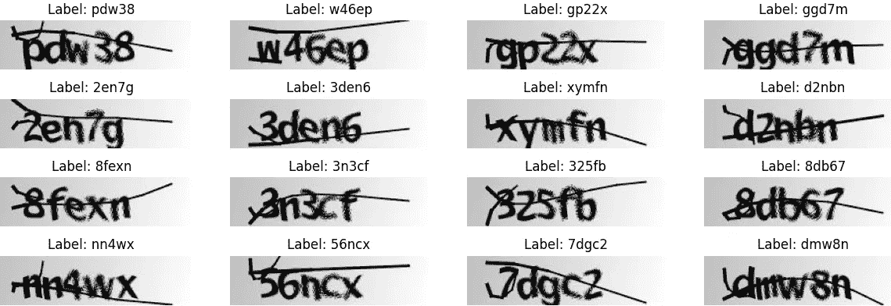
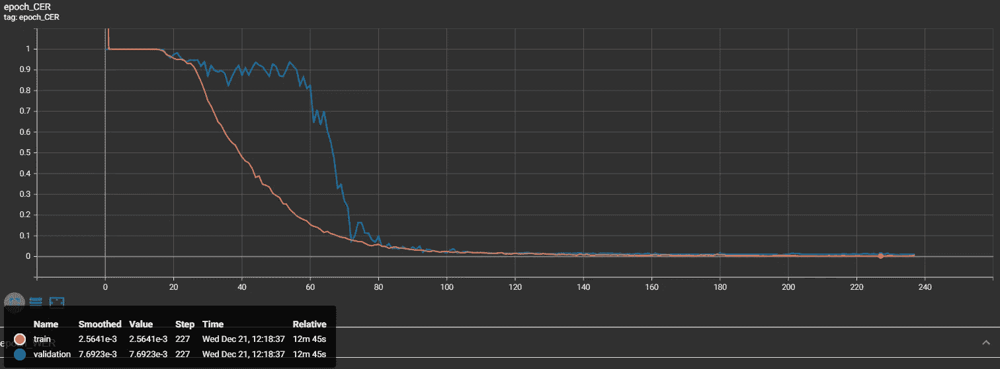
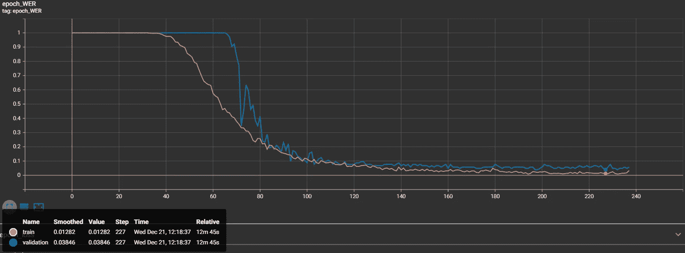
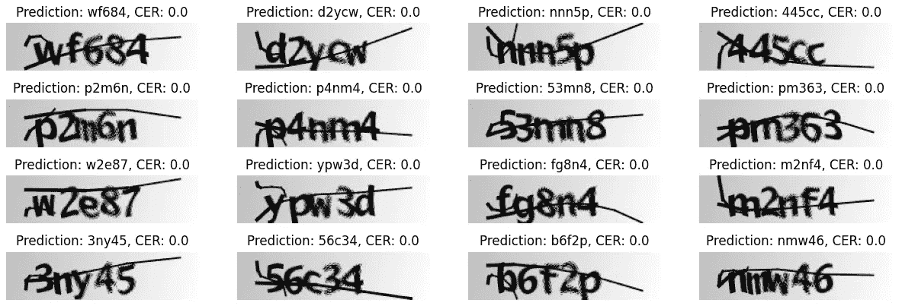

# 用于读取验证码的 TensorFlow OCR 模型

> 原文：<https://pub.towardsai.net/tensorflow-ocr-model-for-reading-captchas-8c6b9d72380b?source=collection_archive---------6----------------------->

## 使用 TensorFlow 和 CTC Loss 函数训练用于 Captcha 图像文本提取的自定义 OCR:分步指南。使用 mltu 库简化流程

**您见过的最先进的数据科学路线图！附带数以千计的免费学习资源和 ChatGPT 集成！**

**[在之前的教程](../ctc-text-recognition)中，我向您展示了如何为简单的 word 图像训练我们的自定义 OCR 来提取文本。在那里，我给出了许多关于我们在哪里、为什么以及如何做事的解释，但它有一个巨大的缺点——我们使用 10 GB 的训练数据集，并不是每个人都可以下载那个巨大的失败，然后仅仅为了好玩而训练几个小时。因此，我为该教程创建了一个延续，解释如何为简单的验证码图片训练 CTC。**

**验证码(完全自动化的公共图灵测试，用于区分计算机和人类)通过提出一个人类容易解决但计算机很难解决的挑战，来保护网站免受机器人和自动化脚本的攻击。一种常见的验证码是一个简单的图像，包含用户必须输入才能继续的一系列字母或数字。**

**本教程将使用 TensorFlow 和 Connectionist 时态分类(CTC)损失函数创建一个验证码到文本的解决方案。并不是从头开始写所有的东西，我将使用我的“mltu”库。**

## **先决条件:**

**开始之前，您需要安装以下软件:**

*   **python 3；**
*   **TensorFlow(本教程我们将使用 2.10 版本)；**
*   **mltu==0.1.4**

**您还需要一个 captcha 图像及其相应标签的数据集(即图像中文本的正确转录)。您可以通过手动转录一组 captcha 图像来创建数据集，也可以使用预先存在的数据集。**

## **下载验证码数据集:**

**在安装了所需的包之后，我们可以下载用于训练模型的数据集。数据集你可以从这个[https://github . com/AakashKumarNain/captcha cracker/raw/master/captcha _ images _ v2 . zip](https://github.com/AakashKumarNain/CaptchaCracker/raw/master/captcha_images_v2.zip)链接下载。该数据集包含 1040 个作为 png 图像的验证码文件。每个示例的标签是一个字符串，即文件名(减去文件扩展名)。**

**但是为了简化我们的工作，我写了一段简短的代码来下载并解压这个 zip 文件:**

**运行此脚本后，所需的数据集将保存到名为“数据集”的文件夹中。如果我们观察它，我们会看到下面的图像:**

****

**作者图片:验证码训练数据集**

## **预处理数据集:**

**在训练模型之前，我们通常需要预处理数据集。但是因为我使用的是定制的 TensorFlow 数据提供者，所以我们只需要生成一个数据集列表，其中的每一行都会给出图像和实际标签的路径。我们可以用下面的代码做到这一点:**

**这里我们迭代一个目录中的所有文件，并将路径和标签保存到数据集。此外，我们正在收集词汇和最大单词长度。这些将在培训过程中使用。**

**在这里，您应该注意这些配置是什么。这是一个简单的配置对象，用于保存培训过程的参数:**

**这里:**

*   ****model_path** 是保存模型的目录的文件路径。目录名包括当前日期和时间；**
*   ****vocab** 是一个字符串，可以用来指定模型应该识别或使用的词汇或字符集；**
*   ****height** 和 **width** 为整数，可以表示模型输入数据的大小或维度，如图像的高度和宽度；**
*   ****max_text_length** 是一个整数，可以表示模型期望处理的某些文本的最大长度；**
*   ****batch_size** 是一个整数，用于确定单个批次中一起处理的样本数量；**
*   ****learning_rate** 是一个浮点数，表示模型在训练期间用来更新其权重的学习率；**
*   ****train_epochs** 是一个整数，表示训练过程将执行的训练时期或通过整个训练数据集的次数；**
*   ****train_workers** 是一个整数，可以表示用于并行化训练过程的工作者线程或过程的数量。**

**现在我们需要创建我们的数据提供者，在那里我们将在训练和验证我们的模型时完成完整的数据预处理:**

**DataProvider 对象是一个实用程序，可用于读取、预处理数据并将其提供给 TensorFlow 训练“fit”函数。我们将用几个参数初始化 DataProvider:**

*   ****数据集**:这是我们之前创建的数据集列表，将用于为训练过程提供数据；**
*   ****skip_validation** :这是一个布尔标志，决定数据提供者是否应该对数据集执行验证检查。如果设置为 True，数据提供程序将跳过这些检查；**
*   ****batch_size** :这是一个整数，决定一个批次中一起处理的样本数量；**
*   ****data_preprocessors** :这是一个数据预处理对象的列表，这些对象将在数据被馈送到模型之前应用于数据。该列表中的 **ImageReader** 对象将从文件中读取并解码图像数据；**
*   ****transformers** :这是一个数据转换对象的列表，这些对象将在数据输入训练过程之前应用于数据。该列表中的 **ImageResizer** 、 **LabelIndexer** 和**label add**对象将分别用于调整图像大小、将文本标签转换为数字索引以及将文本标签填充为固定长度。**

**DataProvider 实例将遍历数据集，并将经过预处理和转换的数据提供给训练过程(fit 函数)。**

## **将数据集分成训练集和测试集:**

**接下来，我们需要将数据集分成训练集和测试集。我们将使用训练集来训练模型，使用测试集来评估模型的性能。同样，使用我的定制 DataProvider 时也毫不费力:**

**现在我们有一个分割数据集，其中 90%用于训练，10%用于验证。
但是你可能已经注意到我没有使用任何增强技术，因为测试数据在验证时不应该被增强。因此，我们只需要向训练数据提供者添加增强器:**

**在这种情况下，augmentors 列表被设置为一个包含三个数据增强对象的列表: **RandomBrightness** 、 **RandomRotate** 和**randomerodedial**。这些对象被假定为定义特定数据扩充操作的类，例如随机调整图像的亮度、以随机角度旋转图像或者侵蚀和扩张图像。当 **DataProvider** 实例遍历数据集时，它会在将数据提供给模型之前对数据应用这些扩充操作。**

## **定义模型架构:**

**现在我们可以定义模型架构了。一种常见的方法是使用卷积神经网络(CNN)从验证码图像中提取特征，然后使用递归神经网络(RNN)处理特征序列并预测相应的文本标签。我正在做以下事情:**

**但是如果您需要更多的细节，下面是这个 train_model 函数的脚本:**

**每种情况都是不同的，如果这对验证码有效，并不意味着对其他数据集也有效。你需要四处玩耍和实验。**

## **编译和训练模型:**

**现在我们已经定义了模型架构，我们可以使用 CTC 损失函数来编译和训练模型。CTC 损失函数被设计成训练模型，该模型在给定输入图像的情况下预测字符序列。**

**为了编译这个模型，我们可以使用下面的代码:**

**对于这个模型，我使用的是 CTCloss 和 CWEMetric。这一具体指标将计算字符错误率和单词错误率。这是最重要的指标之一，将用于在培训期间监控模型的性能。**

**接下来，在我们的培训过程中加入回访至关重要:**

**这段代码在训练 TensorFlow 模型时为我们定义了一组回调。回调可用于定制模型在训练期间的行为，例如保存检查点、记录训练进度或提前停止。**

**下面是正在定义的每个回调的简要描述:**

*   ****EarlyStopping** :当模型在验证集上的性能在指定的时期数(由**耐心**参数确定)内没有改善时，该回调将停止训练过程；**
*   ****ModelCheckpoint** :这个回调会在每个历元之后保存一个模型权重的检查点。检查点将被保存到由**文件路径**参数指定的文件中。只有当模型在验证集上的性能提高时，回调才会保存权重，这是由**监视器**参数确定的；**
*   ****TrainLogger** :这个回调将训练日志写入一个文件；**
*   ****TensorBoard** :该回调将训练日志写入 TensorBoard 日志目录，可以用来可视化训练进度；**
*   ****ReduceLROnPlateau** :当验证集上的模型性能在指定的时期数(由 **patience** 参数确定)内没有提高时，此回调会降低优化器的学习率。学习率按照**因子**参数指定的因子降低；**
*   ****Model2onnx** :这个回调将训练后的模型转换成 onnx 格式。ONNX 文件将与 Keras 保存的模型一起保存。**

**我们可以使用 fit 方法来训练模型，并将其传递给训练和验证数据提供程序。设置适当的超参数，例如批量大小、时期数、回调等。：**

**你可能注意到我在跟踪“瓦尔 CER”而不是损失，所以让我们看看我的训练和验证 CER 曲线是什么样子的:**

****

**作者图片:培训和验证 CER**

**这很好，我们可以看到，在第 227 步，我们的验证字符错误率是 0.007，不到 1%，非常好的结果！现在让我们看看我们的单词错误率(WER):**

****

**作者图片:培训和验证 WER**

**我们可以看到，在同样的 227 步，我们的 WER 是 0.03846。这也不错，但这告诉我们，几乎 4%的验证码图片被预测错误。但是知道我们在这个任务中使用了什么样的小数据集，这不是问题。**

## **使用训练好的模型创建验证码到文本的解决方案:**

**现在，让我们用下面的推理代码来测试我们的模型如何执行:**

**此代码是一个脚本，用于评估预先训练的 ONNX 模型的 captcha-to-word 识别性能。该脚本执行以下步骤:**

1.  **它加载模型配置文件，并使用配置文件中的 **model_path** 和 **char_list** 参数创建 **ImageToWordModel** 对象的实例。 **ImageToWordModel** 对象是 **OnnxInferenceModel** 类的子类，该类加载 ONNX 模型并提供使用该模型进行预测的预测方法。 **ImageToWordModel** 类添加了一个 **char_list** 属性并覆盖 predict 方法以预处理输入图像并解码模型的输出；**
2.  **它从 CSV 文件加载验证数据，并将其转换为元组列表。验证数据由图像文件路径和相应的文本标签组成；**
3.  **它遍历验证数据，并使用`model.predict`方法获得每张图像的预测文本。该函数计算预测文本和基本事实标注之间的字符错误率(CER)。CER 衡量预测文本和标签之间的差异，以百分比表示；**
4.  **它打印每个影像的影像文件路径、标注、预测和 CER，并在循环结束时计算和打印整个数据集的平均 CER。**

**此脚本可以评估模型在验证数据集上的性能，并识别模型预测中的任何错误。还可以修改该脚本，以使用模型对新数据或生产环境进行预测。**

**让我们看看该模型在验证数据集中的结果:**

****

**作者图片:预测验证码图片**

**正如我们所看到的，它从这 16 个例子中预测了 100%!太神奇了！**

# **结论:**

**在本教程中，我们使用 Connectionist 时态分类(CTC)损失函数和 TensorFlow 创建了一个从 captcha 图像中提取文本的解决方案。**

**本教程提供了使用 CTC 和 TensorFlow 实现验证码到文本解决方案的实用指南。我们介绍了安装必要的包和下载 captcha 图像及其相应标签的数据集。我们对数据集进行了预处理，并为训练和验证设置了一个数据提供者。然后我们训练这个模型，保存它，并在新的验证码图片上展示它的准确性。**

**就是这样！您现在有了一个使用 TensorFlow 和 CTC loss 函数的验证码到文本的解决方案。你可以用这个实现来预测不同的验证码图片。**

**我希望这篇教程对你有所帮助，希望你能更好地理解如何使用 TensorFlow 创建一个验证码到文本的解决方案。如果您有任何问题或需要进一步帮助，请告诉我。**

**训练好的模型可以从 [**这个链接**](https://drive.google.com/drive/folders/1gFvpjMj3tC_H1WIhM8r7oWyglOCjqo7C?usp=share_link) 下载。**

**【https://pylessons.com/tensorflow-ocr-captcha】原载于**