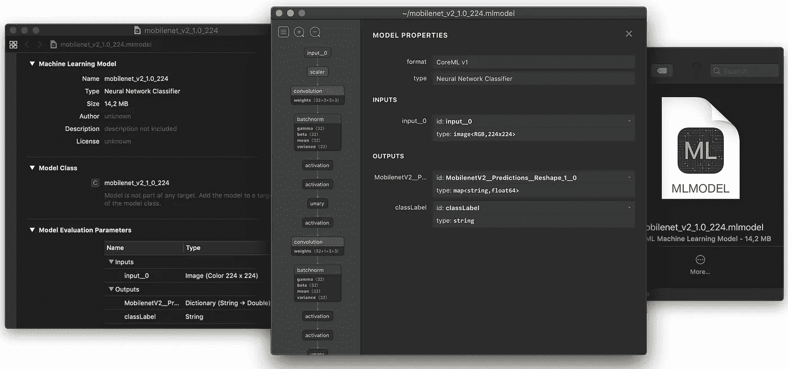
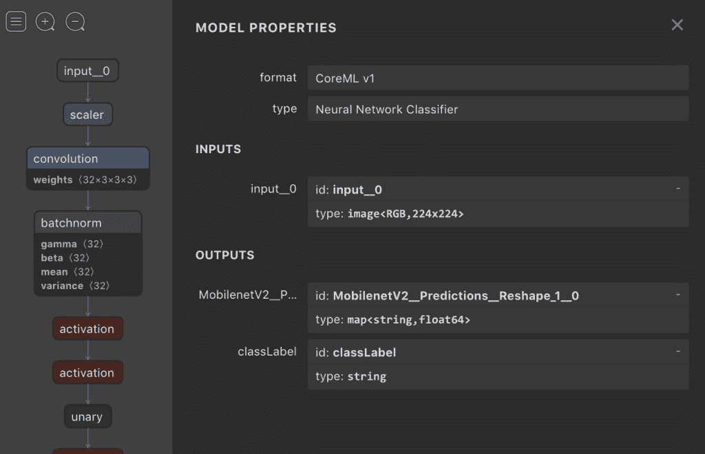
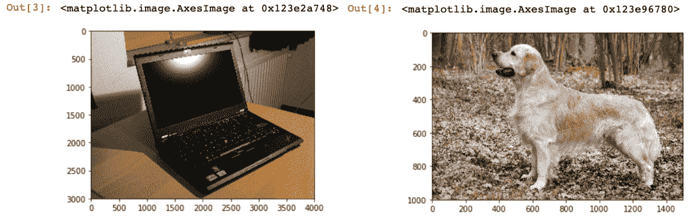

# TensorFlow 到 CoreML 的转换和模型检验

> 原文：<https://pub.towardsai.net/tensorflow-to-coreml-conversion-and-model-inspection-8a30123b1289?source=collection_archive---------0----------------------->

## iOS | [上的机器学习模型向 AI](https://towardsai.net) 的转换

## 将 TF 模型转换为 CoreML，一种 iOS 友好的格式

*本文最初发表于*[*think mobile . dev*](https://thinkmobile.dev)*—一个关于在移动应用中实现智能解决方案的博客(* [*链接到文章*](https://thinkmobile.dev/tensorflow-to-coreml-conversion-and-model-inspection/) *)。*

# 核心 ML

虽然 TensorFlow Lite 似乎是 Android 软件工程师的自然选择，但在 iOS 上，它不一定是相同的。2017 年，iOS 11 发布时，苹果公布了 Core ML，这是一个加速 AI 相关操作的新框架。
如果你是移动机器学习的新手，Core ML 会在你的应用程序中添加模型时简化很多事情(字面意思是拖放设置)。它还带有一些特定领域的框架— [视觉](https://developer.apple.com/documentation/vision/classifying_images_with_vision_and_core_ml)(用于人脸、矩形或文本检测、图像分类等的计算机视觉算法。)，以及[自然语言](https://developer.apple.com/documentation/naturallanguage)。
Core ML 和 Vision 让我们有可能使用定制的机器学习模型来运行推理过程。而那些模型可能来自 TensorFlow 这样的机器学习框架。
在本文中，我们将介绍从 TensorFlow 到 Core ML 格式的转换及其比较。

# TensorFlow 2.0 支持

目前，核心 ML 转换器不支持 TensorFlow 2.0 模型。这将在未来发生变化— converter 致力于支持 TensorFlow 的最新稳定版本。Github 上值得关注的问题。

# 先决条件

要将张量流模型转换成核心 ML，我们需要的不仅仅是[协同实验室](https://colab.research.google.com/)环境。以下是您工作的机器需要具备的物品清单:

*   **张量流 v1。*** (撰写本文时，核心 ML 转换器尚不支持 TensorFlow 2.0)
*   **Python 3.6** 加上一些额外的库:Numpy、Jupyter Notebook、pillow、requests——你会在 Jupyter Notebook 中找到它们，还有模型检验代码。
    (Python 3.7 还不被 coremltools 支持——跟踪[问题](https://github.com/apple/coremltools/issues/228))。
*   [**TF-CoreML**](https://github.com/tf-coreml/tf-coreml)—tensor flow 到 CoreML 转换器，及其依赖关系—[**CoreML tools**](https://github.com/apple/coremltools)，用于转换和验证。
*   **macOS** —不仅用于 iOS 应用开发，还能够启动 **coremltools** 。

满足所有要求后，我们将:

1.  MobileNet v2 从 TensorFlow 到 Core ML 格式的转换，
2.  检查核心 ML 模型(与 TF 进行比较)。

之后，我们的模型将准备在 iOS 应用程序中实施。

# 张量流到 CoreML 的转换

这一部分可以在协作环境中完成。
让我们创建一个新的笔记本，从安装`tfcoreml`和导入适当的库开始:

现在，让我们下载并打开 MobileNet v2 模型及其标签:

现在我们需要了解更多关于我们将要转换成 CoreML 的模型。幸运的是，MobileNet v2 网络包中包含一个包含该信息的 txt 文件。
或者，您可以使用 [Netron](https://github.com/lutzroeder/netron) 应用程序来预览*。pb 文件。

现在是最后一步——用 [tf-coreml](https://github.com/tf-coreml/tf-coreml) 工具将冻结的张量流图转换成 CoreML。

CoreML 模型的有趣之处在于，它包含内置的标签，并在推理过程运行之前对数据进行一些预处理。以下是一些有趣的 tfcoreml 参数:

*   **image_input_names** —如果设置了，这些输入将被核心 ML 视为图像，
*   **image_scale** —当 **image_input_names** 被设置时，我们还可以定义将用于输入数据的比例。为了将 RGB 通道值从范围[0，255]转换到[0，1]，我们使用`IMAGE_INPUT_SCALE = 1.0/255.0`。
*   **red_bias** (以及 green_、blue_、gray_) —这里不使用，但是我们也可以给缩放后的图像添加偏置。因此，例如，如果一个模型需要[-1，1]范围内的数据，我们将使用:`IMAGE_INPUT_SCALE = 2.0/255.0`并将偏差设置为`-1`。
*   **class_labels** —包含模型标签的文件。
*   **输出特征名称**-输出层的名称。

更多信息请看 tfcoreml [资源库](https://github.com/tf-coreml/tf-coreml)和[示例 Jupyter 笔记本](https://github.com/tf-coreml/tf-coreml/tree/master/examples)，它们展示了一些用例。

转换完成后，您应该会看到一个新文件:**mobilenet _ v2 _ 1.0 _ 224 . ml model**。
在控制台输出中，您应该看到一些关于新创建的模型的信息，如下所示:

类似的信息可以在 Netron 上看到:

CoreML *的预览。表示 MobileNet v2 模型的 mlmodel 文件。

正如您可能注意到的，输入和输出名称有一点改变，从:`input:0`到:`input__0`，从:`MobilenetV2/Predictions/Reshape_1:0`到`MobilenetV2__Predictions__Reshape_1__0`。这是因为生成的文件需要用 Swift 或 Objective-C 代码保持语义正确。

带 TensorFlow 到 CoreML 转换的 Colab 笔记本在[这里](https://colab.research.google.com/github/frogermcs/TF-to-CoreML/blob/master/notebooks/Core_ML_export.ipynb)有售。

 [## 谷歌联合实验室

### 编辑描述

colab.research.google.com](https://colab.research.google.com/github/frogermcs/TF-to-CoreML/blob/master/notebooks/Core_ML_export.ipynb) 

# 模型检验

在我们将 CoreML 模型放入移动应用程序之前，最好检查一下它是否与原始 TensorFlow 模型的工作方式相同。为此，我们将创建一个笔记本，这次需要直接在 macOS 上运行(这是 **coremltools** 的要求)。
假设您的机器上已经有了所有需要的 python 库，要创建一个新的笔记本，首先在终端中运行 Jupyter 笔记本环境:

`$ jupyter notebook`

然后在您的 web 浏览器中运行作为该操作的结果而呈现的链接(例如 [http://localhost:8888/？token=1234abcd)。](http://localhost:8888/?token=1234abcd).)

现在我们将创建一个 **python 3** 笔记本，在这里我们将对 CoreML 和 TensorFlow 两个模型进行推理，并比较结果。首先，从所有需要的进口开始:

现在我们将从维基百科载入两张图片:

预览:

现在让我们加载 CoreML 模型:

正如您所看到的，规范显示了我们在导出操作中看到的内容。现在让我们做一些数据预处理:

我们在这里没什么可做的了。数据转换(从范围[0，255]到[0，1])由核心 ML 模型自动完成。

让我们运行预测:

输出是:

如您所见，我们为`useCPUOnly`标志尝试了不同的值。对于金毛寻回犬，我们强制 Core ML 使用 CPU，而对于笔记本电脑映像，我们让操作系统决定应该使用什么硬件。虽然这两者之间没有太大的差异，但当我们将结果与 TensorFlow 进行比较时，我们会看到一个有趣的事情。

现在让我们用张量流模型做一个类似的预测。
首先，加载标签:

并做一些数据预处理:

对于张量流推理过程，我们需要做更多的准备。输入数据不仅需要具有适当的大小(224x224x3)，还需要具有适当的数据格式(范围[0，1]内的浮点值)，并且输入张量应该具有 4 维形状。

然后，让我们加载张量流模型:

最后，预测:

以下是输出结果:

当 CoreML 在 CPU 上运行时，结果非常相似(我们在这里使用的 TF 版本也在 CPU 上运行推理)。但是当使用 GPU 时，情况有所不同。

这种差异从何而来？不一定是硬件本身。对于 CPU 和 GPU 这两种架构，有一些不同的方式来实现高级功能。通常，这些差异非常微妙，就像这里一样。但是如果你发现它们彼此相距很远，这很可能是一个 bug。

此时，结果是令人满意的，我们可以假设 CoreML 模型工作正常。然后我们能做的最后一件事是在 iOS 应用程序中实现它。这将是以后另一篇文章的一部分。

# 源代码和参考资料

这篇博文的源代码可以在 Github 上找到(转换过程用的是 Colab 笔记本，TensorFlow 和 CoreML 比较用的是 Jupyter 笔记本):【https://github.com/frogermcs/TF-to-CoreML/

带 TF 到 CoreML 转换的笔记本可以在这里运行。

 [## 谷歌联合实验室

### 编辑描述

colab.research.google.com](https://colab.research.google.com/github/frogermcs/TF-to-CoreML/blob/master/notebooks/Core_ML_export.ipynb) 

有 TF 和 CoreML 对比的 Jupyter 笔记本预览可以看这里(这款笔记本只能在 macOS 上运行):[https://github . com/frogermcs/TF-to-CoreML/blob/master/notebooks/Core _ ML _ inspection . ipynb](https://github.com/frogermcs/TF-to-CoreML/blob/master/notebooks/Core_ML_inspection.ipynb)

还有一篇来自 **Matthijs Hollemans** 的关于将 MobileNet SSD 模型转换为 CoreML 的很棒的博文:[MobileNet v2+SSDLite with Core ML](https://machinethink.net/blog/mobilenet-ssdlite-coreml/)。

感谢阅读！🙂
请在下面分享您的反馈。👇

*本文最初发表于*[*think mobile . dev*](https://thinkmobile.dev)*—一个关于在移动应用中实现智能解决方案的博客(* [*链接到文章*](https://thinkmobile.dev/tensorflow-to-coreml-conversion-and-model-inspection/) *)。*

 [## TensorFlow 到 CoreML 的转换和模型检验“想，移动！

### 将 TF 模型转换为 Core ML，这是一种 iOS 友好格式的 CoreML，而 TensorFlow Lite 似乎是……

thinkmobile.dev](https://thinkmobile.dev/tensorflow-to-coreml-conversion-and-model-inspection/)