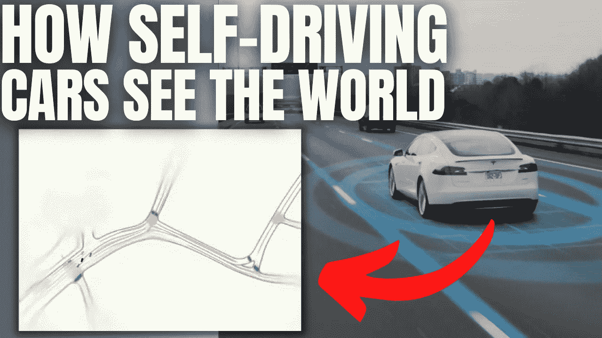
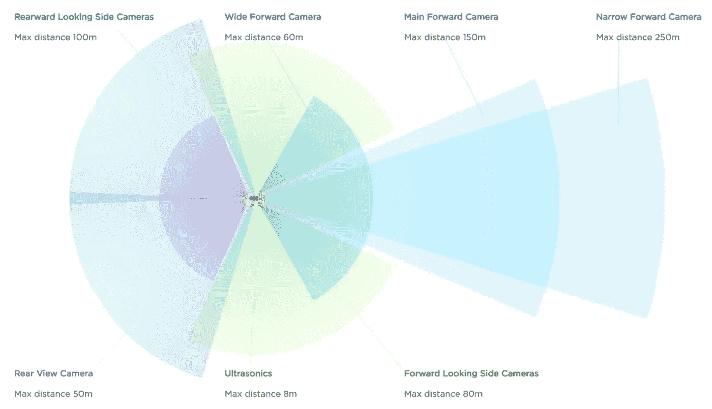
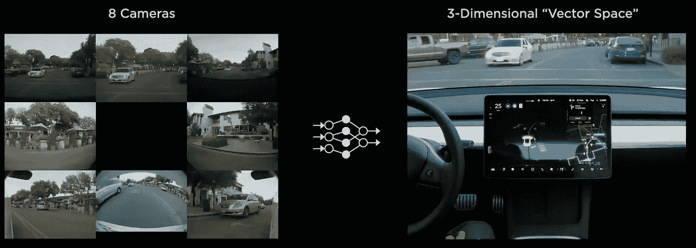
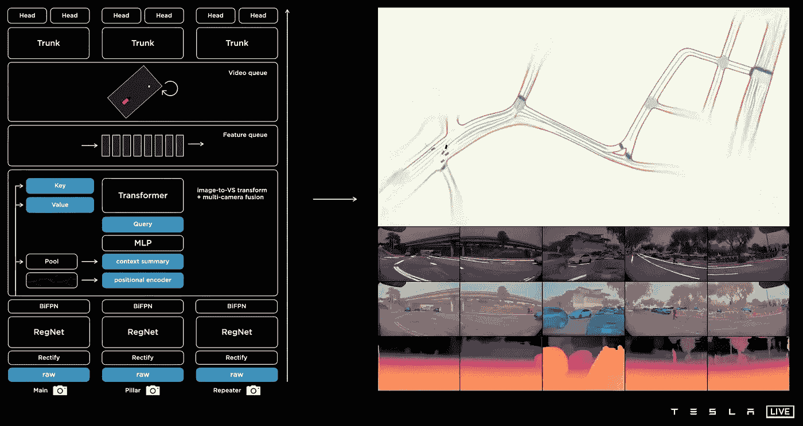
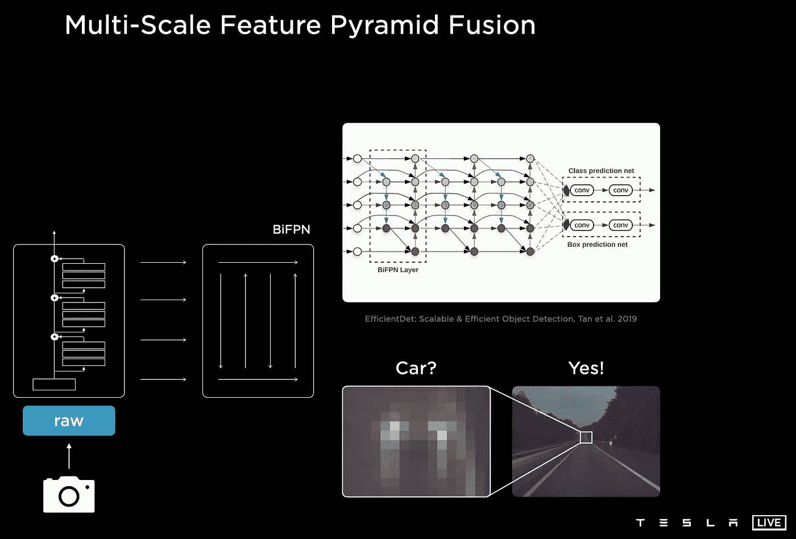
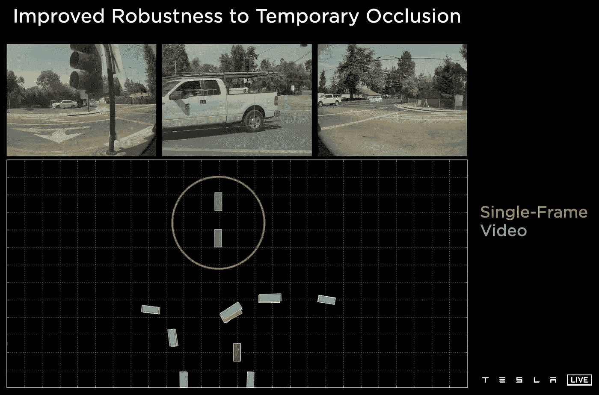
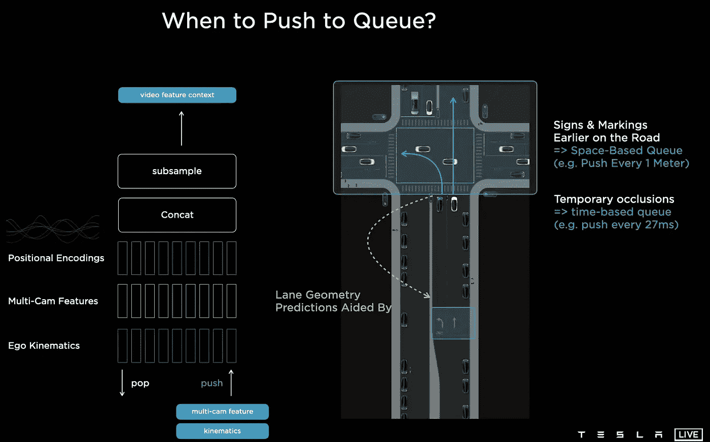
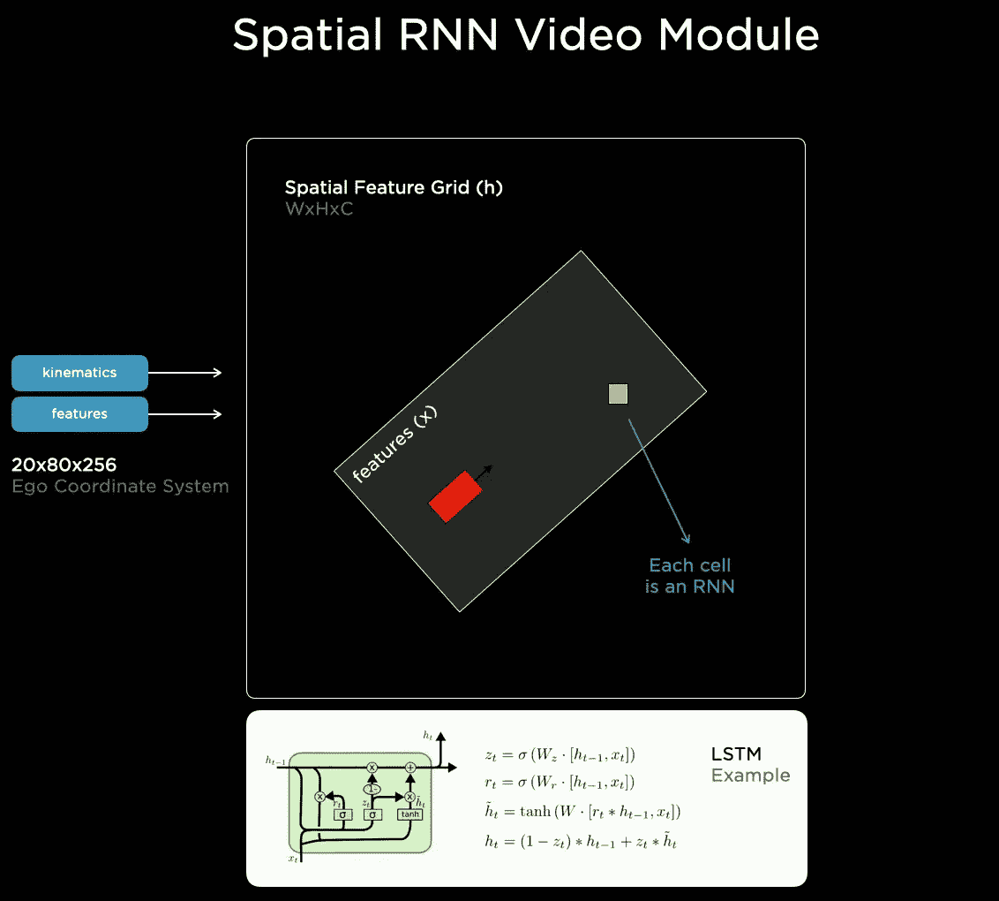
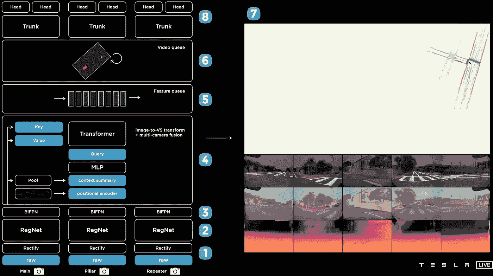

# 特斯拉人工智能日亮点&自动驾驶仪如何工作

> 原文：<https://pub.towardsai.net/tesla-ai-day-in-10-minute-show-does-teslas-autopilot-work-3990252082dc?source=collection_archive---------0----------------------->

## [自动驾驶汽车](https://towardsai.net/p/category/self-driving-cars)

## 安德烈·卡帕西(Andrej Karpathy)关于特斯拉自动驾驶仪的演讲在不到 10 分钟的时间里就解释清楚了

> 原载于 [louisbouchard.ai](https://www.louisbouchard.ai/tesla-autopilot-explained-tesla-ai-day/) ，前两天在[我的博客](https://www.louisbouchard.ai/tesla-autopilot-explained-tesla-ai-day/)上看到的！

听听这个故事…

如果你想知道特斯拉汽车如何不仅能看到其他车辆，还能在道路上导航，这就是你一直在等待的文章。几天前是第一个特斯拉人工智能日，特斯拉人工智能总监 Andrej Karpathy 和其他人展示了特斯拉的自动驾驶仪如何通过他们的八个摄像头进行图像采集，以及在道路上的导航过程。

特斯拉的汽车有八个像这样的摄像头，允许车辆看到他们的周围和远处的前方。不幸的是，你不能简单地从这八个摄像头获取所有信息，然后直接发送给一个会告诉你做什么的人工智能，因为这将是太多的信息，无法一次处理，而我们的计算机还没有这么强大。想象一下自己尝试这样做，不得不处理你周围的一切。老实说，我发现在没有停车标志的时候很难左转，而且你需要多次检查两边才能做出决定。
嗯，对于神经网络来说也是如此，或者更准确地说，对于 CPU 和 GPU 这样的计算设备来说也是如此。

特斯拉相机的视角。图片来自[tesla.com](https://www.tesla.com/autopilot)

为了解决这个问题，我们必须压缩数据，同时保持最相关的信息，就像我们的大脑处理来自我们眼睛的信息一样。为此，特斯拉将这八个摄像头的数据转移到一个更小的空间，他们称之为小得多的“向量空间”。

8 台摄像机到“矢量空间”。图片来自[特斯拉 AI 日视频](https://youtu.be/j0z4FweCy4M)。

这个空间是一个三维空间，看起来就像这样，包含了世界上所有的相关信息，如路标、汽车、人、线等。这个新的空间然后被用于汽车必须做的许多不同的任务，如物体检测、交通灯任务、车道预测等。

但是，它们是如何从 8 个摄像头(这意味着由红-绿-蓝图像组成的 8 倍三维输入)到一个三维输出的呢？这是在 4 个步骤中实现的，并对所有 8 个摄像机并行完成，使其超高效。

整体视觉架构。图片来自[特斯拉 AI 日视频](https://youtu.be/j0z4FweCy4M)。

## 步骤 1 —摄像机和校正模块

首先，图像被发送到校正模块，该模块获取图像，并通过将它们转换成虚拟表示来校准它们。这一步极大地提高了自动驾驶仪的性能，因为它使图像在没有发生任何事情时看起来更加相似，允许网络更容易地比较图像，并专注于不属于典型背景的重要组成部分。

## 第二步——信息提取

然后，这些新版本的图像被发送到第一个名为 RegNet 的网络中。这个 RegNet 只是卷积神经网络架构 CNN 的优化版本。如果你不熟悉这种架构，就暂停视频，快速[看我做的简单讲解](https://youtu.be/q4M4i6AbaOY)。基本上，它采用这些新制作的图像，像金字塔一样反复压缩信息，网络的起点由几个神经元组成，代表图像的一些变化，集中在特定的对象上，告诉我们它在空间上的位置。我们越深入，这些图像就越小，但它们将代表整体图像，同时也聚焦于特定的对象。所以，在这个金字塔的末端，你会有许多神经元，每个神经元告诉你关于整体画面的一般信息，是否包含汽车，路标等。

## 步骤 3 —合并重要的功能

为了两全其美，我们在这个金字塔的多个层次上提取信息，这也可以被视为不同尺度的图像表示，侧重于原始图像中的特定特征。我们最终得到局部和一般信息，所有这些信息都告诉我们图像是由什么组成的，在哪里。

CNN 特征提取器和 BiFPN 特征金字塔融合从摄像机中提取最有价值的信息。图片来自[特斯拉 AI 日视频](https://youtu.be/j0z4FweCy4M)。

然后，这些信息被发送到一个名为 BiFPN 的模型中，该模型将迫使这些来自不同尺度的信息一起对话，并从其包含的一般和具体信息中提取最有价值的知识。这个 BiFPN 网络的输出将是来自所有这些不同规模的八个摄像机的最有趣和最有用的信息。因此，它既包含关于图像的一般信息(这是它所包含的内容),也包含特定信息，例如它在哪里、大小如何等等。例如，它将使用来自在金字塔顶部提取的深度特征的一般知识的上下文来理解“由于这两个模糊的灯位于两个车道之间的道路上，它们可能附着于网络早期层中的一个摄像机识别的特定对象。”

利用这一背景并知道它是单个物体的一部分，人们可以成功地猜测这些模糊的灯是附在汽车上的。

## 步骤 4-将 8 台摄像机的信息融合成一个图像

所以现在我们有了来自所有八个摄像机的不同尺度的最有用的信息。我们需要压缩这些信息，这样就不会有 8 个不同的数据输入，这需要使用一个变压器模块来完成。如果你不熟悉变形金刚，我将邀请你观看我的视频[，它讲述了变形金刚在视觉应用中的应用](https://youtu.be/QcCJJOLCeJQ)。简而言之，这个模块将把我们拥有的八张不同图片的浓缩信息，转换到我们想要的三维空间，向量空间。它将利用这些一般的和空间的信息，这里称为关键字，计算查询，这是我们的向量场的维度，并试图找出什么去哪里。例如，这些查询中的一个可以被视为结果向量空间的一个像素，用于查找我们前面汽车的特定部分。这个值会相应地合并这两个值，告诉我们在这个新的向量空间中什么是什么。这个转换器可以被视为八个摄像机和这个新的 3D 空间之间的桥梁，以理解摄像机之间的所有相互关系。

## 时间问题…

一次只使用一个帧的可变性。图片来自[特斯拉 AI 日视频](https://youtu.be/j0z4FweCy4M)。

既然你已经最终将数据压缩成 3D 表示，我们可以开始真正的工作了。这是他们注释用于训练他们的导航网络的数据的空间，因为这个空间比八个摄像机简单得多，并且更容易注释。好了，现在我们有了一种有效的方式来表示我们所有的八个摄像头，但我们仍然有一个问题:单个摄像头的输入不是智能的。如果对面的一辆车被另一辆车挡住了，我们需要自动驾驶仪知道它还在那里，它没有因为另一辆车在它前面走了一秒钟而消失。为了解决这个问题，我们必须使用时间信息，或者换句话说，使用多个帧。他们选择使用“特征队列”和“视频模块”。

特征队列模块。图片来自[特斯拉 AI 日视频](https://youtu.be/j0z4FweCy4M)。

特征队列将获取一些帧并将其保存在缓存中。然后，每隔一米，或者每隔 27 毫秒，汽车就会将缓存的帧发送给模型。在这里，他们使用时间或距离来测量汽车何时移动和停止。然后，我们刚刚处理的这些帧的 3D 表示与它们相应的位置和包含汽车加速度和速度的运动学数据合并，告诉我们它在每一帧是如何移动的。

视频模块。图片来自[特斯拉 AI 日视频](https://youtu.be/j0z4FweCy4M)。

所有这些宝贵的信息然后被发送到视频模块。这个视频模块使用这些来了解汽车本身及其在当前和过去几帧中的环境。这种理解过程是使用递归神经网络进行的，该网络在所有帧上迭代处理所有这些信息，以更好地理解上下文，并最终构建您所看到的这张定义明确的地图。如果你不熟悉循环神经网络，我将再次引导你去[一个我制作的解释它们的视频](https://youtu.be/Z0pb3LjeIZg)。由于使用了过去的帧，网络现在有了更多的信息来更好地了解正在发生的事情，这对于暂时的闭塞是必要的。

这是视觉过程的最终架构，其输出在右边，下面，你可以看到一些输出被转换回图像，以显示汽车在我们对世界的表示中看到的内容，或者更确切地说，是八摄像机对世界的表示。我们终于有了这个视频模块输出，可以并行发送给汽车的所有任务，如物体检测，车道预测，交通灯等。

## 让我们总结一下…

整体视觉架构。图片来自[特斯拉 AI 日视频](https://youtu.be/j0z4FweCy4M)。

如果我们总结一下这个架构，首先是八个摄像头在拍照。然后，它们被校准并被发送到压缩信息的 CNN，该 CNN 有效地提取信息并合并一切，然后将其发送到转换器架构，该架构将来自所有八个摄像头的信息融合成一个 3D 表示。最后，这种 3D 表示将在几帧内保存在缓存中，然后发送到 RNN 架构，该架构将使用所有这些帧来更好地理解上下文，并输出 3D 空间的最终版本，以发送我们的任务，这些任务最终可以单独训练，并可以并行工作，以最大限度地提高性能和效率。

如您所见，这项任务的最大挑战是工程挑战。通过摄像头和速度传感器，让汽车尽可能高效地了解我们周围的世界，这样它就可以实时运行，并以接近完美的精度完成许多复杂的人类任务。

当然，这只是对特斯拉 autopilot 如何看待我们的世界的简单解释。我强烈建议观看特斯拉 youtube 频道上的精彩视频，下面的参考资料链接了更多关于他们使用的模型、他们面临的挑战、数据标签和模拟工具培训过程、他们的定制软件和硬件以及导航的技术细节。绝对值得花时间！

感谢您的阅读。

## 看视频，在 YouTube 上支持我！

如果你喜欢我的工作，并想与人工智能保持同步，你绝对应该关注我的其他社交媒体账户( [LinkedIn](https://www.linkedin.com/in/whats-ai/) 、 [Twitter](https://twitter.com/Whats_AI) )并订阅我的每周人工智能[简讯](http://eepurl.com/huGLT5) ！

## 支持我:

*   支持我的最好方式是成为这个网站的成员，或者如果你喜欢视频格式，在[**YouTube**](https://www.youtube.com/channel/UCUzGQrN-lyyc0BWTYoJM_Sg)**上订阅我的频道。**
*   **在经济上支持我在 T21 的工作**
*   **跟我来这里上 [**中**](https://whats-ai.medium.com/)**

## **参考资料:**

*   **“特斯拉 AI 日”，特斯拉，2021 年 8 月 19 日，[https://youtu.be/j0z4FweCy4M](https://youtu.be/j0z4FweCy4M)**