# 特斯拉的自动驾驶算法解释

> 原文：<https://pub.towardsai.net/teslas-self-driving-algorithm-explained-40d241aee85c?source=collection_archive---------0----------------------->

在特斯拉人工智能日， *Andrej Karpathy —* 特斯拉*人工智能和自动驾驶视觉总监—* 向我们展示了他们的自动驾驶神经网络。为了节省你的时间，我已经概述了一般概念，这样你就能感受到特斯拉到底有多聪明。

💡*可以在* [*Youtube*](https://youtu.be/j0z4FweCy4M?t=2925) *上查看完整视频。*

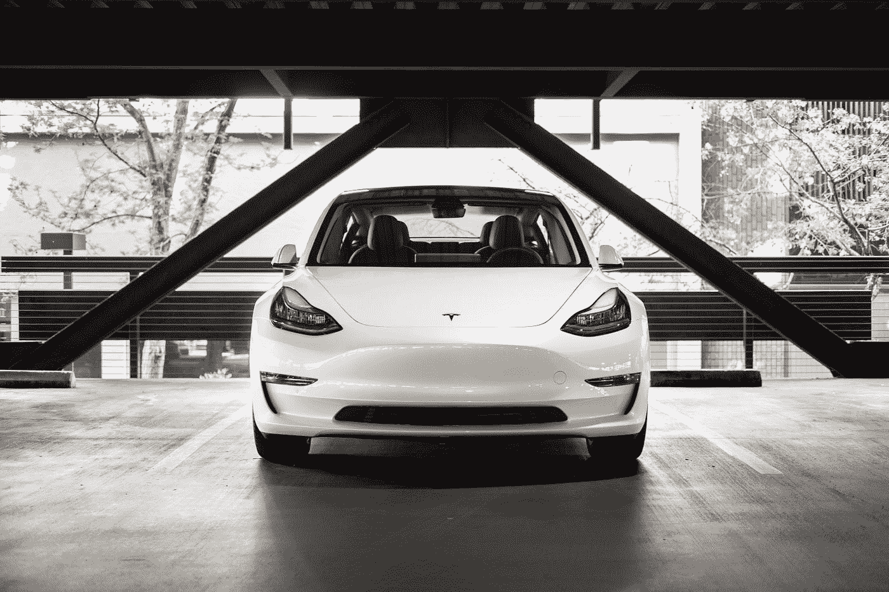

照片由[查理·迪茨](https://unsplash.com/@charliedeets?utm_source=medium&utm_medium=referral)在 [Unsplash](https://unsplash.com?utm_source=medium&utm_medium=referral) 上拍摄

# 版本 1

在自动驾驶开发之初，主要目标是让汽车在单车道内前进，并与前面的汽车保持固定的距离。当时，所有的处理都是在单个图像级别上完成的。

> 那么我们如何在图像中检测汽车或车道呢？

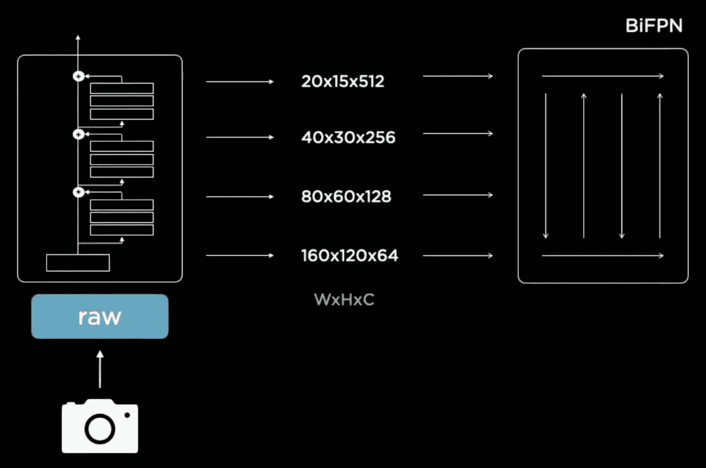

图一。多尺度特征金字塔融合的神经网络主干(来自 [*特斯拉 AI 日*](https://youtu.be/j0z4FweCy4M?t=2925) *)。*

## **特征提取流程或神经网络主干**

车载摄像头的原始图像由残差神经网络(RegNet)处理，该网络提取宽度(W) x 高度(H) x 通道(C)中的多个块或特征层。

第一个特征输出具有高分辨率(160 x 120 ),并且聚焦于图像中的所有细节。一直移动到顶层，具有低分辨率(20×15)但是具有更大的通道数(512)。直观地说，您可以将每个通道视为一个不同的过滤器，激活功能图或图像的某些部分，例如，一个通道更加强调边缘，另一个通道更加强调平滑部分。因此，顶层通过使用各种通道将更多的注意力放在上下文上。然而，较低层通过使用较高的分辨率更关注细节和细节。

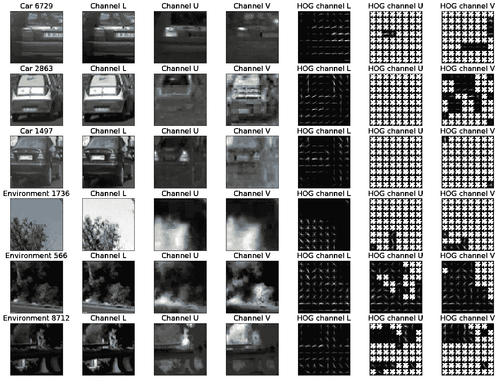

图二。由[阮明](https://medium.com/@iceberg12?source=post_page-----f607bbf860dd--------------------------------)在[媒体](https://medium.com/@iceberg12/vehicle-detection-and-tracking-f607bbf860dd)上制作的特征地图示例

多个要素层通过一个加权双向要素金字塔 **BiFPN** 相互作用。例如，第一个细节层认为它看到了一辆汽车，但不确定。在要素金字塔的顶部，上下文图层提供了对象位于道路尽头的反馈。所以，是的，它可能是一辆汽车，但由于距离太远，看不清楚。

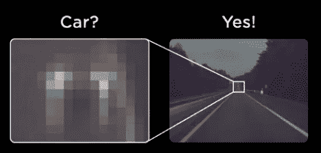

图 3。左边细节层 vs 右边上下文层(来自 [*特斯拉艾天*](https://youtu.be/j0z4FweCy4M?t=2925) *)* 。

## **多任务学习**💪🏽

输出特征不仅用于预测汽车，还用于多种任务，如交通灯检测、车道预测等。每个特定任务都有自己的解码器主干或检测头，它们是单独训练的，但它们都共享相同的神经网络主干或特征提取机制。这种建筑布局被称为**消防栓。**

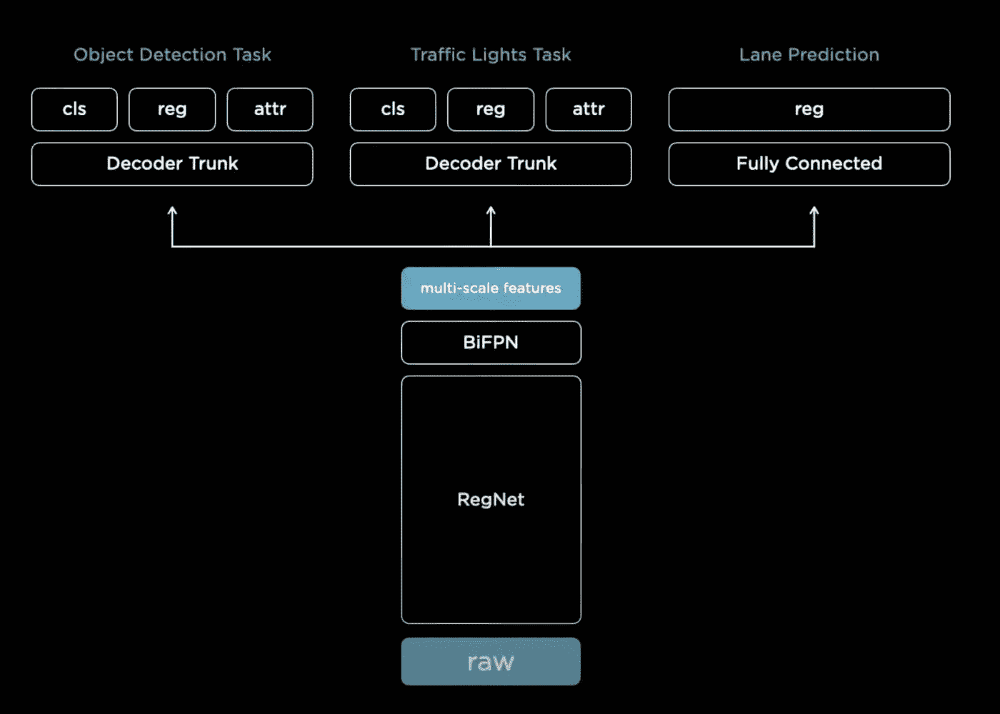

图 4。多任务学习消防栓(来自 [*特斯拉艾天*](https://youtu.be/j0z4FweCy4M?t=2925) *)*

为什么是这个消防栓？

1.  **特征共享** —运行单个神经网络主干的计算效率更高。
2.  分离任务——你可以单独微调任务，而不会影响其他预测。这创造了更多的鲁棒性。

既然我们理解了网络是如何为单个图像工作的，我们可以问自己，我们如何将多个图像组合成一个 3D 空间？毕竟，我们希望对周围环境有一个透彻的了解，尤其是如果汽车是自动驾驶的话。

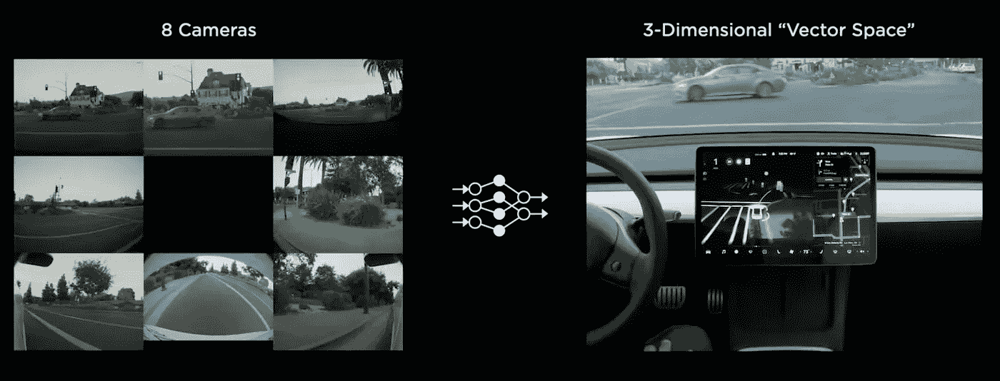

图 5。摄像机拼接到一个 3D 矢量空间(来自 [*特斯拉艾天*](https://youtu.be/j0z4FweCy4M?t=2925) *)*

## 拼接图像

特斯拉的工程师开发了一个**占位跟踪器**，以便将所有的相机图像拼接在一起。尽管付出了努力，他们很快意识到调整占用跟踪器及其所有超参数是极其复杂的。车道检测在图像上看起来很好，但当你把它投射到 3D 空间时，它看起来很糟糕。

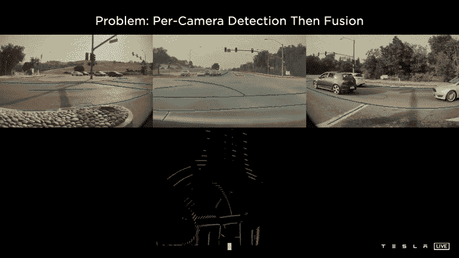

图 6。车道检测拼接成 3D 空间(来自 [*特斯拉艾天*](https://youtu.be/j0z4FweCy4M?t=2925) *)*

> 如何将特征从图像空间转换到向量空间？

# 版本 2

## **多扫描矢量空间预测**

你希望它们成为你的神经网络的一部分，这将被端到端地训练，而不是用手明确地拼接图像*。图像空间预测应映射到具有自上而下视图的栅格上。*

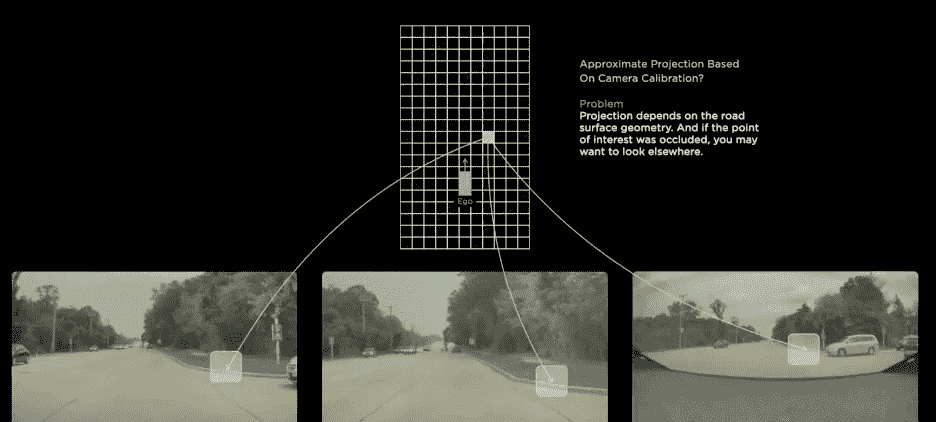

图 7。鸟瞰像素(来自 [*特斯拉艾天*](https://youtu.be/j0z4FweCy4M?t=2925) *)*

第一个挑战是路面可能会向上或向下倾斜，可能会因为车辆经过而造成堵塞。

> 那么如何学习一个模型来克服视觉障碍呢？

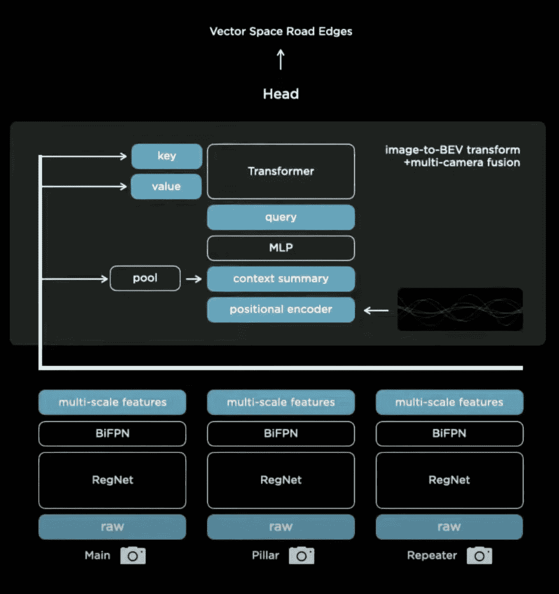

图 8。图像到鸟瞰图(BEV)的透视变换和多相机融合(来自 [*特斯拉艾天*](https://youtu.be/j0z4FweCy4M?t=2925) *)*

如果有一辆车挡住了一个视点，你要学会**注意**图像的不同部分。为了实现这一点，使用了具有多头自关注的**变压器**。

> 为了更好地理解变压器模型，你可以阅读这篇论文:[注意力是你所需要的(arXiv)](https://arxiv.org/pdf/1706.03762.pdf)

其基本工作原理是用真实世界输出空间(矢量空间)的大小初始化栅格。在输出空间中已知位置的黄色像素将向具有 8 个摄像机的神经网络询问关于该像素的信息— **查询**。关键字和查询相互作用，然后**相应地获取值**。经过一些处理后，输出将是关于该像素的一组多机位特征，可用于预测。要做到这一点，精确的校准和良好的工程设计是关键。

> 你如何处理相机校准中的变化？

## **矫正为普通虚拟摄像机**

如果你制造一辆汽车，照相机将总是以稍微不同的方式被安置。在你把图像输入神经网络之前，你需要先校准相机。最优雅的方法是使用**校正变换**将所有图像转换成**合成虚拟摄像机**。这是一种摄像机校准方法，将所有图像转换成一个通用的虚拟摄像机。

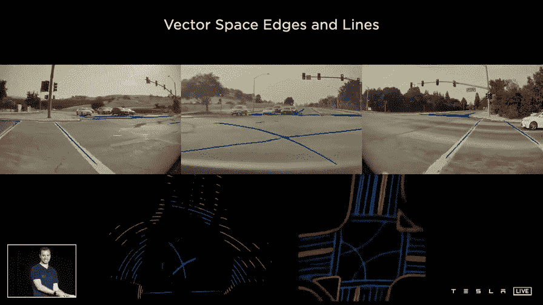

图 9。单摄像头网络左输出 vs 多摄像头网络右输出(来自 [*特斯拉 AI 日*](https://youtu.be/j0z4FweCy4M?t=2925) *)*

最终结果是一个巨大的性能改进和更好的预测直接来自神经网络。有了图像预测权之后，我们还需要考虑另一个维度——**时间**。

# 给等式增加时间

有大量的预测需要时间或视频上下文。例如，如果您想要识别一辆汽车是在停车还是在行驶。如果它在旅行，它的速度有多快？如果想预测前方道路几何，50 米前的道路标线可以有帮助等等。

> 我们如何将时间包含在网络中？

## 特征队列模块

**多尺度特征**由 transformer 模块生成，并与**运动学**连接，如速度和加速度，以及汽车的**位置跟踪。这些编码存储在特色队列中，然后由视频模块使用。**

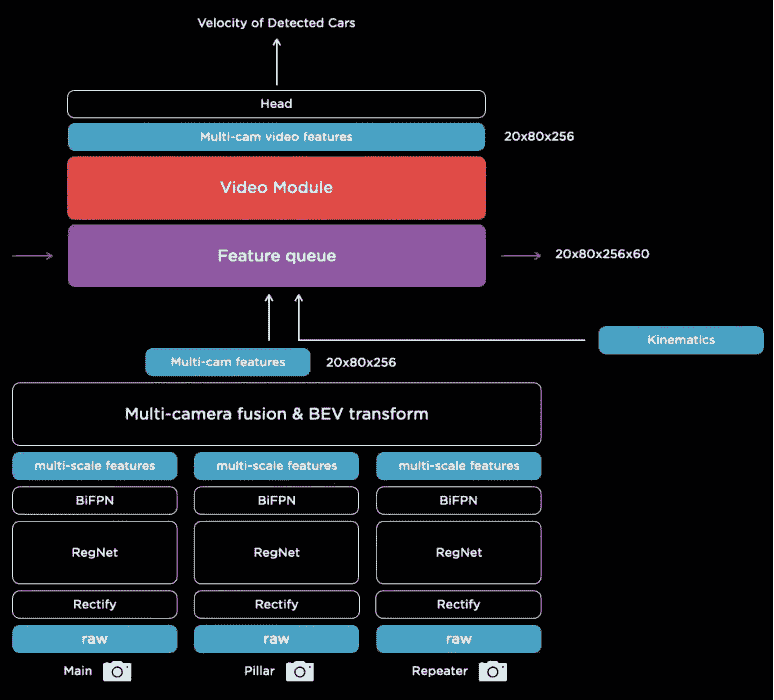

图 10。特征队列和视频模块(来自 [*特斯拉艾天*](https://youtu.be/j0z4FweCy4M?t=2925) *)*

> 我们什么时候推入特征队列？

## 基于时间的队列

最新的特性在**指定的时间框架**毫秒内被推入队列。如果汽车暂时受阻，神经网络可以查看内存并及时参考。所以它可以在某个时间点学习到某物被遮挡。

## 基于空间的队列

为了预测前方道路的几何形状，有必要阅读标线和路标。有时它们发生在很久以前，如果你只有一个基于时间的队列，当你在红灯后等待时，你可能会忘记这些特征。除了基于时间的队列，还有基于空间的队列，汽车每行驶**一定的固定距离就推送信息。**

## 视频神经网络🎥

特征队列由空间递归神经网络(RNN)消耗。RNN 跟踪任何时间点发生的事情，并有能力**选择性地读取和写入**内存或缓存队列。当汽车在周围行驶时，只有汽车附近和汽车可见的部分被更新。结果是道路的二维空间地图，具有跟踪道路的不同方面的通道。

图 11。空间 RNN(来自 [*特斯拉艾天*](https://youtu.be/j0z4FweCy4M?t=2925) *)*

## 把所有东西放在一起

首先，**原始图像**通过**矫正层**，以校正相机校准。然后，图像被传递到**残差网络**，以不同的尺度和通道将它们处理成特征。这些特征通过一个**转换模块**融合成多尺度信息，在矢量空间中表示出来。输出空间在时间或空间上被推入**特征队列**，该队列被类似空间 RNN 的**视频模块**消耗。然后，该视频模块继续进入 hydranet 的分支结构，其主干**和头部**用于所有不同的预测任务。

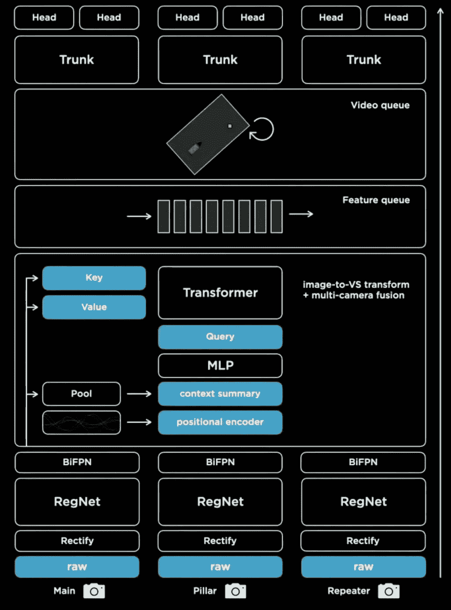

图 12。最终架构概述(来自 [*特斯拉艾天*](https://youtu.be/j0z4FweCy4M?t=2925) *)*

> 💡埃隆·马斯克(Elon Musk)宣布，特斯拉将于 2022 年 8 月 19 日举办第二个人工智能日。

感谢阅读这篇关于特斯拉自动驾驶仪的帖子。我希望它能帮助你理解特斯拉自动驾驶仪的一般概念。更多详情请见[张杰](https://saneryee-studio.medium.com/)的媒体博文[深度了解特斯拉 FSD 系列](https://saneryee-studio.medium.com/deep-understanding-tesla-fsd-part-1-hydranet-1b46106d57)。