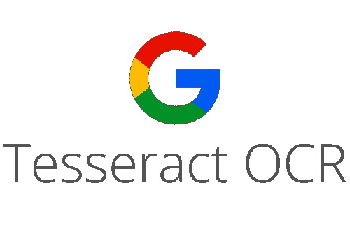
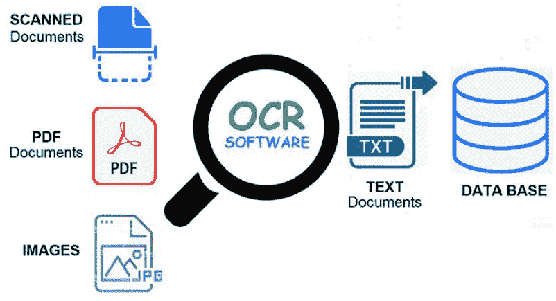
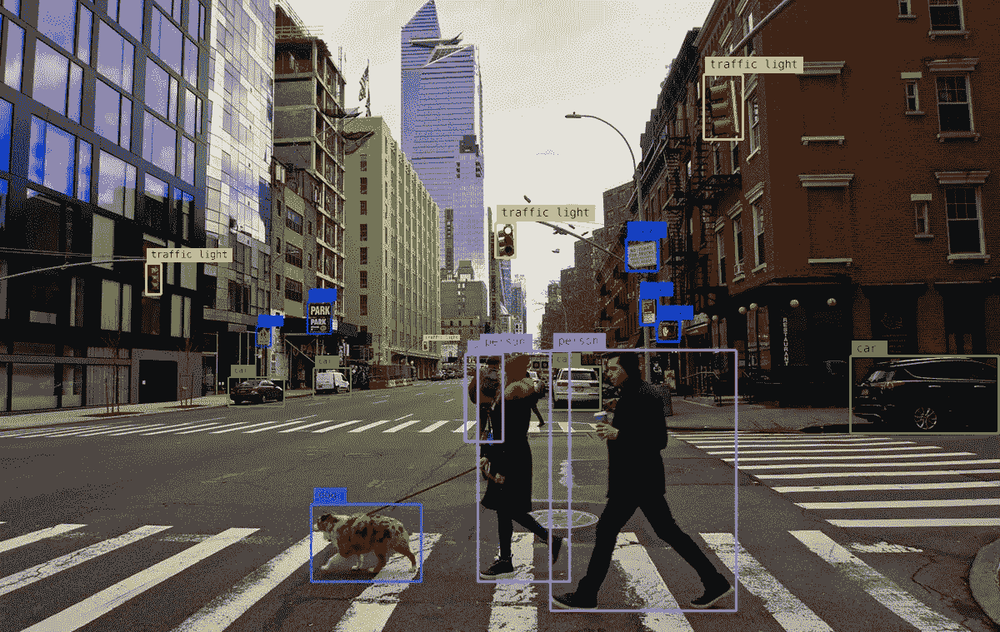
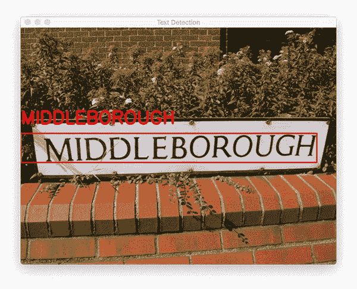
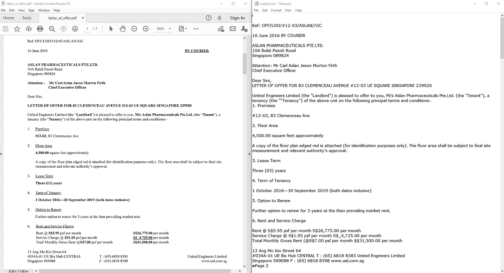
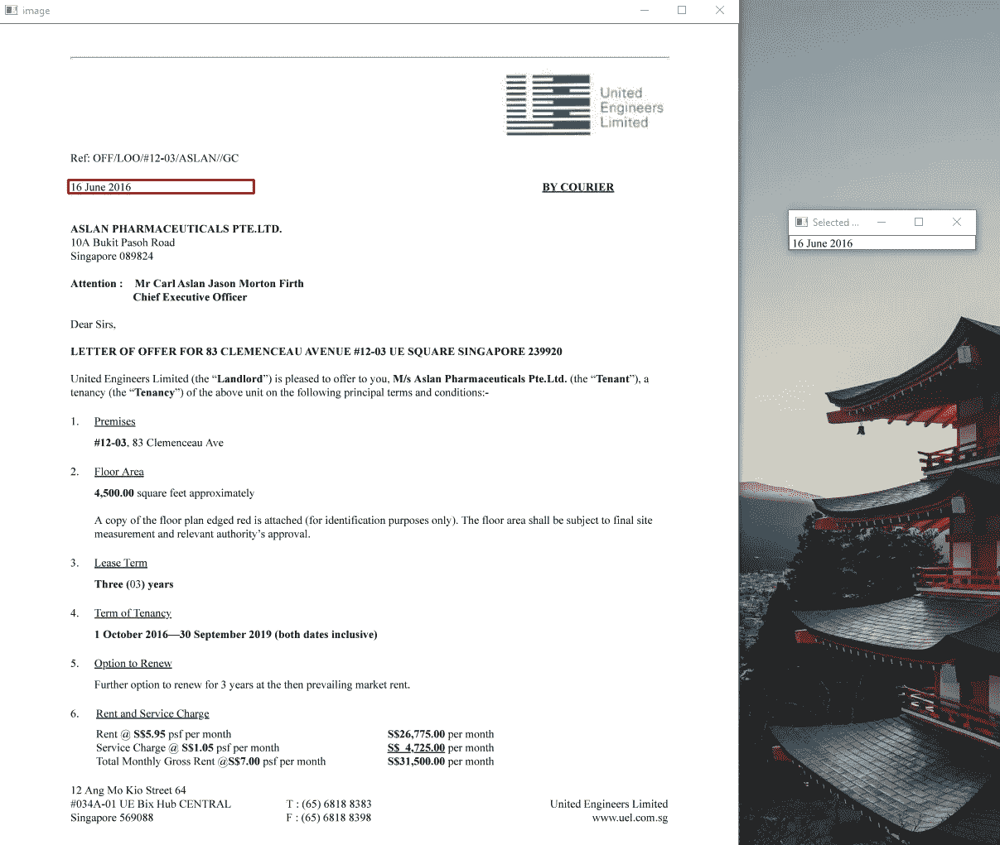
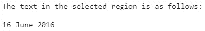
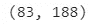
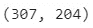
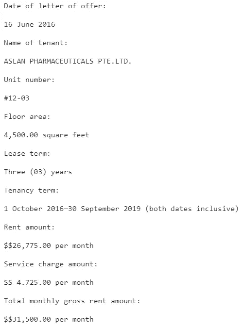

# 用于文本定位和检测的 Tesseract OCR

> 原文：<https://pub.towardsai.net/tesseract-ocr-for-text-localisation-and-detection-e217a87f9d8d?source=collection_archive---------0----------------------->

## [深度学习](https://towardsai.net/p/category/machine-learning/deep-learning)，[计算机视觉](https://towardsai.net/p/category/computer-vision)

## 从 PDF 文件中自动提取有用信息

来源:[用于低资源语言的光学字符识别(OCR)与 Tesseract 版本](https://medium.com/@isurianuradha96/training-sinhala-language-with-tesseract-4-1-version-3cd96ce84b6a)

光学字符识别(“OCR”)系统已被广泛用于向计算机化系统提供自动文本输入。然而，传统的 OCR 系统不能读取多种字体和页面格式的问题仍然没有解决。因此，传统的 OCR 对需要转换成数字形式的文档总数的影响微乎其微。

来源:[纳米网络](https://nanonets.com/blog/ocr-with-tesseract/)

当出于文本分析的目的收集数据时，人们经常以图像的形式找到来源。大多数情况下，当文件包含文本图像时，分析 PDF 格式的单词是具有挑战性的，这使得数据处理变得困难。这个问题的解决方案是使用 OCR。

OCR 是一种识别图像中文本的技术，例如扫描的文档和照片。OCR 系统将包含机器打印或手写文本的文本的二维图像从其图像表示转换成机器可读的文本。

经常使用的 OCR 工具之一是 [Tesseract](https://github.com/tesseract-ocr/tesseract) 。Tesseract 是用于各种操作系统的光学字符识别引擎。它最初是由惠普公司作为专有软件开发的，后来被谷歌公司接管开发。

# 什么是文本定位和检测？

文本检测是定位图像文本所在位置的过程。文本检测的思想可以被认为是对象检测的一种特殊形式。

在**对象检测**中，目标是检测和计算图像中所有对象的边界框，并确定每个边界框的类别标签。物体检测的一个例子如下:

来源: [AlwaysAI](https://learn.alwaysai.co/object-detection)

而使用**文本检测**，目标是自动计算图像中每个文本区域的边界框，如下所示:

来源: [pyimagesearch](https://www.pyimagesearch.com/2018/09/17/opencv-ocr-and-text-recognition-with-tesseract/)

一旦在图像中定位并检测到文本，就可以使用 OCR 软件对其进行解码。

在本文中，我们将阅读 PDF 文件的内容，将页面转换为图像，然后探索使用 Tesseract OCR 进行文本定位和检测。

# 问题陈述:使用 Tesseract OCR 从聘书中提取必填字段。

# 资料组

考虑到这些[租赁单元的样本租赁文件](https://www.sec.gov/Archives/edgar/data/1722926/000119312518095928/d496922dex108.htm)，我们将提取第 1 页到第 7 页(PDF 格式)作为工作要约书。

# 开始编码吧！

PyTesseractt 是一个 python 包装器库，它使用 tesserac 引擎进行 OCR。务必从 UB Mannheim 的[宇宙魔方下载并安装宇宙魔方引擎，并正确设置环境变量和路径变量。](https://github.com/UB-Mannheim/tesseract/wiki)

如果您的路径中没有 tesseract 可执行文件，请包含以下代码行以及保存 tesseract 引擎的路径位置:

# 使用 Python 通过 OCR 读取 PDF 内容

Python 被广泛用于分析数据，这些数据可能并不总是理想的文本格式。在这种情况下，各种图书馆可以将 PDF 或 JPG 格式转换为文本格式，以便以更好的方式分析数据。

使用这些库的主要缺点是编码方案。PDF 文档可以有多种编码，包括 UTF 8、ASCII、Unicode 等。因此，由于编码方案的原因，将 PDF 转换为文本可能会导致数据丢失。

为了读取 PDF 文件的所有内容并使用 OCR 将其存储在文本文档中，我们首先需要将 PDF 页面转换为图像，然后使用 OCR 从图像中读取内容并将其存储在文本文件中。

将输入 PDF 文件(左)转换为输出文本文件(右)

结果，PDF 文件的页面被转换成图像，读取并将其内容写入文本文件。

**这种方法的优点:**

1.  避免基于文本的转换，因为编码方案会导致数据丢失。
2.  由于使用了 OCR，可以识别 PDF 格式的手写内容。
3.  仅识别 PDF 的特定页面成为可能。
4.  获取作为变量的文本，以便可以执行任何数量的所需预处理。

**这种方法的缺点:**

1.  磁盘存储用于存储本地系统中的图像。
2.  使用光学字符识别不能保证 100%的准确性，尽管计算机输入的 PDF 文档具有非常高的准确性。
3.  手写 pdf 仍可识别，但准确性取决于各种因素，如笔迹、背景噪音、页面颜色等。

# 使用 Tesseract OCR 定位和检测文本

> 将 PDF 文件完全转换成文本文件可能很有用，但是我们真的需要所有这些内容吗？

当在审计期间给出一个场景时，Tesseract OCR 的部署将非常有用，其中:

(1)我们知道哪些是我们想要关注的必填字段

(2)要约书是被审计单位使用的标准模板

(3)我们希望通过为将来的审计测试自动提取已识别的字段来提高工作效率和准确性

使用 Python 从前面部分生成的 JPG 图像，我们将读取 *page_1.jpg* 作为输入图像并调整其大小。

**步骤 1:** 使用鼠标从调整大小的输入图像中选择感兴趣区域(“ROI”)。

选定的感兴趣区域用红框表示

**第二步:**对选中的感兴趣区域执行**tesserac OCR，并打印输出文本。**

****

**如上图所示的输出文本，Tesseract OCR 已经成功地以文本格式解释了选定的 ROI。**

****第三步:**提取坐标创建第一个变量— ***lo_date*** 。**

********

****步骤 4:** 重复步骤 1 至 3，创建其余变量。**

**重新载入调整大小的输入图像作为一个干净的 JPG 文件副本。**

**为了从标准报价信中自动提取所选字段，在**步骤 3** 中提取的所选字段的坐标被分配给各自的变量。**

**我们现在可以对分配的变量执行Tesseract OCR 并打印输出结果。**

****

**使用 Tesseract OCR 从已签署的要约函(PDF 格式)中提取和读取的上述输出可以保存到 excel 或文本文件中，以便使用审计软件(如[enlight](https://www.wegalvanize.com/rebrand/)(以前称为 ACL)或 [IDEA](https://idea.caseware.com/) )进行进一步的数据分析。这些有用的信息可以与系统生成的数据相匹配，以确保系统中的数据输入相对于签署的聘书是准确的。减轻了由眼球检查引起的人为错误的风险。**

# **结论**

**随着我们进入数字化的新规范，OCR 的使用也有了巨大的改进，从传统方法到更先进的方法，如 Tesseract OCR。使用 Tesseract 执行文本检测和 OCR 的好处是，我们可以在一个函数调用中轻松完成，这比[多阶段 OpenCV OCR 过程](https://www.pyimagesearch.com/2018/09/17/opencv-ocr-and-text-recognition-with-tesseract/)更容易。**

**对于问题陈述，ROI 的选择和坐标的提取可能很繁琐，但请注意，这是一次性练习，因为要约书是被审计实体对所有租户使用的标准模板。这为在审计测试中使用自动化创造了机会。它的优点不仅包括提高了准确性和工作效率，而且还能够在更广的覆盖范围内进行样品测试。**

**除了关注数字和图形的常见数据分析之外，我们可以进一步探索自然语言处理的使用，以从文本分析中释放洞察力。一定要看看我以前在 **NLP** 上的文章:**

** [## 利用自然语言处理释放文本分析的力量

### 主题建模的潜在狄利克雷分配和文本分类的朴素贝叶斯

medium.com](https://medium.com/towards-artificial-intelligence/unlock-the-power-of-text-analytics-with-natural-language-processing-2e6d83b35f99) 

最后但同样重要的是，Tesseract OCR 最适合构建扫描和处理图像的文档处理管道。这最适合高分辨率输入的情况，在这种情况下，前景文本从背景中清晰地分割出来。为了清理扫描但不干净的文档，使执行 OCR 更加准确，请查看我以前关于 **CycleGAN** 的文章:

 [## CycleGAN 作为 OCR 图像去噪引擎

### 将扫描但不干净的文档清理到原始形式。对于一个干净的文档，执行 OCR 将是一个非常…

medium.com](https://medium.com/towards-artificial-intelligence/cyclegan-as-a-denoising-engine-for-ocr-images-8d2a4988f769) 

# 参考

1.  [使用 Tesseract、OpenCV 和 Python 进行 OCR 的综合指南](https://nanonets.com/blog/ocr-with-tesseract/)
2.  [Tesseract OCR:文本定位和检测](https://www.pyimagesearch.com/2020/05/25/tesseract-ocr-text-localization-and-detection/)
3.  [使用 OCR(光学字符识别)读取 PDF 内容](https://www.geeksforgeeks.org/python-reading-contents-of-pdf-using-ocr-optical-character-recognition/)**