# 使用 Python 测试正态性:完全指南

> 原文：<https://pub.towardsai.net/test-for-normality-using-python-complete-guide-5ae98fb24c2a?source=collection_archive---------0----------------------->

## 在本教程中，我们将探索如何使用 Python 测试正态性。


[Marcin Jozwiak](https://unsplash.com/@marcinjozwiak?utm_source=unsplash&utm_medium=referral&utm_content=creditCopyText) 在 [Unsplash](https://unsplash.com/s/photos/distribution?utm_source=unsplash&utm_medium=referral&utm_content=creditCopyText) 上拍摄的照片

**目录**

*   介绍
*   正态性检验的样本数据
*   Python 中的 Q-Q 图
*   Python 中的 Jarque-Bera 测试
*   Python 中的 Kolmogorov-Smirnov 测试
*   Python 中的 Anderson-Darling 测试
*   Python 中的夏皮罗-维尔克测试
*   正态性检验结果比较
*   结论

# 介绍

在本教程中，我们将对微软股票回报的 52 个观察值的样本数据执行 Python 中的 Jarque-Bera 测试、Python 中的 Kolmogorov-Smirnov 测试、Python 中的 Anderson-Darling 测试和 Python 中的 Shapiro-维尔克测试。

我们还会比较每个测试的结果，并提及它们的优缺点。

要继续学习本教程，我们需要以下 Python 库:

*熊猫*、 *numpy* 、 *matplotlib* 、 *seaborn* 和 *scipy* 。

如果您没有安装它，请打开“命令提示符”(在 Windows 上)并使用以下代码安装它:

```
pip install pandas
pip install numpy
pip install matplotlib
pip install seaborn
pip install scipy
```

# 正态性检验的样本数据

在本文中，我们将研究微软股票的每周历史收益率。让我们考虑 2018 年 1 月 1 日到 2018 年 12 月 31 日之间的时间段。这些数据可以很容易地从雅虎上下载。财务。

继续下载数据。csv 格式，并将其保存在与。py 文件和我们将要构建的代码。

现在我们已经下载了数据，让我们将它导入 Python 并选择具有观察日期和收盘价的列:

显示带有股票价格的前几行数据:

我们应该得到:

```
 Date        Close
0  2018-01-01  88.190002
1  2018-01-08  89.599998
2  2018-01-15  90.000000
```

正如您将看到的，该文件包含 53 周的微软股票价格数据。现在，我们想处理股票的回报，而不是价格本身，所以我们需要做一些数据处理:

显示股票收益数据的前几行:

我们应该得到:

```
 Date        return
0  2018-01-01  0.015988
1  2018-01-08  0.004464
2  2018-01-15  0.045111
```

为了更好地理解这些数据，特别是为什么我们要将价格转换为回报，然后我们要使用 Python 来测试其正态性，让我们使用直方图来可视化数据:

我们得到了:


请注意，数据的分布看起来有点像正态分布。但真的是这样吗？这就是我们将在接下来的章节中使用不同的统计方法来回答的问题！

# Python 中的 Q-Q 图

我们将从一种更直观、更少数学的方法开始，分位数-分位数图。

什么是分位数-分位数图？该图显示了给定数据相对于正态分布的分布，即现有分位数相对于正态理论分位数。

让我们使用 Python 为我们的数据创建 Q-Q 图，然后解释结果。

我们应该得到:

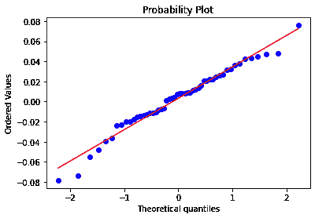

看上面的图表，我们看到一个向上倾斜的线性关系。对于正态分布，观察值应该都出现在 45 度直线上。我们在上面看到这样的关系了吗？我们做了一部分。所以这可以告诉我们的是，我们正在研究的分布并不完全是正态分布，而是接近正态分布。

# Python 中的 Jarque-Bera 测试

Jarque-Bera 是一种正态性测试，或者具体来说是一种将[偏斜度](https://pyshark.com/skewness-in-python/)和[峰度](https://pyshark.com/kurtosis-in-python/)与正态分布相匹配的拟合优度测试。

它的统计量是非负的，大值表示明显偏离正态分布。

Jarque-Bera 的测试统计量 JB 定义如下:


作者图片

其中 **S** 为样本[偏度](https://pyshark.com/skewness-in-python/)， **K** 为样本[峰度](https://pyshark.com/kurtosis-in-python/)， **n** 为样本量。

假设:

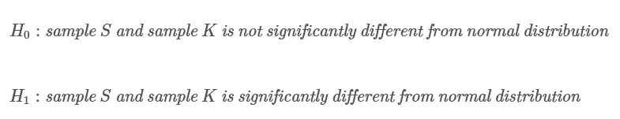

作者图片

现在，我们可以用 Python 计算 Jarque-Bera 测试统计量，并找到相应的 p 值:

我们应该得到:

```
JB statistic: 1.937410519618088
p-value: 0.37957417002405025
```

查看这些结果，我们无法拒绝零假设，并得出样本数据遵循正态分布的结论。

注意:Jarque-Bera 检验在大样本(通常大于 2000 个观察值)中工作正常，其统计量具有 2 个自由度的卡方分布。

# Python 中的 Kolmogorov-Smirnov 测试

最常见的正态性检验之一是 Kolmogorov-Smirnov 检验(或 K-S 检验)。与其他检验相比，Kolmogorov-Smirnov 检验的一个主要优点是非参数的，这意味着它是无分布的。

这里我们关注单样本 Kolmogorov-Smirnov 检验，因为我们希望将一维概率分布与理论上指定的分布(在我们的例子中是正态分布)进行比较。

Kolmogorov-Smirnov 检验统计量测量样本的经验分布函数(ECDF)和参考分布的累积分布函数之间的距离。

在我们的例子中，经验分布函数将来自我们之前收集的收益数据。由于我们将它与正态分布进行比较，我们将使用正态分布的累积分布函数。

到目前为止，这听起来非常专业，所以让我们试着把它分解并形象化，以便更好地理解。

**第一步:**

让我们用回报率数据的平均值和标准差从正态分布中创建一个值数组:

使用 [np.random.normal()](https://numpy.org/doc/stable/reference/random/generated/numpy.random.normal.html) 我们创建了 **data_norm** ，这是一个具有与**df[' return ']【T7]相同数量的观察值的数组，并且具有相同的平均值和标准偏差。**

这里的直觉是，如果我们假设分布的一些参数(均值和标准差)，那么具有这些参数的数字将形成正态分布。

**第二步:**

接下来，我们要做的是在两个数据集上使用 [np.histogram()](https://numpy.org/doc/stable/reference/generated/numpy.histogram.html) 对它们进行排序，并将其分配到箱中:

注意:默认情况下，该函数将使用**bin = 10**，您可以根据正在处理的数据进行调整。

**第三步:**

使用 [np.cumsum()](https://numpy.org/doc/stable/reference/generated/numpy.cumsum.html) 计算上面创建的数组的累积和:

**第四步:**

绘制累积分布函数:

您应该得到:

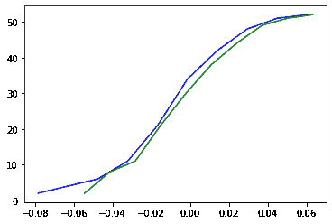

作者图片

其中蓝线是**df[‘收益’]**的 ECDF(经验累积分布函数)，绿线是正态分布的 CDF。

**第四步备选**:

您可以使用 seaborn 更快地创建图形，并且只需要步骤 1 中的 **df['return']** 和 **data_norm** :

您应该得到:

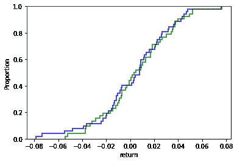

在可视化这两个累积分布函数之后，现在让我们回到 Kolmogorov-Smirnov 测试。Kolmogorov-Smirnov 检验基于这两条曲线(蓝色-绿色)之间的最大距离，并有以下假设:

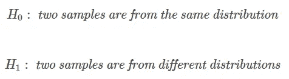

作者图片

我们将 ECDF 定义为:

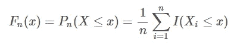

作者图片

它计算低于水平 **x** 的样本观察值的比例。

我们定义一个给定的(理论上的)CDF 为: **F(x)** 。在检验正态性的情况下， **F(x)** 是正态分布的 CDF。

Kolmogorov-Smirnov 统计量定义为:

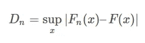

作者图片

直观地说，该统计测量所有 **x** 值的两个分布函数之间的最大绝对距离。

使用上面的图表，这是我估计的上确界:

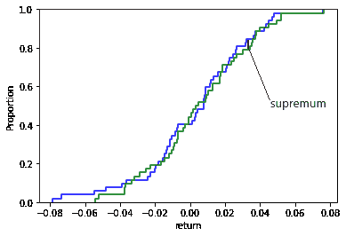

计算 **D_n** 的值，并与 **D_{0.05}** 的临界值(假设 5%)进行比较，可以拒绝或者不拒绝零假设。

回到我们的例子，让我们用 Python 对微软股票回报数据执行 K-S 测试:

我们应该得到:

```
K-S statistic: 0.46976096086398267
p-value: 4.788934452701707e-11
```

由于 p 值明显小于 0.05，我们拒绝零假设，接受另一个假设，即测试的两个样本不是来自同一个累积分布，这意味着微软股票的回报不是正态分布。

# Python 中的 Anderson-Darling 测试

安德森-达林试验(A-D 试验)是对上述[科尔莫戈罗夫-斯米尔诺夫试验](https://pyshark.com/test-for-normality-using-python/#kolmogorov-smirnov-test-in-python)的改进。它测试给定的观察样本是否来自给定的概率分布(在我们的例子中，来自正态分布)。

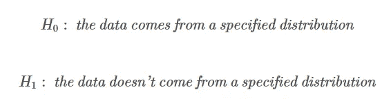

作者图片

A-D 检验比 K-S 检验更有效，因为它考虑了数据中的所有值，而不仅仅是产生最大距离的值(如 K-S 检验)。它还为拟合分布的尾部分配更多的权重。

该检验属于二次经验分布函数(EDF)统计，由下式给出:

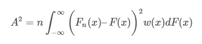

作者图片

其中 **F** 是假设的分布(在我们的例子中是正态分布)， **F_n** 是 ECDF(计算方法在[前面的章节](https://pyshark.com/test-for-normality-using-python/#kolmogorov-smirnov-test-in-python)中讨论过)，而 **w(x)** 是加权函数。

加权函数由下式给出:

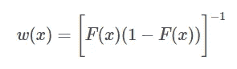

作者图片

这允许对分布尾部的观察值给予更大的权重。

给定这样的加权函数，测试统计可以简化为:

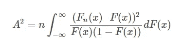

作者图片

假设我们有一个数据样本\(X\)，我们想测试这个样本是否来自正态分布的累积分布函数(\(F(x)\)。

我们需要对数据进行排序，以便{x_1 < x_2 < … < x_n} and then compute the **A** 统计为:

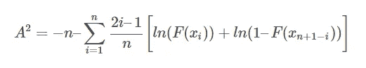

作者图片

回到我们的例子，让我们用 Python 对微软股票回报数据执行 A-D 测试:

我们应该得到:

```
A-D statistic: 0.3693823006816217
Critical values: [0.539 0.614 0.737 0.86 1.023]
Significance levels: [15\. 10\. 5\. 2.5 1\. ]
```

输出的第一行是 A-D 检验统计量，大约为 0.37；输出的第三行是具有不同显著性级别(从 15%到 1%)的列表；输出的第二行是相应显著性水平的临界值列表。

假设我们想在 5%的水平上测试我们的假设，这意味着我们将使用的临界值是 0.737(来自上面的输出)。由于计算机 A-D 检验统计量(0.37)小于临界值(0.737)，我们无法拒绝零假设，并得出微软股票收益率的样本数据来自正态分布的结论。

# Python 中的夏皮罗-维尔克测试

夏皮罗-维尔克检验(S-W 检验)是统计学中的另一种正态性检验，假设如下:

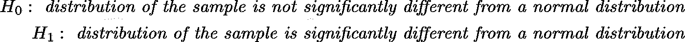

作者图片

与 [Kolmogorov-Smirnov 测试](https://pyshark.com/test-for-normality-using-python/#kolmogorov-smirnov-test-in-python)和 [Anderson-Darling 测试](https://pyshark.com/test-for-normality-using-python/#anderson-darling-test-in-python)不同，它不基于 ECDF 和 CDF 进行统计计算，而是使用从正态分布样本的矩生成的常数。

沙皮罗-维尔克检验统计量定义为:

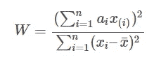

作者图片

其中 **x_{(i)}** 是样本中第(I)个最小的数(x _ { 1 }<x _ { 2 }<…<x _ { n })；和 **a_i** 是从 [var](https://pyshark.com/compute-variance-covariance-matrix-using-python/) 、 [cov](https://pyshark.com/compute-variance-covariance-matrix-using-python/) 生成的常数，表示正态分布样本。

回到我们的例子，让我们用 Python 对微软股票回报数据执行 S-W 测试:

我们应该得到:

```
S-W statistic: 0.9772366881370544
p-value: 0.41611215472221375
```

给定大于 0.05 (>0.05)的大 p 值(0.42)，我们无法拒绝零假设并得出样本与正态分布没有显著差异的结论。

注意:这个测试的最大限制之一是大小偏差，这意味着样本越大，你越有可能得到一个有统计学意义的结果。

# 正态性检验结果比较

下表列出了本文中讨论的正态性检验的结果，以及它们使用 52 个微软股票回报观察值的样本大小的表现。

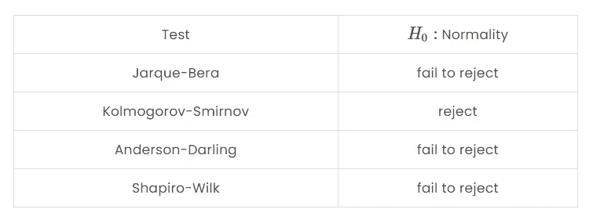

作者图片

# 结论

在本文中，我们讨论了如何使用 Python 和 scipy 库测试正态性。

我们用 Python 进行了 Jarque-Bera 检验，用 Python 进行了 Kolmogorov-Smirnov 检验，用 Python 进行了 Anderson-Darling 检验，用 Python 进行了 Shapiro-维尔克检验。我们还比较了每个测试的结果，并提到了它们的优缺点。

如果您有任何问题或对一些编辑有建议，请随时在下面留下评论，并查看更多我的[统计](https://pyshark.com/category/python-programming/)文章。

*原载于 2021 年 9 月 5 日*[*【https://pyshark.com】*](https://pyshark.com/test-for-normality-using-python/)*。*