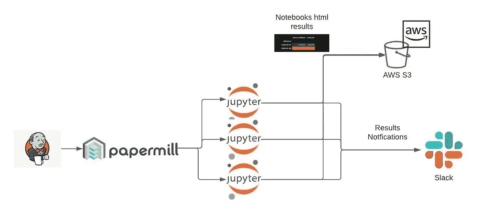
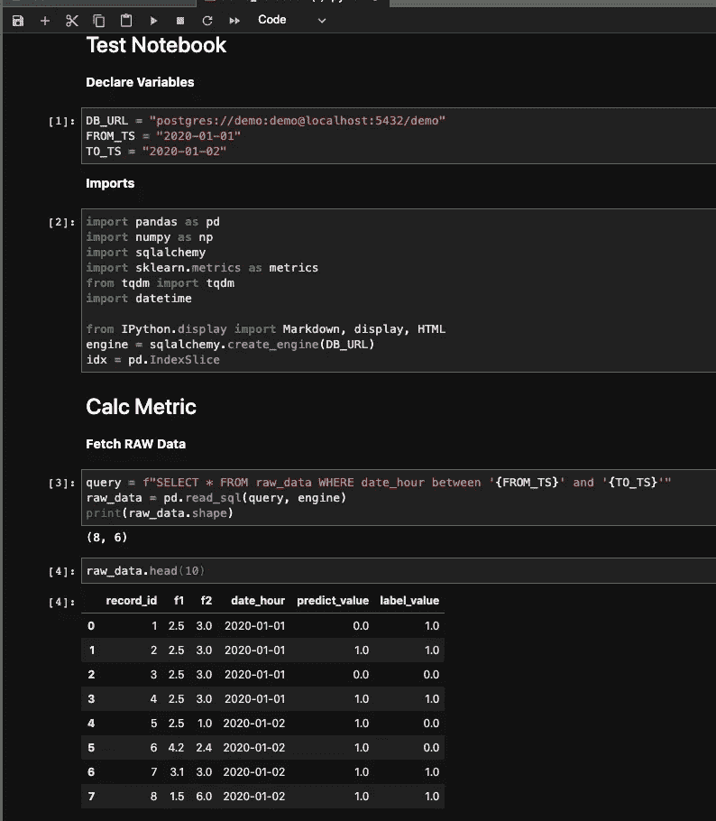
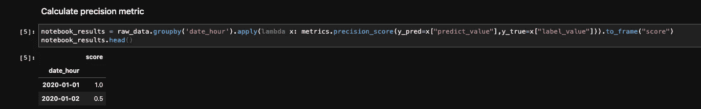
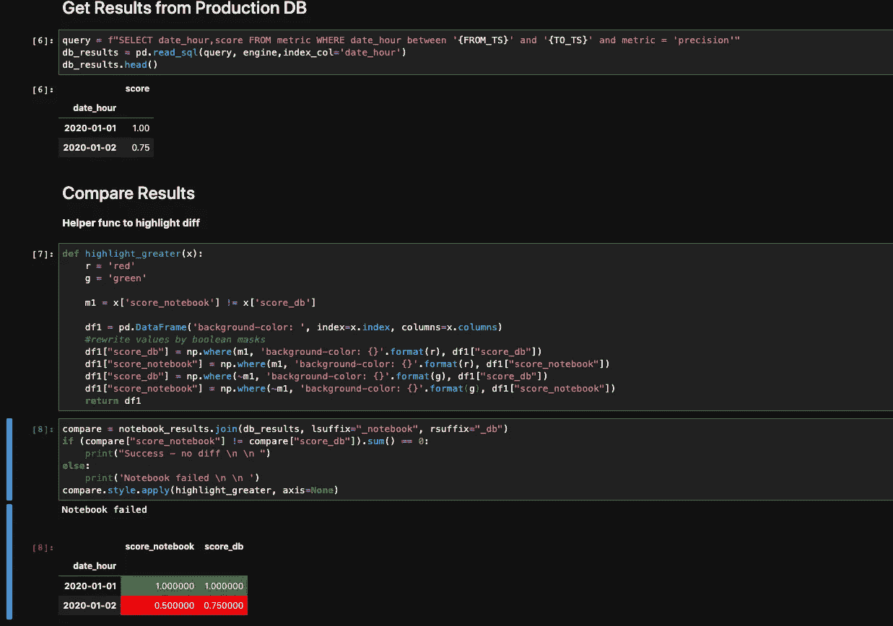

# 测试数据驱动的微服务

> 原文：<https://pub.towardsai.net/testing-data-driven-microservices-a56a77d839b7?source=collection_archive---------2----------------------->

## [编程](https://towardsai.net/p/category/programming)

测试总是开很多题，测试哪些案例？有哪些边缘案例？使用哪个测试平台..等等。
这些问题没有单一的答案。

但是当涉及到测试微服务时，复杂程度就提高了一个档次。因为它们经常要处理大量不同性质的数据。此外，微服务体系结构要求数据在组件(MQ、数据库……)之间传递，这可能会导致难以检测的侵蚀和损坏，例如:当数据流入微服务之间的 MQ 时，会发生舍入，或者发生转换错误，从而导致“静默”问题。从这个意义上说，数据的完整性是速度和多样性之外的另一个挑战。

此外，数据服务通常会执行大量的计算功能，例如:最小值、最大值、卡方值、对数损失、标准差……在处理大批量数据和计算这些计算功能时，错误开始出现在数据的粒度部分。

此外，在微服务架构中工作时，我们希望确保应用程序的完整性。使用微服务需要在许多组件(MQ、数据库……)之间传递数据，这有时会导致我们甚至不知道的数据损坏。
例如，当微服务和数据之间的数据流进入 MQ 时，会产生舍入或转换错误，从而导致无法捕获的问题。

总之，这些错误是如此难以发现，以至于在测试阶段选择正确的边缘案例成为一项(几乎)不可能完成的任务。这就是我想要解决的问题，并试图在这里简化。

让我们来谈谈当今大多数数据科学团队都在使用的一个神奇的工具，叫做 Jupyter Notebook。该工具通过交互式可视化为数据分析和探索提供了一个高效的界面。在使用这个工具并实现 Jupyter 笔记本中的所有计算功能时，我发现选择边缘情况要容易得多，因为它们很清楚，几乎毫不费力就可以看到。

**使用 Jupyter Notebook 进行测试的具体例子** 在下面选择的例子中，我们将回顾一下测试基于 Jupyter Notebook 的数据微服务。在这种情况下，我们计算了笔记本电脑中的所有计算功能，并将它们与存储在数据库中的微服务结果进行了比较，从而可以轻松检测和修复结果中的任何差异。

在编写测试笔记本之后，测试笔记本应该与 CI 集成，以避免每天手动运行测试。

将笔记本作为 CI 部分的一部分运行的一个很酷的框架是“Papermill”，这是一个参数化和执行 Jupyter 笔记本的伟大工具。
它允许您使用 CLI 运行笔记本电脑，并保存笔记本电脑的输出，以便以后进行诊断。

最后，我们可以配置测试笔记本，以便在笔记本的结果与我们的 slack 通道有差距时发送通知，我们使这个测试管道完全自动化。

整个管道的示意图:



测试平台架构

在图中，我们可以看到 Jenkins 触发 CI 来启动 Papermill 工具，该工具运行所有的测试 Jupyter 笔记本。一旦笔记本完成运行，它们的输出将存储在 AWS S3 中，笔记本的结果(通过或失败)将被发送到 Slack。

**在理解了整个架构之后，让我们标记一下使用 Jupyter 笔记本进行测试的好处:**

**V** 运行海量数据。

**V** 作为 CI 的一部分运行，确保应用程序的完整性。

**V** 支持即时诊断和数据探索探索。

**V** 对错误和边缘情况给出清晰可见的见解。

v 易于调试。

现在，让我们执行一个简单的“入门”任务，使用 Jupyter Notebook 和 Papermill 进行测试。

假设我们每天都在计算一个 [*精度*](https://en.wikipedia.org/wiki/Precision_and_recall) 指标，并将其用于以后的分析和性能测量。

我们希望确保应用数据库中存储的精度是正确的，因为它会影响我们的业务决策。

所以让我们为它创建测试。

第一步是创建一个笔记本，它从应用程序中获取原始数据。



Jupyter 笔记本—第 1 部分

原始数据包括两个日期(“2020–01–01”和“2020–01–02”)的预测记录和实际值。

在创建笔记本的第一阶段后，我们应该根据原始数据计算精度指标，这将是我们想要与生产数据进行比较的真实精度。



Jupyter 笔记本—第二部分

在这里，我们可以看到“2020–01–1”的精度值是 1.0(这是一个很好的统计数据！)而在 2020 年 1 月 2 日，这个数字是 0.5。

最后，我们必须从生产数据库中获取我们的精度结果，并将它们与实际结果(笔记本结果)进行比较。



朱庇特笔记本—第三部分

在最后一个单元格中，我们可以看到在“2020–01–02”中，笔记本电脑结果和生产数据库结果之间的结果是不同的，并且它们以红色着色，以便于识别和修复。

所以现在，我们有了一个测试笔记本，可以验证我们需要的每个时间框架的精度正确性，如果有一些差距，它们很容易检测和修复。

对于创建的笔记本，还有另外一件额外的事情要做。我们可以将笔记本集成为 CI 的一部分，因为它可以使用 Papermill 工具在夜间(或在另一个时间表中)运行。

要安装 Papermill，请运行命令:

```
$ pip install papermill
```

要运行 Papermill 并将结果存储在 AWS S3(可能在其他任何地方)并传递时间范围参数:

```
$ papermill local/metric_calc.ipynb s3://notebooks/nightly/results/metric_calc_output.ipynb -p FROM_TS 2020-01-01 -p TO_TS 2020-01-02
```

现在，我们可以在早上看到结果，看看我们的系统是否有一些错误，并确保我们的应用程序正常工作！

另一个有价值的技巧是集成笔记本，以便在结果有差距时向 Slack 通道发送通知。

**注:**

*   您可以将 papermill 的结果集成到其他云提供商。

**参考文献:**

*   【https://github.com/nteract/papermill】T4。
*   [https://github.com/keitakurita/jupyter-slack-notify](https://github.com/keitakurita/jupyter-slack-notify)。
*   [https://jupyter.org/documentation](https://jupyter.org/documentation)。

> *链接到试玩笔记本:* [***笔记本***](https://superwise-public.s3.amazonaws.com/demo_notebook.ipynb) ***。***
> 
> 作者:Oryan Omer — superwise.ai