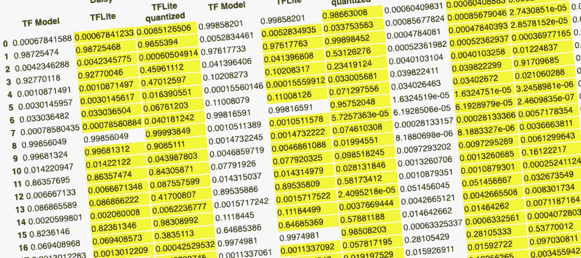
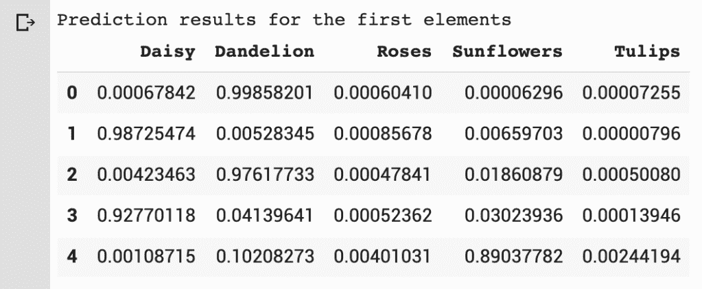
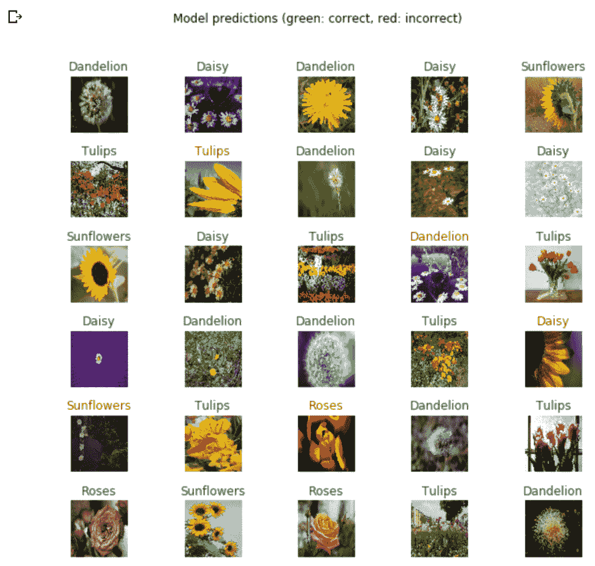
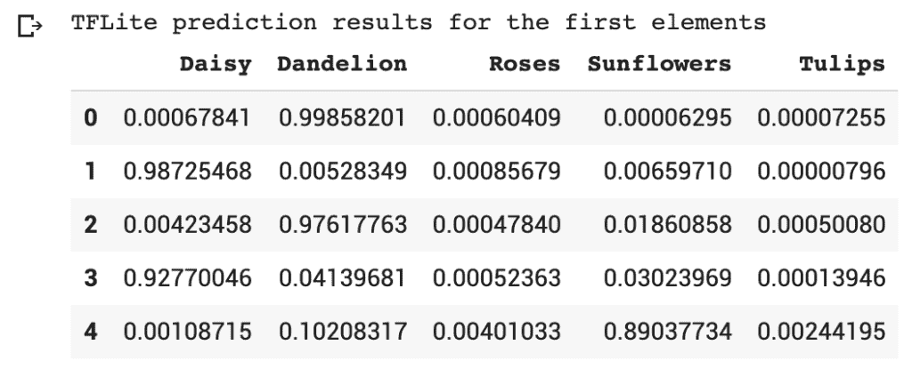
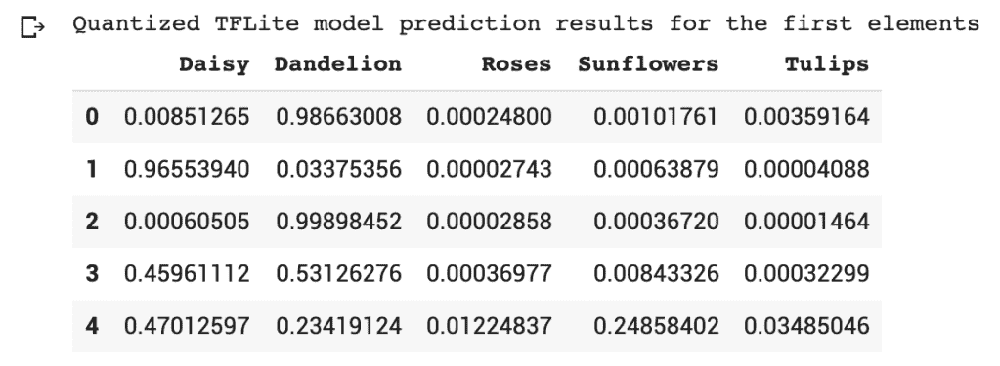
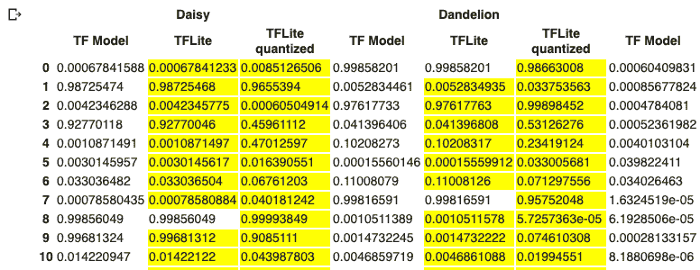
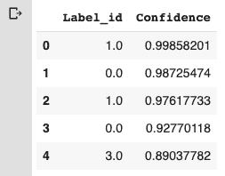
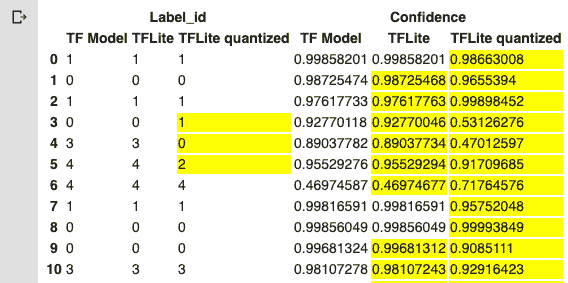
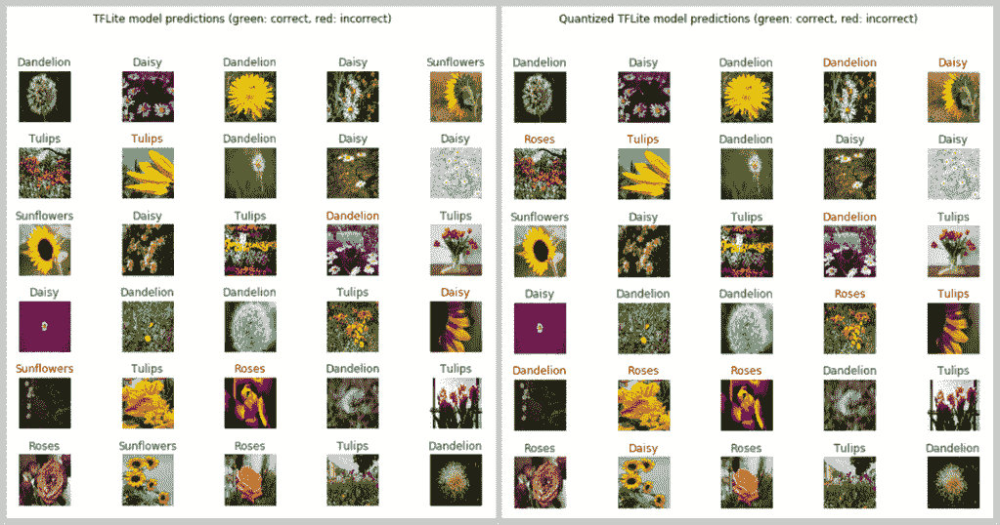

# 测试 TensorFlow Lite 影像分类模型

> 原文：<https://pub.towardsai.net/testing-tensorflow-lite-image-classification-model-e9c0100d8de3?source=collection_archive---------0----------------------->

## [机器学习](https://towardsai.net/p/category/machine-learning)

## 确保您的 ML 模型在移动应用程序上正确工作(第 1 部分)

*本文最初发表于*[*think mobile . dev*](https://thinkmobile.dev)*—一个关于在移动应用中实现智能解决方案的博客(* [*链接到文章*](https://thinkmobile.dev/testing-tensorflow-lite-image-classification-model/) *)。*

寻找如何在移动设备上自动测试 TensorFlow Lite 模型？检查本条的[第二部分。](https://thinkmobile.dev/automate-testing-of-tensorflow-lite-model-implementation/)

随着时间的推移，构建 TensorFlow Lite 模型并在移动应用程序上部署它们变得越来越简单。但是即使有了更容易实现的库和 API，仍然有至少三个主要步骤要完成:

1.  建立张量流模型，
2.  将其转换为 TensorFlow Lite 模型，
3.  在移动应用程序上实施。

在这些步骤之间需要传递一组信息—模型输入/输出形状、值格式等。如果你知道它们(例如，感谢在[这篇](https://thinkmobile.dev/inspecting-tensorflow-lite-image-classification-model/)博客文章中描述的可视化技术和工具)，还有另一个问题，许多软件工程师都在努力解决。

> **为什么在移动应用上实现的模型与在 python 环境中实现的不同？**
> 
> **软件工程师**

在本帖中，我们将尝试可视化 **TensorFlow** 、 **TensorFlow Lite 和**、量化 TensorFlow Lite (带[训练后量化](https://www.tensorflow.org/lite/performance/post_training_quantization))模型之间的差异。这应该有助于我们在出现问题时进行早期模型调试。
这里，我们将只关注张量流方面。值得记住的是，它不包括移动应用程序实现的正确性(如位图预处理和数据转换)。这将在以后的文章中描述。

**重要通知** —此处和 Colab 笔记本中的代码仅显示了 TensorFlow 和 TensorFlow Lite 模型之间目测比较的一些基本想法(在小数据批量上)。它不检查它们的速度和性能的任何其他因素，也不进行任何精确的并排交叉比较。

# 张量流模型准备

*如果已经有 TF 模型为* `SavedModel` *，可以跳过这一段，直接进入* ***从 SavedModel*** *部分加载 TensorFlow 模型。*

作为一个例子，我们将构建一个简单的 TensorFlow 模型，该模型对花卉进行分类，并基于迁移学习技术构建在 **MobileNet v2** 之上。该代码是从 Udacity 的 [TensorFlow 免费课程](https://classroom.udacity.com/courses/ud187)中获取并获得灵感的，我强烈推荐给每个想开始使用这个机器学习框架的人(无论是它的机器学习工程师，还是在客户端实现 ML 解决方案的软件工程师)。

该模型的结构如下:

基于 MobileNet v2 构建的花卉分类模型

对于训练，我们将使用 Keras `ImageDataGenerators`和 Google 提供的示例数据集:

经过 10 次训练后，准确率约为 87%。对我们的需求来说，这很好👌。

当模型准备好时，我们将把它导出为`SavedModel`格式:

# 从 SavedModel 加载 TensorFlow 模型

现在，当我们以`SavedModel`格式保存 TensorFlow 模型时，让我们加载它。如果您不想花费时间来构建和训练您的模型，从这里开始是完全可以的。

因为我们的模型使用来自 TensorFlow Hub 的自定义层，我们需要用`custom_obiects`参数明确指出它的实现。

# 检查模型的预测

现在，我们将从验证数据集制作一批 32 个图像，并在加载的模型上运行推理过程:

对于数据可视化，我们将使用[熊猫库](https://pandas.pydata.org/)。这是我们通过`tf_pred_dataframe.head()`打印数值时所看到的。

预测结果用熊猫数据框表示

这里的每一行代表一个单独图像的预测结果(我们的数据帧有 32 行)。每个单元格包含标签对该图像的置信度。一行中所有值的总和为 1(因为我们模型的最后一层使用了 [Softmax](https://en.wikipedia.org/wiki/Softmax_function) 激活函数)。

我们也可以打印这些图像和预测:

上面的代码将显示:

# TensorFlow Lite 模型

## 将模型转换为 TensorFlow Lite

现在我们将创建两个 TensorFlow Lite 模型——非量化和量化，基于我们创建的模型。
由于 TensorFlow 2.0 的性质，我们需要将 TensorFlow 模型转换成**具体函数**，然后转换成 TensorFlow Lite(更多信息[在此](https://www.tensorflow.org/lite/r2/convert/concrete_function))。

由于 TensorFlow 2.0 的急切执行，在最终转换为 TensorFlow Lite 之前，需要将模型转换为具体函数。

这样一来，我们就会得到两个文件:**花。tflite** (TensorFlow Lite 标准模型)和 **flowers_quant.tflite** (训练后量化的 TensorFlow Lite 量化模型)。

# 运行 TFLite 模型

现在让我们将 TFLite 模型加载到解释器( [tf.lite.Interpreter](https://www.tensorflow.org/versions/r2.0/api_docs/python/tf/lite/Interpreter) )表示中，这样我们就可以在其上运行推理过程。

默认情况下，解释器可以对一幅图像(输入形状:1x224x224x3)运行推理过程。

在运行推理之前，我们需要调整输入和输出张量的大小，以接受一批 32 幅图像:

同样，我们把数据放入熊猫数据框。
下面是我们可以看到的`tflite_pred_dataframe.head()`:

用熊猫数据框表示的 TFLite 模型的预测结果

我们将对第二个模型— **flowers_quant.tflite** 进行完全相同的操作。
数据帧预览:

# 结果比较

现在，我们可以做的是连接来自 TF、TF Lite 和 TF Lite quant 模型的数据框架，在表之间进行目测比较。这段代码的灵感来自 StackOverflow ( [链接](https://stackoverflow.com/a/47112033/2021293)到答案)。🙂

因此，我们可以看到数据帧中突出显示的行在 TF/TF Lite 模型之间是不同的。

正如我们所看到的，在大多数情况下，所有模型之间的预测都是不同的，通常相差很小。
tensor flow 和 TensorFlow Lite 模型之间的高置信度预测彼此非常接近(在某些情况下甚至有相似之处)。量化模型最突出，但这是优化的成本(模型重量减少 3-4 倍)。

为了使预测结果更具可读性，让我们简化数据帧，只显示最高分的预测和相应的标签。

现在，每个数据帧(TF、TFLite 和 TFLite quant)仅显示该标签的标签指数和置信度。

让我们连接数据帧并强调它们之间的差异:

如你所见，尽管存在差异，TFLite 模型通常为图像指出相同的标签(在我们的图像验证批次中)。信心的差异通常很小。量化的 TF Lite 模型在这里并不同样好。在一些置信度得分上有很大的差异，而且在某些情况下，这个模型指出了不同的标签。

以下是我们图像批次中 TFLite 和 TFLite quant 型号的对比:

现在，由我们来决定模型尺寸缩减(在我们的例子中是 3-4 倍)是否值得。

# 后续步骤

在这篇博文中，我们对 TensorFlow、TensorFlow Lite 和量化 TensorFlow Lite 模型进行了并排比较。我们可以注意到 TF 和 TFLite 之间的细微差别，而 TFLite quant 上的差别稍大一些。但这不是我们能检查的所有东西。

这些模型是在相同的环境(Colab 或 Jupyter notebook)中进行检查的，但问题也可能会进一步发生——在移动应用程序实施中。例如在图像处理或数据转换中。

在以后的博客文章中，我们将仔细研究如何在移动设备上直接测试 TF Lite 模型实现的正确性。

# 源代码

这篇博文的源代码可以在 Github (Colab 笔记本，以及未来的移动应用)上找到:[https://github.com/frogermcs/TFLite-Tester](https://github.com/frogermcs/TFLite-Tester)

本帖呈现完整代码的笔记本可以在这里运行:[https://colab . research . Google . com/github/frogermcs/TFLite-Tester/blob/master/notebooks/Testing _ TFLite _ model . ipynb](https://colab.research.google.com/github/frogermcs/TFLite-Tester/blob/master/notebooks/Testing_TFLite_model.ipynb)

 [## 谷歌联合实验室

### 编辑描述

colab.research.google.com](https://colab.research.google.com/github/frogermcs/TFLite-Tester/blob/master/notebooks/Testing_TFLite_model.ipynb) 

感谢阅读！🙂

请在下面分享您的反馈。👇

寻找如何在移动设备上自动测试 TensorFlow Lite 模型？查看本条的[第二部分。](https://thinkmobile.dev/automate-testing-of-tensorflow-lite-model-implementation/)

 [## TensorFlow Lite 模型实现的自动化测试“思考，移动！

### 确保您的 ML 模型在移动应用程序上正确工作(第 2 部分)这是关于测试机器的第 2 篇文章…

thinkmobile.dev](https://thinkmobile.dev/automate-testing-of-tensorflow-lite-model-implementation/) 

*本文最初发表于*[*think mobile . dev*](https://thinkmobile.dev)*—一个关于在移动应用中实现智能解决方案的博客(* [*链接到文章*](https://thinkmobile.dev/testing-tensorflow-lite-image-classification-model/) *)。*

 [## 测试 TensorFlow Lite 图像分类模型“思考，移动！

### 确保您的 ML 模型在移动应用程序上正常工作(第 1 部分)构建 TensorFlow Lite 模型并部署它们…

thinkmobile.dev](https://thinkmobile.dev/testing-tensorflow-lite-image-classification-model/)