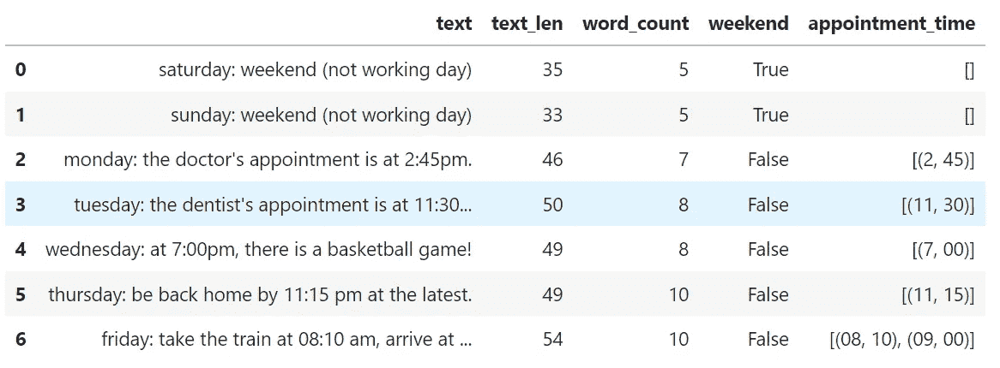

# 熊猫指南文本分析

> 原文：<https://pub.towardsai.net/text-analysis-with-pandas-guide-af8b12873b04?source=collection_archive---------0----------------------->

## 关于如何使用 Pandas 对文本数据进行分析的实践指南


[斯通王](https://unsplash.com/@stonewyq?utm_source=medium&utm_medium=referral)在 [Unsplash](https://unsplash.com?utm_source=medium&utm_medium=referral) 上拍照

大多数情况下，原始数据的形式使得分析变得困难。Python 提供了许多内置函数来操作字符串对象。

我们可以编写自己的函数来操作字符串，并使用`DataFrame.apply()`来应用它们，但这有时可能会很慢。

相反，我们可以使用 pandas 函数，有些函数在本文中有介绍，但是如果您需要更多的函数，您可以查看文档。

# 目录

[1。操纵案例](#8f70)
[2。分割琴弦](#9de6)
[3。替换字符串](#cc83)
[4。串联](#8859)
[5。附加方法:](#5831)
[6。从文本中提取信息](#d189)

# 1.操纵案例

熊猫为字符串操作提供了几个功能:

*   `.lower():`将 DataFrame 中字符串中的所有大写字符转换为小写，并在结果中返回小写字符串。
*   `.upper():`将数据帧中字符串中的所有小写字符转换为大写，并在结果中返回大写字符串。
*   `.strip():`如果字符串的开头或结尾有空格，我们应该使用 strip()修剪字符串以消除空格，或者删除数据帧中字符串包含的多余空格。
*   `.islower():`检查`DataFrame`的索引中每个字符串的所有字符是否都是小写，并返回一个布尔值。
*   `.isupper():`检查`DataFrame`索引中每个字符串的所有字符是否都是大写，并返回一个布尔值。
*   `.isnumeric():`检查`DataFrame`索引中每个字符串的所有字符是否都是数字，并返回一个布尔值。
*   `.swapcase():`它将表壳从下往上调换，反之亦然。

```
Lowercase all letters:
0        lev gor'kov
1                NaN
2          brillouin
3    albert einstein
4     carl m. bender
dtype: object
```

```
Uppercase all letters:
0        LEV GOR'KOV
1                NaN
2          BRILLOUIN
3    ALBERT EINSTEIN
4     CARL M. BENDER
dtype: object
```

```
Uppercase the first letter:
0        Lev gor'kov
1                NaN
2          Brillouin
3    Albert einstein
4     Carl m. bender
dtype: object
```

```
Uppercase the first letter of each word:
0        Lev Gor'Kov
1                NaN
2          Brillouin
3    Albert Einstein
4     Carl M. Bender
dtype: object
```

# 2.拆分字符串

`.split(‘ ‘)`:按照给定的模式分割每个字符串。在下面的例子中，我们有一系列物理学家的名字，我们想把它们分成名和姓，并很好地格式化它们(给它们加标题)。使用`expand=True`将返回结果`DataFrame`，该结果很容易与另一个`DataFrame`连接。

```
Before Splitting:
0        lev gor'kov
1                NaN
2          brillouin
3    albert einstein
4     carl m. bender
dtype: object
```

```
After Splitting:
  First Name  Last Name
0        Lev    Gor'Kov
1        NaN        NaN
2  Brillouin       None
3     Albert   Einstein
4       Carl  M. Bender
```

# 3.替换字符串

当处理文本数据时，您通常会想要从文本中删除一些字符或单词。`.replace(a,b)`用值 b 替换值 a。在下面的例子中，我们用空字符串替换`Dr.`和`Pr.`。

如果要删除或替换的文本不清楚，可以使用正则表达式。

```
Before Replacing:
0            lev gor'kov
1                    NaN
2          Dr. brillouin
3    Pr. albert einstein
4         carl m. bender
dtype: object
```

```
After Replacing:
  First Name  Last Name
0        Lev    Gor'Kov
1        NaN        NaN
2  Brillouin       None
3     Albert   Einstein
4       Carl  M. Bender
```

# 4.连锁的

如果您正在处理文本数据，连接两列是一项常见的任务。这可以使用`.cat()`方法来完成。

*   `cat(sep=’ ‘)`:它用一个给定的分隔符连接`DataFrame`中的`DataFrame`索引元素或每个字符串。在下面的例子中，我们有两个熊猫系列(名和姓),我们想把它们连接成一个熊猫系列。

```
Concatinate and ignore missing values:
0      Albert Doe
1      John Piter
2    Robert David
3            <NA>
4       Jack Carl
dtype: string
```

```
Concatinate and replace missing values with "-":
0      Albert Doe
1      John Piter
2    Robert David
3          - Eden
4       Jack Carl
dtype: string
```

# 5.其他方法:

*   `.startswith(pattern)`:如果 DataFrame 索引中的元素或字符串以模式开头，则返回 true。
*   `.endswith(pattern)`:如果 DataFrame 索引中的元素或字符串以模式结束，则返回 true。
*   `.repeat(value)`:它以给定的次数重复每个元素，如下例所示，每个字符串在 DataFrame 中出现两次。
*   `.find(pattern)`:返回模式第一次出现的第一个位置。

# 6.文本信息抽取

在处理数据时，尤其是在 NLP 任务中，你需要对你的数据做一些基本的数据分析(查找长文本、干净文本、计算字数……)。

*   `.len():`在`len()`的帮助下，我们可以计算数据帧中每个字符串的长度&，如果数据帧中有空数据，它返回`NaN`。
*   `.count(pattern):`它返回`DataFrame`中每个元素的模式出现次数，如下例所示，它计算`DataFrame`中每个字符串的空格数，并返回每个字符串的总字数。
*   它返回该模式所有出现的列表。在下面的例子中，我们传递了一个正则表达式来查找数据中的时间。



这里我们使用链接，而不是直接为`DataFrame`创建新列。方法链是一种编程风格，它按顺序调用多个方法调用，每个调用对同一个对象执行一个操作并返回它。方法链接大大增加了代码的可读性。

# 结论

*   我们已经介绍了熊猫操纵文本数据的一些功能。所有这些都很有用，在特殊情况下会派上用场。
*   Pandas 是一个强大的数据分析和操作库。它提供了许多函数和方法来处理表格形式的数据。和其他工具一样，了解熊猫的最好方法是通过练习。

感谢您的阅读。如果您有任何反馈或建议，请告诉我。