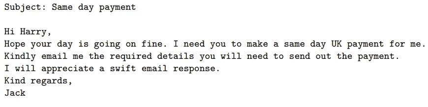
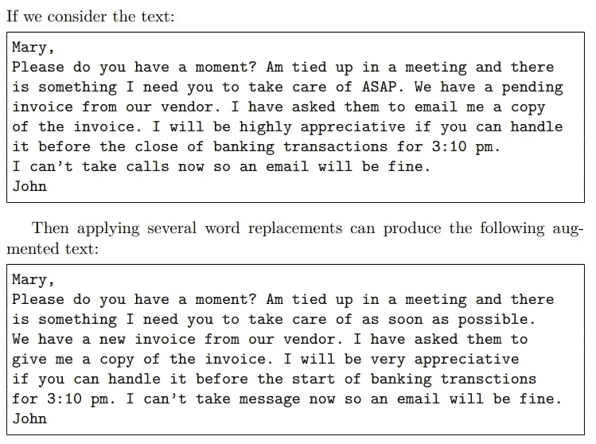
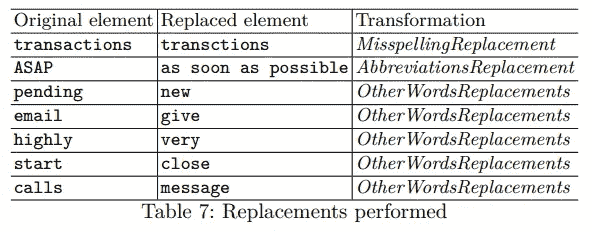
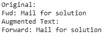
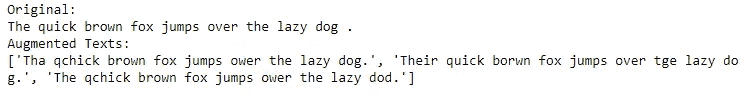
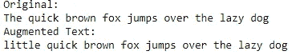

# 用于检测鱼叉式网络钓鱼电子邮件的文本增强

> 原文：<https://pub.towardsai.net/text-augmentation-for-detecting-spear-phishing-emails-19c2e0623f40?source=collection_archive---------1----------------------->

## [自然语言处理](https://towardsai.net/p/category/nlp)

## 用于网络钓鱼电子邮件检测的文本增强技术

由[詹姆斯·惠勒](https://unsplash.com/@souvenirpixels?utm_source=medium&utm_medium=referral)在 [Unsplash](https://unsplash.com?utm_source=medium&utm_medium=referral) 拍摄的照片

信息安全对任何组织都非常重要。赔钱是小问题，严重的是企业制度。但是，与普通电子邮件相比，欺诈电子邮件和网络钓鱼电子邮件只占一小部分数据。增加欺诈和网络钓鱼邮件是解决这个问题的一种方法。

CEO 欺诈邮件示例(Regina 等人，2020 年)

因此，Regina 等人提出了三种不同的方法来生成用于模型训练的合成数据。由于合成数据是一种“假”数据，一些低质量的数据可能会损害模型性能。需要验证以保持高质量的合成数据。此外，还有一些假设:

*   合成数据应该与原始文本共享相同的标签。例如，合成数据应该从正标签变为负标签(对于二元分类器)。
*   合成数据不应该是多余的。换句话说，扩充的文本不应该与原始文本几乎相同。

上图:原文。下图:增补文本(Regina 等人，2020 年)

进行替换(Regina 等人，2020 年)

# 单词替换

## 缩写替换

缩略语在日常会话中很常见。它让演讲者和听众能更容易地交流。比如“F/W”，“FW”就是“前进”的意思。然而，有一些模糊的场景，我们需要上下文来解释缩写。例如，“项目经理”可以解释为“项目经理”和“总理”。

虽然这种方法易于理解和实现，但缺点是需要逐个定义转换或映射。

缩写替换示例

## 拼写错误替换

虽然自动完成有助于纠正拼写错误，但电子邮件和社交媒体中仍然存在拼写错误。比如“bargin”就是“讨价还价”的错别字。Regina 等人提到拼写错误很重要，因为:

*   拼写错误会传达一种紧迫感
*   拼写错误可以欺骗基于文本分析的安全技术。

拼写错误替换示例。

这种方法有助于在推理时处理潜在的看不见的文本，因为模型可以用那些拼写错误的标记来训练。

## 同义词替换

通过替换意义相近的词，可以成为模型的新训练。Regina 等人同时使用 WordNet 和 BERT 来查找同义词或近义词。比如，“*敏捷的棕色狐狸跳过懒狗。”还有“**小** 敏捷的棕色狐狸跳过懒狗。”有类似的意思。第二句话是伯特模型生成的。*

**

*近义词替换的例子。*

*利用 WordNet 是生成 synthetic 的典型方式，而利用 BERT 查找近义词是实现这一点的更好方式。原因是:*

*   *BERT 或上下文单词嵌入模型可以生成近义词。它引入了更多的合成数据，无需预先定义同义词列表(即 WordNet)*
*   *由于 BERT 可以针对特定领域的知识进行训练，因此它可以应用于特定领域的数据。*

# *拿走*

*   *生成训练数据有助于解决资源不足的问题。但是，请记住，您应该选择适当的方法来生成合成数据。*
*   *一些免费的开源库提供了一种生成合成数据的简单方法。nlpaug 是可以通过几行代码生成数据的例子之一。*

# *关于我*

*我是湾区的数据科学家。专注于数据科学、人工智能，尤其是 NLP 和平台相关领域的最新工作。欢迎在 [LinkedIn](https://www.linkedin.com/in/edwardma1026) 上与 [me](https://makcedward.github.io/) 联系，或者在 [Medium](https://medium.com/@makcedward/) 或 [Github](https://github.com/makcedward) 上关注我。*

# *延伸阅读*

*   *NLP 的数据扩充库*

# *参考*

*   *米（meter 的缩写））里贾纳，M .迈耶和 s .古塔尔。[文本数据增强:更好地检测鱼叉式网络钓鱼邮件](https://arxiv.org/pdf/2007.02033.pdf)。2020*