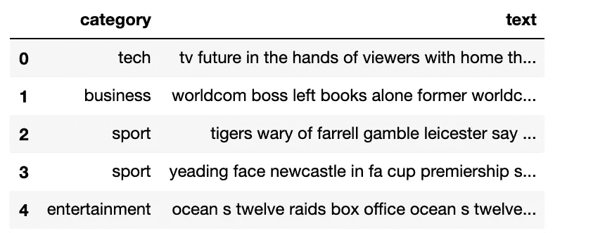
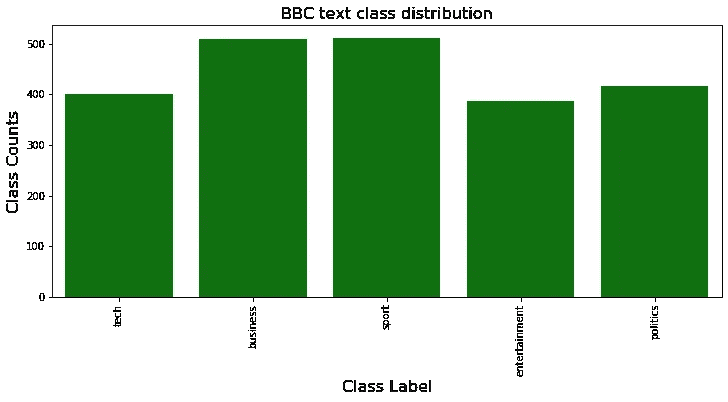
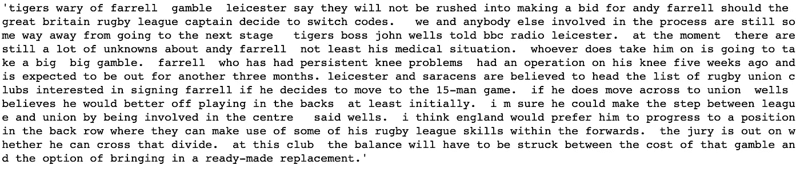
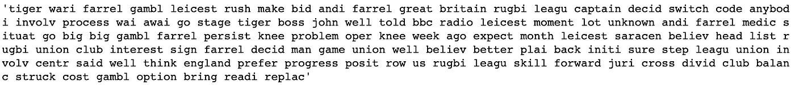
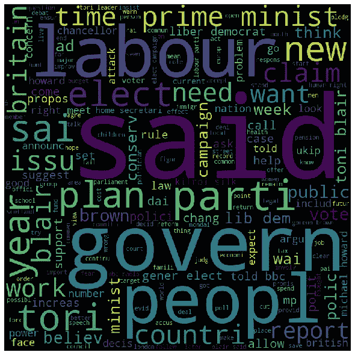
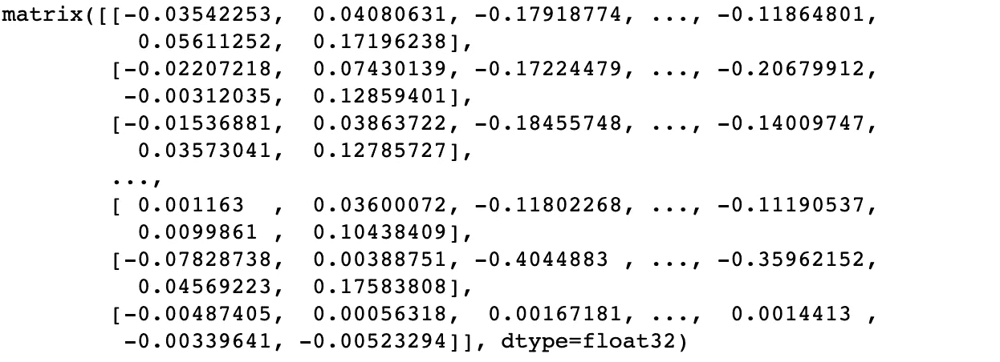
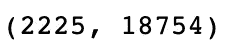
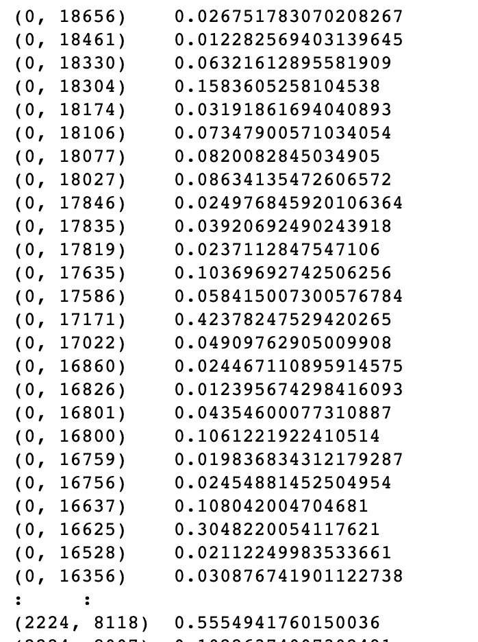
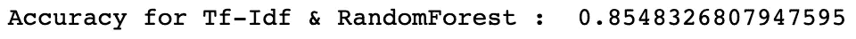

# XGBoost 等人的文本分类:以 BBC 新闻文章为例

> 原文：<https://pub.towardsai.net/text-classification-by-xgboost-others-a-case-study-using-bbc-news-articles-5d88e94a9f8?source=collection_archive---------0----------------------->

## [机器学习](https://towardsai.net/p/category/machine-learning)

## 不同向量空间模型的比较研究 XGBoost 等文本分类技术


在本文中，我们将讨论不同的文本分类技术来解决 *BBC 新文章分类*问题。我们还将讨论不同的向量空间模型来表示文本数据。

我们将使用 *Python、Sci-kit-learn、Gensim 和 Xgboost* 库来解决这个问题。

# 获取数据

这个问题的数据可以从 [Kaggle](https://www.kaggle.com/yufengdev/bbc-fulltext-and-category) 中找到。该数据集包含两列 CSV 格式的 BBC 新闻文本及其类别。让我们看看那里有什么



图 1

看起来像是长文本。我们将在后面的章节中看到这一点。这里的问题是:如果给定一个‘文本’，我们就要预测它的‘类别’。肯定是一个多类文本分类问题。

# 数据探索和可视化

首先，我们会看到有多少类别



图 2

因此，有 5 个不同的类别。我们可以称这些为“类”。从图中可以明显看出，阶级分布没有那么多偏斜。

下一步，我们必须查看数据集的“文本”字段中有什么类型的内容。为此，我们必须先清理文本。

典型的文本清理过程包括以下步骤

1.  转换成小写
2.  删除标点符号
3.  整数、数字的移除
4.  移除多余的空格
5.  移除标签(如、

    等)

6.  删除停用词(如“and”、“to”、“the”等)
7.  词干(将单词转换成词根形式)

我们将使用 Python ' **gensim** '库来清理所有文本。

我们可以使用这个' *clean_text'* 函数来完成这项工作。

让我们打印一条记录的文本字段的第一个内容

```
bbc_text_df.iloc[2,1]
```



图 3

清洁后

```
clean_text(bbc_text_df.iloc[2,1])
```



图 4

这篇课文变得有点不合语法，但它是理解所必需的。

我们将编写一个函数，将“文本”内容可视化为“单词云”

我们必须连接所有文本，并将其传递给该函数

```
texts = ''
for index, item in bbc_text_df.iterrows():
    texts = texts + ' ' + clean_text(item['text'])

plot_word_cloud(texts)
```

我们现在就去


图 5

更大的单词表示“更频繁”。所以，'*年'，'时间'，'人'*等是最常用的词。

现在，我们将看到更有意义的见解:特定“类别”的“文本”的“词云”。

我们将为此编写一个通用函数

我们将看到“类别”“技术”的“词云”

```
plot_word_cloud_for_category(bbc_text_df,'tech')
```


图 6

因此，对于“技术”类别，最常见的词是“peopl”、“techlog”、“game”等。

“运动”也是如此

```
plot_word_cloud_for_category(bbc_text_df,'sport')
```


图 7

最常用的词是“比赛”、“游戏”、“玩家”、“胜利”、“比赛”、“英格兰”等

对于“政治”类别

```
plot_word_cloud_for_category(bbc_text_df,'politics')
```



图 8

“治理”、“人民”、“布莱尔”、“国家”、“部长”是最常用的词。

> 毫无疑问，每个类别都有一些区别于其他类别的词。或者可能是这样的:每一个“文本”都在推断一些决定其类别的上下文
> 
> 我们需要进行向量空间分析，并在模型中使用它来确认上述事实

# 向量空间建模&构建管道

向量空间建模对于任何 NLP 问题都是必不可少的。我们将尝试两个最流行的向量空间模型:“Doc2Vec”和“Tf-Idf”。首先，我们将把数据分成特征和类别。

```
df_x = bbc_text_df['text']
df_y = bbc_text_df['category']
```

## Doc2Vec

我们将使用' *gensim* '库的 Doc2Vec API，并编写一个通用的' Doc2VecTransfoemer '

我们将通过应用这个转换器来看看“Doc2Vec”是什么样子的

```
doc2vec_trf = Doc2VecTransformer()
doc2vec_features = doc2vec_trf.fit(df_x).transform(df_x)
doc2vec_features
```



图 9

因此，它是文本数据的数字表示。我们可以在任何机器学习算法中使用这些数字特征。我们将尝试与*物流回收，随机森林& XGBoost*

> 对于每种情况，我们将使用数据集对模型进行 5 重交叉验证，并对其进行测试。准确度分数将是 5 倍的平均值。

**Doc2Vec &物流回收管道**


图 10

准确度非常低！！

我们会看到其他的分类器

**Doc2Vec & RandomForest 管道**


图 11

又不好了！！

**Doc2Vec & XGBoost 管道**


图 12

没多大改善。

“Doc2Vec”进展不顺利。

我们将看到“Tf-Idf”向量空间模型

## Tf-Idf

我们也将为“Tf-Idf”编写一个类似的转换器

我们将会看到，它是如何改变文本的

```
tfidf_transformer = Text2TfIdfTransformer()
tfidf_vectors = tfidf_transformer.fit(df_x).transform(df_x)
```

打印其尺寸

```
tfidf_vectors.shape
```



图 13

总共有 18754 个代币

```
print(tfidf_vectors)
```



图 14

现在，我们将在实际的 ML 模型中使用这个模型

**Tf-Idf &后勤返回**


图 15

Tf-Idf 给出了很好的准确性！！

**Tf-Idf&random forest**



图 16

**Tf-Idf & XGBoost**


图 17

所以，最好的终于来了！！

> **当然，Tf-Idf & XGBoost 组合将是我们解决这个问题的选择**

# 结果的解释

虽然“Doc2Vec”是 NLP 中比“Tf-Idf”更高级的模型，但在我们的情况下，它仍然没有给出正确的结果。我们分别尝试了基于线性、bagging 和 boosting 的分类器。

这个原因可以解释。在我们的数据集中，每个“文本”字段包含几个确定其类别的单词/标记，这些单词/标记的出现频率相当高。因此，建立一个上下文敏感的模型可能会使情况变得过于复杂，或者淡化这些信息。由于某些标记在某些文本类别中的出现频率很高，因此它在确定“Tf-Idf”时贡献了足够大的值。此外，“文本”是特定领域的。

> 例如，极有可能‘布莱尔’一词将出现在‘政治’类别中，而不是‘体育’类别中。所以这种存在有助于“Tf-Idf”。
> 
> 此外,“Doc2Vec”模式更适合写得非常好的语法正确的文本。在我们的例子中，文本在本质上是相当粗糙的。
> 
> 语法正确的文本的一个例子可以是“维基百科”文本。
> 
> **在各种例子和数据科学家的实验中也证明，虽然“Tf-Idf”模型不如“Doc2Vec ”,但它在分类非常特定领域的文本时仍然给出更好的结果。**

# 结论

现在该结束了。我们测试了分类器和向量空间模型的所有组合。这个 Jupyter 笔记本可以在 [GitHub](https://github.com/avisheknag17/public_ml_models/blob/master/bbc_articles_text_classification/notebook/text_classification_xgboost_others.ipynb) 上找到。

[](https://github.com/avisheknag17/public_ml_models/blob/master/bbc_articles_text_classification/notebook/text_classification_xgboost_others.ipynb) [## avisheknag17/public_ml_models

### 在 GitHub 上创建一个帐户，为 avisheknag17/public_ml_models 开发做出贡献。

github.com](https://github.com/avisheknag17/public_ml_models/blob/master/bbc_articles_text_classification/notebook/text_classification_xgboost_others.ipynb) 

最近，我写了一本关于 ML([https://twitter.com/bpbonline/status/1256146448346988546](https://twitter.com/bpbonline/status/1256146448346988546))的书