# 使用变压器的文本分类

> 原文：<https://pub.towardsai.net/text-classification-using-transformers-a2c6b3395ce3?source=collection_archive---------3----------------------->

## [自然语言处理](https://towardsai.net/p/category/nlp)

## 从头开始构建一个变压器

来源: [Pixabay](https://pixabay.com/vectors/pixel-cells-techbot-teach-o-bot-3947912/)

# 1.PyTorch 中的变压器网络编码

在这一部分，我们将通过 PyTorch 中的一些代码来尝试理解多头自关注变压器网络的**编码器-解码器**架构。不会涉及任何理论(更好的理论版本可以在这里找到),只是网络的框架，以及如何用 PyTorch 自己编写这个网络。

构成变压器模型的架构分为两部分——编码器 ***部分和解码器*部分。几个其他的东西结合起来形成编码器和解码器部分。让我们从编码器开始。****

## *编码器*

**与解码器部分相比，编码器部分非常简单。编码器包含* `*N*` *编码器，每个编码器包含* `*M*` *自聚焦头。**

**

*作者图片*

**让我们把*的每一部分都编码出来`*Encoder*`*

*   **编码器模块**

*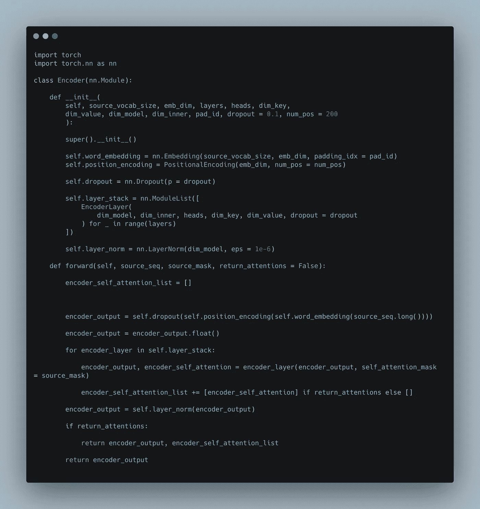*

*作者图片*

*   **位置编码**

**

*作者图片*

*   **编码器层**

*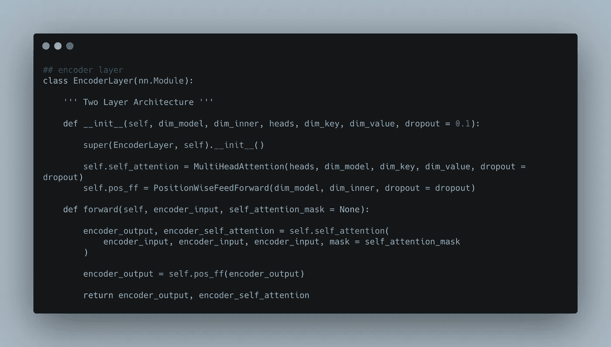*

*作者图片*

*   **多头自关注与缩放点积**

*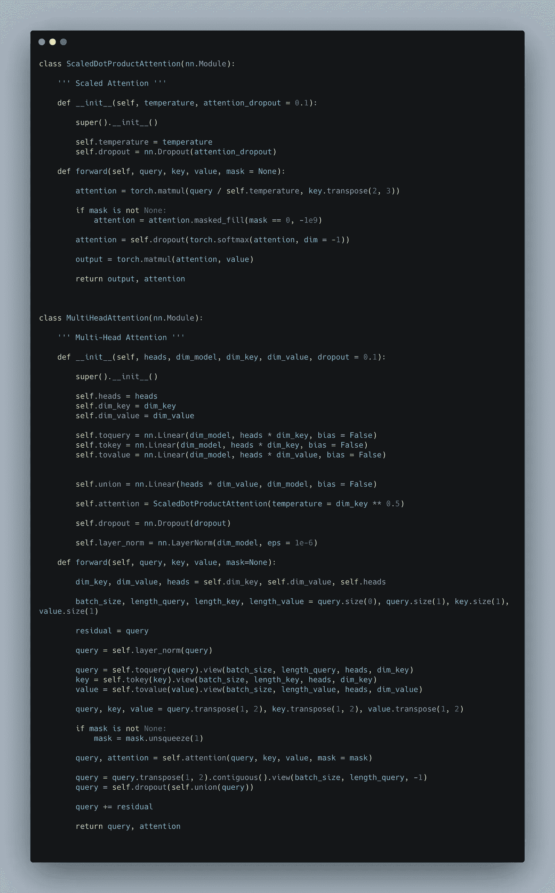*

*作者图片*

*   **位置前馈层**

*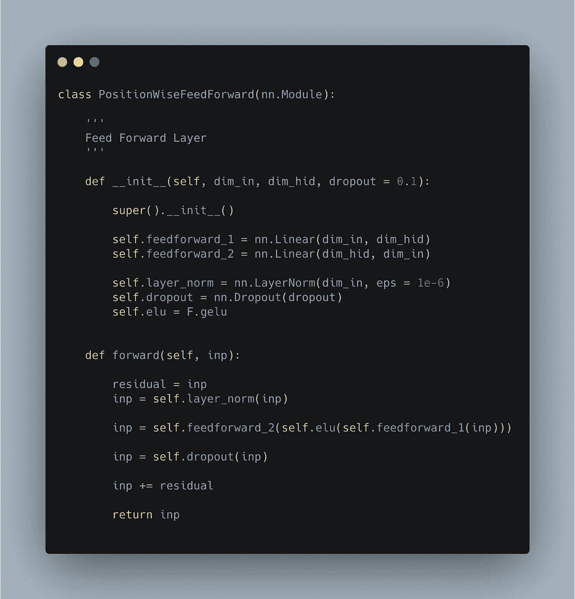*

*作者图片*

*如果你看到代码片段你会明白**编码器**模块是由*位置编码*和*编码器层*组成的；编码器层有一个利用*缩放点积*的*多头自关注*模块，编码器层还有一个**位置式前馈层**。下面给出的图表显示了成批的文本如何转换为记号，然后转换为张量，并流经网络的**编码器**部分，*

*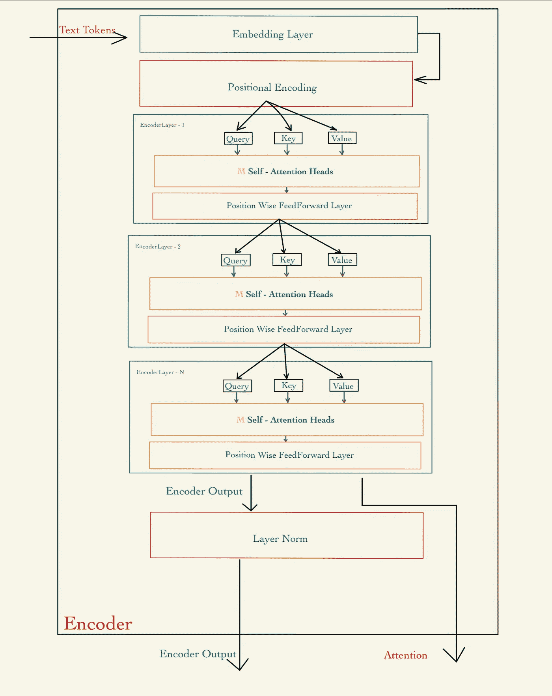*

*作者图片*

## *解码器*

*对于分类任务，解码器输入为:*

1.  *编码器的输出(编码器输出)*
2.  *`CLS`索引令牌*

*如果是一个**序列 2 序列**任务，它将获取*编码器输出*，并且`CLS`索引令牌将被*目标序列*替换*

*与*编码器不同，*在输入标记中计算关注度；在**解码器中，**在目标序列中计算关注度，也与编码器输出一起计算*

***解码器**包含`N` *解码器*和`2 x M`自关注头。第一组`M`自关注头用于计算解码器关注度，即目标序列之间的关注度，第二组`M`自关注头用于计算编码器输出的关注度，即目标序列关注度和编码器输出的输出。*

*与*编码器*类似，**解码器**也有*嵌入层和位置编码层。**

*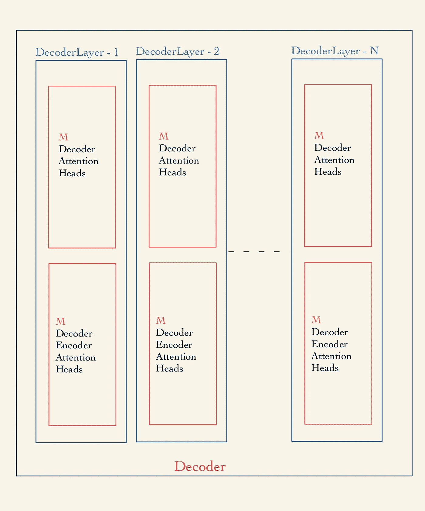*

*作者图片*

**让我们对*的每一部分进行编码`*Decoder*`*

**位置编码******多头注意*** *使用* ***缩放点积******位置明智前馈层*** *保持不变为* ***解码器*** *代替**编码器内的*编码器*，**解码器有一个*解码器*，它有一个 **2** x `**M**`自关注头，采用*比例点积*计算关注度、*位置编码*和*位置前馈层。*****

*   ***解码器***

**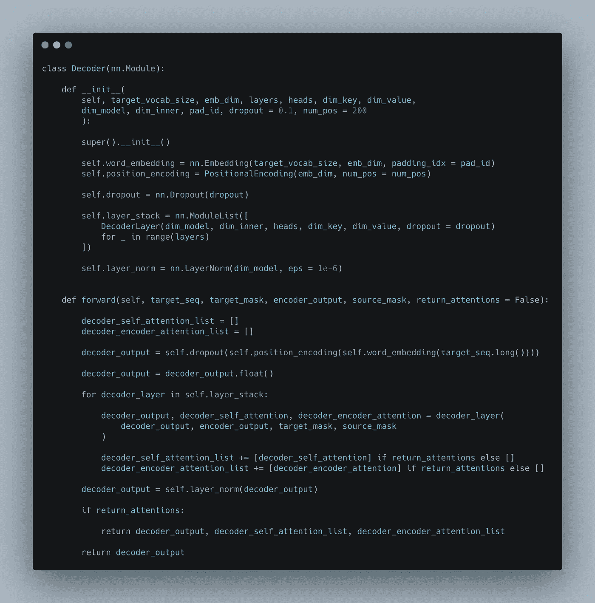**

**作者图片**

*   ***解码层***

**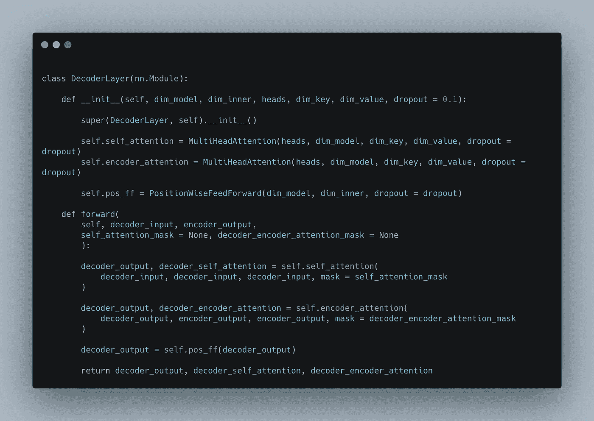**

**作者图片**

***与编码器中的数据流一样，下图表示了解码器中批量张量的流以及编码器的输出是如何合并的。***

**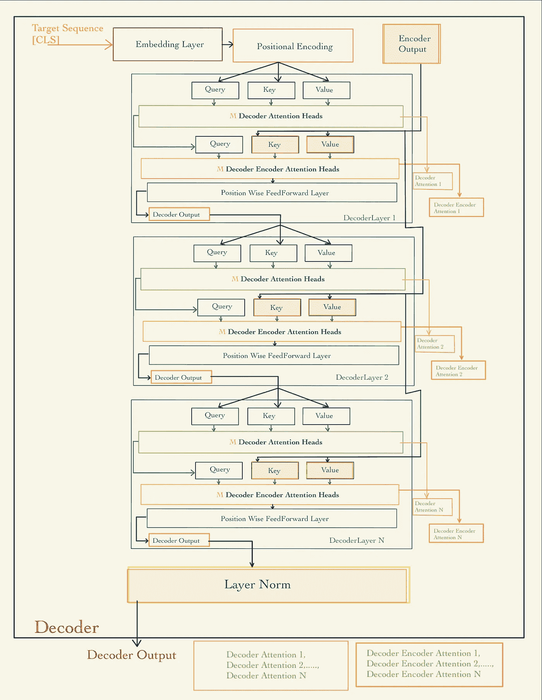**

**作者图片**

**与*编码器*不同，**解码器**有三个不同的输出，**

1.  ***解码器输出***
2.  ***解码器关注度*列表，即在每个 ***解码器*** 的目标序列值中计算的关注度**
3.  ***解码器编码器关注度*列表，即*编码器*的输出为*编码器输出*和*查询*为目标序列关注度计算的输出之间计算的关注度**

**采用我们从**解码器(*解码器输出* )** 接收的输出，我们将**展平**它，并将其通过*全连接层*，该层具有每个类的`N`输出神经元。**

**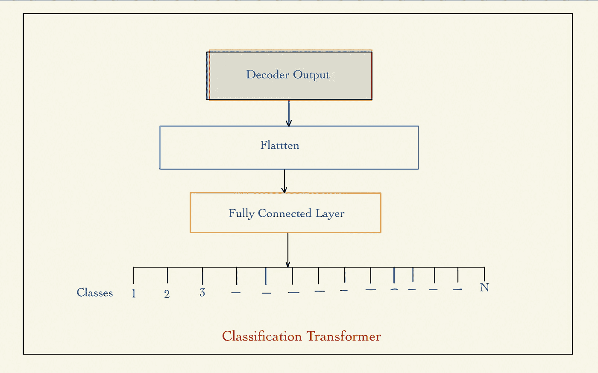**

**作者图片**

## **分类变压器**

**要将一些数据分成 *n* 类，可以使用以下模型代码。**

**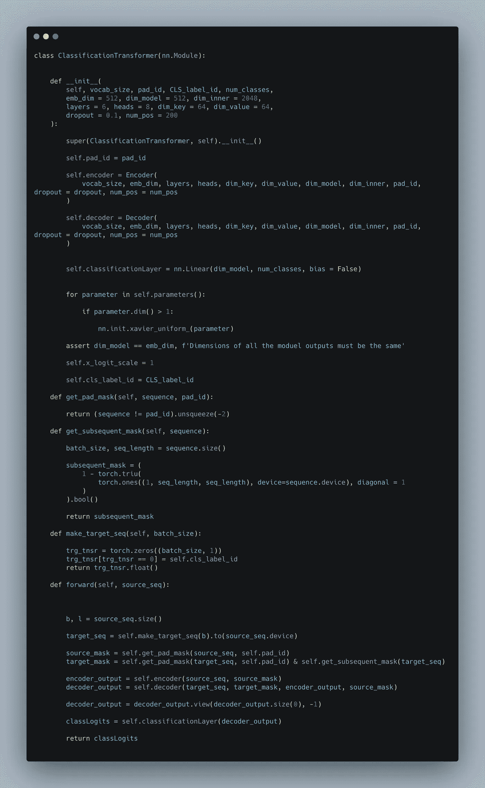**

**作者图片**

***下图显示了通过* `*ClassificationTransformer*`各部分的批量数据流程**

**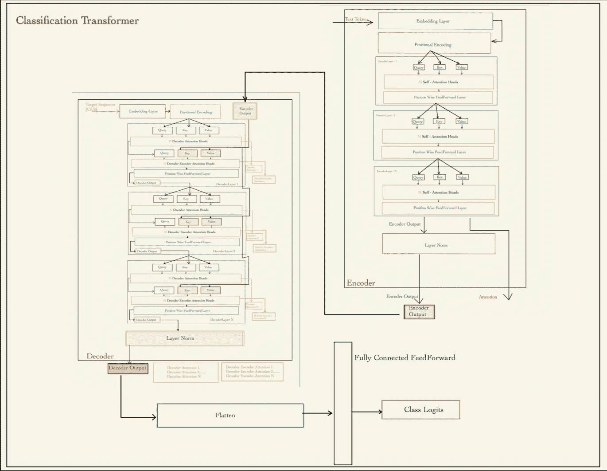**

**作者图片**

**这是关于如何在 PyTorch 中从头开始编写自我关注转换器的构建模块。现在让我们转到一个真实世界的数据集，我们将使用它来训练一个分类转换器，将一个问题分为两类。问题所属的类别是`class`和`subclass`。**

# **2.数据集和数据准备介绍**

**有许多方法可以实现将句子或段落分类成不同类别的良好准确性。正如标题所暗示的，在这一系列的博客中，我们将讨论一个最受关注和使用的模型架构。我们将使用 PyTorch 编写一个多头自我关注变形金刚，而不是使用 HuggingFace 的变形金刚库或任何其他预先训练好的模型。为了让事情变得更加有趣和复杂，我们将训练的数据集有两组类别，我们将讨论和实现不同的方法来实现一个良好的分类模型，该模型可以将文本分类到两组不同的类别中，每组都有几个类。**

**我们将使用的数据集是一个问题分类数据集。这两组类别提供了关于所提问题需要哪种类型的答案的信息。你可以在这里找到数据集[。](https://cogcomp.seas.upenn.edu/Data/QA/QC/)**

**比如问的问题是什么是肝酶？这个问题需要一个*描述性的*文本，最合适的是一个*定义*。所以这里的*类*是 ***描述性文字*** 而*子类*是 ***定义*** 。**

## **数据看起来怎么样？**

**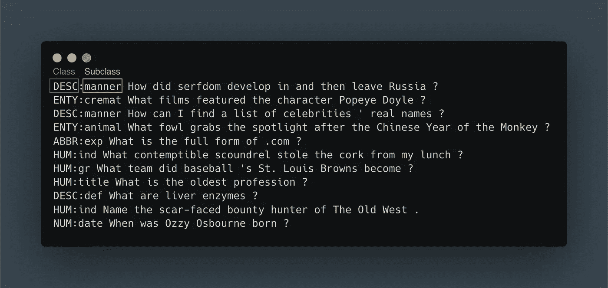**

**作者图片**

## **数据准备**

**你可以用下载文件的链接地址做一个`wget`来下载数据。我们将使用`toknizers`库将问题文本转换成标记。因为拥抱脸标记器库是用`rust`写的，比任何 python 实现都快，所以我们正在利用它。你也可以尝试使用`BytePairEncoding`库可用[这里](https://github.com/vatsalsaglani/BytePairEncoding)把问题转换成令牌。比抱脸令牌化器慢多了。**

**一旦您下载了数据，我们将使用以下步骤清理句子并获得我们的类和子类标签，**

*   ***导入和数据加载***

**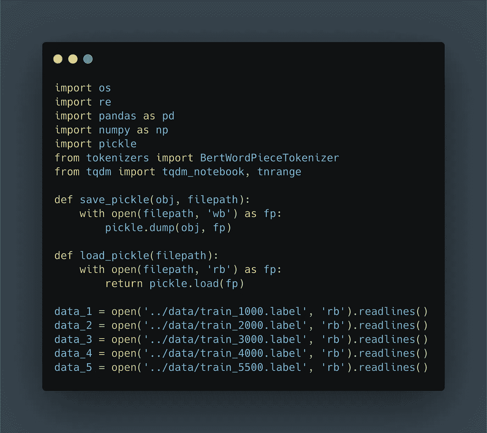**

**作者图片**

*   ***将一行字节解码为字符串***

**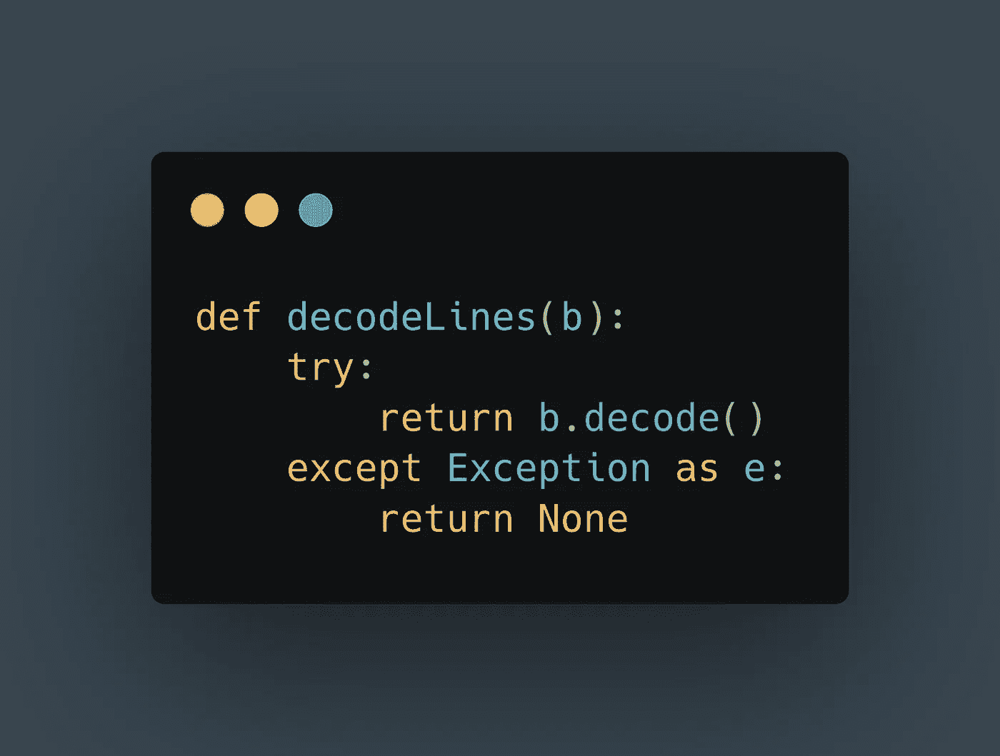**

**作者图片**

*   ***列出所有问题***

**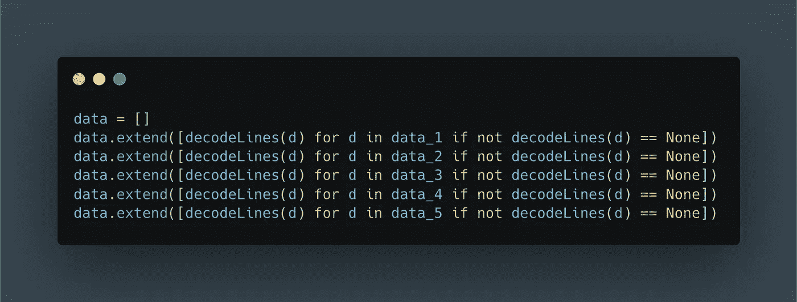**

**作者图片**

*   ***类、子类和问题的字符串***

**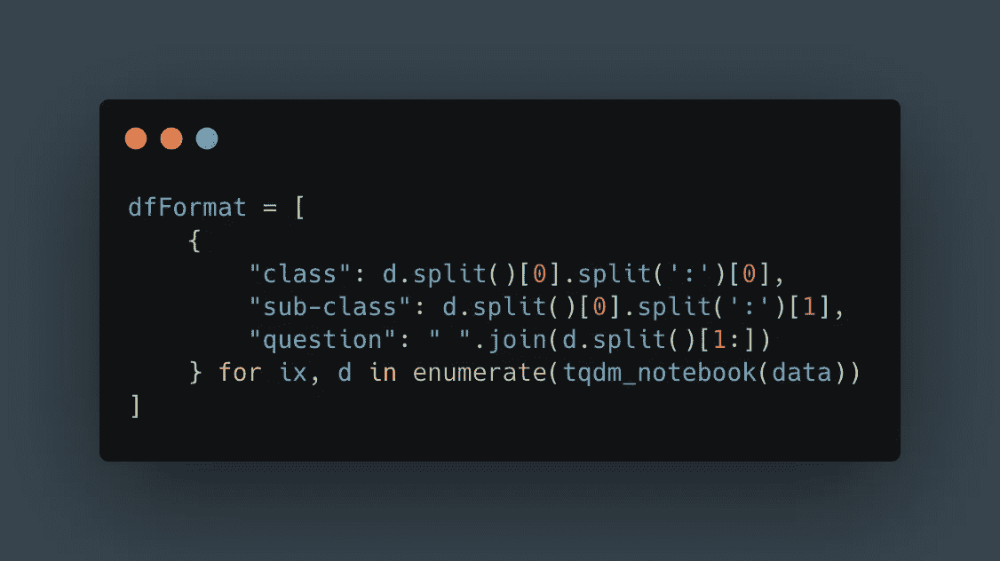**

**作者图片**

*   ***现在的数据会是什么样子？***

**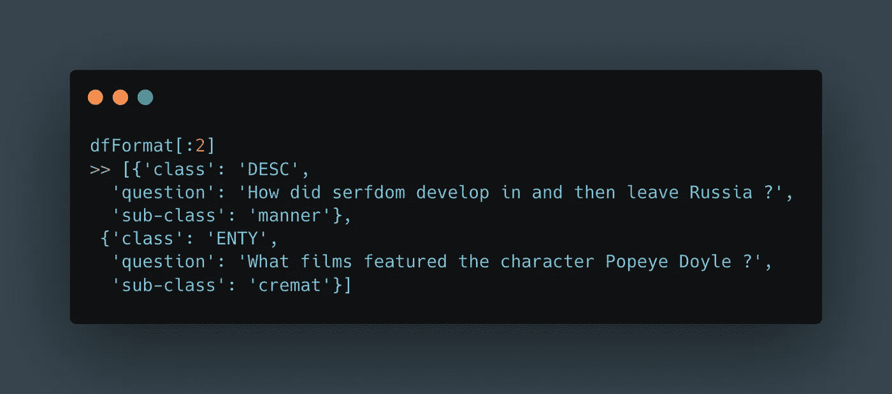**

**作者图片**

*   ***将字典列表转换为数据帧***

**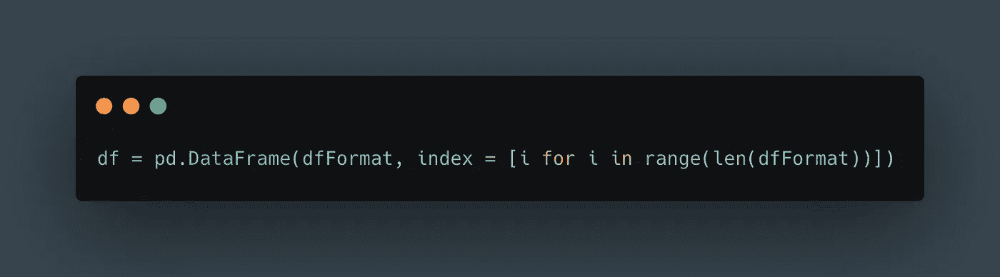**

**作者图片**

*   ***类名到索引，反之亦然***

***总共有 6 个班***

**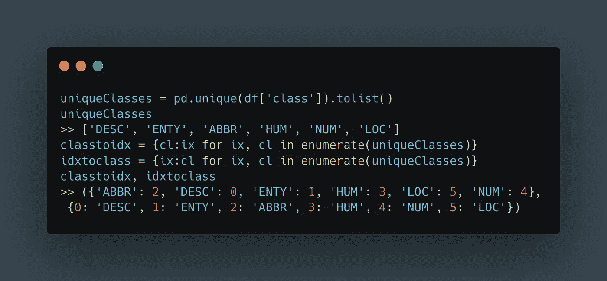**

**作者图片**

*   ***保存* `*classtoidx*` *和* `*idxtoclass*`**

**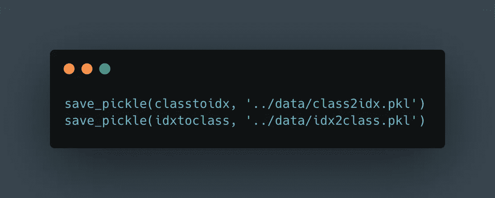**

**作者图片**

*   ***对子类重复上述两个步骤***

***总共有 47 个子类***

**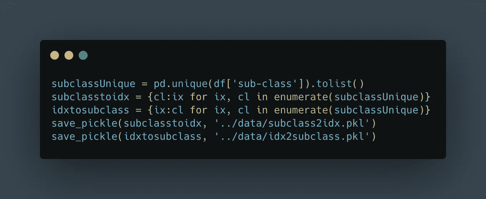**

**作者图片**

*   ***将数据帧中的类和子类映射到它们的索引***

**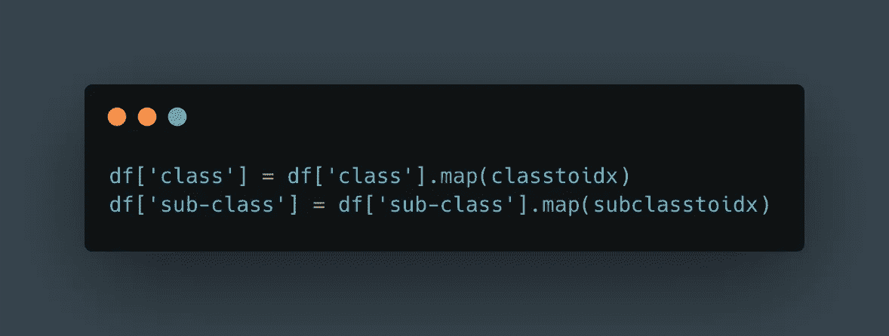**

**作者图片**

*   ***对问题文本进行标记***

**我们将把文本转换成计算机可理解的数字，就像我们对标签所做的那样。这个词汇文件是在 wikitext 数据上训练`BertWordPieceTokenizer`之后获得的，词汇大小为 10k。你可以从[这里](https://drive.google.com/file/d/13DDbLxG2iLBEzOpCYkPs7mEgMI0I_e6H/view?usp=sharing)下载。**

**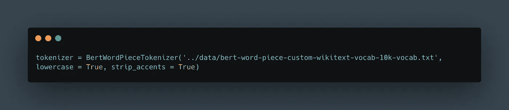**

**作者图片**

**让我们开始标记化，我们分别有一个列表，存储每个问题的标记数。最长的序列有 52 个构成问题的记号。我们可以将最大序列长度设为 100。**

**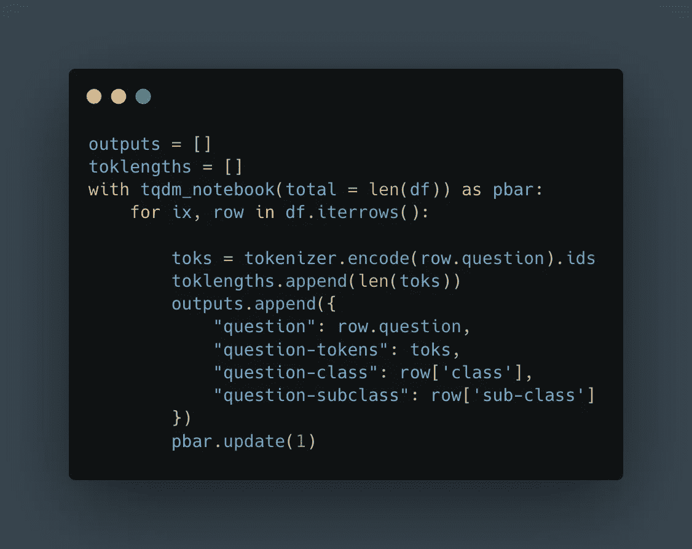**

**作者图片**

*   ***将输出列表保存到 pickle***

**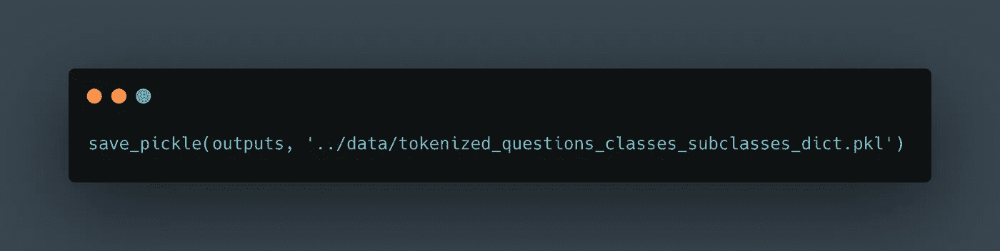**

**作者图片**

**这个[笔记本](https://github.com/vatsalsaglani/QuestionClassification/blob/branch_1/notebooks/DataDownloadExploreNotebook.ipynb)可以跟着实现以上所有。所有零件的代码都可以在[这个 GitHub repo](https://github.com/vatsalsaglani/QuestionClassification) 中找到。**

> ***如果这篇文章以任何可能的方式帮助了你，并且你喜欢它，请在你的社区中分享它。如果有任何错误，请在下面评论指出来。***