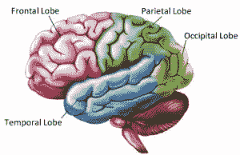
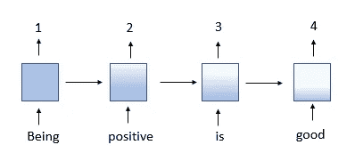
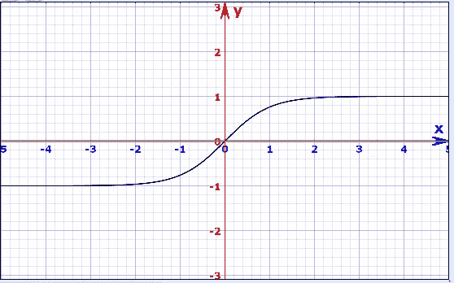
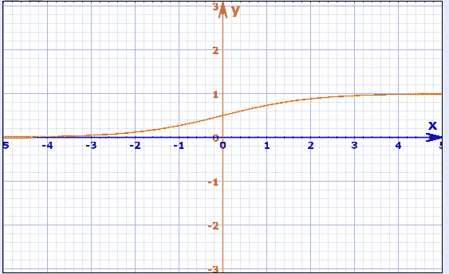

# 用 RNN 进行文本分类

> 原文：<https://pub.towardsai.net/text-classification-with-rnn-62f98767caf1?source=collection_archive---------2----------------------->

## [深度学习](https://towardsai.net/p/category/machine-learning/deep-learning)

递归神经网络，又名 RNN，是一种著名的监督深度学习方法。其他常用的深度学习神经网络有卷积神经网络和人工神经网络。深度学习背后的主要目标是通过机器来重申大脑的功能。因此，不严格地说，每个神经网络结构都是大脑的一部分。



脑叶(图片来源:【https://www.nbia.ca/brain-structure-function/】T2

人工神经网络，又名 ANN，长期存储数据，颞叶也是。所以它与颞叶有关。卷积神经网络，又名 CNN，用于图像分类和计算机视觉任务。我们大脑中同样的工作是由枕叶完成的，所以 CNN 可以参考枕叶。现在，RNN 主要用于时间序列分析，我们必须处理一系列数据。在这样的工作中，网络从它刚刚观察到的东西中学习，即短期记忆。因此，它类似于大脑的额叶。

**导入数据**

在本文中，我们将使用 IMDB 电影评论数据集进行文本分类。这个数据集有 5 万条不同电影的评论。它是在文本分类中使用的基准数据集，用于训练和测试机器学习和深度学习模型。我们将创建一个模型来预测电影评论是正面还是负面。这是一个二元分类问题。该数据集可以使用 *Tensorflow* 直接导入，也可以从 [Kaggle 下载。](https://www.kaggle.com/lakshmi25npathi/imdb-dataset-of-50k-movie-reviews)

```
from tensorflow.keras.datasets import imdb
```

**数据预处理**

对一部电影的评价并不统一。一些评论可能由 4-5 个单词组成。有些可能由 17-18 个单词组成。但是当我们把数据输入到我们的神经网络时，我们需要统一的数据。所以我们填充数据。在将数据传递到神经网络之前，我们需要遵循两个步骤:嵌入和填充。在嵌入过程中，单词用向量表示。向量空间中单词的位置是从文本中学习的，它从它周围的单词中学习更多。 *Keras* 中的嵌入层需要统一的输入，所以我们通过定义统一的长度来填充数据。

```
sentence=['Fast cars are good',
          'Football is a famous sport',
          'Be happy Be positive']After padding:[[364  50  95 313   0   0   0   0   0   0]  
 [527 723 350 333 722   0   0   0   0   0]  
 [238 216 238 775   0   0   0   0   0   0]]
```

在上面的代码片段中，每个句子都用零填充。要输入的每个句子的长度是 10，所以每个句子都用零填充。你可以在我的 [GitHub](https://github.com/aaryaab/Text-Classification-with-RNN) 档案中找到单词嵌入和填充的完整代码。

**建造 RNN 模型**

递归神经网络分三个阶段工作。在第一阶段，它通过隐藏层向前移动并进行预测。在第二阶段，使用损失函数将其预测值与真实值进行比较。损失函数展示了模型的表现。损失函数值越低，模型越好。在最后阶段，它使用反向传播中的误差值，进一步计算每个点(节点)的梯度。梯度是用于调整每个点的网络权重的值。


递归神经网络

当我们处理序列数据时，经常使用递归神经网络。原因是，模型使用的层赋予了模型短期记忆。利用这种记忆，它可以更准确地预测下一个数据。关于过去数据的信息的保留时间是不固定的，但它取决于分配给它的权重。因此，RNN 被用于情感分析、序列标注、语音标注等。

模型的第一层是**嵌入层**:

```
# Embedding Layerimdb_model.add(tf.keras.layers.Embedding(word_size, embed_size, input_shape=(x_train.shape[1],)))
```

嵌入层的第一个参数是数据集中不同单词的数量。这个参数被定义为足够大，使得语料库中的每个单词都可以被唯一地编码。在这个项目中，我们将 word_size 定义为 20000。第二个参数显示了嵌入向量的数量。语料库中的每个单词都将通过嵌入的大小来显示。

模型的第二层是 **LSTM 层:**

```
# LSTM Layerimdb_model.add(tf.keras.layers.LSTM(units=128, activation='tanh'))
```

这是迄今为止递归神经网络最重要的概念。LSTM-长期短期记忆层解决了梯度消失的问题，从而为模型提供了使用最近的过去记忆来预测下一个单词的记忆。

消失渐变:

如前所述，梯度是用于调整每个点的权重的值。梯度越大。调整幅度越大，反之亦然。现在的问题是，在反向传播中，层中的每个节点根据前一层的梯度值计算其梯度值。



消失梯度

因此，如果前一层的梯度值较小，该节点的梯度值也会较小，反之亦然。因此，沿着反向传播的方向，梯度的值变得非常小。因为梯度非常小，接近于零。每个点的权重几乎没有调整，因此他们的学习是最小的。通过最少的学习，模型无法理解上下文数据。

```
Wrec: Recorded weight at each pointWrec < 1: Vanishing Gradient   
Wrec > 1: Exploding Gradient
```

这个问题的解决方案是由 hoch Reiter schmid Huber 在 1997 年提出的。是 LSTM。长短期记忆会控制反向传播中的数据流。内部机制中有计算信息流的门，并防止重量减少超过某个值。通过将模型与 LSTM 层堆叠，模型变得更深，深度学习模型的成功在于模型的深度。


LSTM 节点的内部结构。(图片来源:【https://colah.github.io/posts/2015-08-Understanding-LSTMs/】T2)

在 LSTM 中，内部结构中的门只传递相关的信息，而丢弃不相关的信息，因此沿着序列向下，它正确地预测了序列。关于 LSTM 工作的详细信息，请阅读[克里斯多佛·奥拉](https://colah.github.io/posts/2015-08-Understanding-LSTMs/)的文章。

**激活功能**

在 RNN 模型中，使用“双曲正切(tanh(x))”的激活函数，因为它将值保持在-1 到 1 之间。在反向传播过程中，节点处的权重乘以梯度进行调整。如果渐变值更大，则该特定节点的权重值将增加很多。因此，其他节点的权重将是最小的，并且不会计入学习过程。反过来，这将导致模型中的高偏差。为了避免这种情况，使用了双曲函数。它使值介于-1 和 1 之间，并在网络的权重中保持均匀分布。

```
tanh(z) = [exp(z) - exp(-z)] / [exp(z) + exp(-z)]
```



双曲正切图

双曲正切激活函数的另一个优点是该函数比另一个函数收敛得更快，并且计算也更便宜。

```
# Output Layerimdb_model.add(tf.keras.layers.Dense(units=1, activation='sigmoid'))
```

在输出层，使用“Sigmoid”激活函数。像“双曲正切”一样，它也收缩值，但它是在 0 到 1 之间收缩的。这背后的推理是，如果一个值乘以 0，它将是零，可以丢弃。如果一个值乘以 1，它将保持为零，并且只在这里。因此，通过使用 sigmoid 函数，只有相关和重要的值将用于预测。



Sigmoid 函数的图形

**编译图层:**

```
imdb_model.compile(optimizer='rmsprop', loss='binary_crossentropy', metrics=['accuracy'])
```

在这个文本分类问题中，我们预测的是正面评论还是负面评论。因此，我们正在研究一个二元分类问题。所以我们使用“二元交叉熵”的损失函数此外，使用的指标将是“准确性”当我们处理多类分类问题时，我们使用“稀疏分类交叉熵”和“稀疏准确度”多类分类问题主要用 CNN。更多信息，可以看我在 [CNN](https://towardsdatascience.com/deep-learning-with-cifar-10-image-classification-64ab92110d79) 上的文章。

在训练模型的同时，我们分批训练模型。我们不是一次训练一个复习，而是分批次进行。这降低了计算能力。我们对模型使用了 128 的批量大小。

```
imdb_model.fit(x_train, y_train, epochs=5, batch_size=128)
```

您可以通过更改 epochs 和 batch_size 来临时改变模型。但是也要注意过度合身！通过使用这个模型，我得到了接近 84%的准确率。

因此，在这篇文章中，我们了解了什么是递归神经网络。我们讲述了预处理的重要性，以及如何在 RNN 结构中完成预处理。我们学习了消失梯度的问题，以及如何用 LSTM 解决它。最后，我们阅读激活函数以及它们在 RNN 模型中是如何工作的。

你可以在我的 [GitHub 简介](https://github.com/aaryaab/Text-Classification-with-RNN)中找到这个模型的完整代码。

请随时在 https://www.linkedin.com/in/aarya-brahmane-4b6986128/[与我联系](https://www.linkedin.com/in/aarya-brahmane-4b6986128/)

参考资料:

这是一篇很棒的文章，可以用很棒的视觉表现方式[https://colah.github.io/posts/2015-08-Understanding-LSTMs/](https://colah.github.io/posts/2015-08-Understanding-LSTMs/)深入了解 LSTM

你可以在 https://www . mathsisfun . com/data/function-grapher . PHP # functions 找到并制作一些有趣的图表

快乐深度学习！

和平！