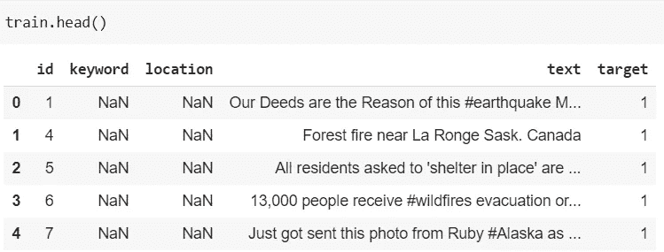
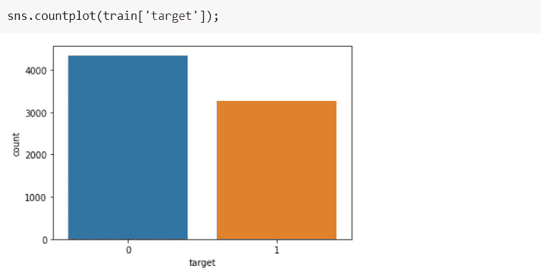

# 使用简单转换器的文本分类

> 原文：<https://pub.towardsai.net/text-classification-with-simple-transformers-a29d13358135?source=collection_archive---------0----------------------->

## [自然语言处理](https://towardsai.net/p/category/nlp)

## 用简单的转换器解决二值文本分类问题


[阿瑟尼·托古列夫](https://unsplash.com/@tetrakiss)在 [Unsplash](https://unsplash.com/photos/uPuh-VwJRM0) 上拍摄的照片

**使用变压器模型从未如此简单过*！是的，这是作者 Thilina Rajapakse 说的，我同意他的观点，你也应该同意。您可能已经见过包含数百行代码的冗长代码来实现 BERT、RoBERTa 等变压器模型。一旦你理解了如何使用`Simple Transformers`，你就会知道使用 transformer 模型是多么容易和简单。***

`Simple Transformers`图书馆建立在拥抱脸`Transformers`图书馆之上。`transformers`库提供了许多预先训练好的模型，如 BERT、RoBERTa、XLNET 等。这可用于解决许多 NLP 任务。

简单的转换器可以用于文本分类、命名实体识别、问题回答、语言建模等。在本文中，我们将使用来自 Kaggle 的灾难推特数据集在 [NLP 上用简单的转换器解决二进制分类问题。让我们开始吧。](https://www.kaggle.com/c/nlp-getting-started/overview)

# **导入库&数据集**

将数据集从 Kaggle 下载到 Colab。从您的 Kaggle 个人资料导航至`**My Account > API**`，然后点击`**Create New API Token.**` 这将下载`**kaggle.json**`文件。一旦你有了这个文件，运行下面的代码。在执行过程中，它会提示您上传一个 JSON 文件，以便您可以上传`**kaggle.json**`文件。

```
from google.colab import files
files.upload()
!pip install -q kaggle
!mkdir ~/.kaggle
!cp kaggle.json ~/.kaggle/
!chmod 600 ~/.kaggle/kaggle.json
!kaggle competitions download -c nlp-getting-started
```

谷歌 Colab 预装了变形金刚。在这里，我们正在升级变形金刚库，这样我们将拥有它的最新版本，然后安装简单的变形金刚:

```
!pip install --upgrade transformers
!pip install simpletransformers
```

现在，导入所有必需的库:

```
import numpy as np
import pandas as pd
from sklearn.metrics import f1_score
from sklearn.model_selection import train_test_split
from simpletransformers.classification import ClassificationModel, ClassificationArgs
```

# 预处理

我们现在将把训练和测试数据集加载到 pandas 数据框架中，即训练和测试。训练集中有 7613 条记录，测试集中有 3263 条记录。

```
train = pd.read_csv(‘/content/train.csv’)
test = pd.read_csv(‘/content/test.csv’)print(‘Shape of train set {}’.format(train.shape))
print(‘Shape of test set {}’.format(test.shape))
>>> Shape of train set (7613, 5) 
>>> Shape of test set (3263, 4)
```



由于我们不需要`‘id’`、`‘keyword’`、&、`‘location’`列，我们将从两个列车&测试数据中移除这些列。

```
train.drop([‘id’, ‘keyword’, ‘location’], axis=1, inplace=True)
test.drop([‘id’, ‘keyword’, ‘location’], axis=1, inplace=True)
```

两个数据集中没有空值。所以我们不必担心处理丢失的值。

```
train.isnull().sum().sum()
>> 0test.isnull().sum().sum()
>> 0
```

我们来看看目标分布。



作者图片

我们将使用训练测试分割，并使用 80%的数据来构建分类模型。

```
train.columns = ['text', 'labels']train_df, valid_df = train_test_split(train, test_size=0.2, stratify=train[‘labels’], random_state=42)
```

# **初始化一个**

由于我们试图解决二进制文本分类，我们将不得不按照[这个](https://simpletransformers.ai/docs/classification-specifics/#sub-tasks-falling-under-text-classification)表使用`ClassificationModel`。

对于`ClassificationModel`，我们需要通过`model_type`和`model_name`。我们将使用`roberta`和`roberta_base`。但是，您可以从列表中自由选择任何型号并进行试验。

变压器等深度学习模型运行在支持 CUDA 的 GPU 上。默认情况下，CUDA 是启用的。在使用简单的变压器之前，请确保您的系统中的 GPU 是打开的。既然我们处理的是二进制分类`num_labels`应该设为 2。

我们可以为分类模型配置几个参数，可以在[这里](https://simpletransformers.ai/docs/usage/#configuring-a-simple-transformers-model)找到。这里我们只使用三个参数:`num_train_epochs`、`overwrite_output_dir`、&、`manual_seed`。其他一些重要且最常用的参数有— `learning_rate`、`train_batch_size`等。

```
model_args = ClassificationArgs(num_train_epochs=1, overwrite_output_dir=True, manual_seed=42)model = ClassificationModel(model_type='roberta', model_name='roberta-base', use_cuda=True, num_labels=2, args=model_args)
```

# **训练模型**

`train_model()`方法使用`train_df`数据帧训练模型。这将运行一个时期，因为我们已经将`num_train_epoch`设置为 1。

```
model.train_model(train_df)
```

# **评估模型**

`eval_model()`方法将使用`valid_df`数据帧评估模型，并返回 3 个输出。

```
result, model_outputs, wrong_preds = model.eval_model(valid_df)
```

由于本次比赛的评价指标是`f1_score`，所以让我们用 sklearn 计算一下`f1_score`。

```
predictions = []
for x in model_outputs:
    predictions.append(np.argmax(x))
print(‘f1 score:’, f1_score(valid_df[‘labels’], predictions))>>> f1 score: 0.8134044173648134
```

# 对测试集的预测

`predict()`方法将用于对未知数据进行预测。在对测试做出预测并提交给 Kaggle 后，在排行榜上给出了`0.81949`的`f1_score`。

```
test_predictions, raw_outputs = model.predict(test[‘text’])
sample_sub[‘target’] = test_predictions
sample_sub.to_csv(‘submission.csv’,index=False)
files.download(‘submission.csv’)
```

考虑到我们仅在 80%的训练数据上试验了一个变压器模型，并且我们还没有探索超参数优化、早期停止和 k 倍交叉验证，这是一个非常好的分数。如果我们能尝试所有这些，我们可以进一步提高分数。

完整的代码可以在 Colab 上的[这里](https://colab.research.google.com/drive/1-24bwB3in7zVHxmENOhI6RWa-MqmrQt8?usp=sharing)找到。您也可以查看下面的相同代码:

这里还有一篇你可能会感兴趣的文章:

[](https://medium.com/towards-artificial-intelligence/summarization-with-simple-transformers-14d158686faa) [## 简单变压器总结

### 使用 simpletransformers 生成摘要的实践指南

medium.com](https://medium.com/towards-artificial-intelligence/summarization-with-simple-transformers-14d158686faa) 

# 结论

希望你喜欢阅读本教程，并理解如何使用简单的变压器分类任务。

# **参考文献**

[](https://simpletransformers.ai/) [## 简单变压器

### 使用变压器模型从未如此简单！内置支持:文本分类令牌分类…

simpletransformers.ai](https://simpletransformers.ai/) 

*阅读更多关于 Python 和数据科学的此类有趣文章，* [***订阅***](https://pythonsimplified.com/home/) *到我的博客*[**【www.pythonsimplified.com】**](http://www.pythonsimplified.com/)***。*** 你也可以在[**LinkedIn**](https://www.linkedin.com/in/chetanambi/)**上联系我。**