# 用 Python 中任意形状的 WordCloud 实现文本数据可视化

> 原文：<https://pub.towardsai.net/text-data-visualization-with-wordcloud-of-any-shape-in-python-8cec334e5c4f?source=collection_archive---------0----------------------->

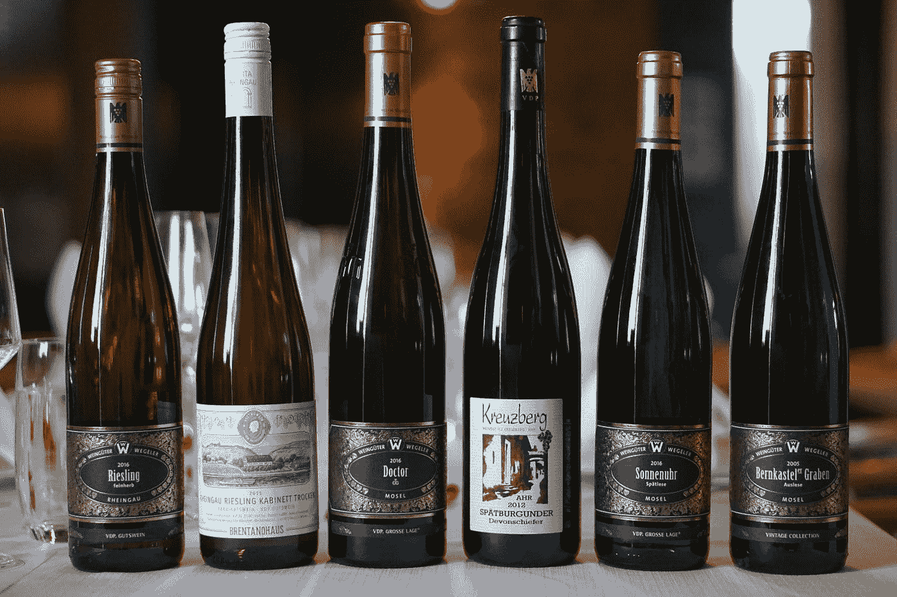

[李想](https://unsplash.com/@lxngacn?utm_source=medium&utm_medium=referral)在 [Unsplash](https://unsplash.com?utm_source=medium&utm_medium=referral) 上拍照

## [数据可视化](https://towardsai.net/p/category/data-visualization)

## 学习生成任何形状的单词云

单词云是可视化文本的有效方式。从一堆文本中，你可以看出哪些词是占优势的。它们是有趣且吸引人的视觉效果。所以，只要看这个图像，你就知道文本的模式。在这篇文章中，我将解释如何使用名为 word cloud 的 python 模块来生成单词云。这个简单易行。我将从一个简单的单词云开始，然后展示一些自定义和酷的形状。

# 设置

对于本教程，我将使用来自 Kaggle 的数据集。请随意下载数据集并跟随:

[](https://www.kaggle.com/christopheiv/winemagdata130k) [## winemag-data-130k

### Kaggle 是世界上最大的数据科学社区，拥有强大的工具和资源来帮助您实现您的数据…

www.kaggle.com](https://www.kaggle.com/christopheiv/winemagdata130k) 

要使用 WordCloud 模块，需要安装它。这可以通过使用 pip install 命令来完成:

```
pip install wordcloud
```

针对 anaconda 用户的命令:

```
conda install -c conda-forge wordcloud
```

要使用的工具:

1.  [Numpy 库](https://numpy.org/)
2.  [熊猫图书馆](https://pandas.pydata.org/)
3.  [Matplotlib 库](https://matplotlib.org/)
4.  [枕头影像库](https://pillow.readthedocs.io/en/stable/)
5.  [Jupyter 笔记本](https://jupyter.org/)环境

请确保您已经安装了它们。

# 简单词云

最简单的版本非常容易构建。首先导入必要的包和数据集。

```
import numpy as np
import pandas as pd
from os import path
from PIL import Image
from wordcloud import WordCloud, STOPWORDS, ImageColorGeneratorimport matplotlib.pyplot as plt
%matplotlib inlinedf = pd.read_csv("winemag-data-130k-v2.csv", index_col=0)
```

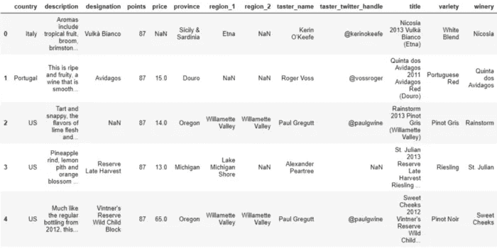

作者图片

正如你所看到的，这个数据集描述了不同国家的葡萄酒以及其他一些信息。但是对于本教程，我将只关注 description 列，因为它包含了大量的文本。我将把所有的描述合并成一个大的文本。

```
text = " ".join(review for review in df.description)
print ("There are {} words in the combination of all review.".format(len(text)))#output:
There are 31661073 words in the combination of all review.
```

这就是大文本数据。下面是生成最简单的单词云的代码片段。

```
wordcl = WordCloud().generate(text)
plt.imshow(wordcl, interpolation='bilinear')
plt.axis('off')
plt.show()
```

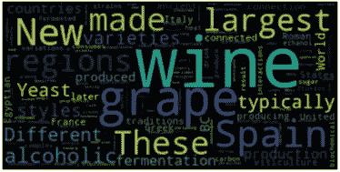

作者图片

最基础的字云都做好了！单词越大、越粗，在文本中出现的频率就越高。

我们来看看如何改进这个字云。

# 完善词云

你可能会想到的一个重要的改进是，去掉一些不太重要的词，如 is、are、too、some 等。这很容易。因为我们已经有了一组叫做“停用词”的词可以使用。

```
stopwords = set(STOPWORDS)
```


作者图片

这是输出的一部分。你可以看到一些停用词。我想在停用词中再加几个词。比如‘酒’这个词。这可能是文本中使用最多的单词，因为这个单词在 WordCloud 中看起来非常大。我们知道这和酒有关。我们不需要把这个词想象得那么大。我还会在停用词中添加一些其他词，如下所示:

```
stopwords.update("drink", "now", "wine", "made", "the")
```

我还将使用更多的样式参数。

background_color:更改默认的黑色背景

max_font_size:在上面的例子中，你可以看到有些单词确实很大。我相信如果我们能控制住它，它会看起来更好。

max_words:基于出现的频率，它会在词云中呈现指定数量的词。

让我们使用上面解释的所有参数，再次创建单词 cloud:

```
wordcl = WordCloud(stopwords=stopwords, background_color="white", max_font_size=50, max_words= 2000).generate(text)
plt.figure(figsize=(10, 8))
plt.imshow(wordcl, interpolation='bilinear')
plt.axis('off')
plt.show()
```

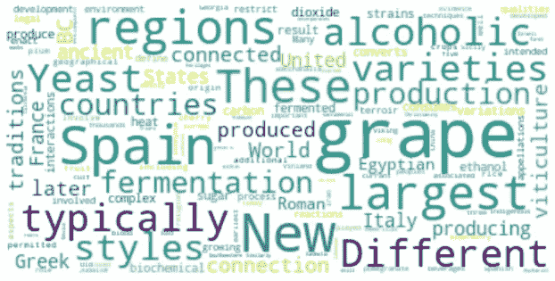

作者图片

我建议，请随意摆弄这些参数。

# 使用自定义形状

我们可以使用自定义形状将这个单词云做成我们选择的形状，而不是矩形。为了演示我将使用这张图片:


图片来源:[https://www.shutterstock.com/](https://www.shutterstock.com/)

在这个[链接](https://www.shutterstock.com/image-vector/two-women-drinking-champagne-359133053)中找到这张图片

你也可以从这个页面截图来使用这张图片。我们将把我们的单词云做成这个形状。我把这张照片保存在一个名为“img”的文件夹里。

```
mask = np.array(Image.open("img/w_wine.png"))
```

现在，在 WordCloud 模块中使用这个掩码。

```
wc = WordCloud(background_color='black', mask=mask, mode='RGB', 
              width=1000, max_words=200, height=1000,
              random_state=1)
wc.generate(text)
plt.figure(figsize=(10, 10))
plt.imshow(wc, interpolation='bilinear')
plt.tight_layout(pad=0)
plt.axis('off')
plt.show()
```

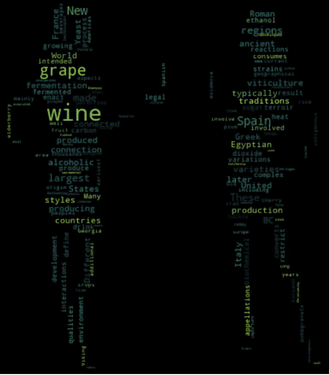

作者图片

在我看来，不是所有这些颜色，白色的文字在黑色背景下会看起来更清晰更好。

```
wc = WordCloud(background_color='black', mask=mask, mode='RGB', 
               color_func=lambda *args, **kwargs: "white", 
              width=1000, max_words=200, height=1000,
              random_state=1)
wc.generate(text)
plt.figure(figsize=(10, 10))
plt.imshow(wc, interpolation='bilinear')
plt.tight_layout(pad=0)
plt.axis('off')
plt.show()
```

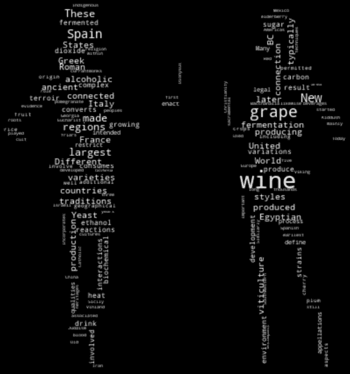

作者图片

使用轮廓获得更精确的形状。

```
wc = WordCloud(background_color='white', mask=mask, mode='RGB',
               width=1000, max_words=1000, height=1000,
               random_state=1, contour_width=1, contour_color='steelblue')
wc.generate(text)
plt.figure(figsize=(10, 10))
plt.imshow(wc, interpolation='bilinear')
plt.tight_layout(pad=0)
plt.axis('off')
plt.show()
```

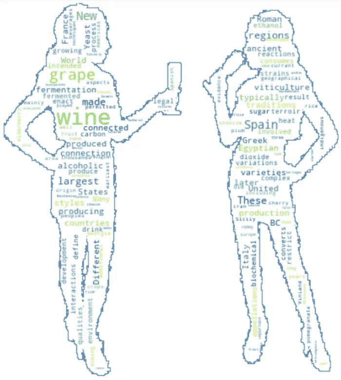

作者图片

是不是很酷！使用相同的代码，我开发了这个单词云，旁边有图片。

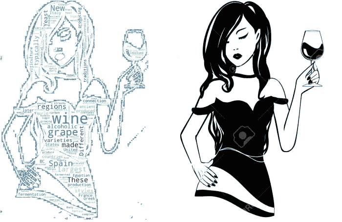

作者图片

找到右图[这里](https://www.123rf.com/photo_101294827_stock-vector-isolated-logo-silhouette-of-black-and-white-stylish-young-girl-with-glass-of-alcoholic-booze-in-nati.html)

请随意尝试。我们一定要得到那些黑色的图片来做这种类型的可视化吗？不完全是。我们可以用一张有颜色的图片，把单词的颜色做成图片的颜色。下面我就用这张彩图。

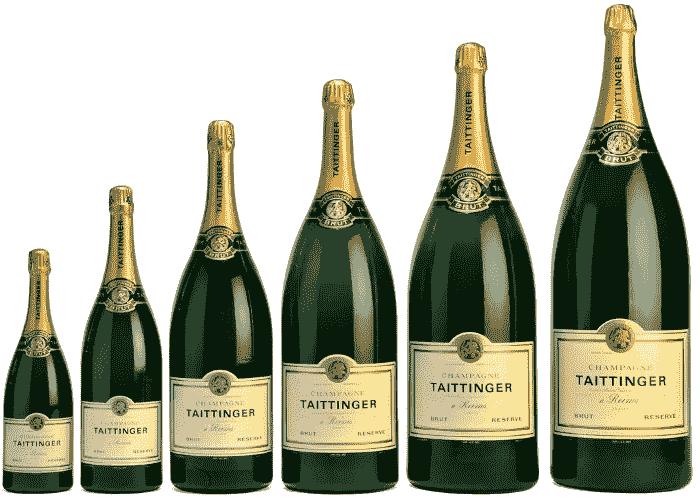

图片来源:[https://mosaicmagazine.com/](https://mosaicmagazine.com/)

在这个[链接](https://mosaicmagazine.com/observation/history-ideas/2017/07/why-are-extremely-large-wine-bottles-named-after-biblical-kings/)里找到这张图

这里我们将使用图像颜色生成器模块来生成单词云的颜色。以下是全部代码片段:

```
bottles = np.array(Image.open("img/bottle size.png"))
wc = WordCloud(background_color='white', mask=bottles)
wc.generate(text)image_colors = ImageColorGenerator(bottles)
wc.recolor(color_func=image_colors)plt.figure(figsize=[10, 10])
plt.imshow(wc, interpolation='bilinear')
plt.axis('off')
plt.show()
```

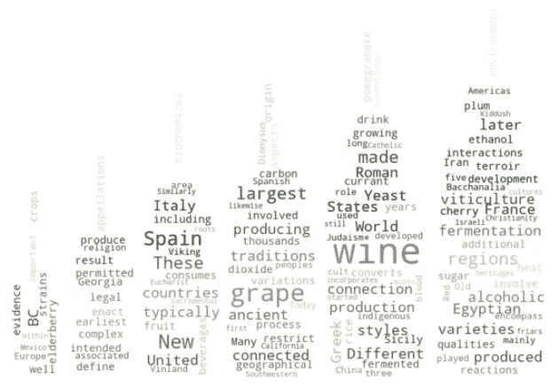

作者图片

看，单词的颜色几乎和瓶子的颜色一样。但这并不准确。因为瓶子的颜色不统一，不简单。

> 一个缺点是，如果形状太复杂，颜色太复杂，可能不会给你想要的效果。

瓶子的形状很简单。所以，云这个词的形状变得相当清楚了。但是瓶子的颜色有点复杂。在我看来，云这个词并不能抓住瓶子的确切颜色。

正如我之前展示的，你可以给它加上一个边界。

```
wc = WordCloud(background_color="white", mask=bottles,
              contour_width=1, contour_color='firebrick')
wc.generate(text)
image_colors = ImageColorGenerator(bottles)
wc.recolor(color_func=image_colors)
plt.figure(figsize=(10,10))
plt.imshow(wc, interpolation='bilinear')
plt.axis('off')
plt.show()
```

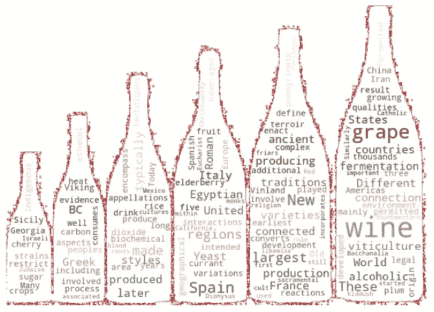

作者图片

最后，您可能希望将该图像保存在一个文件中。我在这个笔记本所在的文件夹中有一个名为“img”的文件夹。我决定把这个文件保存在那里。下面是如何做到这一点:

```
wc.to_file("img/wine.png")
```

# 结论

我在这篇文章中尝试解释了一个单词云的制作过程。提供了一些应该工作良好的代码片段。WordCloud 模块中还有其他参数，我没有涉及到，因为我想尽可能保持简单。

欢迎在[推特](https://twitter.com/rashida048)上关注我，并喜欢我的[脸书](https://www.facebook.com/rashida.smith.161)页面。