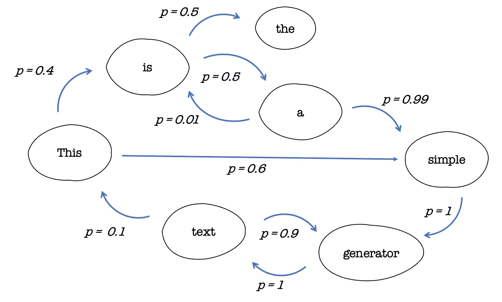
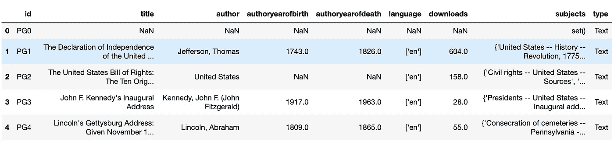
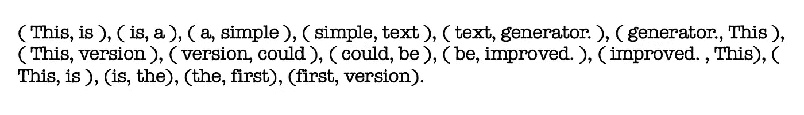
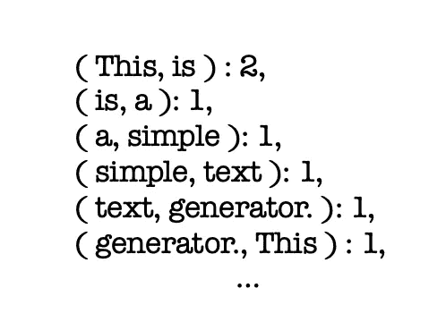
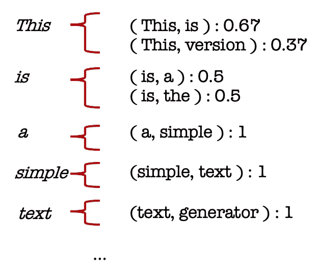
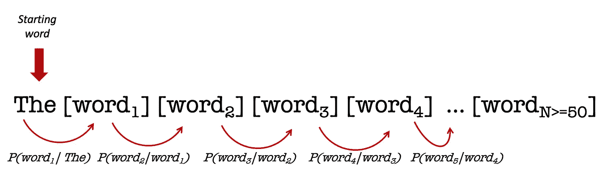
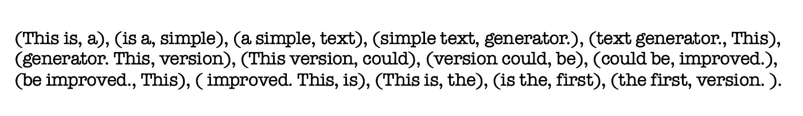
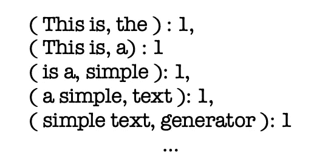
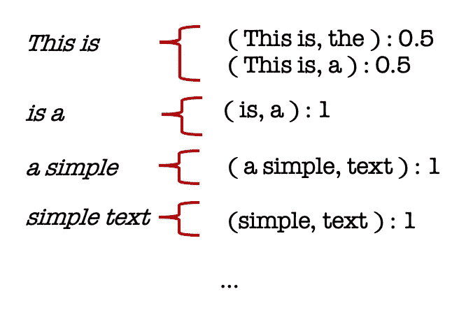
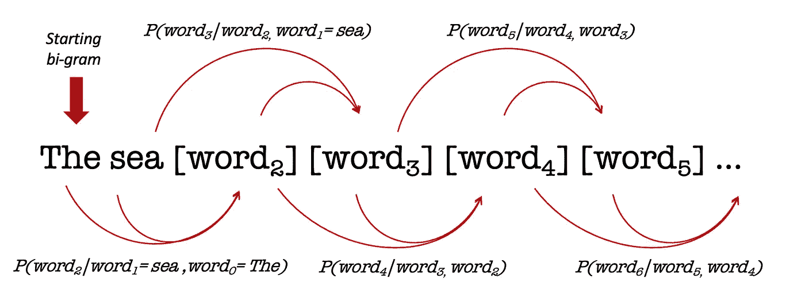

# 基于马尔可夫决策过程的文本生成

> 原文：<https://pub.towardsai.net/text-generation-with-markov-decision-processes-168251ef937c?source=collection_archive---------2----------------------->

## 马尔可夫决策过程似乎是一种处理序列、驯服序列或将其用作最终自动生成某些文本的构建块的有效方法。


照片由[帕特里克·托马索](https://unsplash.com/@impatrickt)从 [Unsplash](https://unsplash.com/photos/Oaqk7qqNh_c) 拍摄

生成文本需要制定几个规则来管理我们打算使用的单词。



作者图片

这意味着使用某种基础真理来人工学习它们。我把这个杰作命名为`Herman Melville`的`Moby Dick`，我们将从`Project Gutenberg`下载。

`Project Gutenberg`是第一个提供免费电子书的公司，也被称为 eBooks。电子书由`Project Gutenberg`的创始人`Michael Hart`于 1971 年创立，他的遗产继续激励着今天的电子书和相关材料的生产。

首先，您必须下载:

*   来自此链接的[标准化项目古腾堡语料库元数据](https://zenodo.org/record/2422561/files/SPGC-metadata-2018-07-18.csv?download=1)(或简化为 SGPC 元数据)[在](https://zenodo.org/record/2422561#.YlSxV25Bwyk)[知识共享署名 4.0 国际](https://creativecommons.org/licenses/by/4.0/legalcode)许可下可用，由`Martin Gerlach`和`Francesc Font-Clos` (*)编译。
*   通过 python 的 pip 包管理器的`[Gutenberg](https://pypi.org/project/Gutenberg/)`库。

元数据将帮助您将每个 id 与给定的图书进行匹配。id 对于使用`Gutenberg` python 库是必不可少的，因为这是你加载书籍的唯一方式。

首先，出于好奇，我们会进行一些探索性的分析。

## **1。探索性分析**

一旦我们装载了基本原料，

```
import pandas as pd
import numpy as np
```

我们可以继续处理元数据文件:

```
metadata = "path-to-metadata"
data_meta = pd.read_csv(metadata)
```

让我们来看一看这个文件:

```
data_meta.head()
```



作者图片

看来`Gutenberg Project`处理多种语言，这对于那些使用英语以外的语言的人来说很有趣。

```
>>> data_meta.language.value_counts()['en']                46972
['fr']                 2864
['fi']                 1903
['de']                 1644
['nl']                  782
                      ...  
['en', 'tl', 'es']        1
['en', 'myn']             1
['gl']                    1
['nah']                   1
['en', 'brx']             1
Name: language, Length: 123, dtype: int64
```

在这里，我们只保存英文书:

```
data_meta_eng = data_meta[data_meta['language'] == "['en']"]
```

以下是我们可能会遇到的一些作者:

```
>>> np.random.choice(data_meta_eng.author.unique(), 15 )array(['Ohrwalder, Josef', 'Reese, H. B.', 'Eltzbacher, Paul',
       'Denikin, Anton Ivanovich', Atkinsonn, George William',
       'Hooker, Worthington', 'Olmstead, Charles H.',
       'Kemp, Matthew Stanley', 'Williams, Howard', 'Boys, John',
       'Slater, Gilbert', 'Austrian, Delia', 'Hodous, Lewis',
       'Ostwald, Hans', 'Gildersleeve, Basil L. (Basil Lanneau)'],
      dtype=object)
```

## **2。实施:**

这一切都始于载入古腾堡的基本元素:

```
from gutenberg.acquire import load_etext
from gutenberg.cleanup import strip_headers
```

基本上，`load_etext`通过与元数据文件中的名称相匹配的`id`从远程镜像加载一本书。`Herman Melville`的`Moby Dick`可以用 id `2701`获得:

```
text = strip_headers(load_etext(2701)).strip()
text = text.replace('\n',' ').replace('\t',' ').replace('\r',' ')
```

假设每页平均包含 250 到 300 个单词，我们大概有一本 800 页的书，这很好地反映了实际长度:

```
>>> len(text.split())/275773.796
```

一般来说，`stopwords`是所有可能的单词中出现频率最高的:

```
>>> from collections import Counter>>> wordcount = Counter(text.split())
>>> sorted_wordcount = dict(sorted(wordcount.items(), key=lambda item: item[1], reverse=True)){'the': 13694,
 'of': 6531,
 'and': 5932,
 'a': 4493,
 'to': 4459,
 'in': 3850,
 'that': 2679,
 'his': 2428,
 'I': 1723,
 'with': 1649,
 'as': 1591,
 'was': 1566,
...
```

当我们要处理一些 NLP 任务时，我们倾向于摆脱它们。在这种情况下，我们将保留它们，因为它们将构成我们生成的故事的主干，就像我们的方法一样简单。

现在，我们把一个特殊的配方放在一起，以实现文本中的马尔可夫决策过程。

首先，我们构建一个成对的窗口，在书中滑动:

```
from itertools import teedef pairwise(iterable):
    a, b = tee(iterable)
    next(b, None)
    return zip(a, b)pairwise_words = pairwise(text.split())
```

让我们用下一段文本运行一个小示例:

```
This is a simple text generator. This version could be improved. This is the first version.
```

下面是实现的方式:



作者图片

我们有一个包含两个连续单词的所有元组的列表。

现在，计算每个元组的出现是有趣的，因为它们用于计算转移概率:



作者图片

```
pairwise_count = Counter(pairwise_words)
```

在接下来的部分，我们试图把所有这些放在一起。我们构造了一个类似于转移矩阵的东西。相反，它将由字典组成，字典由作为关键字的唯一单词以及从该唯一单词到书中下一个单词的所有转换组成。

这是上一个例子的说明图:



作者图片

这里有一个输出`dictionary_transitions`的实现，对于进一步的分析非常有用:

下一个代码片段确保了我们的`Markov Decision Process`的触发:我们通常选择`“The”`作为序列的第一个元素。我们检查`Moby Dick`中`“The”`之后的所有单词的`dictionary_transitions`。

我们选择一个具有预定概率的转换。然后我们重复这个过程。



作者图片

这是一个虚构故事的例子:

```
'The quantity too keenly, sir; there apart from the crowd of thy finger darted out; this through the hull go into one he had every plank and go—that’s the most buoyant matter of protrusion. If your backbones, my soul, therefore was not seen pulling for a schooner or make plain; but then mixed with rope-walks of the twenty-four hours, going to them, for all that from demonstrable, yet some ten to go a-whaling, and honorable, and feel the Town-Ho’s story, is I.'
```

不幸的是，我们可以注意到生成的文本是多么不一致，因为每个单词都独立于它周围的所有上下文。它可以访问的唯一上下文元素是前一个单词。这并不反映现实，所以我们将增加一层复杂性，以考虑更多的背景。

让我们用两个词来代替一个词来预测下一个词。

为了做到这一点，我们像前面一样用一个三个单词的窗口重复这个过程，以构建一组附加到随后的单词的二元模型。

```
def triplewise(iterable):

    result = []

    for (a, _), (b, c) in pairwise(pairwise(iterable)):
        result.append((a+" "+b , c))

    return result

triplewise_words = triplewise(text.split())
```

在前面的同一个例子中，我们将有一个包含所有二元模型元组的列表，其后续单词如下:



作者图片

我们计算出现次数:



作者图片

```
triplewise_count = Counter(triplewise_words)
```

我们设置了`dictionary_transitions_v2`，它将保存每个二元模型以及一组可能的后续单词和概率。与前面的实现相同(不过这个可能需要一些时间来运行) :



我们启动了生成句子的过程:



作者图片

第一个例子:

```
'The three corresponding new sails were now at the wounded planks, but we didn’t know him then; but not a cobbler’s job, that’s at an end to the road-side door.'
```

第二个:

```
'The Titans, they say, and I will quit it, lest Truth shake me falsely.” “There now’s the old black, testily. “Silence! How old are you, reader, but a bubble, sing out.” All this while Tashtego, Daggoo, and Queequeg budged not.'
```

第三个是:

```
'The people of the fight. But with Ahab the question returns whether this is both ponderous and profound. And I am told, on good authority, that Sperm Whales have been studying Murray’s Grammar! Improving his mind, poor fellow! he’ll have to say.'
```

## 结束语:

在这篇文章中，我们看到了一个基本的例子，它应该为更复杂的人工智能模型建立支柱，这些模型能够处理更长的序列，以在文本生成的情况下维护上下文。

我们使用了`1-gram and 2-gram`方法来生成一些文本。我们可以增加生成单词的数量，并在一致性和意义方面感受到飞跃。

与之前使用的数据相比，我们可以用更多的数据合并不同书籍的不同章节，我们可以积累更多的广义知识，而不会局限于一个独特的背景故事。

最后但并非最不重要的是，我们的方法只考虑以前的单词作为上下文。更复杂的模型(编码器)完全有能力填补这一空白。

## 参考资料:

(*) [自然语言统计分析和定量语言学的标准化项目古腾堡语料库](https://arxiv.org/abs/1812.08092)。

1.  [古腾堡计划](https://www.gutenberg.org/about/)