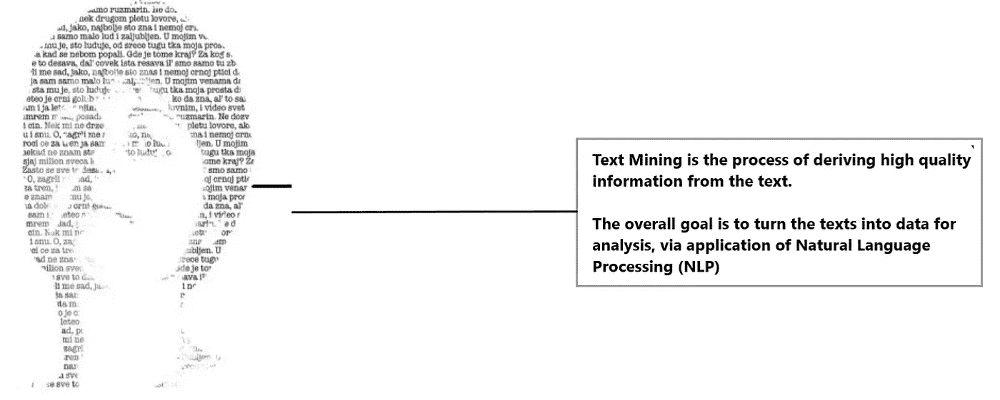
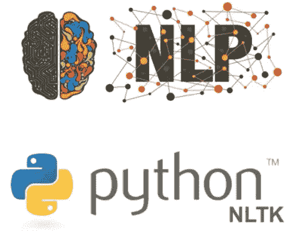
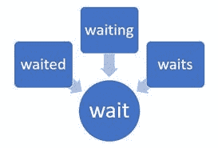
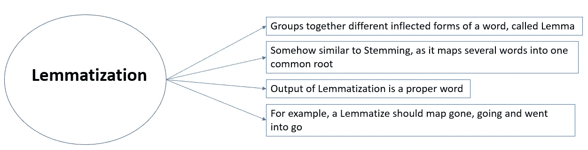
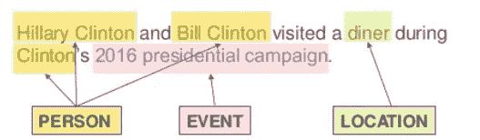
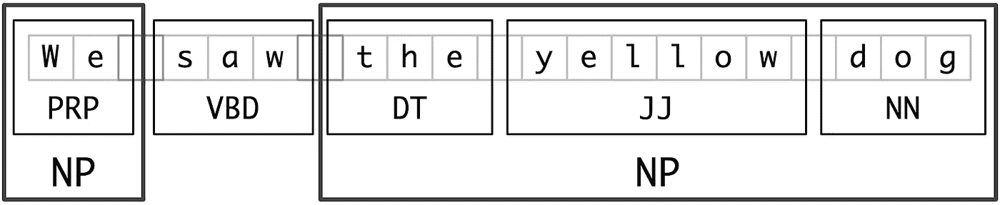

# Python 中的文本挖掘:步骤和示例

> 原文：<https://pub.towardsai.net/text-mining-in-python-steps-and-examples-78b3f8fd913b?source=collection_archive---------0----------------------->

## [数据挖掘](https://towardsai.net/p/category/data-mining)，[编程](https://towardsai.net/p/category/programming)， [Python](https://towardsai.net/p/category/programming/python)


在今天的场景中，人们成功的一种方式取决于他们如何与他人交流和分享信息。这就是语言概念出现的原因。然而，世界上有许多种语言。每一个都有许多标准和字母，这些词有意义地组合起来就形成了一个句子。每种语言在发展这些句子时都有自己的规则，这些规则也被称为语法。


根据行业估计，在当今世界，当我们说话、发推特、在 WhatsApp、电子邮件、脸书、Instagram 或任何短信上发送消息时，只有 20%的数据是以结构化格式生成的。而且，这些数据的大部分以文本形式存在，这是一种高度非结构化的格式。为了从文本数据中产生有意义的见解，我们需要遵循一种叫做文本分析的方法。

# 什么是文本挖掘？

> 文本挖掘是从自然语言文本中获取有意义信息的过程。



# **什么是 NLP？**

> **自然语言处理(NLP)是处理人类语言的计算机科学和人工智能的一部分。**

换句话说，NLP 是文本挖掘的一个组成部分，它执行一种特殊的语言分析，本质上是帮助机器“阅读”文本。它使用不同的方法来破译人类语言中的歧义，包括以下内容:自动摘要、词性标注、消歧、组块，以及消歧和自然语言理解和识别。我们将一步一步地看到使用 Python 的所有过程。



首先，我们需要安装 NLTK 库，这是一个自然语言工具包，用于构建 Python 程序来处理人类语言数据，它还提供了易于使用的接口。

# 自然语言处理术语

## 标记化

标记化是自然语言处理的第一步。它是将字符串分解成记号的过程，这些记号又是小的结构或单元。标记化包括三个步骤:将复杂的句子分解成单词，理解每个单词相对于句子的重要性，以及最终对输入句子产生结构描述。

## **代码:**

```
# Importing necessary library
import pandas as pd
import numpy as np
import nltk
import os
import nltk.corpus# sample text for performing tokenization
text = “In Brazil they drive on the right-hand side of the road. Brazil has a large coastline on the eastern
side of South America"# importing word_tokenize from nltk
from nltk.tokenize import word_tokenize# Passing the string text into word tokenize for breaking the sentences
token = word_tokenize(text)
token
```

## 输出

```
['In','Brazil','they','drive', 'on','the', 'right-hand', 'side', 'of', 'the', 'road', '.', 'Brazil', 'has', 'a', 'large', 'coastline', 'on', 'the', 'eastern', 'side', 'of', 'South', 'America']
```

从上面的输出中，我们可以看到文本被分割成标记。单词、逗号、标点符号称为记号。

# 在文本中寻找不同的频率

## 代码 1

```
# finding the frequency distinct in the tokens
# Importing FreqDist library from nltk and passing token into FreqDist
from nltk.probability import FreqDist
fdist = FreqDist(token)
fdist
```

## 输出

```
FreqDist({'the': 3, 'Brazil': 2, 'on': 2, 'side': 2, 'of': 2, 'In': 1, 'they': 1, 'drive': 1, 'right-hand': 1, 'road': 1, ...})
```

“the”在文本中出现 3 次，“Brazil”在文本中出现 2 次，依此类推。

## 代码 2

```
# To find the frequency of top 10 words
fdist1 = fdist.most_common(10)
fdist1
```

## 输出

```
[('the', 3),
 ('Brazil', 2),
 ('on', 2),
 ('side', 2),
 ('of', 2),
 ('In', 1),
 ('they', 1),
 ('drive', 1),
 ('right-hand', 1),
 ('road', 1)]
```

# 堵塞物

> 词干通常是指将单词规范化为其基本形式或词根形式。



在这里，我们等待着，等待着，等待着。这里的词根是 wait。词干提取有两种方法，即波特词干提取(从单词中删除常见的词形和词尾变化)和兰开斯特词干提取(一种更积极的词干提取算法)。

## 代码 1

```
# Importing Porterstemmer from nltk library
# Checking for the word ‘giving’ 
from nltk.stem import PorterStemmer
pst = PorterStemmer()
pst.stem(“waiting”)
```

## 输出

```
'wait'
```

## 代码 2

```
# Checking for the list of words
stm = ["waited", "waiting", "waits"]
for word in stm :
   print(word+ ":" +pst.stem(word))
```

## 输出

```
waited:wait
waiting:wait
waits:wait
```

## 代码 3

```
# Importing LancasterStemmer from nltk
from nltk.stem import LancasterStemmer
lst = LancasterStemmer()
stm = [“giving”, “given”, “given”, “gave”]
for word in stm :
 print(word+ “:” +lst.stem(word))
```

## 输出

```
giving:giv
given:giv
given:giv
gave:gav
```

兰卡斯特比波特·斯泰默更具侵略性

# 词汇化



简单来说，就是把一个单词转换成它的基本形式的过程。词干化和词元化的区别在于，词元化考虑上下文并将单词转换为其有意义的基本形式，而词干化只是删除最后几个字符，通常会导致不正确的意思和拼写错误。

例如，词汇化将正确地识别“care”到“care”的基本形式，而词干化将截断“ing”部分并将其转换为 car。

可以使用 Wordnet Lemmatizer、Spacy Lemmatizer、TextBlob、Stanford CoreNLP 在 python 中实现 Lemmatization

## 密码

```
# Importing Lemmatizer library from nltk
from nltk.stem import WordNetLemmatizer
lemmatizer = WordNetLemmatizer() 

print(“rocks :”, lemmatizer.lemmatize(“rocks”)) 
print(“corpora :”, lemmatizer.lemmatize(“corpora”))
```

## 输出

```
rocks : rock
corpora : corpus
```

# 停止言语

“停用词”是语言中最常见的词，如“the”、“a”、“at”、“for”、“above”、“on”、“is”、“all”。这些词不提供任何意义，通常从文本中删除。我们可以使用 nltk 库删除这些停用词

## 密码

```
# importing stopwors from nltk library
from nltk import word_tokenize
from nltk.corpus import stopwords
a = set(stopwords.words(‘english’))text = “Cristiano Ronaldo was born on February 5, 1985, in Funchal, Madeira, Portugal.”
text1 = word_tokenize(text.lower())
print(text1)stopwords = [x for x in text1 if x not in a]
print(stopwords)
```

## 输出

```
Output of text:
['cristiano', 'ronaldo', 'was', 'born', 'on', 'february', '5', ',', '1985', ',', 'in', 'funchal', ',', 'madeira', ',', 'portugal', '.']Output of stopwords:
['cristiano', 'ronaldo', 'born', 'february', '5', ',', '1985', ',', 'funchal', ',', 'madeira', ',', 'portugal', '.']
```

# 词性标注


词性标注用于根据定义和上下文给给定文本的每个单词(如名词、动词、代词、副词、连词、形容词、感叹词)分配词性。有许多工具可用于 POS 标签，一些广泛使用的标签有 NLTK、Spacy、TextBlob、Standford CoreNLP 等。

## 密码

```
text = “vote to choose a particular man or a group (party) to represent them in parliament”
#Tokenize the text
tex = word_tokenize(text)
for token in tex:
print(nltk.pos_tag([token]))
```

## 输出

```
[('vote', 'NN')]
[('to', 'TO')]
[('choose', 'NN')]
[('a', 'DT')]
[('particular', 'JJ')]
[('man', 'NN')]
[('or', 'CC')]
[('a', 'DT')]
[('group', 'NN')]
[('(', '(')]
[('party', 'NN')]
[(')', ')')]
[('to', 'TO')]
[('represent', 'NN')]
[('them', 'PRP')]
[('in', 'IN')]
[('parliament', 'NN')]
```

# 命名实体识别

它是检测命名实体(如人名、地名、公司名、数量和货币价值)的过程。



Ref: [Sujit Pal](https://www.slideshare.net/sujitpal/soda-v2-named-entity-recognition-from-streaming-test-106598233)

## 密码

```
text = “Google’s CEO Sundar Pichai introduced the new Pixel at Minnesota Roi Centre Event”#importing chunk library from nltk
from nltk import ne_chunk# tokenize and POS Tagging before doing chunk
token = word_tokenize(text)
tags = nltk.pos_tag(token)
chunk = ne_chunk(tags)
chunk
```

## **输出**

```
Tree('S', [Tree('GPE', [('Google', 'NNP')]), ("'s", 'POS'), Tree('ORGANIZATION', [('CEO', 'NNP'), ('Sundar', 'NNP'), ('Pichai', 'NNP')]), ('introduced', 'VBD'), ('the', 'DT'), ('new', 'JJ'), ('Pixel', 'NNP'), ('at', 'IN'), Tree('ORGANIZATION', [('Minnesota', 'NNP'), ('Roi', 'NNP'), ('Centre', 'NNP')]), ('Event', 'NNP')])
```

# 组块

分块意味着挑选出单个的信息片段，并把它们组合成更大的片段。在自然语言处理和文本挖掘的背景下，组块意味着将单词或标记分组为组块。



参赛:nltk.org

## 密码

```
text = “We saw the yellow dog”
token = word_tokenize(text)
tags = nltk.pos_tag(token)reg = “NP: {<DT>?<JJ>*<NN>}” 
a = nltk.RegexpParser(reg)
result = a.parse(tags)
print(result)
```

## 输出

```
(S We/PRP saw/VBD (NP the/DT yellow/JJ dog/NN))
```

这篇博客总结了文本预处理，涵盖了 NLTK 步骤，包括标记化、词干化、词汇化、词性标注、命名实体识别和组块。

感谢阅读。请继续学习，并关注更多内容！

你也可以在 [KDnuggets 上阅读这篇文章。](https://www.kdnuggets.com/2020/05/text-mining-python-steps-examples.html)

## 参考:

1.  [https://www . expert system . com/natural-language-processing-and-text-mining/](https://www.expertsystem.com/natural-language-processing-and-text-mining/)
2.  https://www.nltk.org
3.  【https://www.edureka.co 
4.  [https://www . geeks forgeeks . org/NLP-chunk-tree-to-text-and-chaining-chunk-transformation/](https://www.geeksforgeeks.org/nlp-chunk-tree-to-text-and-chaining-chunk-transformation/)
5.  [https://www . geeks forgeeks . org/part-speech-tagging-stop-words-using-nltk-python/](https://www.learntek.org/blog/categorizing-pos-tagging-nltk-python/)