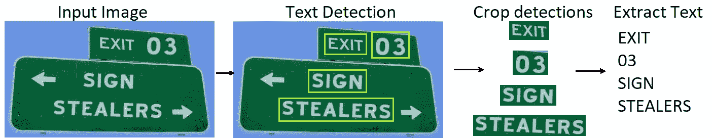
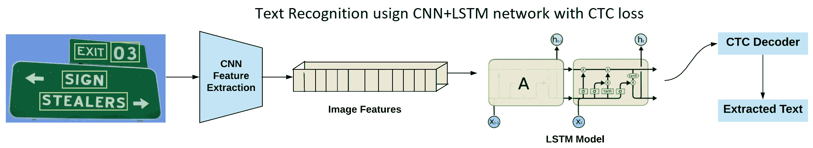
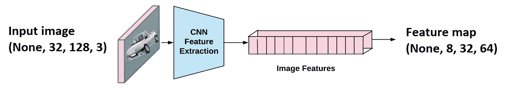
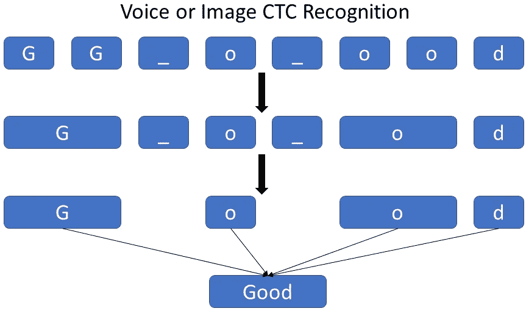
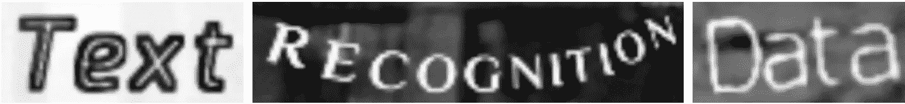
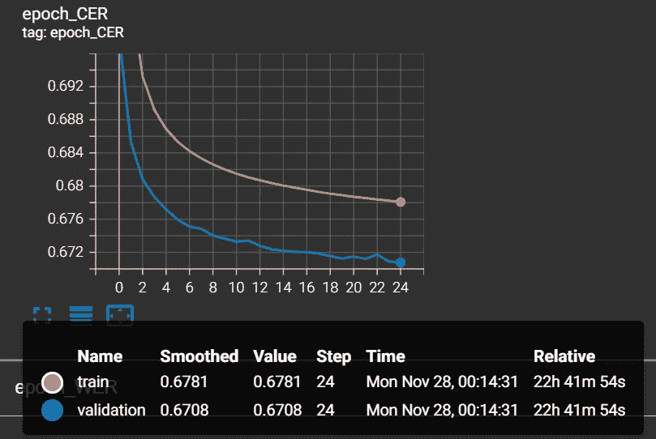

# 基于 TensorFlow 和 CTC 网络的文本识别

> 原文：<https://pub.towardsai.net/text-recognition-with-tensorflow-and-ctc-network-15b2925f3171?source=collection_archive---------3----------------------->

## 在本教程中，我们将探讨如何通过神经网络模型使用张量流和 CTC 损失从图像中识别文本。

**您见过的最先进的数据科学路线图！附带数以千计的免费学习资源和 ChatGPT 集成！**

**如果您读过这篇文章，您应该知道从图像中提取文本是一个复杂的问题。从图像中提取不同大小、形状和方向的文本是许多环境中的基本问题，特别是在增强现实辅助系统、电子商务和社交媒体平台上的内容审核中。为了解决这个问题，我们需要准确地从图像中提取文本。**

**有两种最流行的方法可以用来从图像中提取文本:**

*   **我们可以使用文本检测器或分割技术定位图像中的文本，然后提取定位的文本(更简单的方法)；**
*   **我们可以训练一个在单个模型中实现文本检测和识别的模型(硬方法)；**

**在本教程中，我将只关注整个 OCR 流程中的单词提取部分:**

****

**作者图片，OCR 管道**

**但是，了解当今最流行的 ocr 的管道是有价值的。正如我所说的，大多数管道包含一个文本检测步骤和文本识别步骤:**

*   ****文本检测**帮助您识别包含文本的图像的位置。它接受一幅图像作为输入，给出带有坐标的盒子作为输出；**
*   ****文本识别**使用从文本检测模型导出的边界框从输入图像中提取文本。它使用来自检测器的边界框输入带有裁剪图像部分的图像，并输出原始文本。**

**文本检测非常类似于对象检测任务，其中需要检测的对象只是文本。在这一领域已经进行了大量的研究来准确地从图像中检测文本，并且许多检测器在单词级别检测文本。然而，单词级检测器的问题是它们不能检测任意形状的单词(旋转、弯曲、拉伸等)。).**

**但事实证明，我们可以通过使用各种分割技术而不是使用检测器来获得更好的结果。探索每个字符和字符之间的间距有助于检测各种形状的文本。[ [1](https://openaccess.thecvf.com/content_CVPR_2019/papers/Baek_Character_Region_Awareness_for_Text_Detection_CVPR_2019_paper.pdf)**

**对于文本检测，您可以选择其他流行的技术。但是，正如我已经提到的，这将是太复杂和广泛的教程，以涵盖两者。因此，我将着重解释文本识别的 CTC 网络。**

**我注意到在开发各种东西时，我必须重新实现我已经反复使用的东西。那么为什么不通过创建一个库来保存所有这些东西来简化它呢？有了这个教程，我将开始一个新的 MLTU(机器学习训练实用程序)库，我将在 [GitHub](https://github.com/pythonlessons/mltu) 上开源，在那里我将保存所有的教程代码。**

## **文本识别管道:**

****

**图片由作者，文字识别与 CNN+MSTM 网络和 CTC 损失**

**在文本定位步骤之后，包含文本的区域被裁剪并通过 CNN 层发送以提取图像特征。这些特征后来被输入到多对多 LSTM 架构中，该架构通过字典输出 softmax 概率。这些不同时间步长的输出被提供给 CTC 解码器，以从图像中获得原始文本。我将在本教程的以下部分详细介绍每个步骤。**

**首先，让我们看看我的张量流模型，以了解我们如何连接 CNN 层和 LSTM 层。这个教程不是初级的，所以我只会循序渐进的覆盖一些部分，这里只贴一部分代码，更深入的代码部分，你可以看看我的 [**GitHub**](https://github.com/pythonlessons/mltu) 资源库。**

**本教程的文件可以在[https://github . com/python lessons/mltu/tree/main/Tutorials/01 _ image _ to _ word](https://github.com/pythonlessons/mltu/tree/main/Tutorials/01_image_to_word)链接上找到。要运行本教程，您必须安装我的带有 pip 的“mltu”0 . 1 . 3 版本包:**

**`pip install mltu==0.1.3`**

**以下是在 TensorFlow 中构建模型的代码:**

**我使用 ResNet 模型中的一个原理来构建残差块，帮助我们的模型学习更好的细节。我会将所有输入图像的大小调整为 32×128 像素。有了这个大小，我们的模型摘要将如下所示:**

**如果您不熟悉 TensorFlow，这可能会为您提供有限的信息，但这里的想法是为我们的 CTC 损失函数创建一个具有正确输出的模型。为此，我们必须从 CNN 过渡到 LSTM 层。为了做到这一点，我使用了一个重塑 CNN 最后一层删除一个维度，这将是伟大的 LSTM 输入。**

**为了使一切正常，我们必须确保最后一层满足 CTC 损失函数的要求。这里我有 63 个。在我的单词数据集中，我知道我有 62 个不同的字符，但是我们需要将它递增 1(分隔标记)。我也有 256；正如您在这里看到的，我们必须确保这个值大于我们的数据集中的最大单词长度，在我的数据集中是 23。在我们的预测中，这一个将被视为间隔；稍后详细介绍。**

**首先，让我们理解感受野的概念，以便更容易理解 CNN 模型的特征是如何转移到 LSTM 网络的。**

## **CNN 特写到 LSTM 图层:**

****

**上图显示了一个图像(32x128 大小)通过卷积层发送。层被设计成使得，结果，我们获得形状的特征图(无，8，32，64)。这里的“无”是可以取任何值的批量大小。**

**(None，8，32，64)可以很容易地整形为(None，256，64)，256 对应的是时间步长的个数，64 不过是每个时间步长的特征个数。人们可以将这与训练具有单词嵌入的任何 LSTM 模型联系起来，并且输入形状通常是(batch_size，no_time_steps，word_embedding_dimension)。**

****

**之后，这些特征图被输入到 LSTM 模型中，如上图所示。您现在可能会想，众所周知，LSTM 模型处理的是序列数据，而要素地图是如何排序的。但这里的想法是，CNN 层重塑序列，同时改变其层的视图。**

**结果，对于每个时间步长，我们从 LSTM 模型获得词汇的软最大概率，即 256。现在，让我们转到教程中激动人心的部分，计算这种架构设置的损耗值。**

## **什么是 CTC 损失，我们为什么要使用它:**

**这是一个广泛的主题，我可以为它创建另一个完整的解释教程。但是因为已经有大量关于 CTC 损失的文章，我将只提及整个想法。**

**当然，我们可以创建一个包含文本字符串图像的数据集，然后为每个水平图像位置指定相应的符号。我们可以使用分类交叉熵作为损失来训练 NN 输出每个水平位置的字符得分。然而，这种解决方案存在一些问题:**

*   **在字符级别注释一个数据集是非常耗时(并且乏味)的；**
*   **我们只得到字符分数，需要进一步处理才能得到最终文本。我们需要删除所有重复的字符。单个符号可以跨越多个水平位置；例如，我们可以得到“Heeloo”，因为“e”或“e”是宽的。但是如果被识别的文本是“好”的呢？那么去掉所有重复的“0”会给我们一个不正确的结果。怎么处理？**
*   **提到的 CTC 损失也适用于语音到文本的应用。音频信号和相应的文本可用作训练数据，并且不存在像第一个字符被朗读“x”毫秒或从“x1”到“x2”毫秒朗读字符“z”这样的映射。按时间顺序注释每个角色的发音单词是不可能的。**

**CTC 为我们解决了所有这些问题:**

1.  **在用 CTC 损失函数训练模型时，我们只需要知道图像中的确切单词。因此，我们忽略图像或音频频谱图中符号的位置和宽度；**
2.  **识别的文本不需要进一步处理。**

**为了区分两个连续的标记和重复的标记，我们使用了一个“分离”标记，我之前已经提到过。理解其工作原理的最佳方式是想象我们正在处理表示“家”这个词的声音数据:**

****

**图片作者，字“好”解码有 CTC 丢失**

**我们使用一种巧妙的编码方案来解决重复字符的问题。在对文本进行编码时，我们可以在任何地方插入任意数量的空白，解码时这些空白将被删除。此外，我们可以多次重复每个字符。但是，我们需要在重复的符号之间插入一个空格，比如“你好”。**

**我们可以举几个例子:**

*   **从 word Home→“H-o-m-e”“H-ooo-m-ee”“-HHHHHHo-m-e”等。；**
*   **从 word Good→“G-o-o-d”、“GGGo-od”、“G-oooo-oooo-dddd”等。；**

**正如您所看到的，这种技术还允许我们轻松地创建精确文本的不同对齐方式，例如，“H-o-m-e”、“H-ooo-m-ee”、“HHHHHHo-m-e”都代表实际的文本(Home)，但对图像有不同的对齐方式。神经网络已经被训练输出加扰文本(在 NN softmax 输出中编码)。**

**一旦我们有了一个经过训练的神经网络，我们通常希望用它来识别我们的模型从未见过的图像中的文本。一种简单且非常快速的算法是“最佳路径解码”，包括两个步骤:**

1.  **它根据每个时间步长最可能的符号计算最佳路径；**
2.  **它通过删除路径中的重复字符和所有空格来撤消编码。剩下的代表已识别的文本！**

**这是一个简短的关于 CTC 损失没有进入数学的封面，但如果你有兴趣了解和研究数学是如何工作的，我发现了[这篇很棒的文章](https://ogunlao.github.io/blog/2020/07/17/breaking-down-ctc-loss.html)一步一步地解释了它。**

## **CTC 损失代码:**

**让我们回到编码部分。我只会编写一些之前提到的数学计算的代码。我们可以使用“`keras.backend.ctc_batch_cost`”函数来计算 CTC 损失，下面是定义了自定义 CTC 层的相同代码，用于训练和评估部分。要将它用作损失函数，我们需要构造一个继承对象来实现:**

**现在，当我们构建和编译我们的模型时，我们将其用作常规损失函数:**

**就是这样；我们的模型已经准备好接受图像和注释，并接受训练。但是你可能注意到我使用了一些 CWER 指标。没错！在训练单词、语音和句子识别模型时，仅仅依靠验证损失不是一个好的做法。知道我们的模型在验证数据集中犯了多少错误更好。这样，我们将能够增强我们的模型架构以获得更好的结果。**

**为了不浪费我们的资源，我将它实现为一个 TensorFlow 度量，在它训练时运行。**

**字符错误率(CER)衡量转录或翻译的准确性，通常用于语音识别或自然语言处理。它将基本事实转录或翻译(正确版本)与系统产生的实际转录或翻译进行比较，并计算输出中的错误百分比。**

**为了计算 CER，我们首先计算地面真相转录或翻译中的字符总数，包括空格。然后，我们计算将输出转录或翻译转换为基本事实所需的字符插入、替换和删除的数量。然后，CER 计算为这些误差的总和除以字符总数，以百分比表示。**

**换句话说，CER 测量输出转录或翻译中相对于基本事实中字符总数的错误数量。它会考虑拼写或语法错误，但也会考虑缺少或多余的空格、大写错误和其他轻微的转录不匹配。**

**例如，假设我们有下面的基本事实转录:“这是一个测试句子。”**

**假设我们有以下由语音识别系统产生的输出转录:“这是一个测试句子。”**

**在这种情况下，输出转录与地面实况相同，因此没有错误。CER 将为 0%。**

**另一方面，如果我们有以下输出转录:“这是一个测试句子。”**

**有一个单字符错误(句尾多了一个“e”)，所以 CER 就是 1/23 = 4.3%。**

## **培训回访:**

**你可能已经注意到我在 GitHub 的代码中使用了几个回调函数。回调是在培训过程的特定阶段实现的功能组。这些回调允许您在训练期间观察模型的统计数据和内部状态。**

**我倾向于在几乎所有的可训练模型中使用回调。"**

**我们可以数出六种不同的回调来说明问题，正如你可能看到的，我没有跟踪验证损失，而是跟踪验证 CER(“瓦尔 _CER”)！**

**我们大多数人训练这些模型部署在我们不想使用 TensorFlow 的地方。因此，我创建了一个“Model2onxx”回调，在培训结束时，它将模型转换为。onnx 格式，没有这个庞大的 TensorFlow 库也可以用，而且通常情况下，运行速度快两倍！**

## **准备数据集:**

**这是另一个广泛的话题，我将通过仅提及最基本的方面来快速涵盖。因此，在本教程中，我们将创建一个模型来从简单的文本图像中识别文本。我发现了一个巨大的“[文本识别数据](https://www.robots.ox.ac.uk/~vgg/data/text/#sec-synth)数据库，让我们这样做。**

****

**按作者分类的图像:数据集中的示例图像**

**这个数据集由**900 万张图像**组成，覆盖 **90k 个英语单词**，包括我们工作中使用的训练、验证和测试分割。**

**如果您正在学习我的教程，请下载这个 10 GB 的数据集，并将其解压缩到“ **Datasets/90kDICT32px** ”文件夹中。**

**使用下面的代码，我们将读取训练和验证数据集的所有路径:**

**这是一个简单的 for 循环，在每次循环中，读取文件路径并提取单词的实际标签。此外，我们正在收集词汇和尽可能长的单词。这两个参数稍后用于为我们的任务构建一个合适的模型。**

**好了，接下来，我们将使用我的“mltu”包中的基本 DataProvider 模型来构造我们的训练和验证数据提供者:**

**我创建这个对象是为了使用不同的数据预处理程序、增强器或转换器为任何数据类型提供数据。**

**特别是对于一个图像到文本的任务，我使用一个简单的 OpenCV“ImageReader”预处理器。然后我用变形金刚来规范我们的形象和标签；首先，我们将所有图像调整到相同的大小。接下来，我们将字符串标签转换为索引，因为我们的模型不理解字符串；它必须是数值。最后一步，我们用未知值填充单词，这样我们的输入就能满足精确的形状要求。**

## **训练模型:**

**我们到了最终训练模型的时候了。因为在我的 1080TI GPU 上完成一个纪元都需要一个多小时，所以我没有展示整个训练过程。但是因为我们很棒的回调，我们可以查看我们的训练日志和 Tensorboard 日志。**

**这是我们用来创建模式、编译它、定义回调和启动模型训练过程的代码:**

**现在，我可以通过在终端中发出以下命令来打开 Tensorboard 仪表板，其中包含我训练的模型日志的路径:**

**`tensorboard --logdir Models/1_image_to_word/202211270035/logs`**

**因为我们的数据集很大，它在第一个时期学习的大多数东西，所以当它完成第一个训练时期时，我们的 CER 会给我们很好的结果:**

****

**图片由作者提供:每个时期的张量板字符错误率**

**正如我们所看到的，在每一个时代，我们的 CER 率都在下降。这就是我们所期待的！**

**当我们的训练过程结束时，保存了两个模型:默认的. h5 Keras 模型和。onnx 格式模型。因此，让我们对保存的模型进行推理。**

## **测试模型:**

**现在，每个人都知道如何在默认的“. H5”Keras 模型上运行推理，但通常，当我们想在某个地方部署我们的解决方案时，这不是最佳选择。这就是我将模型转换为。onnx 格式。这是一种轻量级的模型格式，通常速度更快，并且不需要安装庞大的库。**

**首先，我将创建一个对象来加载。onnx "模型并处理所有的数据预处理和后处理。为此，我的对象从“OnnxInferenceModel”对象继承:**

**在创建对象时，我们唯一需要传递给 ImageToWordModel 的是词汇表。这就是为什么在训练模型时序列化和保存配置很重要。**

**现在，让我们编写一段代码，对验证数据集中的每幅图像进行推理，并检查字符错误率是多少:**

**我可以运行 1000 个例子，我会收到以下结果:**

**`Average CER: 0.07760155677655678`**

**这意味着在 1000 个例子中，我的模型有 7%的 CER；这很好，知道我们的训练和验证数据集可以更好！**

**这里有几个例子:**

****

**我在这里只展示了几个例子。你可以用更多的例子来验证这一点。**

# **结论:**

**总之，从图像中提取文本是一个复杂的问题，在各种背景下都很重要，包括增强现实、电子商务和内容审核。从图像中提取文本有两种主要方法:使用文本检测器或分割技术来定位文本，以及训练执行文本检测和识别的单个模型。本教程侧重于后一种方法，将 CNN 和 LSTM 层与 CTC 损失函数相结合，从图像中提取文本。该教程还介绍了一个新的开源库，名为 MLTU(机器学习训练实用程序)，将用于存储未来教程中的代码。**

**在本教程中，我尽量简短，只解释最重要的部分。更深入地说，它可以扩展成几个不同的教程，但我仍然需要做更多的工作。在本教程的最后，我们终于有了一个可以从图像中识别文本的自定义 OCR 模型。**

**这是我的教程系列的第一部分，在这里我们学习了如何训练我们的自定义 OCR 来识别图像中的文本。从现在开始，我们可以转向其他更具挑战性的任务。**

**我希望这篇教程对你有帮助，你可以在你的项目中使用我的代码，甚至我的新“mltu”库。下期教程再见！**

**我训练的模型[可以从这个链接](https://drive.google.com/drive/folders/180mJBpSNfeLCTZ2OuBZnLNxl2i0_LcEr?usp=share_link)下载(放在 Models 文件夹中)。玩得开心！**

## **参考:**

**[1] [白永明等，“用于文本检测的字符区域意识”IEEE/CVF 计算机视觉和模式识别会议录。2019.](https://openaccess.thecvf.com/content_CVPR_2019/papers/Baek_Character_Region_Awareness_for_Text_Detection_CVPR_2019_paper.pdf)**

**【https://pylessons.com/ctc-text-recognition】原载于**