# 使用 K-Shingling、最小散列和 LSH(位置敏感散列)的文本相似性

> 原文：<https://pub.towardsai.net/text-similarity-using-k-shingling-minhashing-and-lsh-locality-sensitive-hashing-8a60a7aaa9d9?source=collection_archive---------0----------------------->

## [自然语言处理](https://towardsai.net/p/category/nlp)

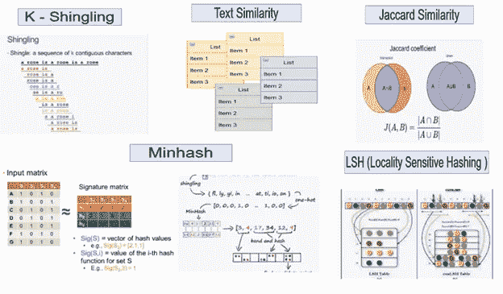

文本相似性在自然语言处理(NLP)中起着重要的作用，并且在许多领域得到了广泛的应用。一些应用包括信息检索、文本分类、主题检测、机器翻译、文本摘要、文档聚类、剽窃检测、新闻推荐等。几乎涵盖了所有领域。

但是有时，理解文本相似性算法背后的概念变得很困难。这篇文章将展示文本相似性的实现以及对所需概念的解释。

但在我开始之前，让我告诉你，可能有几种方法和几种算法来执行相同的任务。我将使用 K-Shingling、最小散列和 LSH(局部敏感散列)中的一种方法进行描绘。

考虑的数据集是从手头问题的 3 个文档中提取的文本。

我们可以使用 n 个文档，每个文档都很长。但是为了简化和避免繁重的计算，我考虑从每个文档中抽取一小块。

让我们一步一步地执行实现。

**第一步:**

将您的工作目录设置为文件所在的文件夹，以便 R 可以读取它。然后使用下面的代码从工作目录中读取所有的输入文件。

```
# Libraries used
library(dplyr)
library(proxy)
library(stringr)
library(data.table)
# Set the working directory
setwd(".\")# Read the original text file 
files <- list.files(path=".", pattern='*.txt', all.files=FALSE,
           full.names=FALSE)( doc <- lapply( files, readLines ) )
```

R Studio 输入显示

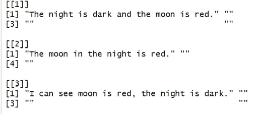

**第二步:**

对文本进行预处理以删除标点符号，将其转换为小写，并逐字拆分文本。

```
# Preprocess text
documents <- lapply(doc, function(x) {
  text <- gsub("[[:punct:]]", "", x) %>% tolower()
  text <- gsub("\\s+", " ", text) %>% str_trim()  
  word <- strsplit(text, " ") %>% unlist()
  return(word)
})
# Print the texts in files
documents[[1]]
documents[[2]]
documents[[3]]
```

r 工作室显示器

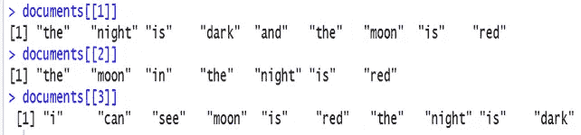

**第三步:**

介绍一种表示文档资产的技术。我们将进一步理解 K 收缩的重要性，但是现在，我们可以试着熟悉这些步骤。

手头文档的 k-瓦片区被认为是在其中找到的所有可能的长度为 k 的连续子串。

让我们用一个 k = 3 的例子来说明。

```
Shingling <- function(document, k) {
  shingles <- character( length = length(document) - k + 1 )

  for( i in 1:( length(document) - k + 1 ) ) {
    shingles[i] <- paste( document[ i:(i + k - 1) ], collapse = " " )
  }

  return( unique(shingles) )  
}# "shingle" the example document, with k = 3
documents <- lapply(documents, function(x) {
  Shingling(x, k = 3)
})
list( Original = doc[[1]], Shingled = documents[[1]] )
```

r 工作室显示器

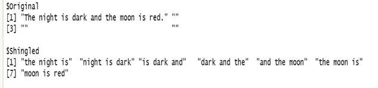

因此，在 k = 3 的情况下，打印出来的第一个文档的 k 个瓦片区由长度为 3 的子串组成。

第一个 K 字是:**《夜是》**

第二个带状疱疹是:**《夜色深沉》**以此类推。

需要注意的重要一点是，文档的 k-shingle 集应该是惟一的。例如，如果上面的第一个文档包含不止一个**“the night is”**，那么它将只作为该文档的 k-瓦片区集合出现一次。

**第四步:**

构建一个**“特征”矩阵**，将三个文档之间的关系可视化。“特征”矩阵将是布尔矩阵，具有:

rows =所有文档中瓦片区集合的每个唯一可能组合的元素。

columns =每个文档一列。

因此，当且仅当文档 j 包含瓦片区 I 时，矩阵将在行 I 和列 j 中填充 1，否则将填充 0。

让我们通过下面的描述来理解这一点。

```
# Unique shingles sets across all documents
doc_dict <- unlist(documents) %>% unique()# "Characteristic" matrix
Char_Mat <- lapply(documents, function(set, dict) {
  as.integer(dict %in% set)
}, dict = doc_dict) %>% data.frame()# set the names for both rows and columns
setnames( Char_Mat, paste( "doc", 1:length(documents), sep = "_" ) )
rownames(Char_Mat) <- doc_dict
Char_Mat
```

r 工作室显示器

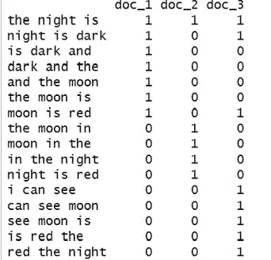

上述矩阵的第一行所有三列都为 1。这是因为所有三个文档都包含 3 个字母“黑夜是”。

对于第二列，值是[1，0，1]，这意味着文档 2 没有 3-瓦片区“黑夜是黑暗的”，而文档 1 和 3 有。

这里要注意的重要一点是，大多数时候这些“特征矩阵”几乎是稀疏的。所以我们通常尽量只用 1 出现的位置来表示这些矩阵，这样更节省空间。

**第五步:**

在创建了瓦片集和特征矩阵之后，我们现在需要测量文档之间的相似性。

为此，我们将利用 **Jaccard 相似性**。

例如，对于作为集合 1 和集合 2 的两个瓦片区集合，Jaccard 相似性将是:

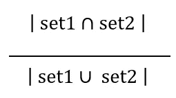

这样，我们将计算所有三个文档的成对 Jaccard 相似性。“R”中的“dist”函数快速计算并返回距离/相似性矩阵。

```
# how similar is two given document, Jaccard similarity 
JaccardSimilarity <- function(x, y) {
  non_zero <- which(x | y)
  set_intersect <- sum( x[non_zero] & y[non_zero] )
  set_union <- length(non_zero)
  return(set_intersect / set_union)
}# create a new entry in the registry
pr_DB$set_entry( FUN = JaccardSimilarity, names = c("JaccardSimilarity") )# Jaccard similarity distance matrix 
d1 <- dist( t(Char_Mat), method = "JaccardSimilarity" )# delete the new entry
pr_DB$delete_entry("JaccardSimilarity")
d1doc
```

r 工作室显示器

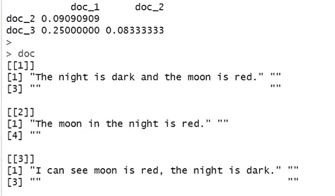

相似性矩阵 d1 告诉我们，文档 1 和 3 是三个文档中最相似的。

对于小数据集，上面的方法工作得非常好，但是想象一下，如果我们有大量的文档要比较，而不是只有三个具有明显更大长度的文档，那么上面的方法可能不能很好地扩展，并且我们可能会有大量的计算和性能问题，因为具有一组跨所有文档的唯一瓦片区的稀疏矩阵将相当大，使得文档之间的 Jaccard 相似性的计算成为负担。

在这种情况下，我们采用一种不同的技术来帮助我们节省计算，并可以有效地大规模比较文档的相似性。这种技术被称为**最小化。**

**第六步:**

最小散列涉及将大量独特的瓦片区压缩成一个更小的表示，称为“签名”。

然后，我们使用这些签名来衡量文档之间的相似性。

虽然这些签名不可能给出精确的相似性度量，但是估计值非常接近。

选择的签名数量越多，估计就越准确。

为了说明，让我们考虑一个例子。

假设我们采用上述例子将 16 行的 minhash 特征矩阵分成 4 个签名。然后，第一步是生成 4 列相互独立的随机置换行。我们可以自己看到，这个简单的散列函数实际上确实生成了随机置换的行。为了得出这个结果，我们使用公式:

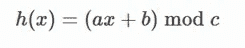

其中:

x 是原始特征矩阵的行数。

a 和 b 是小于或等于最大数 x 的任意随机数，并且它们在每个签名中必须是唯一的。

例如，对于签名 1，如果生成 5 作为 a 系数，则必须确保该值不会在签名 1 内多次作为 a 系数，尽管它仍然可以用作

签名 1 中的 b 系数。并且该限制对于下一个签名也是刷新的，也就是说，5 可以用作签名 2 的 a 或 b 系数，但是签名 2 的 a 或 b 系数同样没有倍数 5，依此类推。

c 是一个素数，略大于瓦片区集合的总数。

对于上面的示例集，由于总行数是 16，因此素数 17 就可以了。

现在让我们通过“R”代码来生成它。

```
# number of hash functions (signature number)
signature_num <- 4# prime number
prime <- 17# generate the unique coefficients  
set.seed(12345)
coeff_a <- sample( nrow(Char_Mat), signature_num )
coeff_b <- sample( nrow(Char_Mat), signature_num )# see if the hash function does generate permutations
permute <- lapply(1:signature_num, function(s) {
  hash <- numeric( length = length(nrow(Char_Mat)) )
  for( i in 1:nrow(Char_Mat) ) {
    hash[i] <- ( coeff_a[s] * i + coeff_b[s] ) %% prime
  }
  return(hash)
})
# # convert to data frame 
permute_df <- structure( permute, names = paste0( "hash_", 1:length(permute) ) ) %>%
  data.frame()
permute_df
```

r 工作室显示器

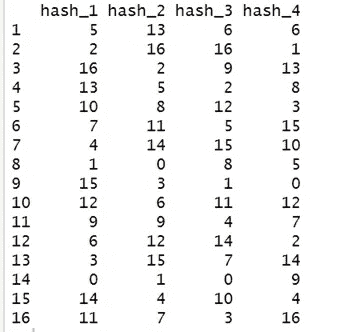

从上面的输出中，我们看到生成了 4 列随机置换的行。也有 0，但这不会影响我们的计算，我们稍后会看到。

**第七步:**

使用随机置换的行，现在将进一步计算签名。任何列(文档)的签名值都是通过使用由每个哈希函数生成的置换顺序获得的，其中该列的第一行的编号为 1。

我们接下来要做的是将随机置换的行(由哈希函数生成)与原始特征矩阵相结合，并将矩阵的行名更改为其行号，以说明计算过程。

```
# use the first two signature as an example
# bind with the original characteristic matrix
Char_Mat1 <- cbind( Char_Mat, permute_df[1:2] )
rownames(Char_Mat1) <- 1:nrow(Char_Mat1)
Char_Mat1
```

r 工作室显示器

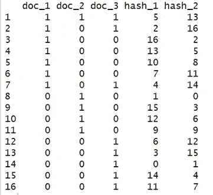

现在考虑上面生成的矩阵，我们将从第一个哈希函数(hash_1)开始。

根据我们的第一个散列函数的置换行顺序，第一行是第 14 行(为什么是第 14 行？因为 0 是我们随机生成的排列的最小值，并且它在第 14 行有一个 0，使其成为第一行)。然后，我们将查看所有三个文档的第 14 行的条目，并试图找到“第 14 行的哪个文档的条目是 1？”。文档 3 的(doc_3)行 14 是 1，因此由我们的第一个散列函数生成的文档 3 的签名值是 0。但是文档 2 和 3 在第 14 行的条目都是 0，因此我们必须继续寻找。

根据我们的第一个哈希函数的置换行顺序，第二行是第 8 行(1 是我们随机生成的置换的第二个最小值，它在第 8 行的值为 1)。我们应用与上面相同的概念，发现第 8 行的文档 2 的(doc_2)条目是 1，因此由我们的第一个散列函数生成的文档 2 的签名值是 1。注意，我们已经完成了文档 3，我们不再需要检查它是否包含 1。但是我们还没有完成，文档 1 在第 8 行的条目仍然是 0。因此，我们必须看得更远。

再次检查我们的第一个散列函数的置换行顺序，第三行是第 2 行。文档 1 的第 2 行的条目是 1。因此，我们已经使用第一个散列函数计算完了所有三列的签名值！！也就是[2，1，0]。

然后，我们可以应用相同的概念，使用第二个散列函数计算每一列(文档)的签名值，第三列、第四列等等也是如此。快速查看签名第二散列函数显示，根据其置换的行顺序，第一行是第 8 行，doc_2 在行 3 中具有 1。类似地，第二行是 doc_3 为 1 的第 14 行，第三行是 doc_1 为 1 的第 3 行。因此，我们的第二个散列函数为所有三个文档生成的签名值是[2，0，1]。

至于这些计算出来的签名值，我们会沿途存储到一个签名矩阵中，这个矩阵以后会代替原来的特征矩阵。以下部分将使用所有 4 个哈希函数计算所有 3 列的签名值，并打印出签名矩阵。

```
# obtain the non zero rows' index for all columns
non_zero_rows <- lapply(1:ncol(Char_Mat), function(j) {
  return( which( Char_Mat[, j] != 0 ) )
})# initialize signature matrix
SM <- matrix( data = NA, nrow = signature_num, ncol = ncol(Char_Mat) )# for each column (document)
for( i in 1:ncol(Char_Mat) ) {
  # for each hash function (signature)'s value 
  for( s in 1:signature_num ) {
    SM[ s, i ] <- min( permute_df[, s][ non_zero_rows[[i]] ] )
  }
}# set names for clarity
colnames(SM) <- paste( "doc", 1:length(doc), sep = "_" )
rownames(SM) <- paste( "minhash", 1:signature_num, sep = "_" )  
SM
```

r 工作室显示器

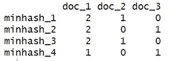

我们的签名矩阵具有与原始特征矩阵相同的列数，但是它只有 n 行，其中 n 是我们希望生成的散列函数的数量(在本例中是 4)。

让我详细说明我们如何解释上述结果？

例如，对于文档 1 和 3(列 1 和 3)，其相似度将是 0.25，因为它们仅在总共 4 行中的 1 行一致(两列的行 4 都是 1)。

让我们通过代码来计算同样的解释。

```
# signature similarity
SigSimilarity <- function(x, y) mean( x == y )# same trick to calculate the pairwise similarity 
pr_DB$set_entry( FUN = SigSimilarity, names = c("SigSimilarity") )
d2 <- dist( t(SM), method = "SigSimilarity" )
pr_DB$delete_entry("SigSimilarity")list(SigSimilarity = d2, JaccardSimilarity = d1)
```

r 工作室显示器

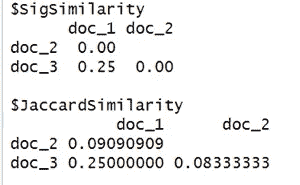

根据原始 Jaccard 相似性和使用签名相似性获得的新相似性之间的结果差异，我们可能会怀疑这是否是一个准确的估计？但是如前所述，Minhash 的目的是提供一个对真正 Jaccard 相似性的快速“近似”,估计可以更接近，但不是 100%准确，因此存在差异。此外，这里考虑的例子太小，无法使用大数定律来描述更接近的精度。大型数据集有望获得更准确、更接近的结果。

在主要要求是计算每个可能的对的相似性的情况下，可能是为了文本聚类或类似的目的，那么 LSH(位置敏感散列法)不能达到目的，但是如果要求是找到最可能相似的对，那么可以进一步使用一种称为位置敏感散列法的技术，这将在下面讨论。

## 位置敏感散列法

虽然计算文档之间的相似性所需的信息已经从原始的*稀疏*特征矩阵压缩成更小的签名矩阵，但是潜在的问题或对所有文档执行成对比较的需要仍然存在。

位置敏感散列(LSH)的概念是，给定大小为 n(行数)的签名矩阵，我们将把它分成 b 个带，结果每个带有 r 行。这相当于一个简单的数学公式——n = br，因此，当我们进行划分时，我们必须确保我们选择的 b 可以被 n 整除。使用上面的签名矩阵并选择频带大小为 2，上面的示例将变成:

```
# number of bands and rows
bands <- 2
rows <- nrow(SM) / bandsdata.frame(SM) %>% 
  mutate( band = rep( 1:bands, each = rows ) ) %>%
  select( band, everything() )
```

r 工作室显示器

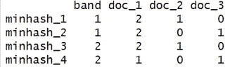

位置敏感哈希告诉我们的是:如果两个文档的签名值在至少一个带的所有行中一致，那么这两个文档很可能是相似的，应该进行比较(将其列为候选对)。使用这一小组文档可能是一个不好的例子，因为可能会发生没有一个文档被选为我们的候选对的情况。例如，如果波段 1 的文档 2 的签名值变为[ 0，1 ]而不是当前的[ 1，0 ]，那么文档 2 和文档 3 将成为候选对，因为它们在波段 1 中的两行都取相同的值[ 0，1 ]。

注意——在执行上述这组 R 代码时，我的计算和你的计算可能会有所不同，因为签名是随机生成的。

最后的想法

上述使用雅克卡相似性、最小散列法和 LSH 的技术是计算文档相似性所使用的技术之一，尽管还存在更多的技术。文本相似性是一个活跃的研究领域，技术在不断发展。因此，使用哪种方法在很大程度上取决于用例以及我们想要实现的需求。

感谢阅读！！！

你可以在媒体上跟踪我

领英:[苏普里亚·戈什](https://www.linkedin.com/in/supriya-ghosh)

推特: [@isupriyaghosh](https://twitter.com/isupriyaghosh)