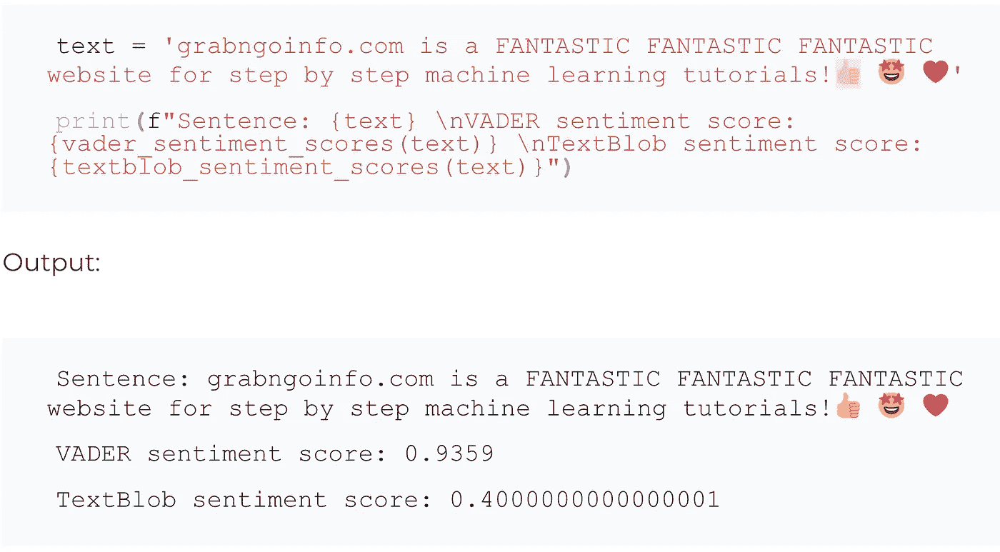
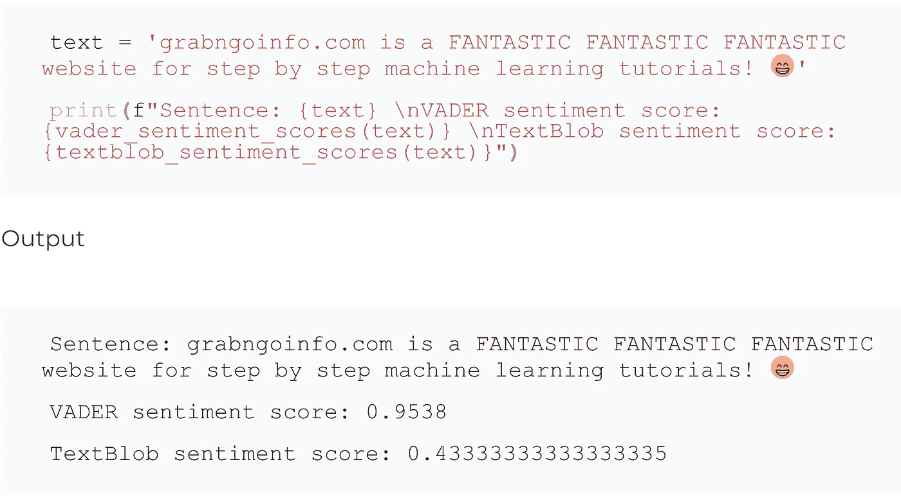

# 使用 Python 进行情感分析的 TextBlob 与 VADER

> 原文：<https://pub.towardsai.net/textblob-vs-vader-for-sentiment-analysis-using-python-76883d40f9ae?source=collection_archive---------0----------------------->

TextBlob 和 VADER 情感评分的比较


由[🇸🇮·扬科·菲利](https://unsplash.com/@itfeelslikefilm?utm_source=medium&utm_medium=referral)在 [Unsplash](https://unsplash.com?utm_source=medium&utm_medium=referral) 上拍摄的照片

TextBlob 和 VADER 是两个使用最广泛的情感分析 Python 库。与用于情感分析的机器学习方法相比，TextBlob 和 VADER 使用了基于词典的方法。词典方法具有单词和情感之间的映射，并且句子的情感是每个术语的情感的集合。

词典情感分析输出从-1 到 1 的极性得分，其中-1 表示高度负面的情感，1 表示高度正面的情感。接近 0 的值表示中性情绪。

TextBlob 和 VADER 的一个关键区别是，VADER 专注于社交媒体。因此，VADER 花了很多精力来识别社交媒体上通常出现的内容的情感，如表情符号、重复的单词和标点符号(例如感叹号)。

在本文中，我们将使用例句来比较 TextBlob 和 VADER 的性能，看看哪个性能更好！

**本岗位资源:**

*   YouTube[上的视频教程](https://www.youtube.com/watch?v=V858y9L_RJM&list=PLVppujud2yJpx5r8GFeJ81fyek8dEDMX-&index=2)
*   关于 [NLP](https://www.youtube.com/playlist?list=PLVppujud2yJpx5r8GFeJ81fyek8dEDMX-) 的更多视频教程
*   关于 NLP[的更多博文](https://medium.com/@AmyGrabNGoInfo/list/nlp-49340193610f)

# 步骤 1:导入库

首先，我们需要安装`vaderSentiment`包。

```
pip install vaderSentiment
```

成功安装后，您将看到下面的输出。请注意，您的版本可能与我的不同。

```
Successfully installed vaderSentiment-3.3.2
```

现在导入 VADER 和 TextBlob 的包。

```
# Import the packages for sentiment analysis
from vaderSentiment.vaderSentiment import SentimentIntensityAnalyzer
from textblob import TextBlob
```

[](https://medium.com/@AmyGrabNGoInfo/membership) [## 通过我的推荐链接加入 Medium-Amy @ GrabNGoInfo

### 阅读艾米的每一个故事(以及媒体上成千上万的其他作家)。你的会员费直接支持艾米和…

medium.com](https://medium.com/@AmyGrabNGoInfo/membership) 

# 步骤 2:为 VADER 和文本块定义函数

让我们分别为 VADER 和 TextBlob 创建函数，这将有助于我们以后更高效地编码。

```
# VADER
vader_sentiment = SentimentIntensityAnalyzer**()** def vader_sentiment_scores**(**text**)**:
  score = vader_sentiment.polarity_scores**(**text**)** return score**[**'compound'**]**# TextBlob
def textblob_sentiment_scores**(**text**)**:
  textblob_sentiment = TextBlob**(**text**)** score = textblob_sentiment.sentiment.polarity
  return score
```

# 第三步:检查情绪差异

我们分别使用 VADER 和文本块来获得一个句子的情感得分。两者都给我们一个积极的情绪分数，VADER 的值比 TextBlob 高。

```
text = 'grabngoinfo.com is a fantastic website for step by step machine learning tutorials.'print**(**f"Sentence: {text} \nVADER sentiment score: {vader_sentiment_scores(text)} \nTextBlob sentiment score: {textblob_sentiment_scores(text)}"**)**
```

输出:

```
Sentence: grabngoinfo.com is a fantastic website for step by step machine learning tutorials.VADER sentiment score: 0.5574TextBlob sentiment score: 0.4
```

# 步骤 4:检查资本化的影响

在这一步，我们使用同一个句子。只要把“奇妙”这个词改成大写就行了。VADER 认为大写版本具有更强的情感，并增加了情感得分。同时，TextBlob 没有区分单词的大小写版本之间的情绪。

```
text = 'grabngoinfo.com is a FANTASTIC website for step by step machine learning tutorials.'print**(**f"Sentence: {text} \nVADER sentiment score: {vader_sentiment_scores(text)} \nTextBlob sentiment score: {textblob_sentiment_scores(text)}"**)**
```

输出:

```
Sentence: grabngoinfo.com is a FANTASTIC website for step by step machine learning tutorials.VADER sentiment score: 0.6523TextBlob sentiment score: 0.4
```

# 第五步:检查重复单词的影响

在这一步，我们重复单词“奇妙”三次，看看这是否会影响情绪得分。结果，VADER 把分数从 0.6523 提高到 0.9325。然而，TextBlob 情感得分几乎没有增加。结果表明，VADER 认为重复词具有更强的情感，而 TextBlob 没有考虑重复词。

```
text = 'grabngoinfo.com is a FANTASTIC FANTASTIC FANTASTIC website for step by step machine learning tutorials.'print**(**f"Sentence: {text} \nVADER sentiment score: {vader_sentiment_scores(text)} \nTextBlob sentiment score: {textblob_sentiment_scores(text)}"**)**
```

输出:

```
Sentence: grabngoinfo.com is a FANTASTIC FANTASTIC FANTASTIC website for step by step machine learning tutorials.VADER sentiment score: 0.9325TextBlob sentiment score: 0.4000000000000001
```

# 第六步:检查标点符号的影响

在这一步中，我们将标点符号从句号改为感叹号，VADER 和 TextBlob 的情感得分都增加了。

```
text = 'grabngoinfo.com is a FANTASTIC FANTASTIC FANTASTIC website for step by step machine learning tutorials!'print**(**f"Sentence: {text} \nVADER sentiment score: {vader_sentiment_scores(text)} \nTextBlob sentiment score: {textblob_sentiment_scores(text)}"**)**
```

输出:

```
Sentence: grabngoinfo.com is a FANTASTIC FANTASTIC FANTASTIC website for step by step machine learning tutorials!VADER sentiment score: 0.9359TextBlob sentiment score: 0.43333333333333335
```

# 第七步:检查表情符号的影响

在这一步，我们在句子的末尾添加了三个表情符号，一个竖起大拇指，一个星星眼睛和一颗心。人们通常在有积极情绪的时候使用这三个表情符号。然而，我们可以看到，VADER 的情绪得分并没有增加，而 TextBlob 的情绪得分甚至下降了！



现在让我们尝试一些笑脸表情符号。看起来 Textblob 没有改变情绪，VADER 将积极情绪从 0.9359 增加到 0.9538。



# 摘要

基于上面的比较，我们可以看到 VADER 提供了比 TextBlob 更细粒度的情感，并且在评估文本情感时考虑了大写、重复单词和表情符号。

如果你对教程的视频版本感兴趣，请查看下面的视频。访问 GrabNGoInfo 网站或 [GrabNGoInfo YouTube 频道](https://www.youtube.com/channel/UCmbA7XB6Wb7bLwJw9ARPcYg/playlists)获取更多机器学习教程。

使用 Python 进行情感分析的 TextBlob 与 VADER—GrabNGoInfo.com

# 推荐教程

*   [GrabNGoInfo 机器学习教程盘点](https://medium.com/grabngoinfo/grabngoinfo-machine-learning-tutorials-inventory-9b9d78ebdd67)
*   [用于异常检测的单级 SVM](https://medium.com/p/one-class-svm-for-anomaly-detection-6c97fdd6d8af)
*   [使用 Python 中的 Prophet 进行多时间序列预测的 3 种方法](https://medium.com/p/3-ways-for-multiple-time-series-forecasting-using-prophet-in-python-7a0709a117f9)
*   [使用 Python 实现不平衡分类的四种过采样和欠采样方法](https://medium.com/p/four-oversampling-and-under-sampling-methods-for-imbalanced-classification-using-python-7304aedf9037)
*   [利用 Python 中的 Prophet 进行具有季节性和假日效应的多元时间序列预测](https://medium.com/p/multivariate-time-series-forecasting-with-seasonality-and-holiday-effect-using-prophet-in-python-d5d4150eeb57)
*   [如何检测离群值|数据科学面试问答](https://medium.com/p/how-to-detect-outliers-data-science-interview-questions-and-answers-1e400284f6b4)
*   [利用 Python 中的 Prophet 进行时间序列异常检测](https://medium.com/p/time-series-anomaly-detection-using-prophet-in-python-877d2b7b14b4)
*   [如何用谷歌 Colab 笔记本使用 R](https://medium.com/p/how-to-use-r-with-google-colab-notebook-610c3a2f0eab)

[](https://medium.com/@AmyGrabNGoInfo/membership) [## 通过我的推荐链接加入媒体-艾米 GrabNGoInfo

### 作为一个媒体会员，你的会员费的一部分会给你阅读的作家，你可以完全接触到每一个故事…

medium.com](https://medium.com/@AmyGrabNGoInfo/membership)