# TensorFlow 回调在运行

> 原文：<https://pub.towardsai.net/tf-callbacks-in-action-966e8ff52900?source=collection_archive---------2----------------------->

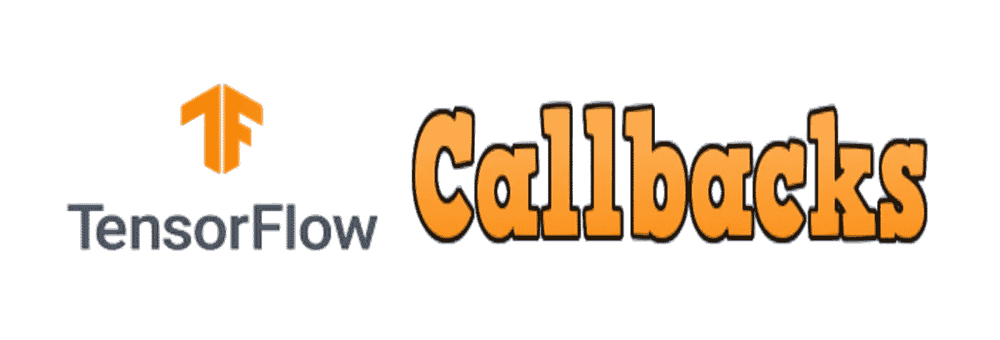

通俗地说，如果我想引入回调，那么它就是控制器，通过它你可以控制你的飞机。没有这些控制器，你就无法控制飞机，你就会坠毁。

回调:在 keras.io 中，回调是一个可以在训练的不同阶段执行动作的对象(例如，在一个时期的开始或结束，在一个批处理之前或之后，等等)。).

这意味着回调是在模型的训练过程中执行特定任务的函数。
那么，这些回调你能做什么呢？
1。您可以在训练/批次/时期开始和结束后执行特定任务。
2。您可以定期将模型状态保存在磁盘中。
3。你可以根据你的任务来安排学习速度。
4。当特定条件变为真时，您可以自动停止训练。
5。在训练过程中，你可以通过子类化这些回调函数来做任何事情。

举个例子，你可以让你的训练输出像这样干净多彩，挺牛逼的吧？

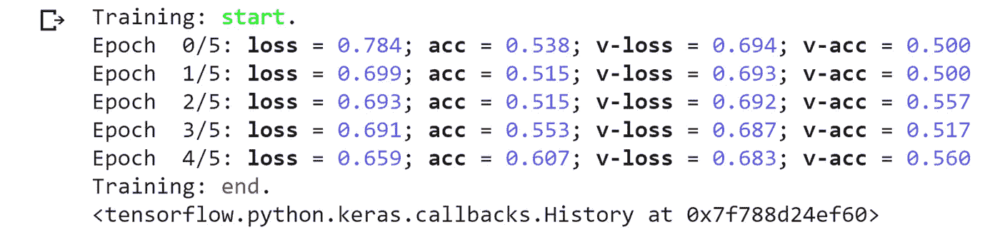

Tensorflow 在基类“tf.keras.callbacks”下提供了广泛的回调。有关回调的完整列表，请访问 [TensorFlow 的网站](https://www.tensorflow.org/api_docs/python/tf/keras/callbacks/Callback)。

在本文中，我们将介绍一些基本的 TensorFlow 回调，以及如何使用它们来完全控制培训。

这篇文章的上下文是:-
1。通过子类化回调类来定制回调。
2。提前停止回调。
3。模型检查点回调。
4。ReduceOnPlateu 回调。
5。学习率计划程序。
6。奖励包，让输出干净多彩，如上图。

但是让我们首先加载 cats_vs_dogs 数据集，我一直使用原始数据集的非常小的子类。然后，让我们使用顺序 API 来定义我们的模型架构。在整篇文章中，我都在使用这个数据集和这个模型架构。

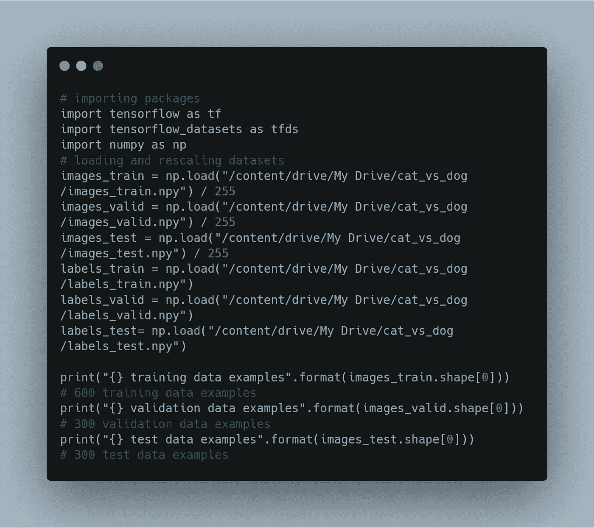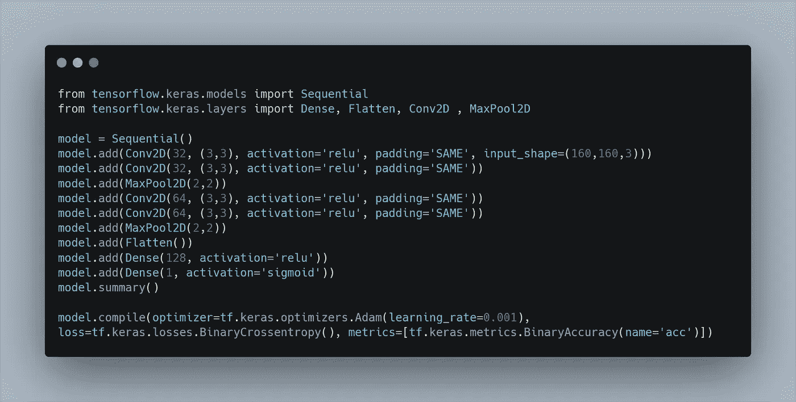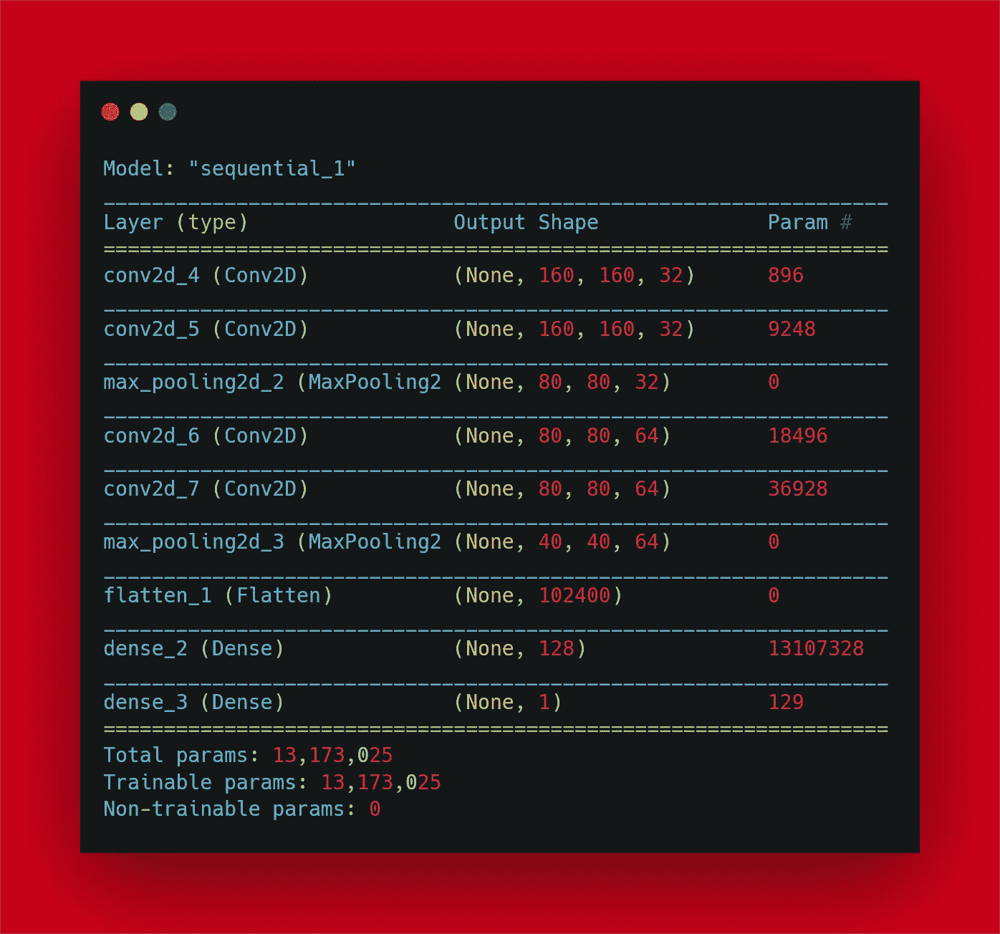

注意:-这篇文章是关于 TensorFlow 回调的，而不是为了制作世界级的 ML 模型和实现最先进的结果。因此，在整篇文章中，忽略损失和指标，试着专注于如何使用这些回调。数据集是最小的，可能会过拟合，但你可以忽略所有这些东西。

所以，不再拖延，让我们开始学习上面提到的回调。

# 1.通过子类化回调类来定制回调。

这些回调属于基类“TF . keras . callbacks”。
通过对这些回调进行子类化，我们可以在训练/批处理/时期开始或结束时执行某些功能。
为此，我们可以覆盖回调类的功能。
这些功能的名称是自我解释它们的行为。
例如 def on_train_begin()，这表示当
训练开始时该做什么。
下面我们来看看如何覆盖这些函数。我们还可以
监控日志并执行某些操作，通常是在
训练/批次/时期的开始或结束。

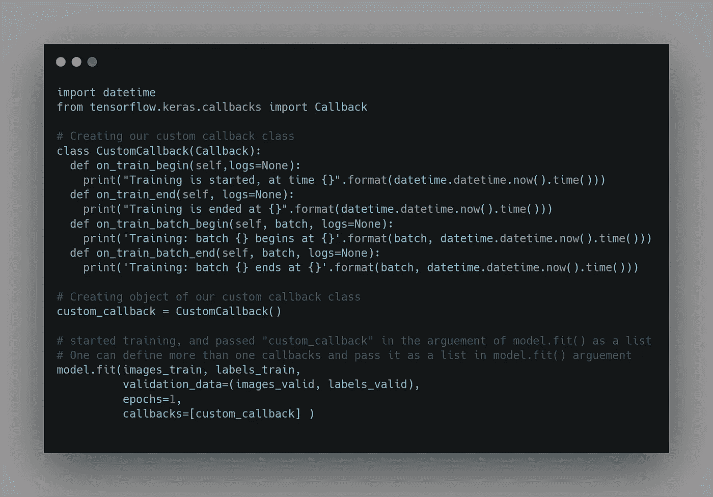

## 输出:

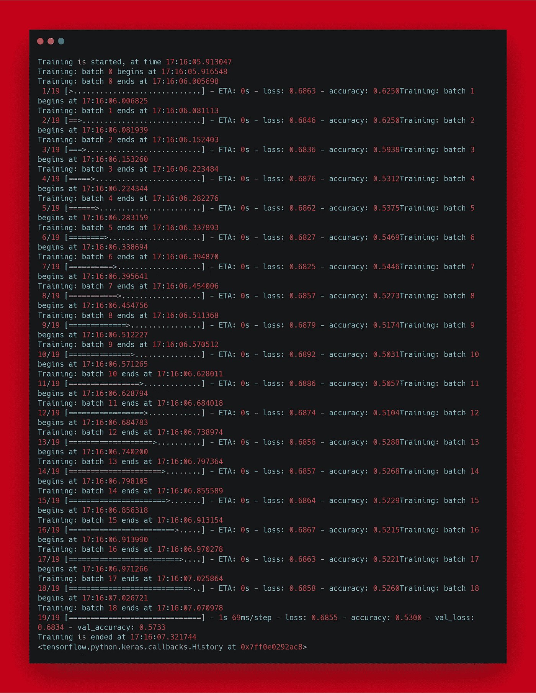

# 2.提前停止回调。

假设我们不知道回调，并且您想要防止由于将我们的模型训练到额外的时期而导致的模型过度拟合(我们不是上帝，所以我们知道我们的模型将在多少时期收敛)。因此，我们绘制 val_loss 与历元的关系图，并检查
有多少个历元开始过度拟合数据。然后，我们将在小于该纪元编号的时间内重新训练我们的模型。如果我告诉你不用手动做这件事呢？
是的，你可以用 EarlyStopping 回调来做到这一点。
那么，让我们看看如何使用这个回调函数。

首先，导入回调，然后创建
EarlyStopping 回调的实例，并根据我们的需要传递参数。让我来解释这些论点。

*   “监控”您可以传递损失或指标。
    一般我们通过 val_loss 来监控。
*   " min_delta "您可以在此参数中传递一个整数。
    简而言之，如果模型
    的下降幅度不大于/小于损失/指标，那么您就是在告诉回调模型
    没有改善。
*   “耐心”，意思是要等多少个纪元。
    之后，如果根据“最小增量”的值，在
    模型性能中没有看到改进，则停止训练。
*   “mode”
    默认设置为“auto ”,这在
    处理自定义损耗/指标时很方便。因此，您可以
    告诉回调，当
    其定制损耗/指标降低时，模型是否正在改进，然后将其设置为“最小”
    或增加，然后将其设置为“最大”

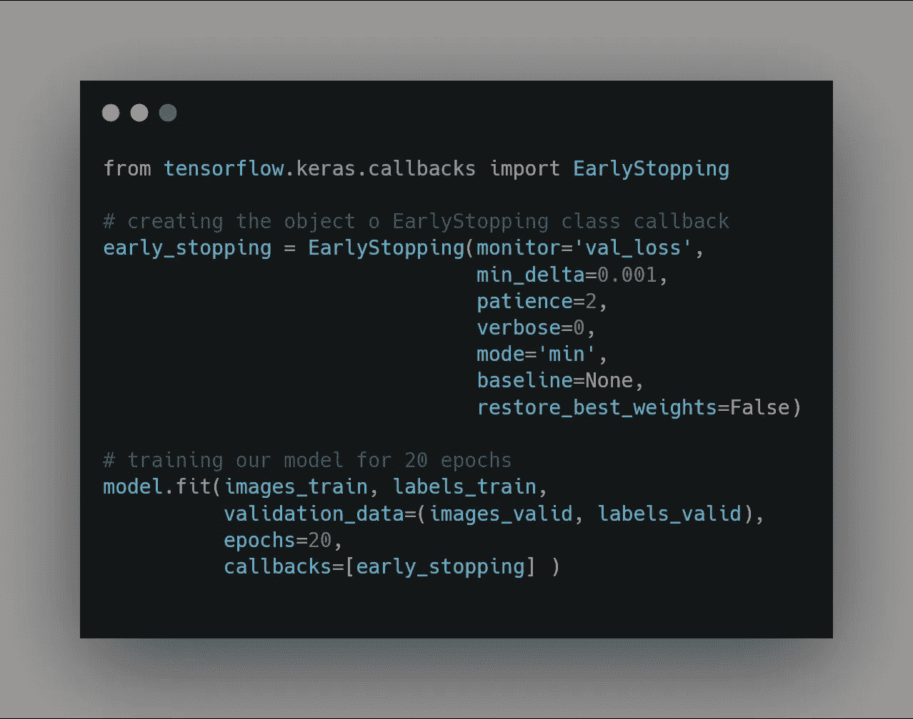

# 3.ReduceLROnPlateau。

如果损失/指标没有任何改善，此回调用于降低学习率。

这些论点是:

*“monitor”它被设置为一个字符串
形式的损失/指标，如果没有改善，我们将减少学习。

*   " factor "您可以在此参数中传递一个整数，
    并说您当前的学习率是 LR，那么如果
    在监控的损失/度量中没有看到任何改进，
    那么学习将减少该" factor "
    即新学习率= lr *因子
*   " Verbose"
    可以设置 verbose =1，查看每个历元的学习率。
    或 verbose = 0 来禁用它。

参数 min_delta 和 mode 与 EarlyStopping 回调的参数中解释的相同。

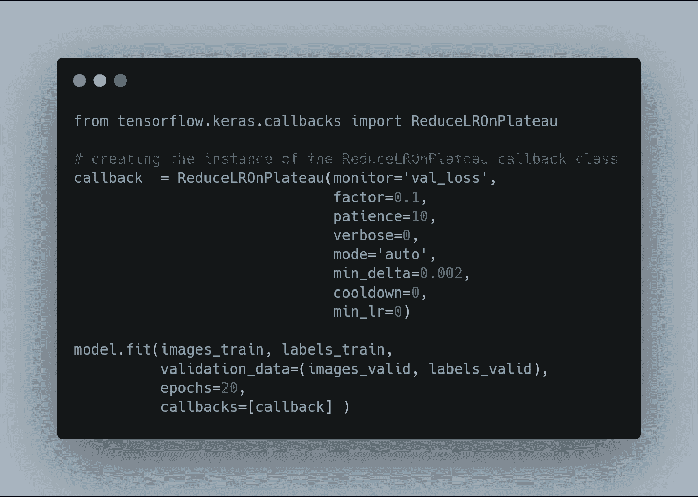

# 4.模型检查点

让我们想象一下，你正在训练一个像 colab 中的 Bert 一样重的模型，这需要大量的训练时间。于是，你开始了模特训练，去睡觉了。然后第二天早上
你醒来，打开可乐罐。
但是你会在屏幕上看到“运行时断开”的信息。
听起来像噩梦一样艰难？
对于这个问题，ModelCheckpoint 就像我们生活中的救星一样出现了。我们可以在每个纪元结束时保存检查点。
这样，如果在训练过程中发生了可怕的事情，我们就可以加载重量或继续训练。

那么，让我们看看如何使用这个回调函数。我们可以用 Keras h5/hd5 格式或者 TensorFlow pb
格式保存
模型检查点。如果您传递参数“file path = model . H5”(. H5 扩展名)
，它将被保存为 Keras 格式或“filepath= model.p”(。pb 扩展)
用于以 TensorFlow 模型格式保存。

此外，有两种选择来保存检查点，您可以保存整个体系结构+权重，也可以只保存权重。可以通过设置“save_only_weights=True”或“save_only_weights=False”来实现这一点

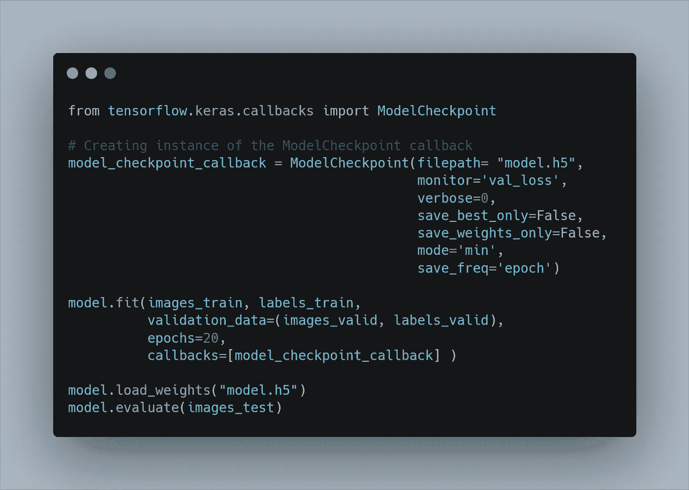

# 5.学习率计划程序

> 调度学习的最简单方法是将学习速率
> 从大的初始值线性降低到小的值。
> 这允许在
> 学习过程开始时进行大的重量变化，并在
> 学习过程结束时进行小的变化或微调。

我们来看看如何安排学习率。为此，我们必须
定义一个包含
改变学习率规则的辅助函数。
然后我们可以简单地将这个辅助函数的名称
传递给 LearningRateScheduler 类的对象的参数。

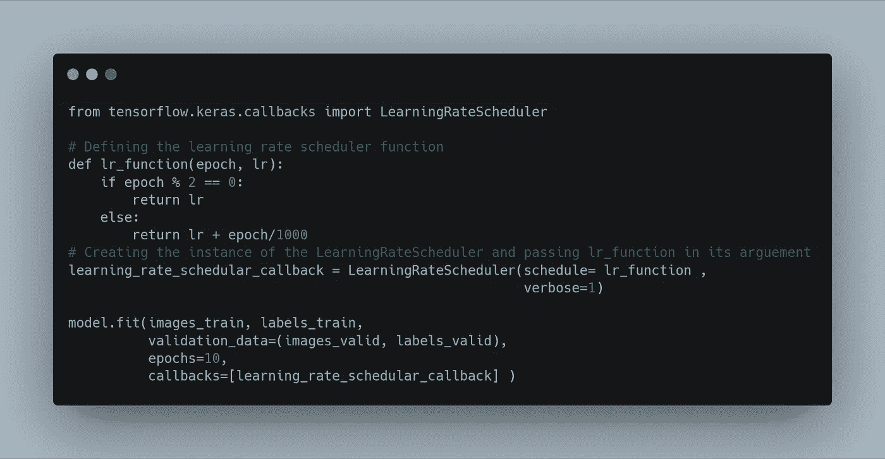

## 输出:

最后，这里是实用程序文件，使培训输出更干净和丰富多彩。

## 资源

[Github 上的资源库](https://github.com/abhinavsp0730/callback_blog):

你可以在[谷歌的 colab](https://colab.research.google.com/drive/1HRAt-ViaZW2BpwjY51rn64W3VBrTp-FI?usp=sharing) 上运行上面所有的代码。